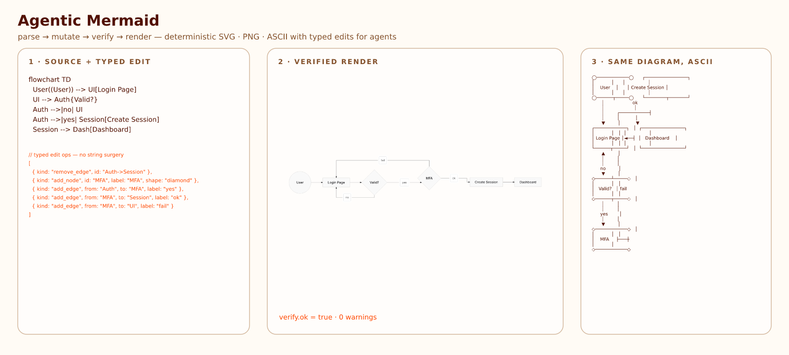

<div align="center">

# Agentic Mermaid

**Beautiful diagrams, made with your agent.**

Agentic Mermaid is an open-source Mermaid toolkit for people who want AI agents to create diagrams that look finished: SVG and PNG renders, ASCII and Unicode for review, deterministic layout, and Style + Palette controls for brand colors, typography, strokes, fills, and backdrops.

It is forked from [`lukilabs/beautiful-mermaid`](https://github.com/lukilabs/beautiful-mermaid). Published on npm as `agentic-mermaid`; the GitHub repository is `adewale/agentic-mermaid`; the canonical live site is [`agentic-mermaid.dev`](https://agentic-mermaid.dev/), a Cloudflare Workers deployment.



[Live Demo & Samples](https://agentic-mermaid.dev/) · [Live Editor](https://agentic-mermaid.dev/editor)

Docs: [docs index](./docs/) · [getting started](./docs/getting-started.md) · [agent guide](./Instructions_for_agents.md) · [agent API cookbook](./docs/agent-api-cookbook.md) · [design system](./DESIGN.md) · [skills](./skills/) · [fork differences](./docs/fork-differences.md) · [vs Mermaid & Beautiful Mermaid](./docs/comparison.md) · [changelog](./CHANGELOG.md)

</div>

## Why Agentic Mermaid

Use it when you want to describe a diagram in plain language and get back something you can publish without a design cleanup pass.

| You want | Agentic Mermaid gives you |
|---|---|
| An agent to draft the diagram | Mermaid source plus a verified render path |
| Beautiful defaults | Built-in looks such as `watercolor`, `blueprint`, `hand-drawn`, and `publication-figure` |
| Brand fit | Style + Palette stacks and custom JSON palettes you can keep in your repo |
| Safe edits later | `parseMermaid` → family narrower → `mutate` → `verifyMermaid` → `serializeMermaid` |
| Reviewable artifacts | SVG, PNG, ASCII, Unicode, and JSON layout from the same source |

The agent workflow is the guardrail behind the polish: agents should not guess from pixels, concatenate strings, or regenerate whole diagrams when a structured edit is available.

## Highlights

- **14 diagram families** — flowchart, state, architecture, sequence, class, ER, timeline, journey, XY chart, pie, quadrant, Gantt, Mindmap, and GitGraph.
- **SVG, PNG, ASCII, Unicode, JSON** — one deterministic layout foundation for docs, decks, terminals, and agent workflows.
- **Synchronous, zero-DOM SVG renderer** — no Puppeteer, no browser flash.
- **Composable styles** — `{ style: ['hand-drawn', 'dracula'] }` stacks a look over a palette; 15 full looks cover sketch, watercolor, blueprint, accessibility, print, operational, physical-media, architecture, and editorial/report use cases. Custom styles are plain JSON records any agent can author (`docs/style-authoring.md`). `seed` re-rolls the ink, never the layout.
- **21 built-in themes + Shiki compatibility** — a theme is a palette-only style: theme from two colors or a VS Code theme.
- **Agent-native editing** — typed mutation for all fourteen renderable families (flowchart/state, sequence, timeline, class, ER, journey, architecture, XY chart, pie, quadrant, Gantt, Mindmap, GitGraph); source-level round-trip only for opaque fallbacks (unmodeled syntax).
- **CLI + MCP + library** — `am`, `agentic-mermaid-mcp`, `agentic-mermaid`, and `agentic-mermaid/agent`.

## Installation

```bash
npm install agentic-mermaid       # or: bun add agentic-mermaid / pnpm add agentic-mermaid
am --help
agentic-mermaid-mcp
```

For repository development, install from source and run the Bun entrypoints:

```bash
git clone https://github.com/adewale/agentic-mermaid
cd agentic-mermaid
bun install
bun run build
bun run bin/am.ts --help
bun run bin/agentic-mermaid-mcp.ts   # MCP stdio server
```

> **ESM-only.** `agentic-mermaid` ships ES modules (there is no CommonJS build);
> `require()` consumers should use dynamic `import()` instead. Requires Node ≥ 18.
>
> The `am …` commands shown below assume the published bin. From a source
> checkout, run them as `bun run bin/am.ts …` instead.

## Output quick starts

Use `agentic-mermaid/agent` when you want one import path for styled renders, output formats, and the structured edit API.

### SVG

```ts
import { renderMermaidSVG } from 'agentic-mermaid/agent'

const svg = renderMermaidSVG(`flowchart TD
  Start --> Done`, { security: 'strict' })
```

### PNG

```ts
import { writeFileSync } from 'node:fs'
import { renderMermaidPNG } from 'agentic-mermaid/agent'

const png = renderMermaidPNG(`flowchart TD
  Start --> Done`, {
  fitTo: { width: 1200 },
  background: '#fff',
})

writeFileSync('diagram.png', png)
```

CLI equivalent:

```bash
am render diagram.mmd --format png --output diagram.png
```

### ASCII / Unicode

```ts
import { renderMermaidASCII } from 'agentic-mermaid/agent'

const unicode = renderMermaidASCII(`flowchart LR
  A --> B`)
const ascii = renderMermaidASCII(`flowchart LR
  A --> B`, { useAscii: true })
```

## Agent quick start

If your coding agent can read repo files, point it at:

- [`skills/agentic-mermaid-diagram-workflow/SKILL.md`](./skills/agentic-mermaid-diagram-workflow/SKILL.md) for diagram authoring/editing.
- [`skills/agentic-mermaid-live-editor/SKILL.md`](./skills/agentic-mermaid-live-editor/SKILL.md) for editor changes.

If it only has shell access:

```bash
am --agent-instructions
am capabilities --json
am preview diagram.mmd --security strict --open
am mutate diagram.mmd --op '{"kind":"add_node","id":"Cache","label":"Cache"}' --json
```

Zero-install prompt for a coding agent: read `https://agentic-mermaid.dev/llms.txt` and follow the parse → narrow → mutate → verify → serialize workflow. To wire Agentic Mermaid into another repo, run `npx agentic-mermaid init-agent` (or `bun run bin/am.ts init-agent` from a source checkout); it writes a non-clobbering `AGENTS.md` section, root `skills/` bundle, and `.mcp.json` sample.

Use strict `preview` for human inspection and `mutate --op/--ops` for verified one-shot or batched edits.

For multi-step MCP edits, connect `agentic-mermaid-mcp` and use Code Mode `execute(code)` with the same `mermaid.*` SDK names. Stdio is the default transport; `agentic-mermaid-mcp --transport http` starts HTTP/SSE and managed PNG file/URL artifacts. See the [agent API cookbook](./docs/agent-api-cookbook.md) for copy-pasteable library, CLI, and MCP recipes.

## MCP server

Agentic Mermaid ships a Model Context Protocol server so MCP-capable agents can render and safely edit diagrams without shelling out.

- **Self-hosted (default).** `agentic-mermaid-mcp` runs a stdio server exposing `execute` (Code Mode sandbox), `render_png`, and `describe`. Package runners can use `npx -y agentic-mermaid mcp`; the `mcp` argument routes the package-name binary to the same stdio server. Add `--transport http` for HTTP/SSE with managed PNG file/URL artifacts. See [`docs/mcp-http-transport.md`](./docs/mcp-http-transport.md) and [`docs/mcp-code-mode-rationale.md`](./docs/mcp-code-mode-rationale.md).
- **Hosted.** A stateless Streamable HTTP endpoint is available at `https://agentic-mermaid.dev/mcp` (tools: `execute`, `render_svg`, `render_ascii`, `render_png`, `verify`, `describe`, `mutate`, `build`; 64 KB input caps). It is MCP JSON-RPC only, not a REST render API. Hosted `execute` runs the same `mermaid.*` facade in a Cloudflare Dynamic Worker isolate with no network; hosted PNG returns base64 only.

Local-first is the default posture: prefer the library, CLI, or a self-hosted MCP for anything sensitive, offline, larger than the hosted caps, or needing local PNG file/URL artifacts. The hosted endpoint is a public, unauthenticated convenience for zero-install render/verify/describe and bounded structured edits.

## Structured edit example

```ts
import { parseMermaid, asFlowchart, mutate, verifyMermaid, serializeMermaid } from 'agentic-mermaid/agent'

const parsed = parseMermaid('flowchart TD\n  API --> DB')
if (!parsed.ok) throw new Error('parse failed')

const flow = asFlowchart(parsed.value)
if (!flow) throw new Error(`not a structured flowchart: ${parsed.value.kind}`)

const next = mutate(flow, { kind: 'add_node', id: 'Cache', label: 'Cache' })
if (!next.ok) throw new Error(next.error.message)

const verify = verifyMermaid(next.value)
if (!verify.ok) throw new Error(JSON.stringify(verify.warnings, null, 2))

const source = serializeMermaid(next.value)
```

Rules:

- Use `asFlowchart` / `asState` / `asSequence` / `asTimeline` / `asClass` / `asEr` / `asJourney` / `asArchitecture` / `asXyChart` / `asPie` / `asQuadrant` / `asGantt` / `asMindmap` / `asGitGraph` before mutating existing diagrams.
- Mutation ops use `kind`, not `type`.
- Run `verifyMermaid` before every commit point.
- Do not call `mutate` on opaque fallback bodies; the narrower returns `null` for unmodeled syntax.

## Supported diagram families

| Family | Parse | Verify | Render | Structured mutate |
|---|---:|---:|---:|---:|
| Flowchart / state | ✓ | ✓ | SVG/PNG/ASCII | ✓ |
| Sequence | ✓ | ✓ | SVG/PNG/ASCII | simple messages/participants |
| Timeline | ✓ | ✓ | SVG/PNG/ASCII | ✓ |
| Class | ✓ | ✓ | SVG/PNG/ASCII | ✓ |
| ER | ✓ | ✓ | SVG/PNG/ASCII | ✓ |
| Journey | ✓ | ✓ | SVG/PNG/ASCII | modeled subset (BUILD-15) |
| XY chart | ✓ | ✓ | SVG/PNG/ASCII | modeled subset (BUILD-16) |
| Pie | ✓ | ✓ | SVG/PNG/ASCII | ✓ |
| Quadrant | ✓ | ✓ | SVG/PNG/ASCII | ✓ |
| Architecture | ✓ | ✓ | SVG/PNG/ASCII | modeled subset (BUILD-17) |
| Gantt | ✓ | ✓ | SVG/PNG/ASCII | sections/tasks; calendar directives ride along verbatim |
| Mindmap | ✓ | ✓ | SVG/PNG/ASCII | recursive tree, shapes/icons/classes |
| GitGraph | ✓ | ✓ | SVG/PNG/ASCII | replayed commits, branches, merges, cherry-picks |

See [diagram families](./docs/diagram-families.md) for examples and compatibility notes.

## More documentation

- [System architecture](./docs/design/system/README.md) — **start here** for how the engine works: the rendered three-stacks overview (dogfooded, drift-proof) routing to the design and route-contract docs.
- [API reference](./docs/api.md) — renderers, agent API, options, CLI/MCP pointers.
- [Agent API cookbook](./docs/agent-api-cookbook.md) — practical recipes for agents.
- [Theming](./docs/theming.md) — two-color themes, built-ins, Shiki compatibility.
- [Custom style cookbook](./docs/custom-style-cookbook.md) — JSON style files, screenshots, schema usage, and CLI commands.
- [Fonts in custom styles](./docs/custom-fonts.md) — font selection, SVG declarations, PNG directories, fallbacks, and browser usage.
- [React integration](./docs/react.md) — zero-flash `useMemo` rendering.
- [ASCII output](./docs/ascii.md) — terminal output, color modes, XY charts.
- [Mermaid config](./docs/config.md) — frontmatter, init directives, runtime config.
- [Features](./docs/features.md), [quality](./docs/quality.md), [security](./SECURITY.md), [fork differences](./docs/fork-differences.md).
- [Adding diagram types](./docs/contributing/adding-diagram-types.md) for contributors.

## Live editor and examples

- [Examples](https://agentic-mermaid.dev/examples/) — supported families, Style + Palette combinations, and the rich shared examples corpus.
- [Live editor](https://agentic-mermaid.dev/editor) — SVG/PNG exports and URL sharing.
- [`examples/agent-loop.ts`](./examples/agent-loop.ts)
- [`examples/mcp-vs-cli-complex-diagrams.ts`](./examples/mcp-vs-cli-complex-diagrams.ts)
- [`examples/agent-improve-auth-flow.ts`](./examples/agent-improve-auth-flow.ts)

## Attribution

Agentic Mermaid is a fork of Beautiful Mermaid by [Luki Labs](https://github.com/lukilabs/beautiful-mermaid). The ASCII rendering engine is based on [`mermaid-ascii`](https://github.com/AlexanderGrooff/mermaid-ascii) by Alexander Grooff and extended for Agentic Mermaid.

## License

MIT
