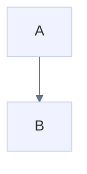
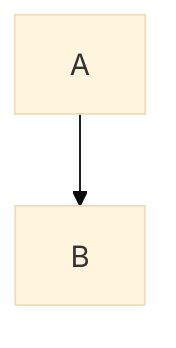

# Mermaid config support

Agentic Mermaid accepts Mermaid-style runtime config through explicit render options, YAML frontmatter, and `%%{init: ...}%%` / `%%{initialize: ...}%%` directives.

Round-trip behavior: the agent surface preserves these source wrappers
byte-verbatim — `parseMermaid → serializeMermaid` and every `mutate` re-emit
the original frontmatter/directives/leading comments untouched, so a
`config.layout`/`config.look` request written for Mermaid survives an
Agentic Mermaid edit loop. Canonical wrapper synthesis (config-nested
frontmatter, directives folded) is opt-in via
`serializeMermaid(d, { wrapper: 'canonical' })` or `am format
--canonical-wrapper`.

## Explicit config

```ts
import { renderMermaidSVG } from 'agentic-mermaid'

const svg = renderMermaidSVG(source, {
  mermaidConfig: {
    theme: 'base',
    themeVariables: {
      fontFamily: 'Inter, sans-serif',
      primaryColor: '#eef2ff',
      primaryTextColor: '#111827',
      lineColor: '#64748b',
    },
  },
})
```

Explicit options win over source-level config when both specify the same supported field.

## YAML frontmatter



## Init directives



Loose Mermaid-style object literals are accepted for documented config surfaces where Mermaid permits them.

## Supported config surfaces

Top-level:

- `theme`
- `themeVariables`
- `fontFamily`
- `fontSize`

Family-specific:

- `xyChart.width`, `xyChart.height`, `xyChart.chartOrientation`, `xyChart.showDataLabel`, `xyChart.titlePadding`, `xyChart.xAxisLabelPadding`, `xyChart.yAxisLabelPadding`, `xyChart.plotReservedSpacePercent`, `xyChart.plotColorPalette`, `xyChart.useMaxWidth`, `xyChart.useWidth`
- `architecture.padding`, `architecture.iconSize`, `architecture.fontSize`
- `timeline.disableMulticolor`, `timeline.padding`, `timeline.sectionFontSize`, `timeline.periodFontSize`, `timeline.eventFontSize`

Unsupported fields are preserved at the source level where possible, but only documented fields are interpreted by renderers.

## Security

Use strict rendering for untrusted source:

```ts
renderMermaidSVG(source, { security: 'strict' })
```

Strict mode disables external-fetch references such as remote font imports. Agents should prefer strict mode unless the caller explicitly wants externally loaded fonts.

## PNG and config

PNG renders from the same SVG pipeline, so supported Mermaid config affects PNG too:

```ts
import { renderMermaidPNG } from 'agentic-mermaid/agent'

const png = renderMermaidPNG(source, {
  fitTo: { width: 1200 },
  background: '#fff',
})
```

For offline/deterministic PNG generation, avoid external font imports by relying on the bundled font fallback or by rendering with strict/offline SVG options where applicable.
