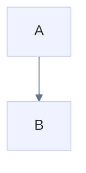
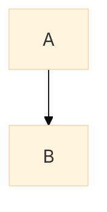

# Mermaid config support

Agentic Mermaid accepts Mermaid-style runtime config through explicit render options, YAML frontmatter, and `%%{init: ...}%%` / `%%{initialize: ...}%%` directives.

Round-trip behavior: the agent surface preserves these source wrappers
byte-verbatim — `parseMermaid → serializeMermaid` and every `mutate` re-emit
the original frontmatter/directives/leading comments untouched, so a
`config.layout`/`config.look` request written for Mermaid survives an
Agentic Mermaid edit loop. Canonical wrapper synthesis (config-nested
frontmatter, directives folded) is opt-in via
`serializeMermaid(d, { wrapper: 'canonical' })` or `am format
--canonical-wrapper`.

## Explicit config

```ts
import { renderMermaidSVG } from 'agentic-mermaid'

const svg = renderMermaidSVG(source, {
  mermaidConfig: {
    theme: 'base',
    themeVariables: {
      fontFamily: 'Inter, sans-serif',
      primaryColor: '#eef2ff',
      primaryTextColor: '#111827',
      lineColor: '#64748b',
    },
  },
})
```

Explicit options win over source-level config when both specify the same supported field. `RenderOptions.onConfigDiagnostic` can collect warnings for explicit config that is unknown, invalid, or has no faithful effect; without a collector, explicit ineffective State config warns through `console.warn` rather than disappearing silently.

## YAML frontmatter



## Init directives



Loose Mermaid-style object literals are accepted for documented config surfaces where Mermaid permits them.

## Supported config surfaces

Top-level:

- `theme`
- `themeVariables`
- `fontFamily`
- `fontSize`

(The composable look system is a *render option*, not Mermaid config:
`RenderOptions.style` — name | JSON record | stack — and
`RenderOptions.seed`; see `docs/style-authoring.md`. Mermaid
`themeVariables` and explicit color options still win over a style's
palette, preserving Mermaid compatibility.)

Family-specific config is **wire-or-warn**: every accepted key either changes
output or produces `INEFFECTIVE_CONFIG` naming the field. Unknown keys also
warn, so spelling mistakes cannot disappear silently. This contract covers all
12 families and both frontmatter and init directives.

Notable wired sections include:

- `flowchart`: spacing and measured wrapping;
- `sequence`: actor/message/note spacing, dimensions, activations, and numbering;
- `timeline`, `journey`, `class`, `er`, `architecture`, `xyChart`, `pie`, and
  `quadrantChart`: the fields documented in their family design notes;
- `gantt.displayMode` (`compact` packs non-overlapping tasks in a section into
  shared rows).

`state` has a typed `StateRuntimeConfig`. `nodeSpacing`, `rankSpacing`,
`padding`, `radius`, `fontSize`, `compositTitleSize` (upstream spelling),
`forkWidth`, `forkHeight`, `noteMargin`, and `dividerMargin` are wired to
State-specific geometry/paint. `defaultRenderer: 'elk'` is satisfied;
alternate renderer requests, invalid values, and legacy Dagre/fixed-metric
calibration fields emit qualified `state.*` diagnostics. Unsupported fields
and wrappers remain source-preserved. The executable all-family audit is
`src/__tests__/unknown-config-wire-or-warn.test.ts`; the independent State key
inventory and discriminating geometry probes are in `state-config.test.ts`.

## Security

Use strict rendering for untrusted source:

```ts
renderMermaidSVG(source, { security: 'strict' })
```

Strict mode disables external-fetch references such as remote font imports. Agents should prefer strict mode unless the caller explicitly wants externally loaded fonts.

## PNG and config

PNG renders from the same SVG pipeline, so supported Mermaid config affects PNG too:

```ts
import { renderMermaidPNG } from 'agentic-mermaid/agent'

const png = renderMermaidPNG(source, {
  fitTo: { width: 1200 },
  background: '#fff',
})
```

For offline/deterministic PNG generation, avoid external font imports by relying on the bundled font fallback or by rendering with strict/offline SVG options where applicable.
