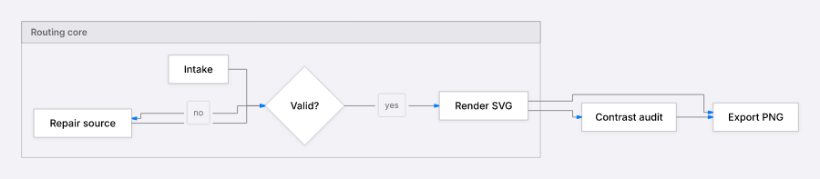
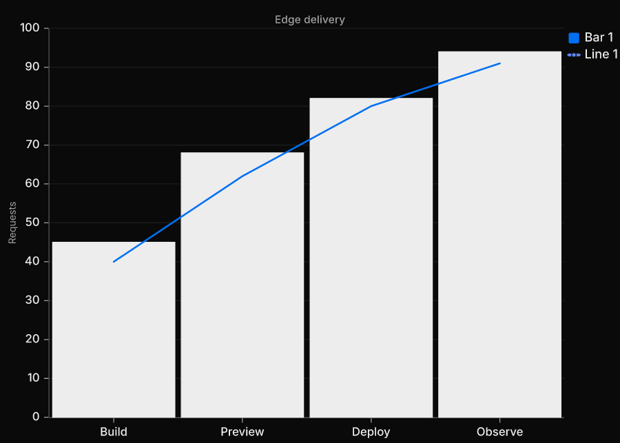
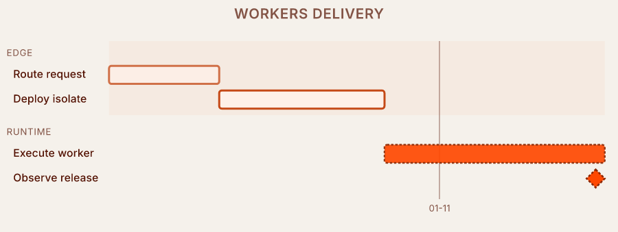
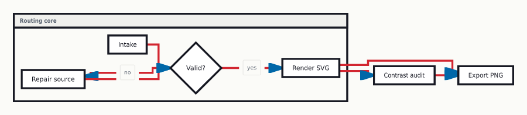
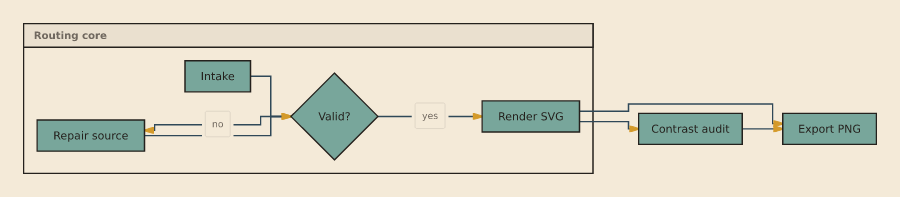
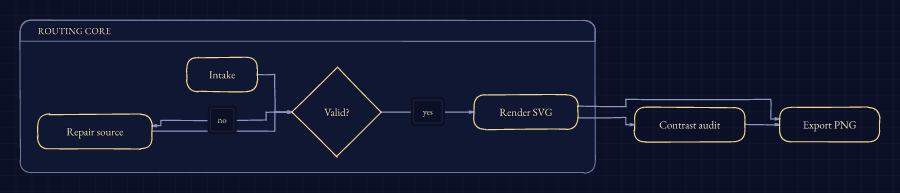

# Custom style cookbook

Custom styles are JSON files. Put the file under version control, pass it to
`--style`, and add a `seed` when you want reproducible sketch variation.

```bash
am render diagram.mmd --format svg --style examples/styles/transit-route-map.style.json --seed 11 > diagram.svg
am render diagram.mmd --format png --style examples/styles/transit-route-map.style.json --seed 11 --output diagram.png
```

The schema is published in this repo as
[`docs/schemas/style-spec.schema.json`](./schemas/style-spec.schema.json) and
from the package as `agentic-mermaid/style-spec.schema.json`. Example files use
`$schema` so editors can offer field completion. The renderer ignores that
field.

Runtime validation still matters. A schema catches the file shape; the renderer
uses `validateStyleSpec` before accepting untrusted records.

```ts
import { readFileSync } from 'node:fs'
import { validateStyleSpec } from 'agentic-mermaid'

const style = JSON.parse(readFileSync('examples/styles/transit-route-map.style.json', 'utf8'))
const problems = validateStyleSpec(style)
if (problems.length) throw new Error(problems.join('\n'))
```

The `font` field names a family; the output environment still has to provide
that face. See [Fonts in custom styles](./custom-fonts.md) for SVG behavior,
PNG `fontDirs`, system fonts, fallbacks, and browser usage.

## Public brand-inspired prototypes — documentation only

These three files are the highest supported non-built-in form of a Style probe:
version-controlled public `StyleSpec` records with schema validation, executable
fixtures, deterministic screenshot gates, strict rendering, inspect-only
constraints, and optional process-local registration. The reviewed image hashes
are pinned in
[`eval/style-prototype-evidence/visual-approval.json`](../eval/style-prototype-evidence/visual-approval.json).
They are not package-owned built-ins, installed BrandPacks, claims of pixel
equivalence, or endorsements.

### Cupertino-inspired prototype

Complete file:
[`examples/styles/cupertino-prototype.style.json`](../examples/styles/cupertino-prototype.style.json).

This is an implementation example, not a built-in Style. Agentic Mermaid ships
the opt-in file but does not register `cupertino`, give it a package-owned
runtime identity, expose it in a built-in catalog or picker, or retain a
registered short name. Load the JSON explicitly when you want to study or
adapt the prototype:



```bash
am render examples/styles/cupertino-prototype.mmd --format svg \
  --style examples/styles/cupertino-prototype.style.json \
  --options '{"shadow":true}' \
  --output diagram.svg
```

Library hosts can opt into a reusable name without creating a built-in registry
identity. Registration is explicit, process-local, and disposable:

```ts
import { readFileSync } from 'node:fs'
import { registerStyle, renderMermaidSVG, validateStyleSpec } from 'agentic-mermaid'

const prototype = JSON.parse(
  readFileSync('examples/styles/cupertino-prototype.style.json', 'utf8'),
)
const source = readFileSync('examples/styles/cupertino-prototype.mmd', 'utf8')
const problems = validateStyleSpec(prototype)
if (problems.length) throw new Error(problems.join('\n'))

const unregister = registerStyle(prototype)
try {
  const svg = renderMermaidSVG(source, {
    style: 'look:cupertino-prototype',
    shadow: true,
  })
} finally {
  unregister()
}
```

The public `StyleSpec` expresses the prototype's palette, font, weight-based
role typography, surface-first border policy, padding, geometry, and inspect-only
contrast/accent-area constraints. Its 10-unit node corners, 26-unit group
corners, and 16-unit connector bend radius make the intended Cupertino-inspired
curve discipline directly inspectable; `shadow` remains the shared render option
supplying elevation. The file still does not claim pixel equivalence with an
Apple interface: it uses bundled Inter rather than licensed SF Pro, has no
motion/spring system, and provides no designed dark companion.

Agentic Mermaid is independent of and not affiliated with Apple Inc.;
“Cupertino” describes the prototype's design inspiration, not an Apple product
or endorsed implementation.

### Vercel-inspired prototype

Complete file:
[`examples/styles/vercel-inspired-prototype.style.json`](../examples/styles/vercel-inspired-prototype.style.json).



```bash
am verify examples/styles/vercel-inspired-prototype.mmd \
  --style examples/styles/vercel-inspired-prototype.style.json
am render examples/styles/vercel-inspired-prototype.mmd --format svg \
  --style examples/styles/vercel-inspired-prototype.style.json > diagram.svg
```

This static prototype uses the public palette and role records for dark surfaces,
hairlines, compact typography, and restrained geometry. Its executable XYChart
fixture exercises `bar-0` and `line-0` category bindings through named semantic
slots; contrast and accent-area policy remains inspect-only. It deliberately
does not imitate Geist assets, Vercel motion, live application chrome, or a
complete product design system.

Agentic Mermaid is independent of and not affiliated with Vercel Inc.;
“Vercel-inspired” describes visual research, not a Vercel product or endorsed
implementation.

### Cloudflare Workers-inspired prototype

Complete file:
[`examples/styles/cloudflare-workers-inspired-prototype.style.json`](../examples/styles/cloudflare-workers-inspired-prototype.style.json).



```bash
am verify examples/styles/cloudflare-workers-inspired-prototype.mmd \
  --style examples/styles/cloudflare-workers-inspired-prototype.style.json
am render examples/styles/cloudflare-workers-inspired-prototype.mmd --format svg \
  --style examples/styles/cloudflare-workers-inspired-prototype.style.json > diagram.svg
```

This static prototype combines warm surface tokens, sans/mono role typography,
Gantt section-category bindings, and visible `outline`/`pattern` cues. The cues
survive no-color terminal projection where that family supports them; contrast
and accent-area rules diagnose without repainting. It does not reproduce
Cloudflare application chrome, motion, tinted multi-layer shadow systems, or a
complete Workers design system.

Agentic Mermaid is independent of and not affiliated with Cloudflare, Inc.;
“Cloudflare Workers-inspired” describes visual research, not a Cloudflare
product or endorsed implementation.

## Transit route map

Complete file:
[`examples/styles/transit-route-map.style.json`](../examples/styles/transit-route-map.style.json).



This style is a good route-map example because it stresses brand colors and
connector weight. It also shows the current limit: JSON styles can set a
route-map palette, but they cannot yet assign stable route colors or station-dot
glyphs per path.

Use it when you want to test whether a style keeps connectors readable:

```json
{
  "$schema": "https://agentic-mermaid.dev/schemas/style-spec.schema.json",
  "name": "look:transit-route-map",
  "colors": {
    "bg": "#fbfbf8",
    "fg": "#171923",
    "line": "#d22630",
    "accent": "#0067a8",
    "surface": "#ffffff"
  },
  "font": "DejaVu Sans",
  "stroke": "crisp",
  "strokeWidth": 4
}
```

## Mid-century report

Complete file:
[`examples/styles/mid-century-report.style.json`](../examples/styles/mid-century-report.style.json).



This is the easiest uncovered cluster to teach with today's StyleSpec. It is
mostly palette, typography, and page treatment. No new backend capability is
needed.

Use it when you want a report figure with visible section bands and square
technical connectors:

```json
{
  "$schema": "https://agentic-mermaid.dev/schemas/style-spec.schema.json",
  "name": "look:mid-century-report",
  "colors": {
    "bg": "#f4ead8",
    "fg": "#24211d",
    "line": "#2f4858",
    "accent": "#d49a2a",
    "surface": "#78a69b"
  },
  "font": "DejaVu Sans",
  "stroke": "crisp",
  "strokeWidth": 1.6
}
```

## Star chart atlas

Complete file:
[`examples/styles/star-chart-atlas.style.json`](../examples/styles/star-chart-atlas.style.json).



This example exercises the page axis: dark host, grid backdrop, pale strokes,
serif labels, and lightly rough geometry. It is useful because it reveals
hard-coded light fills quickly.

Use it when you need a dark page style that still keeps labels readable:

```json
{
  "$schema": "https://agentic-mermaid.dev/schemas/style-spec.schema.json",
  "name": "look:star-chart-atlas",
  "colors": {
    "bg": "#0b1026",
    "fg": "#ece4c4",
    "line": "#8a96c0",
    "accent": "#f0d98a",
    "surface": "#101733"
  },
  "font": "EB Garamond",
  "stroke": "jittered",
  "roughness": 0.35,
  "fill": "none",
  "backdrop": "grid"
}
```

## Which uncovered clusters belong in guides

Three clusters make good cookbook examples now:

- **Transit/route-map semantics.** It teaches thick connector palettes and the
  difference between a global palette and a true route identity system.
- **Retro editorial palettes.** Bauhaus, mid-century, and report figures fit
  the current fields well: color tokens, solid fills, and typography.
- **Star-chart/page treatments.** Dark pages and grid backdrops test whether
  every family routes text and strokes through style tokens.

Three clusters should wait for new capabilities:

- **Stained glass, ukiyo-e, and codex.** They need material backdrops, spot
  palettes, and stronger fill texture rules than the public JSON fields expose.
- **Glass, CRT amber, and neon arcade.** They need compositor/filter fields:
  glow, blur, translucent panels, and static-export fallbacks.
- **Graffiti or spray paint.** They need spray, overspray, layered text
  outlines, and drip/splatter operators before the result is more than a bright
  marker style.

## Regenerate the screenshots

```bash
bun run scripts/docs/custom-style-cookbook.ts
bun run scripts/docs/custom-style-cookbook.ts --check
```

The generator renders the same flowchart through each JSON file. If a
screenshot changes, inspect it before committing the new PNG.
