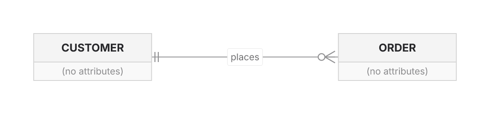
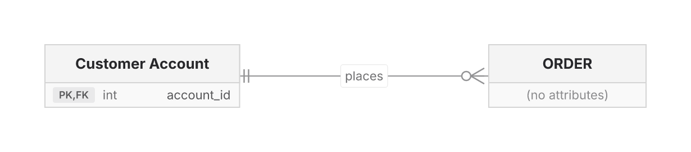

# ER Diagram — Design Notes

## Overview

The ER family follows the standard parse → layout → render pipeline:
`src/er/parser.ts` → `src/er/layout.ts` (ELK layered) →
`src/er/renderer.ts` (SceneGraph lowering + DefaultBackend). The agent
surface owns a separate structured body (`src/agent/er-body.ts`) under the
structured-or-opaque contract.

Supported today:

- bare and aliased entity declarations (`CUSTOMER["Customer Account"]`) and
  entities with attribute blocks (`type name PK|FK|UK "comment"`)
- relationships with the full Mermaid cardinality token set
  (`|| |o o| }o o{ }| |{`), identifying (`--`) and non-identifying (`..`)
  lines, and labels
- **`direction TB|BT|LR|RL`** (upstream v11.4+) — wired to layout
  (plan §ER 6)
- **flowchart-style `subgraph … end` tolerance** (repo #103) — see below
- accessibility directives, SVG/PNG/ASCII output

## Alias and composite-key evidence (2026-07)

**Why:** `CUSTOMER["Customer Account"]` separates stable identity from display
label, while `PK, FK` declares two badges for one attribute. The fixture is
[`er-alias-keys-demo.mmd`](./er-alias-keys-demo.mmd).

| Before (`7f5102a9`) | After |
|---|---|
|  |  |

**What to inspect:** before, the alias declaration and attribute block are
dropped, leaving `CUSTOMER (no attributes)`. After, the header reads `Customer
Account` and the row shows a `PK,FK` badge while the relationship still resolves
the stable `CUSTOMER` endpoint.

## Direction and spacing (2026-07 elevation)

`direction TB|BT|LR|RL` (shared grammar in
`src/shared/direction-statement.ts`) is parsed into `ErDiagram.direction`
and mapped through `directionToElk` from `src/layout-engine.ts` — the same
mapping the flowchart engine uses, not a copy.

**Deliberate divergence**: the fork's default ER flow stays **LR** (upstream
defaults TB). Changing the default would reflow every existing ER golden for
no user request; an explicit `direction TB` gets upstream's behavior.

RenderOptions `nodeSpacing`/`layerSpacing` thread into ELK (defaults 70/90
unchanged).

## Config (wire-or-warn, P4)

The typed `er` frontmatter section (`ErRuntimeConfig` in
`src/mermaid-source.ts`), applied by `applyErFrontmatterConfig` in
`src/er/layout.ts` on both the render path and the verify layout path:

- **Wired**: `layoutDirection` (precedence: in-body `direction` statement >
  `er.layoutDirection` > LR default), `nodeSpacing`, `rankSpacing`
  (explicit RenderOptions win).
- **Lint** (`INEFFECTIVE_CONFIG`, Tier-3): `titleTopMargin`,
  `diagramPadding`, `minEntityWidth`, `minEntityHeight`, `entityPadding`,
  `stroke`, `fill`, `fontSize` (`ER_NOOP_CONFIG_FIELDS`, beside the wiring).

## Crow's-foot markers (glyph correction)

The SVG marker vocabulary now matches upstream's erMarkers reference
exactly (verified 2026-07):

| Cardinality | Glyphs | Marker |
|---|---|---|
| one and only one | `\|\|` | two ticks |
| zero or one | `\|o` / `o\|` | ONE tick + circle |
| one or more | `}\|` / `\|{` | crow's foot + ONE tick |
| zero or more | `}o` / `o{` | crow's foot + circle |

Before the correction, zero-or-one drew TWO ticks (reading as "one and only
one" plus a circle) and one-or-more drew no tick (indistinguishable from a
bare many). `src/__tests__/er-crowsfoot.test.ts` pins each marker by
primitive counts in the scene geometry and requires the four signatures to
be pairwise distinct. Existing `||` markers kept their historical two-step
float arithmetic so unaffected diagrams stay byte-identical. The ASCII
renderer's textual markers (`|`, `o|`, `>`, `>o`) already distinguished all
four and are unchanged.

## Subgraph tolerance (repo #103, option 2)

One upstream parser test exercises flowchart-style
`subgraph … direction RL … end` inside an erDiagram (the opener may even
ride the header line: `erDiagram subgraph WithRL`). The contract:

- the strict family detector accepts the header-riding form
  (`detectDiagramTypeFromFirstLine` in `src/mermaid-source.ts`);
- the render parser tracks subgraph depth and IGNORES the block delimiters;
  entity/relationship lines inside still render (without grouping);
  a `direction` inside a subgraph belongs to the dropped construct and does
  not leak to the diagram level;
- verify announces the dropped grouping with the existing
  `UNSUPPORTED_SYNTAX` Tier-3 lint (`syntax: 'er_subgraph'`, built in
  `src/agent/er-body.ts` from the parser's own
  `erContainsSubgraphConstruct`), which also suppresses the generic
  `er_opaque` double-flag;
- the agent body uses ordered `ErStatement` segments: relationships/entities
  remain typed and editable while `subgraph`, scoped `direction`, `end`, and
  tolerated unknown lines retain their exact source order as opaque segments.
  Identity edits that would stale a preserved opaque reference are refused.
  An opaque-only empty block remains whole-body opaque instead of becoming a
  misleading structured empty diagram; a header-only `erDiagram` remains a
  structured blank canvas for typed authoring.

The former bench exclusion
`er-upstream-should-correctly-parse-direction-rl-inside-a-subgraph`
(`local-verify-gap`, tracked by #103) has been converted to an imported case
per its `convert-to-case` target.

## Styling, ordered preservation, and terminal clearance

Entity `:::class` suffixes no longer alter semantic identity or create phantom
entities. `classDef`, class assignment, and inline `style` use the shared
`src/shared/style-props.ts` grammar; paint resolves before rendering and is
editable through `define_class`, `set_entity_class`, and `set_entity_style`.
Aliases and comma-separated composite keys remain fully structured;
`set_entity_label` edits display labels without renaming ids.

`src/ascii/er-diagram.ts` reserves entity frames and attribute rows before
routing. Deterministic detours cannot cross a foreign entity box, and Unicode
labels are measured in display cells. `er-typed-segments.test.ts` pins ordered
mixed typed/opaque preservation and identity-edit refusal;
`er-ascii-clearance.test.ts` pins terminal box and attribute-row clearance.
