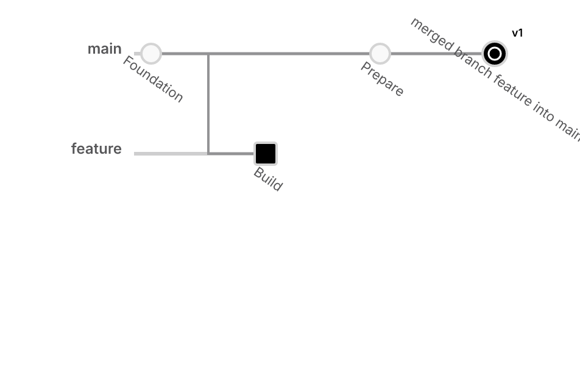

# GitGraph

## Contract

GitGraph is a first-class replayed-history family. `src/gitgraph/parser.ts` executes `commit`, `branch`, `checkout`/`switch`, `merge`, and `cherry-pick` statements in source order, so branch heads and parent relations are validated rather than merely tokenized. Custom duplicate commit identities fail with `GITGRAPH_DUPLICATE_COMMIT_ID`.

Compatibility is pinned to Mermaid commit `f3dea58385fd5c7dd1f4e9c9c1876751ae6943cc`. The checked oracle accounts for all 69 direct blocks in upstream `gitGraph.spec.ts`: 63 portable/error cases execute, five config-accessor blocks are source-inexpressible, and duplicate custom identity is an executable deliberate divergence. Unlike upstream random generated ids, omitted ids are deterministic `c<N>` values. The source-file hash, cases, and divergence rationale live in `eval/mermaid-upstream-suite-bench/mindmap-gitgraph-f3dea583.json`. The harvest added legacy `commit "message"`, multiline `accDescr`, and pinned mixed explicit/implicit branch-order compatibility.

## Visual evidence

**Why:** at baseline commit `c7e33247`, `gitGraph` was not a registered family,
so the reproducible render command below failed instead of producing an
artifact. The after image is generated from [`gitgraph-demo.mmd`](./gitgraph-demo.mmd):

```bash
bun run bin/am.ts render docs/design/families/gitgraph-demo.mmd \
  --format png --output docs/design/families/gitgraph-after.png
```



**What to inspect:** stable main/feature lanes, replay-ordered commit marks,
the merge's two parent paths, the highlighted authored commit, and the `v1`
tag. There is intentionally no fabricated “before” picture: the causal before
state was a named unsupported-family failure. Reproduce it in an isolated
baseline worktree (do not run this over the feature checkout):

```bash
git worktree add --detach /tmp/am-before c7e33247b7f152ada47000db3cd514c04cbcc00e
(cd /tmp/am-before && bun install --frozen-lockfile && \
  printf 'gitGraph\n  commit id:"base"\n' | bun run bin/am.ts render - \
    --format png --output /tmp/gitgraph-before.png)
git worktree remove --force /tmp/am-before
```

Expected result: exit 2 with `PARSE_FAILED` / `UNKNOWN_HEADER: Unrecognized
header: "gitGraph"`; no PNG is produced.

## Rendering and layout

`src/gitgraph/layout.ts` gives each branch a stable lane, places commits in replay order (or deterministic generation levels under `parallelCommits`), and materializes every first-parent, merge-parent, and cherry-pick relation. `src/gitgraph/renderer.ts` lowers branch rails, relation polylines, commit types, tags, and labels through Scene IR. Commit groups expose source-facing `data-id`; relations expose typed `data-from`/`data-to`. `src/ascii/gitgraph.ts` draws spatial branch rails and merge topology before painting commit marks so routes cannot erase identities.

Wired `gitGraph` config fields are `showBranches`, `showCommitLabel`, `mainBranchName`, `mainBranchOrder`, `parallelCommits`, and `rotateCommitLabel`. Unknown fields and invalid documented values produce named `INEFFECTIVE_CONFIG` diagnostics and have no effect.

## Typed editing

Use `asGitGraph`. Replay operations append commits, create/checkout branches, merge, and cherry-pick. Property operations set commit message/type/tags, rename a non-main branch, and edit accessibility title/description. Invalid replay state is rejected with a typed mutation error; history is never silently repaired. Semantic merge commits always retain `type: 'MERGE'`; an authored visual `type:` override is held separately as `customType`, and synthetic merge labels are not serialized as authored `msg:` text.

## Verification

`verifyMermaid` checks commit-label overflow, parent anchoring, and the real projected layout. The focused citizenship suite proves stable replay/serialization, deterministic generated ids, duplicate and invalid-state rejection, parent cardinality, branch-lane geometry, typed mutation, SVG identity/accessibility/security, terminal topology, and property-generated linear histories.

See `src/__tests__/mindmap-gitgraph-citizenship.test.ts` and the exhaustive
operation/replay contract in `src/__tests__/gitgraph-agent-ops.test.ts`. The
focused Stryker lane (`bun run mutation-test:gitgraph`) killed 294/303 mutants
(**97.03%**) in the latest 2026-07-10 local run; the gitignored report is not
immutable PR evidence and the committed break floor is 60%. The nine survivors
are canonical whitespace/`NORMAL` equivalents or merge/statement-kind guards
implied by valid discriminated replay state. The broad nightly family lane
additionally mutates parser, layout, and renderer cores.
