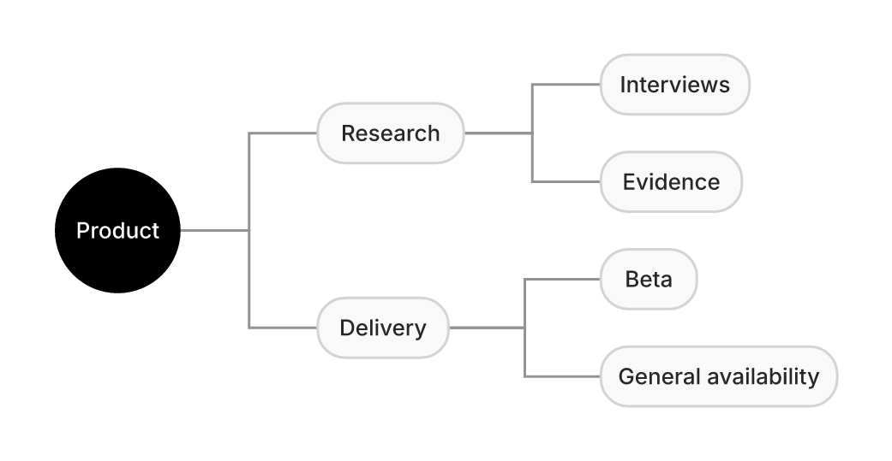
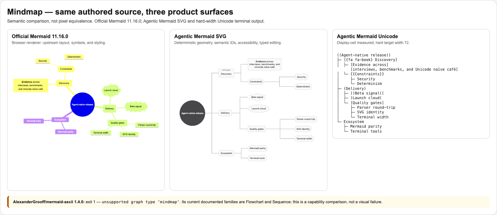
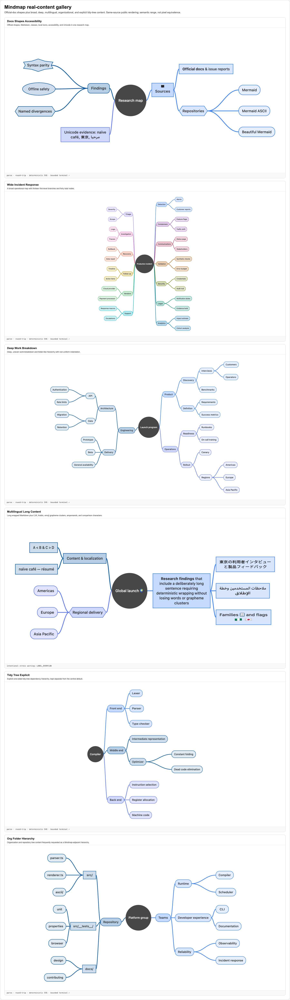

# Mindmap

## Contract

Mindmap is a first-class, indentation-sensitive family. The parser consumes the untrimmed normalized body, produces a recursive `MindmapNode` tree, and preserves Mermaid shapes, `::icon(...)`, `:::class`, `accTitle`, and `accDescr`. Duplicate semantic node identities fail with `MINDMAP_DUPLICATE_ID`; they never overwrite an earlier node.

Compatibility is pinned to Mermaid commit `f3dea58385fd5c7dd1f4e9c9c1876751ae6943cc`. The checked oracle accounts for all 26 direct blocks in upstream `mindmap.spec.ts`; every block is executable, and the source-file hash, normalized expectations, and intentional divergences live in `eval/mermaid-upstream-suite-bench/mindmap-gitgraph-f3dea583.json`. The harvest added trailing-inline-comment compatibility (`%%` outside quoted labels). Current documentation parity also covers quoted multiline Markdown Strings with `**bold**`/`*italic*`, all seven documented shape delimiters, `::icon(...)`, multiple `:::class` names, and `layout: tidy-tree`. Malformed or whitespace-only decorations, metadata, accessibility directives, and shape delimiters fail closed rather than becoming nodes.

## Visual evidence

**Why:** at baseline commit `c7e33247`, `mindmap` was not a registered family,
so the reproducible render command below failed instead of producing an
artifact. The after image is generated from [`mindmap-demo.mmd`](./mindmap-demo.mmd):

```bash
bun run bin/am.ts render docs/design/families/mindmap-demo.mmd \
  --format png --output docs/design/families/mindmap-after.png
```



The same authored fixture also renders in official Mermaid 11.16.0 and both Agentic output engines:



Regenerate the pinned upstream SVG, terminal text, and comparison sheet with:

```bash
bun run scripts/pr-assets/mindmap-gitgraph-comparison.ts
```

**What to inspect:** one central semantic root; deterministic branches on both sides; ordered Discovery/Delivery/Ecosystem subtrees; every documented shape; multiline Markdown formatting; a resolved local book pictogram; curved hierarchy connectors; and the same central-root meaning preserved by the 72-cell terminal surface. Pixel identity is not expected because the renderers use different layout and style engines.
There is intentionally no fabricated “before” picture: the causal before state
was a named unsupported-family failure. Reproduce it in an isolated baseline
worktree (do not run this over the feature checkout):

```bash
git worktree add --detach /tmp/am-before c7e33247b7f152ada47000db3cd514c04cbcc00e
(cd /tmp/am-before && bun install --frozen-lockfile && \
  printf 'mindmap\n  root((Product))\n' | bun run bin/am.ts render - \
    --format png --output /tmp/mindmap-before.png)
git worktree remove --force /tmp/am-before
```

Expected result: exit 2 with `PARSE_FAILED` / `UNKNOWN_HEADER: Unrecognized
header: "mindmap"`; no PNG is produced.

## Rendering and layout

`src/mindmap/layout.ts` deterministically measures and wraps labels, places the root centrally, partitions first-level branches across left and right sides, sizes depth columns independently per side, and preserves subtree order within each side. Independent side widths prevent one long label from creating an empty mirror column; compact horizontal gaps and larger leaf spacing use the canvas rather than producing a very wide strip. `src/mindmap/renderer.ts` assigns a stable palette color to each first-level subtree, carries that color through tinted descendant fills and curved connectors, and emits source-semantic `data-id` values only on node groups. `src/ascii/mindmap.ts` renders a central-root projection with Unicode or ASCII branches, grapheme-aware wrapping, and the hard `targetWidth` contract.

The wired family config fields are `mindmap.padding`, `mindmap.maxNodeWidth`, and the official top-level `layout` selector. The default is the family-signature central bilateral layout. `layout: tidy-tree` explicitly selects the deterministic one-sided alternate; unknown layout values are diagnosed as `INEFFECTIVE_CONFIG`. Unknown fields and invalid documented values likewise produce named diagnostics and cannot silently change geometry.

`::icon(name)` is preserved structurally on every surface. Known curated names resolve to bounded local path pictograms; unknown packs render an explicit sanitized token fallback. Rendering never performs a network request or ambient filesystem lookup, and applications can inspect the typed `icon` field to provide an additional trusted local icon policy.

## Real-content corpus

The popularity-weighted follow-up corpus adds six same-source scenarios derived from Mermaid docs/specs, Mermaid issues, Beautiful Mermaid #85, Mermaid ASCII #74, and the highest-star sampled fork networks: official shapes/accessibility, a 40-node incident map with 13 root branches, deep work breakdown, multilingual long content, explicit tidy-tree, and organization/repository hierarchy.



Sources, fork weights, structural expectations, and fixtures live in [`eval/mindmap-gitgraph-content-corpus`](../../../eval/mindmap-gitgraph-content-corpus/). `mindmap-gitgraph-content-corpus.test.ts` proves parse/round-trip, central-vs-tidy geometry, deterministic safe SVG, truthful public layout, and hard-width terminal output for every case.

## Typed editing

Use `asMindmap` before mutation. Operations cover add/remove/rename/move, label and shape changes, icon/class decoration, and accessibility title/description. Moves reject cycles; removal of a non-empty subtree requires `recursive: true`; default-shape nodes retain Mermaid's label-as-identity rule.

## Verification

`verifyMermaid` checks label overflow and projects real node/edge geometry into `RenderedLayout`. The focused citizenship suite proves parser/serializer stability, duplicate rejection, tree and route invariants, typed edits, Unicode/display-cell behavior, external-reference hygiene, deterministic SVG/layout, and property-generated sibling trees.

See `src/__tests__/mindmap-gitgraph-citizenship.test.ts`, documentation/grammar parity in `src/__tests__/mindmap-gitgraph-doc-parity.test.ts`, and the exhaustive operation contract in `src/__tests__/mindmap-agent-ops.test.ts`. AlexanderGrooff/mermaid-ascii 1.4.0 currently exits 1 for this fixture with `unsupported graph type 'mindmap'`; its coverage request is [issue #74](https://github.com/AlexanderGrooff/mermaid-ascii/issues/74), so the comparison records capability honestly rather than fabricating equivalent output. The focused Stryker lane (`bun run mutation-test -- mindmap`) remains available as an opt-in survivor harvest. Accepted equivalent survivors and current evidence live in `docs/mutation-testing.md`.
