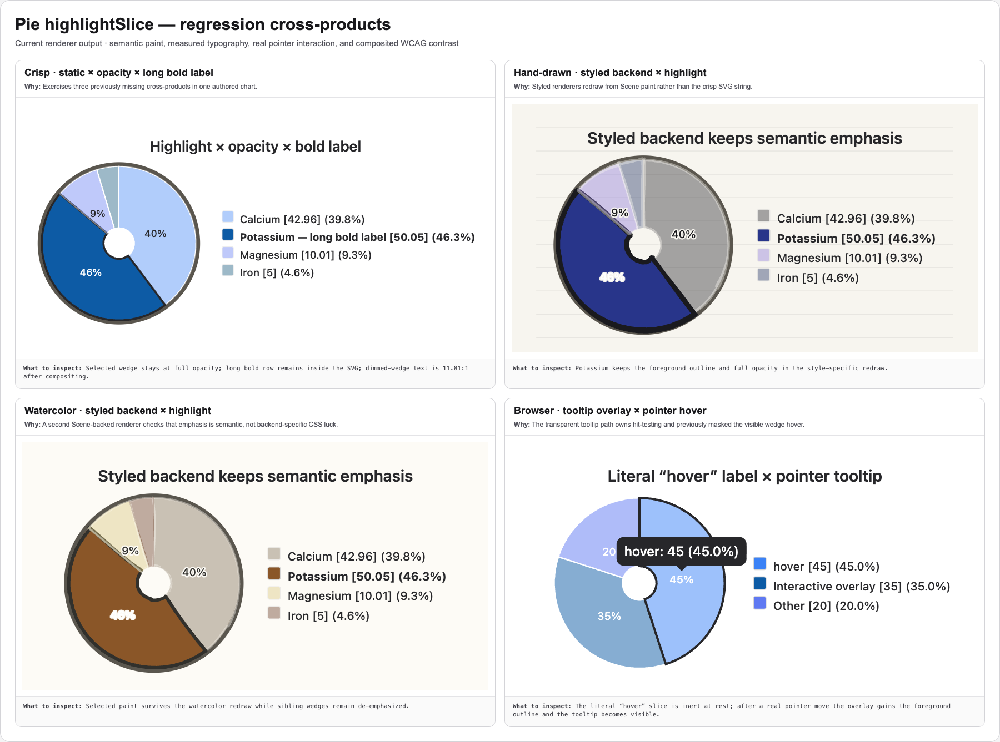

# Pie — family design notes

Status: shipped (pie-family elevation, plan §Pie items 1–4 + tooltips)
Upstream contract verified against: mermaid.js.org/syntax/pie.html,
`packages/mermaid/src/diagrams/pie/pieRenderer.ts`, `pieStyles.ts`,
`config.schema.yaml` (v11.16.0 donut/legend work: PR #7760, issue #7607;
on-slice labels: #1027).

## Architecture

- `src/pie/parser.ts` — render grammar (loud errors, never silent drops).
- `src/pie/config.ts` — the single resolver for the `pie` config section +
  pie theme variables (`resolvePieVisualConfig`), plus the
  documented-but-unwired lists that back the `INEFFECTIVE_CONFIG` lint
  (`pieIneffectiveConfigFields`, consumed by `src/agent/verify.ts`).
- `src/pie/palette.ts` — the single home for slice fills, consumed by the SVG
  renderer (wedges + legend swatches) and `src/ascii/pie.ts` (bars).
- `src/pie/layout.ts` — geometry, legend arrangement by `legendPosition`,
  donut wedge paths, and the on-slice label placement/collision policy.
  Percent formatting for both surfaces lives here (`formatPiePercent` for the
  legend, `formatPieSlicePercent` for on-slice labels) and is reused by the
  agent layout adapter (`src/agent/family-layouts.ts`).
- `src/pie/renderer.ts` — SceneGraph lowering; paint only, no geometry.

## Wired config (upstream names and semantics)

| Key | Contract | Notes |
|---|---|---|
| `pie.textPosition` | number 0..1, default 0.75 | label anchor at `radius * textPosition` along the slice mid-angle (upstream's zero-thickness label-arc centroid); invalid/out-of-range → default |
| `pie.donutHole` | valid (0, 0.9], else 0 | exact upstream clamp; inner radius = `donutHole * radius`; annular wedge paths (nonzero winding ring for a single-slice donut) |
| `pie.legendPosition` | `top\|bottom\|left\|right\|center`, default `right` | same enum/default as upstream; geometry is ours (see divergences) |
| `pie.highlightSlice` | slice label, or reserved `hover` | static target gets non-geometric emphasis; `hover` enables hover-only emphasis without matching a literal label |
| `pie1`..`pie12` | slice fills | honored in **source order**, cycling past 12; unset indices fall back to the derived palette |
| `pieStrokeColor`, `pieStrokeWidth` | slice border | `.pie-slice` rule; accepts numbers or upstream-style `"2px"` strings |
| `pieOuterStrokeWidth`, `pieOuterStrokeColor` | outer circle | drawn at `radius + width/2` (upstream geometry) — only when configured |
| `pieOpacity` | slice fill opacity | applied only when explicitly set |
| `pieSectionTextSize`, `pieSectionTextColor` | on-slice labels | size feeds the layout's fit/collision measurement too |
| `pieTitleTextSize`, `pieTitleTextColor` | title text | size feeds layout measurement and rendering |
| `pieLegendTextSize`, `pieLegendTextColor` | legend text | size feeds layout measurement and rendering |

Documented-but-unwired keys emit the Tier-3 `INEFFECTIVE_CONFIG` lint instead
of being silently swallowed (P4): `useMaxWidth`, `useWidth` (config section).
Every other documented key — including `highlightSlice` and the title/legend
text theme variables — is wired above.

## On-slice labels: format and small-slice policy

Label text matches upstream exactly: `((value/sum) * 100).toFixed(0) + '%'`.

Suppression policy (deterministic, all in `placeSliceLabels`):

1. **Slices under 1% of the total get no on-slice label.** Upstream removes
   sub-1% slices from the drawing entirely (`pieRenderer.ts` `>= 1` filter),
   so its labels only ever exist for slices ≥ 1%. Our faithfulness contract
   forbids dropping data, so we keep the wedge (and its legend row) and
   suppress only the label. This subsumes upstream's explicit `"0%"` filter.
2. **Greedy non-overlap.** Candidates are admitted largest-slice-first
   (ties: source order); a label whose box (measured with the shared text
   metrics, the same estimator the overlap auditor uses) would overlap an
   admitted label is suppressed. Upstream has no such pass and overprints
   runs of thin slices; we never do. Consequence: in a run of thin slices a
   smaller slice can occasionally be labeled while a slightly larger neighbor
   is not (the larger one collided with an even larger neighbor first) —
   deterministic, and never overlapping.

## Legend percentages and the "(0.0%)" fix

The legend shows `Label [value] (pct%)` — the `(pct%)` suffix is a
pre-existing fork divergence (upstream's legend is label + optional
`[value]` only). Legend percent formatting: **round half-up to one decimal
with a 0.1% floor for nonzero fractions** — a nonzero slice can never read
"(0.0%)". Chosen over "match upstream" because upstream has no legend
percentage to match, and its on-slice format (integer + drop-sub-1%-slices)
would erase the information the legend row exists to carry. Note
`Math.round`-half-up and `toFixed` agree on exact ties for positive values,
so the only behavioral change vs. the old `toFixed(1)` is the floor.

## Divergences from upstream (deliberate)

- **Sub-1% slices render.** Upstream silently deletes them from the pie while
  keeping their legend rows; we draw the wedge and suppress only the label.
- **pieN in source order.** Upstream assigns pie1..pie12 after d3 sorts
  slices by value, so the Nth variable doesn't color the Nth data line
  (upstream #5314). We bind pieN to source order — the documented intent.
- **Canvas sizing.** Upstream translates legend groups and can clip
  (its own `legendPosition: center`/`top` variants overhang); our layout
  sizes the canvas from measured extents so no legend row, slice label, or
  title can clip at any position. Multiline (` `) legend rows get taller
  rows and per-line measurement instead of colliding.
- **No outer circle / no 0.7 opacity by default.** Upstream always draws a
  2px black outer circle and 0.7-opacity slices; the crisp look keeps
  borderless opaque slices unless the theme variables ask otherwise.
- **Derived palette.** Without pieN overrides, ≤6 slices keep the
  accent-anchored same-family ladder shared with xychart; >6 slices switch to
  a hue-rotation wheel sized to the slice count (evenly spread hues from the
  accent, alternating lightness tiers, WCAG-checked against the background —
  `src/pie/palette.ts`). Upstream's 12-color theme wheel simply repeats past
  12; the old ladder degenerated to near-identical neighbors (measured WCAG
  1.01:1) at 15 slices.
- **`interactive` tooltips** (beyond parity): pie slices reuse the shared
  hover-tooltip machinery (`src/shared/svg-tooltip.ts`, also used by xychart
  and quadrant) — hover group per slice, native `<title>`, styled tip
  anchored at the label point. Upstream pie has no tooltips outside the
  mermaid.live wrapper.
- **`highlightSlice` is static, non-geometric emphasis (Option D).** The
  configured slice keeps its exact geometry and is emphasized with a heavier
  foreground border while the other slices and legend swatches dim; meaningful
  percentage and legend text stays at full contrast, and the selected legend
  row goes bold. Terminal output marks it with `>`. Geometry is deliberately left
  untouched: the perception literature (Skau & Kosara 2016, "Arcs, Angles, or
  Areas") finds arc length and area are the cues people read, and that changing a
  slice's radius or exploding it degrades reading — so emphasis must not distort
  the wedge (this also honours the faithfulness contract). Earlier this used a
  CSS `scale(1.05)` about the wedge's fill-box centre, which displaced the slice
  off the pie centre (bulging past the outer ring, gapping its neighbour, and
  detaching from the donut hole); that transform is gone. `highlightSlice: hover`
  is a reserved interaction mode and applies the same border on hover only. With
  interactive tooltips, the transparent tooltip hit target also owns the hover
  border so it cannot intercept the interaction. Static renderers add no
  executable hover/click behavior.

## Verification surface

The captioned evidence sheet above is generated from current renderer output by
`bun run gallery:pie-highlight`; `bun run gallery:pie-highlight:check` and its
receipt test bind both PNGs to the complete TypeScript input tree. It includes
crisp `highlightSlice × pieOpacity × long bold label`, hand-drawn and watercolor
Scene redraws, and a real browser pointer over the interactive tooltip overlay.

`src/__tests__/pie-elevation.test.ts` carries the invariant gates that
accompany the golden updates (P5): label collision/canvas-containment
property, legend containment across all five positions on the pie-15 probe,
donut path invariants (no center vertex, ring subpaths), palette
distinguishability (pairwise contrast-or-hue-separation) and background
contrast floors (including post-opacity compositing), source-order pieN
binding, wire-or-warn lint behavior, and tooltip presence/absence. Browser E2E
also checks actual bold-glyph containment and pointer-driven tooltip hover. The
label-overlap fuzz gate pins pie at zero
affected cases; the layout's collision policy uses the same text estimator
as the auditor, so the guarantee is by construction.
