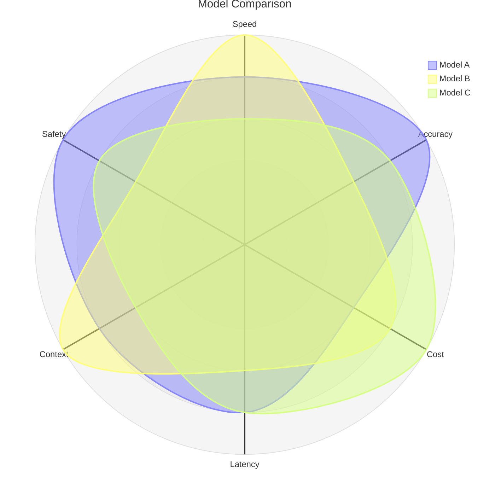
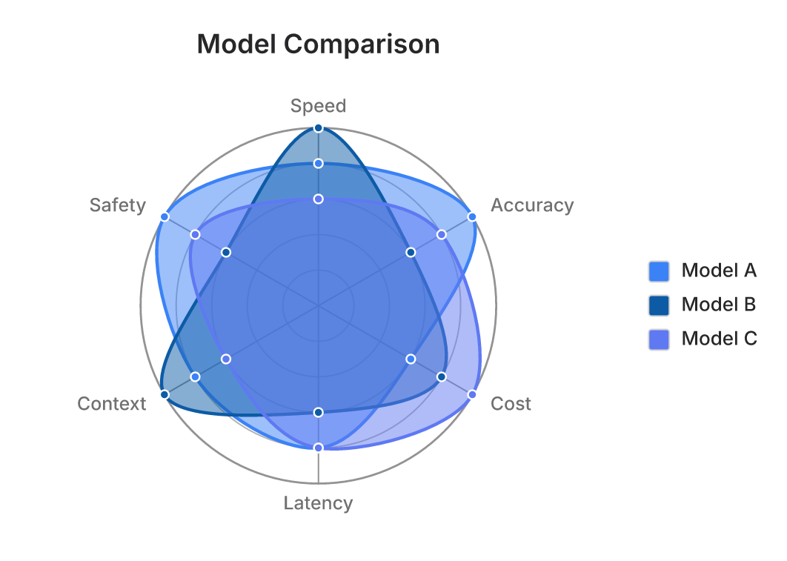
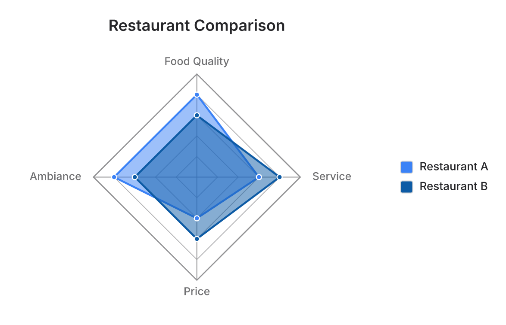

# Radar (`radar-beta`)

Agentic Mermaid renders Mermaid's radar (spider / star-plot) charts. A radar plots
multivariate data on equi-angular spokes from a shared center — one closed area per
entity — so readers compare the overall *silhouette* across shared dimensions.

Polygon graticule + straight edges (`graticule polygon`):

## Syntax

- Header: `radar-beta`, `radar-beta:`, or `radar-beta :`.
- `title <text>`; `accTitle:` / `accDescr:` (accessibility directives fall back to a
  lossless opaque body — they render but typed mutation is unavailable).
- `axis id["Label"] [, id2 …]` — one or more axes; label defaults to the id.
- `curve id["Label"]{…}` — values either **positional** (`{85, 90, 80}`, mapped to
  axes in declaration order) or **keyed** (`{ c: 3, a: 1, b: 2 }`, colon optional,
  reordered to axis order). Declarations are order-independent, curve blocks may span
  lines, and Mermaid `%%` comments are accepted between and after statements.
- Body options: `min`, `max`, `ticks` (integer `1..64`), `graticule circle|polygon`,
  `showLegend`.

## Rendering

Axis 0 sits at 12 o'clock; axes proceed clockwise (`angle = 2πi/n`). Values map to a
radius in `[min, max]`. `graticule circle` draws circular rings and a smooth closed
Catmull-Rom curve (`curveTension`, default 0.17); `graticule polygon` draws polygonal
rings and straight polygon edges. Each curve is a translucent filled area (reusing the
scene `pie-slice` role, so the hand-drawn / watercolor Style stacks apply for free) with
dot vertices on the data points; per-curve colors come from the shared chart palette
(`pieSliceColors`), so a radar renders consistently across every built-in Palette and
matches pie/xychart series identity. Axis labels wrap to two lines when long (closing the
upstream long-label clipping gap, #7683).

Config (`config.radar.*`, wire-or-warn): `width`, `height`, `marginTop/Right/Bottom/Left`,
`axisScaleFactor` (spoke length only), `axisLabelFactor`, `curveTension`, `useMaxWidth`,
and the Agentic extension `tickLabels` (draws numeric ring labels — the still-unmerged
upstream request #6473/#6481 — off by default to preserve parity).

Safe `themeVariables.radar.*` fields are also wired and diagnosed: axis/graticule colors
and stroke widths, axis/legend font sizes, curve/graticule opacity, curve stroke width,
and legend box size. `themeVariables.titleColor` and `cScale0..11` control the title and
curve palette. Unknown or invalid values produce `INEFFECTIVE_CONFIG` rather than silently
vanishing.

## ASCII

Radar's polar geometry doesn't map onto a character grid, so — like pie — it degrades to
a proportional bar table grouped by axis, one colored bar per curve, reusing the shared
palette. It uses the same clamped scale as SVG, honors `showLegend`, preserves multiline
axis/curve cells, includes frontmatter titles, explicitly reports arity mismatches, and
bounds bars independently of input size.

## Agent-native mutation (`asRadar`)

Axes and curves are coupled: every curve carries exactly one value per axis. `add_axis` /
`remove_axis` / `reorder_axis` re-shape every curve's value vector by construction, so
`curve.values.length === axes.length` is an invariant. Ops:
`set_title`, `add_axis`, `remove_axis`, `rename_axis`, `set_axis_label`, `reorder_axis`,
`add_curve`, `remove_curve`, `set_curve_values`, `set_curve_value`, `set_curve_label`,
`rename_curve`, `reorder_curve`, `set_config`.

## Divergences from upstream

Where Mermaid is unguarded, Agentic Mermaid fails loudly instead of emitting NaN geometry:
a degenerate scale (`max ≤ min`) is a named error; negative literals are rejected (the
grammar has no sign token); `ticks` is bounded to `1..64` to prevent input-driven
allocations (upstream accepts zero or arbitrarily large counts). Values outside the scale
are clamped in both SVG and ASCII. A positional curve whose value count ≠ the axis count is
not drawn but is still legended (matching upstream), while it stays opaque rather than
entering the invariant-preserving typed mutation model. See
[`eval/mermaid-radar-bench/harvest.json`](../../../eval/mermaid-radar-bench/harvest.json).
