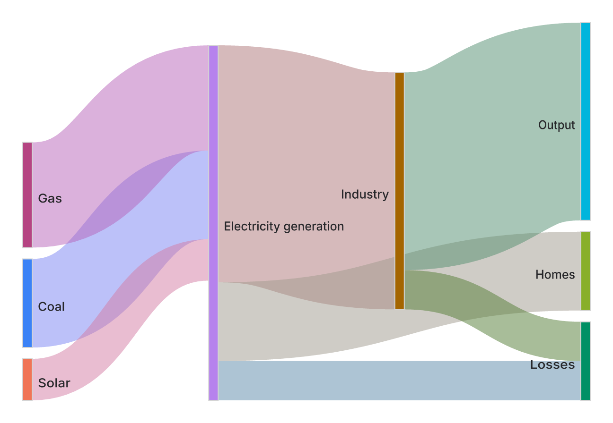
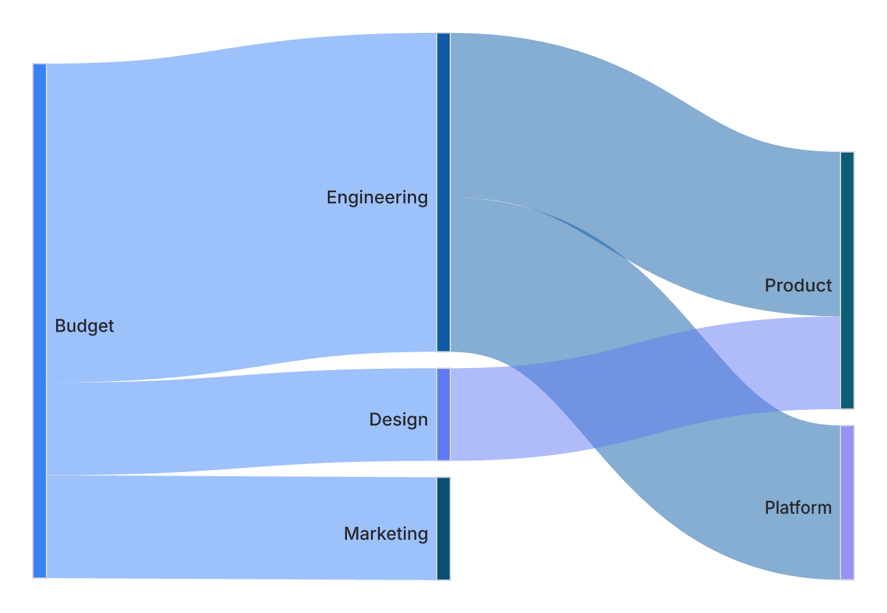

# Sankey family

Headers `sankey` / `sankey-beta` (Mermaid v10.3.0+, pinned upstream 11.16.0).
A sankey diagram shows conserved flows between layered stages: nodes are
implied by the labels in the CSV body, and each row is one value-weighted
ribbon from source to target.



## Aesthetic thesis

**The ribbon widths ARE the message; everything else recedes.** A sankey is an
account, not a picture: width is proportional to flow quantity (the domain's
defining property — [Wikipedia](https://en.wikipedia.org/wiki/Sankey_diagram)),
and quantity is conserved across stages, with imbalances surfaced by the
`FLOW_IMBALANCE` lint rather than silently absorbed into node height. Every
visual decision serves the widths reading truthfully at a glance:

- **Opaque bars, translucent ribbons** (L4): nodes are crisp landmarks; the
  0.5-alpha ribbons blend legibly where they cross, and their *composited*
  color — the color a viewer actually sees — is held to the same WCAG/APCA
  visibility floors as an opaque wedge (`ensureCompositedBgContrast`).
- **One color language** (L3): node identity comes from the shared categorical
  palette, identical in SVG and terminal output; ribbon hue is direction-coded
  from its endpoints, never decorative.
- **Nothing clips, nothing lies** (L5/L6): one `ky` scale resolve, 1px
  visibility floors that grow the flow area instead of overstacking a face,
  and labels that flip sides and grow the canvas rather than truncate.
- **Crossings are measured, not eyeballed**: `sankeyCrossings` is tracked per
  commit in `eval/heuristic-tracker`, so relaxation-quality changes are a
  reviewed number, not an impression.

## Syntax (RFC 4180 subset)

```
sankey-beta

%% source,target,value
Coal,Electricity generation,127.93
Pumped heat,"Heating and cooling, homes",193.026
Pumped heat,"Heating and cooling, ""commercial""",70.672
```

- Exactly three columns per row; unquoted fields are trimmed, quoted fields
  preserved exactly (`""` is a literal quote).
- Empty lines and `%%` comments are allowed.
- Values are non-negative numbers; malformed rows error loudly with the line
  named. Self-loops and cycles are rejected at parse time with the offending
  path spelled out (upstream defers to d3-sankey's opaque "circular link").

## Layout

Deterministic, d3-sankey-style clean-room implementation
(`src/sankey/layout.ts`): longest-path layering, the four upstream
`nodeAlignment` policies (justify default), a fixed number of barycenter
relaxation sweeps, and per-node link stacking sorted by neighbor center.
Node labels sit beside the rectangles and flip sides at the canvas midline;
the canvas grows so measured labels never clip.



## Config (`sankey` section)

Wired: `width`, `height`, `linkColor` (`source` | `target` | `gradient` |
CSS color), `nodeAlignment`, `showValues`, `prefix`, `suffix`, `labelStyle`
(`legacy` | `outlined`), `nodeWidth`, `nodePadding`, `nodeColors`.
Declared no-op: `useMaxWidth`.

`linkColor: gradient` (the upstream default) renders as the deterministic
source→target midpoint blend via `color-mix()`: the scene-security contract
forbids URL-referencing paints, so a literal `<linearGradient>` cannot be
expressed. See `eval/mermaid-sankey-bench/harvest.json` for the full
divergence ledger.

## Agent surface

Typed body `SankeyBody { links: {source, target, value}[] }` with ops
`add_link`, `remove_link`, `set_link_value`, `rename_node` (occurrence
disambiguates parallel duplicate rows; renames reject label collisions so
two nodes can never merge silently). Canonical serialization emits
`sankey-beta` plus one CSV row per link, quoting only when content demands
it.

## Terminal

`src/ascii/sankey.ts` renders a grouped flow list — one section per node
with outgoing flows, value column, and value-proportional bars — in both
Unicode and ASCII charsets, colored with the same categorical palette as
the SVG.
