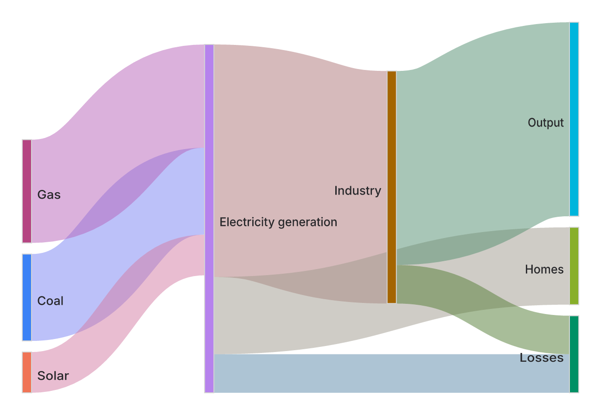
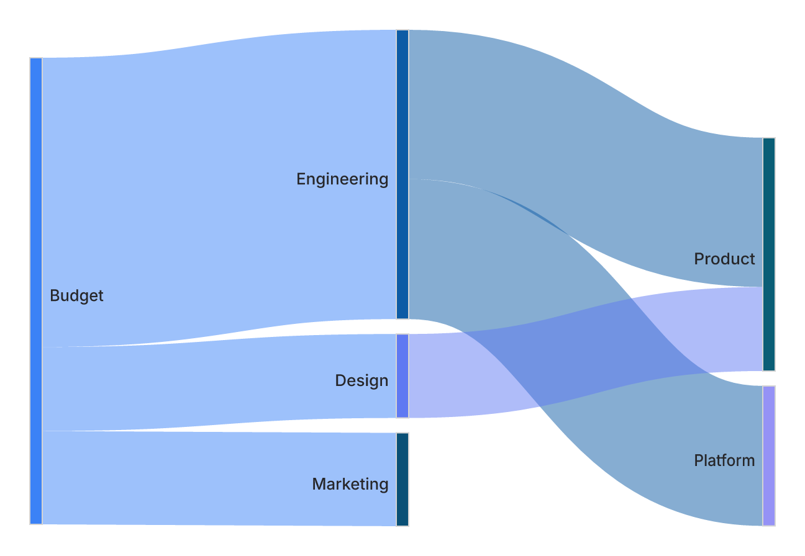

# Sankey family

Headers `sankey` / `sankey-beta` (Mermaid v10.3.0+, pinned upstream 11.16.0).
A sankey diagram shows conserved flows between layered stages: nodes are
implied by the labels in the CSV body, and each row is one value-weighted
ribbon from source to target.



## Aesthetic thesis

**The ribbon widths ARE the message; everything else recedes.** A sankey is an
account, not a picture: width is proportional to flow quantity (the domain's
defining property — [Wikipedia](https://en.wikipedia.org/wiki/Sankey_diagram)),
and quantity is conserved across stages, with imbalances surfaced by the
`FLOW_IMBALANCE` lint rather than silently absorbed into node height. Every
visual decision serves the widths reading truthfully at a glance:

- **Opaque bars, translucent ribbons** (L4): nodes are crisp landmarks; the
  0.5-alpha ribbons blend legibly where they cross, and their *composited*
  color — the color a viewer actually sees — is held to the same WCAG/APCA
  visibility floors as an opaque wedge (`ensureCompositedBgContrast`). Light
  pages retain Mermaid's multiply blend; concrete dark pages use normal alpha
  compositing because multiply can only darken an already-dark backdrop and
  cannot produce a visible ribbon.
- **One color language** (L3): node identity comes from the shared categorical
  palette, identical in SVG and terminal output; ribbon hue is direction-coded
  from its endpoints, never decorative.
- **Nothing clips, nothing lies** (L5/L6): d3-sankey supplies the authoritative
  flow scale and stacking; 1px rendering floors keep zero/tiny marks visible,
  and labels flip sides and grow the canvas rather than truncate.
- **Crossings are measured, not eyeballed**: `sankeyCrossings` is tracked per
  commit in `eval/heuristic-tracker`, so relaxation-quality changes are a
  reviewed number, not an impression.

## Syntax (RFC 4180 subset)

```
sankey-beta

%% source,target,value
Coal,Electricity generation,127.93
Pumped heat,"Heating and cooling, homes",193.026
Pumped heat,"Heating and cooling, ""commercial""",70.672
```

- Exactly three columns per logical row. Quoted fields may span physical lines
  and contain commas; `""` is a literal quote. Every decoded field is trimmed
  before it becomes a node identity, matching Mermaid 11.16.
- Empty lines and `%%` comments are allowed.
- Values are non-negative finite numbers, including exponent (`1e3`) and
  trailing-decimal (`1.`) forms; malformed rows error loudly with the starting
  line named. Self-loops and cycles are rejected at parse time with the
  offending path spelled out (upstream defers to d3-sankey's opaque "circular
  link").

## Layout

`src/sankey/layout.ts` uses `d3-sankey` 0.12.3 directly—the same geometric
engine pinned by Mermaid 11.16—for layering, all four `nodeAlignment` policies
(justify default), barycenter relaxation, collision resolution, and ribbon
stacking. Agentic Mermaid owns the typed projection around that engine:
deterministic mark IDs, measured label/canvas bounds, typed connector routes,
and explicit visibility floors. An all-zero graph uses equal surrogate weights
only to obtain finite d3 ordering/positions; authored node/link values and link
widths remain zero. If the requested `width` cannot fit `nodeWidth` across the
graph's layers, the effective flow corridor grows to the smallest non-
overlapping width. Node labels sit beside the rectangles and flip sides at the
canvas midline; the canvas grows so measured labels and nodes never clip.



## Config (`sankey` section)

Wired: `width`, `height`, `linkColor` (`source` | `target` | `gradient` |
CSS color), `nodeAlignment`, `showValues`, `prefix`, `suffix`, `labelStyle`
(`legacy` | `outlined`), `nodeWidth`, `nodePadding`, `nodeColors`.
Declared no-op: `useMaxWidth`.

`linkColor: gradient` (the upstream default) creates a typed, deterministic
source→target `linearGradient` resource for every ribbon. IDs are namespaced
with the render's `idPrefix`, stops preserve authored endpoint colors, and the
gradient uses `userSpaceOnUse` coordinates so each transition spans its actual
link. Local `url(#id)` paints are accepted only when they resolve to a declared
typed resource; dangling or external references are rejected.

This is an additive implementation of core Scene v2's existing `resources`
capability plus its already-typed connector `mixBlendMode`; the optional
gradient descriptor does not widen the External Scene wire format, so the Scene
contract version does not change. First-party backend admission now proves
marker and gradient resource serialization plus blend-mode realization
independently. External Scene v1 remains closed: authored gradient resources
and `mixBlendMode` keys reject at its exact-key boundary. Terminal projection
preserves the typed stroke receipt but reports `gradient-paint` and
`mix-blend-mode` as explicit continuous-visual losses.

## Agent surface

Typed body `SankeyBody { links: {source, target, value}[] }` with ops
`add_link`, `remove_link`, `set_link_value`, `rename_node` (occurrence
disambiguates parallel duplicate rows; renames reject label collisions so
two nodes can never merge silently). Canonical serialization emits
`sankey-beta` plus one CSV row per link, quoting only when content demands
it.

## Terminal

`src/ascii/sankey.ts` renders a grouped flow list — one section per node
with outgoing flows, value column, and value-proportional bars — in both
Unicode and ASCII charsets, colored with the same categorical palette as
the SVG.
