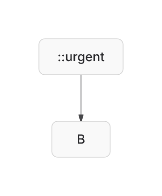
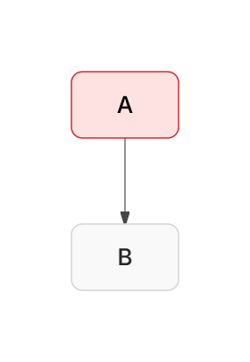

# State (`stateDiagram-v2`) Design Note

## Overview

Design choices behind Agentic Mermaid's state-diagram implementation after the
family-elevation wave (plan §State 1, 2, 6, 7; repo issue #118 state half).

Pipeline:

- `src/state/parse-core.ts` — THE state grammar for notes, pseudostate
  stereotypes, history endpoints, transitions, and concurrency separators.
  Two consumers — the render parser and the agent body — so the surfaces
  cannot drift (the class/journey parse-core precedent).
- `src/parser.ts` `parseStateDiagram` — renderer-grade parser → `MermaidGraph`
  (shared with flowchart layout/render; state adds `stateNotes`, the Batch-4
  pseudostate shapes, and concurrency-region subgraphs).
- `src/agent/state-body.ts` — structured `StateBody` (parse / serialize /
  mutate / verify; structured-or-opaque fallback).
- `src/layout-engine.ts` — ELK layout + the post-freeze `placeStateNotes`
  pass; direction-aware fork/join bar sizing.
- `src/route-contracts.ts` — the self-loop arc router (typed route class with
  its own certificate vocabulary; shared with flowchart).
- `src/renderer.ts` — bars/choice/history shapes, note boxes, dashed
  concurrency-region separators.

## Input model

Modeled constructs (both surfaces):

- `stateDiagram-v2` / `stateDiagram`
- `state "Label" as id`, `id : Description`, composites `state X { … }`
  (nestable, per-composite `direction`)
- transitions `from --> to [: label]`; endpoints `[*]`, plain ids, and
  history references (`[H]`, `[H*]`, `Base[H]`, `Base[H*]`)
- pseudostate stereotypes `state id <<fork|join|choice>>` and the PR #5700
  history forms `<<history>> / <<H>> / <<deephistory>> / <<H*>>`
  (shorthands normalize to `history` / `deep-history` on parse)
- notes: `note left|right of X : text` and the block form
  `note left|right of X … end note` (body lines joined with `\n`)
- `--` concurrency separators inside composites (render parser only — see
  Deferred)

Render-parser-only details:

- Note targets are auto-declared (upstream parity); a note on a composite
  anchors to the composite's box.
- `X[H]` / bare `[H]` resolve to ONE history node per composite
  (`Working[H]`), labeled `H`/`H*`, shape `state-history`. A bare `[H]`
  inside composite `C` is the same node as `C[H]`.
- Each `--` splits the enclosing composite into region subgraphs
  (`X__r1`, `X__r2`, …) flagged `concurrencyRegion` — members land in their
  region, so containment is by construction.

## `:::` class shorthand evidence (2026-07)

**Why:** `A:::urgent` decorates state `A`; it must not become a description or
change semantic identity. The fixture is
[`state-style-shorthand-demo.mmd`](./state-style-shorthand-demo.mmd).

| Before (`7f5102a9`) | After |
|---|---|
|  |  |

**What to inspect:** before, the node is visibly named `::urgent`. After, it is
`A`, has the authored red class paint, and the transition remains attached to
that same state.

## Rendering

- **Fork/join** (`state-fork`/`state-join`): filled bars perpendicular to the
  effective flow direction (70×10 in TB, 10×70 in LR), drawn with the text
  color. Bars are rectangles to the route engine (`RECT_LIKE`), so incident
  lanes may attach anywhere along the bar — "the bar spans its lanes" is a
  construction property, not a repair. Upstream renders these as plain boxes
  (mermaid#2514, broken since 2021).
- **Choice** (`state-choice`): small unlabeled diamond (36×36); clipping and
  ports reuse the diamond geometry.
- **History** (`state-history`): a 32×32 circle containing `H` (`H*` deep).
  Upstream has no history rendering at all (open PR #5700) — this is
  Feature(beyond): the transition is preserved, the circle is drawn, and
  verify announces the Tier-3 `state_history` lint because re-entry
  *semantics* are not modeled by any analysis.
- **Concurrency regions**: regions draw no box of their own; the composite
  draws dashed separators (`class="region-separator"`) centered in the gap
  between adjacent region boxes. The separator axis is derived from the
  region boxes themselves, so the "separator sits between the regions"
  invariant holds whatever the compound packing chose.
- **Notes**: a bordered annotation box (`class="state-note"`, `data-target`,
  `data-side`) with the group-header fill. Placement is the post-freeze
  `placeStateNotes` pass: the box starts adjacent to its target on the
  DECLARED side and only ever moves outward, stepping past any node box,
  group box, edge segment, edge-label pill, or earlier note — so "sits on
  the declared side" and "overlaps nothing" hold simultaneously and
  deterministically (upstream's own placement is broken: mermaid#3782).
  A note whose target sits inside a composite is pushed outside the
  composite's border (the composite box is an obstacle); growing the
  composite instead is future work.

## Self-loop arcs (state AND flowchart; plan §State 6)

ELK emits a self-loop as a ~10px stub that hides behind its own label pill
(upstream: mermaid#6336 fixed state-side in 2025 — the bar; #6049 flowchart-
side still open — the beat). `applyRouteContracts` now rebuilds every
`self-loop` route as the standard arc:

- leave the node on one side at cross-center − d, run out to a real depth
  (≥14px, target 24px), return at cross-center + d — orthogonal, endpoints on
  the outline (clipped for diamonds/circles) at DISTINCT points;
- the side starts from ELK's stub (the space ELK already reserved) and falls
  back to the side with the most clear depth;
- depth is clamped against sibling nodes, group borders (a loop inside a
  composite stays inside it), and foreign label pills — the arc cannot
  introduce an overlap;
- the label pill sits just OUTSIDE the outer segment (4px gap) on the loop's
  centerline — a pill wider than the loop is deep would otherwise cover the
  whole arc, recreating the hidden-stub defect (the layout-rubric's self-loop
  rule measures pill-RECT-to-route, which this satisfies);
- multiple loops on one node nest (depth +14, separation +6 per rank).

This is correctness by construction, not an exemption: the certificate
vocabulary gained `loopSide` (`RouteCertificate.loopSide`), the invariant
stays `self-loop`, and `auditRouteContracts` / `findRouteHitches` run
unchanged over the rebuilt geometry (`self-loop-arcs.test.ts` pins both).

## Structured agent body

`StateBody` additions (repo #118 — these constructs no longer fall opaque):

- `StateNode.stereotype?: 'fork' | 'join' | 'choice' | 'history' | 'deep-history'`
- `StateBody.notes?: StateNote[]` (`{ target, side, text }`, source order)
- history endpoints preserved verbatim on `StateTransition.from/to`

Serialization: definitions before transitions (definition-before-use), notes
last; single-line note form when the text has no `\n`, block form otherwise.
Note text is canonical by construction (`validNoteText`: trimmed lines, no
blanks, no `end note` line), so serialize∘parse is idempotent.

Op menu (8 → 14; journey/gantt conventions — prescriptive errors, full
registration in types/op-schema/mutation-ops/sdk-decl, render-parse
round-trip proof per op):

- `set_direction { direction, state? }` — diagram or composite override
- `move_state { id, parent }` — reparent a subtree; `null` = top level;
  simple parents promote to composites
- `dissolve_composite { id }` — hoist children + inner transitions; rejects
  while transitions/notes still reference the composite
- `remove_state { id, recursive? }` — `recursive: true` removes a non-empty
  composite's whole subtree; transitions and notes touching any removed id
  cascade (history refs `X[H]` included)
- `add_note { target, side?, text }` / `remove_note { index }` /
  `set_note_text { index, text }` (class-family naming)

## Verification

- `verifyState` (Tier 1/3 on the body): note `LABEL_OVERFLOW` +
  `EDGE_MISANCHORED` for notes on unknown targets; history endpoints anchor
  when their base names a known state; the Tier-3 `UNSUPPORTED_SYNTAX`
  `state_history` lint announces every history pseudostate.
- Geometric Tier 2 keeps running through the graph projection
  (`stateBodyToGraph` → the shared flowchart verify path).
- Invariant gates beside the goldens: note side/no-overlap/on-canvas,
  fork-bar-spans-lanes, separator-between-regions, self-loop
  boundary/clearance/pill-hug (`state-notes`, `state-pseudostates`,
  `self-loop-arcs` suites).

## Deferred / honest limits

- **`--` concurrency in the agent body**: regions RENDER correctly, but the
  structured body keeps such diagrams opaque (announced by the
  `state_opaque` lint). A structured region model (regions inside
  `StateNode`) is deliberate future work — repo #118 does not list it.
- `classDef`/`:::` styling now renders through the shared graph paint model
  without turning `A:::class` into visible `::class` text; the typed StateBody
  still keeps styled sources opaque and warned. Full typed style mutation,
  bare `stateId` lines, and hyphenated composite ids remain separate work.
- Notes on deeply nested states sit outside the enclosing composite rather
  than growing it.
- History rendering is visual+preservation only; no reachability analysis
  models re-entry semantics (the Tier-3 lint says so).
- ASCII: the new shapes render via the shape registry (bars as solid-corner
  boxes, choice as diamond, history as circle); notes and region separators
  are not yet drawn on the ASCII surface.
