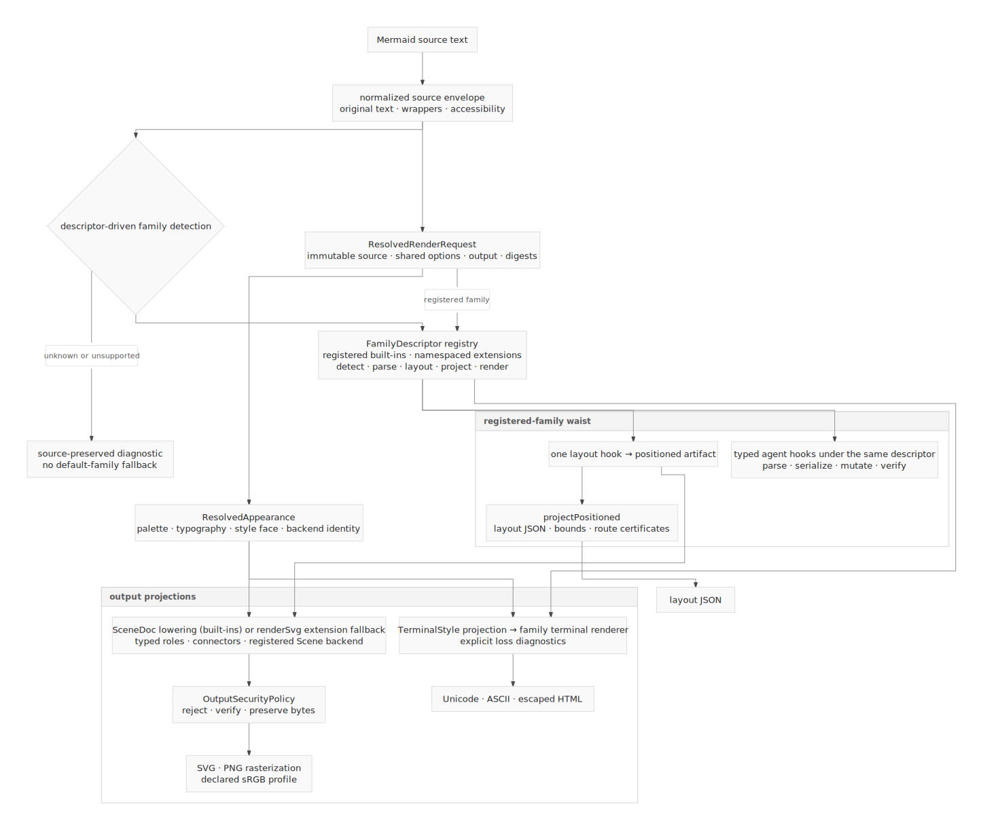

# System architecture — start here

How the Agentic Mermaid engine fits together: a single top-down view of the
whole system, distinct from the per-diagram-type design notes.



Mermaid source first becomes one lossless normalized envelope. Descriptor-driven
detection then selects a registered `FamilyDescriptor`; unknown and unsupported
headers produce a source-preserving diagnostic instead of falling through to a
default family. The registry is the family authority. Built-in metadata and the
generated capability/documentation tables are projections of it, not competing
family lists. Website editor and comparison examples are projections of the
same bounded canonical examples.

Every rendering adapter resolves an immutable `ResolvedRenderRequest` once. Its
`ResolvedAppearance` owns the final palette, typography, style face, and backend
identity, while receipts expose shared-request, output-request, and appearance
digests for parity checks. A family layout hook produces one positioned artifact.
`projectPositioned` derives layout JSON, bounds, and route certificates from that
artifact without reparsing or laying out the source again.

Graphical output then takes one of two explicit paths: the family crisp renderer,
or typed `SceneDoc` lowering into a registered Scene backend. Both converge at the
same reject-and-verify `OutputSecurityPolicy` before SVG leaves the engine;
PNG rasterizes that secured SVG and declares the shared sRGB profile. Terminal
outputs preserve their distinct grid geometry, but consume a named projection of
the same resolved appearance and report losses rather than silently ignoring
graphical style. Typed parse, serialize, mutate, and verify hooks remain on the
same family descriptor identity.

## This figure is dogfooded and drift-proof

The diagram is authored as Mermaid ([`architecture.mmd`](./architecture.mmd)) and
rendered to [`architecture.svg`](./architecture.svg) **by our own renderer**. A
determinism snapshot test
([`src/__tests__/docs-architecture-diagram.test.ts`](../../../src/__tests__/docs-architecture-diagram.test.ts))
re-renders the source and asserts (a) the render is deterministic across calls and
(b) it matches the committed SVG — so the picture can never silently drift from the
code it describes. Regenerate after an intentional source change:

```
UPDATE_GOLDEN=1 bun test src/__tests__/docs-architecture-diagram.test.ts
```

This is the documentation half of the abstraction work: docs *about* the system are
produced *by* the system, and pinned the same way we pin layout determinism.

## Read next

- [`route-contracts.md`](./route-contracts.md) — the flowchart routing engine (edge classification, direct-lane proofs, certifying straightener).
- [`layout-rubric.md`](./layout-rubric.md) — the deterministic layout-quality rubric.
- [`layout-guarantees-and-robustness.md`](./layout-guarantees-and-robustness.md) — literature + industry synthesis: which invariants we can guarantee by construction vs. only optimize-and-certify, and the path to fuzz-robustness.
- [`source-preservation-ladder.md`](./source-preservation-ladder.md) — the structured\|opaque family-adoption contract (L0–L4).

> These design docs are co-located here in `design/system/`; per-family notes live in
> [`../families/`](../families/README.md).
