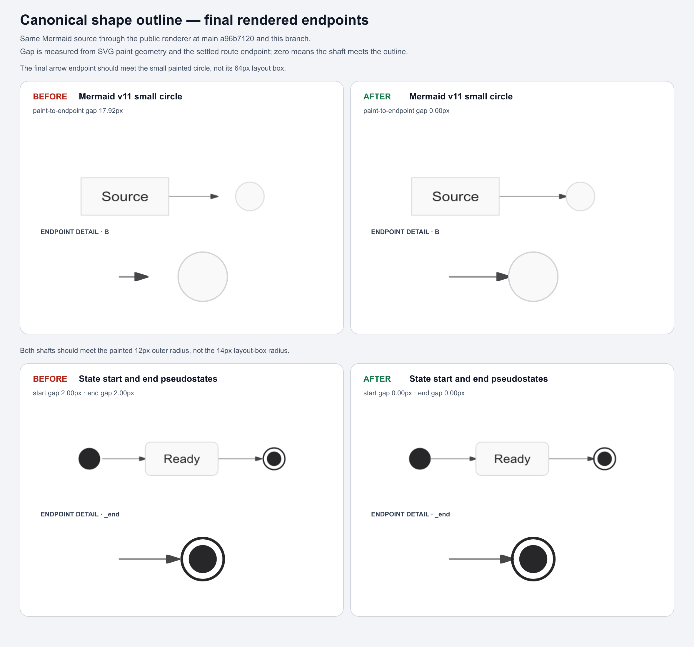

# Correctness-by-construction consolidation

This change closes two independent duplication defects without reviving the
general-purpose endpoint router removed after PR #190:

1. XYChart syntax was recognized separately by the renderer and agent body.
2. Flowchart and State shapes were painted by the renderer but independently
   approximated by clipping, port selection, and late route repair.

PR #218 landed while this branch was in final validation and already made the
source envelope the universal `accTitle` / `accDescr` authority. The rebase
keeps that implementation and adds only a registry-derived all-family proof;
it does not introduce a second accessibility abstraction.

The common failure mode was authority drift. A new syntax form or shape could
be correct in one consumer and silently wrong in another. The replacement
makes inconsistent production states unrepresentable: parse once and project;
define paint and route geometry together.

## Tasks and acceptance evidence

| Task | Scope | Acceptance evidence |
|---|---|---|
| Remove the rejected CONS-11/16/26 implementation and unrelated generated churn | Repository | The replacement is a fresh implementation on the rebased mainline; no endpoint-repair mechanism is restored. |
| Make one XYChart grammar authoritative | XYChart renderer and agent | The agent passes the complete source, including the header, to the renderer parser. Strict whole-input parsing, quote-aware semicolon splitting, component-update axes, point-label retention, canonical quoting, opaque fallback, and property-based parse/serialize closure are pinned. |
| Make admitted XYChart numbers serializable | XYChart mutation | Every finite JavaScript number is emitted as parser-compatible plain decimal, including exponent thresholds, subnormal values, `Number.MAX_VALUE`, and negative zero; malformed or upstream-incompatible authored lists stay opaque. |
| Close mutation output through the registered parser | All structured families | A mutation must reparse to the same family and representation. Only a descriptor-verified `EMPTY_DIAGRAM` build scaffold may remain structured below the source grammar floor. The new gate exposed and fixed State transition removal silently dropping surviving implicit states. |
| Preserve authored-vs-derived XY state | XYChart | Derived numeric ranges carry no authorship into agent serialization. |
| Prove the rebased accessibility authority across the registry | All 15 registered families | Registry-derived parse/serialize/render matrix, block and closing-line suffix cases, and malformed-block preservation. Production ownership remains in PR #218's source envelope. |
| Make one production shape profile authoritative | Flowchart v11 shapes and State pseudostates | A 48-shape catalog census requires every shape to declare an exact, conservative, or absent boundary plus side-attachment policy; paint, clipping, ports, straightening, and late route repair consume that profile. |
| Keep verification independent | Route audit and rubric | `rendered-endpoint-diagnostics.ts` separately reconstructs exact silhouettes and declared envelope/none policies. Both the final route audit and visual rubric call it; production route construction does not. |
| Prove late repair cannot undo correct clipping | 48 semantic shapes × LR/RL/TD/BT | Forced detours exercise route shortening after layout. Exact endpoints must satisfy both the production profile and independent diagnostic; the route audit must remain clean. |
| Preserve historical evidence as history | Test-portfolio report | The July 19 candidate remains immutable and internally checked; each current gallery owns its live freshness receipt rather than rewriting the historical measurement when inputs grow. |
| Show the material visual changes | Small circle and State start/end | A before/after contact sheet is generated from the pre-change and candidate revisions. |
| Reconcile maintained documentation | Backlog, route contract, lessons | CONS-11 and CONS-16 leave the backlog; CONS-26 names only the remaining family grammar pairs. |
| Validate the whole repository | Every family and public surface | Type checks, full tests, lint, build, generated-artifact checks, and dependency audit pass. |

## Visual evidence

The same public renderer and Mermaid source measure a 17.92px small-circle gap
before the change and 0px after it. State start and end gaps move from 2px each
to 0px. The generator reads both the painted circle and settled route endpoint
from the emitted SVG; it does not place the measurements by hand. Regenerate
with `bun run scripts/pr-assets/shape-outline-authority-evidence.ts`.

## Diagram-family implications

| Family set | Change | Deliberately unchanged |
|---|---|---|
| XYChart | Renderer parsing is the grammar authority; the agent projects its AST and uses its text serializer. Parsed-diagram rendering now preserves quoted multiword axis titles and authored ranges instead of silently inferring a replacement scale. | Direct raw-source rendering, marks, and mutation policy. |
| All 15 registered families | A new registry-derived test proves PR #218's source-envelope authority through parse, serialize, and render. | No new production accessibility behavior; each family still owns its body grammar and model projection. |
| Flowchart and State | Rendering, clipping, cardinal ports, and every existing route-shortening/repair path consume the same boundary and side-attachment declaration. This fixes State start/end and `sm-circ` clipping that previously used layout-box radii and prevents later repairs from restoring a bounding-box endpoint on semantic polygons or small circles. State mutation also preserves an implicit endpoint as an explicit bare state when its last transition is removed. | ELK layout, side choice, bundling, label placement, marker sizing, and the removed general-purpose endpoint router. |
| Other 12 families | No production change. The registry matrix makes their inherited accessibility contract explicit. | Their family-specific layout and graphical geometry do not use flowchart shape clipping. |

This separation matters: a universal source concern should be universal, while
a flowchart silhouette model must not be smuggled into Sequence, Gantt, Radar,
or other unrelated layout systems.

The shared accessibility module is the sole semantic extractor. Narrow lexical
scanners remain where the product needs exact source spans or must ignore
metadata before family detection; they locate text but do not construct a
second accessibility model.

## Resolved tensions

### Full fidelity versus strict structure

A semantic AST cannot safely claim syntax it only partly understands. XYChart
therefore becomes structured only when the shared strict parser consumes the
whole family body. Unknown or malformed syntax remains byte-preserved in the
opaque representation. This follows the full-fidelity syntax-tree principle:
source trivia and unsupported syntax must survive even when the structured
model cannot own them ([Roslyn syntax model](https://learn.microsoft.com/dotnet/csharp/roslyn-sdk/work-with-syntax)).

### Incremental builders versus parser closure

Blank-slate typed builders sometimes need a valid intermediate draft that the
source grammar cannot yet represent, such as an XYChart title before its first
series. Mutation therefore permits a representation mismatch only when the
owning family verifier classifies the candidate as `EMPTY_DIAGRAM`. Every
non-empty result must reparse to the same family and body kind. This boundary
found a State loss bug: removing the last transition from an implicitly
declared state left it in memory but omitted it from serialization. The State
mutator now promotes such survivors to bare declarations before the generic
closure check, so the exception does not grow to cover a real data loss.

### Pinned Mermaid syntax versus established compatibility

Mermaid 11.16 documents a colon for inline accessibility values and no colon
for a multiline block ([Mermaid accessibility options](https://mermaid.js.org/config/accessibility.html)).
Agentic Mermaid already promises both compact colon and whitespace-separated
inline forms at its universal source boundary. Removing the latter would be a
breaking change unrelated to consolidation, so the shared recognizer preserves
that documented project compatibility and serializers emit the canonical colon
form. This is an intentional input-language superset, not a claim that the
extra spelling is upstream Mermaid syntax.

### One production geometry versus independent proof

The renderer, clipper, port projector, and late route repair must not carry
separate copies of the same constants; they now consume one shape profile. An
auditor must remain independently falsifiable, so the final route audit and
rubric call a separate rendered-endpoint diagnostic that rederives exact
polygons, ellipses, cylinders, and declared envelope/none policies. SVG
defines basic shapes through equivalent geometric paths, which supports sharing
the geometric definition between paint and clipping
([SVG 2 basic shapes](https://www.w3.org/TR/SVG2/shapes.html),
[SVG geometry elements](https://www.w3.org/TR/SVG2/types.html#InterfaceSVGGeometryElement)).

### Exact silhouettes versus bounded complexity

Closed analytic shapes declare exact rectangles, ellipses, stadia, cylinders,
or polygons. Open and complex decorated Bézier symbols declare a conservative
layout envelope with a reason; they do not pretend that the envelope is the
painted path. This gives every v11 shape a bounded policy without adding a
general SVG path intersection engine. If user evidence later promotes an exact
path, the outline module is the single place to add it.

### Automatic ports versus explicit attachment semantics

This consolidation clips existing routes to their painted boundary and ensures
existing repair passes can only rebuild endpoints admitted by the same side
profile. It does not choose a different side or force normal incidence. Graphviz exposes compass-point ports
and ELK distinguishes free through fixed-position port constraints
([Graphviz `portPos`](https://graphviz.org/docs/attr-types/portPos/),
[ELK port constraints](https://eclipse.dev/elk/reference/options/org-eclipse-elk-portConstraints.html)).
Research on generalized port constraints treats crossings, bends, and runtime
as competing metrics rather than assuming one universal optimum
([Zink et al., 2020](https://arxiv.org/abs/2008.10583)). Any future port-policy
change therefore needs a separate, representative visual problem statement and
must not arrive as a side effect of outline deduplication.

## Remaining work

CONS-26 is intentionally not declared complete. Class, ER, Sequence,
Architecture, Gantt, and Radar still have agent/render grammar duplication.
Several final ASTs discard statement order or opaque segments, so the safe next
step is a shared statement parser or event stream, one family at a time, with
differential and unknown-line tests. Projecting from a lossy final AST merely
moves the drift to a different boundary.

Issue #88 also remains open: this work prevents authority drift and makes final
endpoint contact auditable, but it does not establish a new normal-incidence
port policy for tangential rectangle arrivals. TEST-5 retains the separate
severity, certificate-consistency, and public-audit-enrollment decisions.
