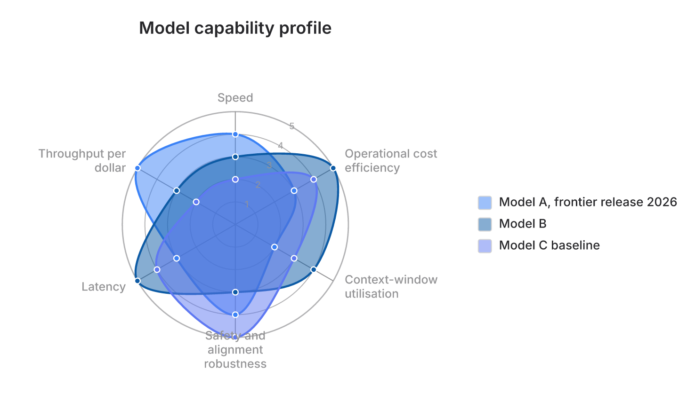
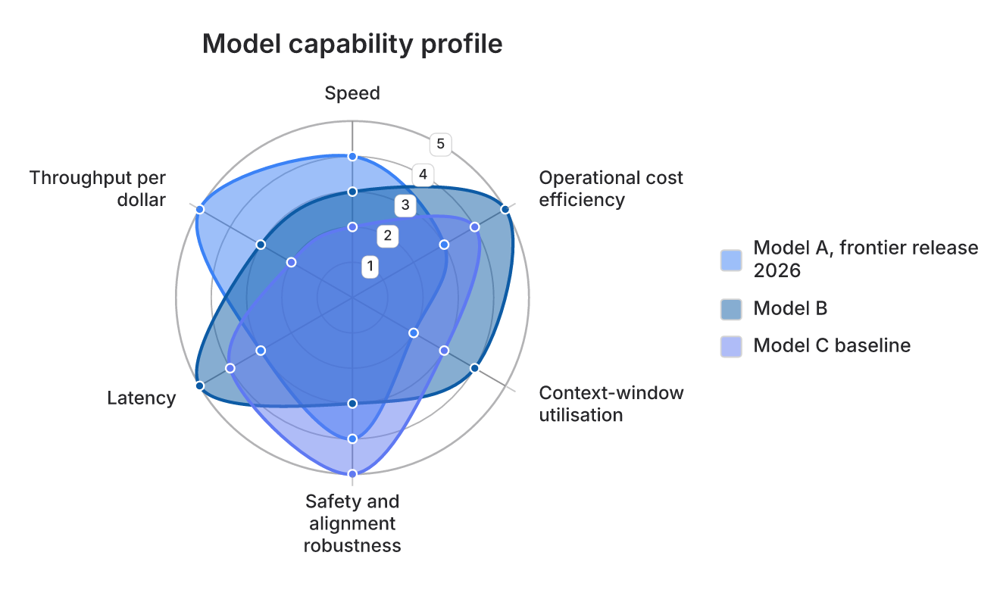

# Cross-family aesthetics — the lessons from the radar family (#161)

> Status: **design note / plan.** Distilled from a read-only survey of PR
> [#161](https://github.com/adewale/agentic-mermaid/pull/161) (the `radar-beta`
> family) against every other family. It captures (1) the load-bearing mechanism,
> (2) the *union* of aesthetic lessons — radar's plus the disciplines the families
> that already beat radar contribute, (3) the families that beat radar and what they
> do, (4) a before/after mock of radar absorbing that union, (5) a ranked
> improvement plan, and (6) a review of **every** family against the union.
>
> Sibling refs: [`layout-rubric.md`](./layout-rubric.md),
> [`ugly-layouts.md`](./ugly-layouts.md),
> [`../style-palette-compatibility.md`](../style-palette-compatibility.md),
> [`../../contributing/lessons-learned.md`](../../contributing/lessons-learned.md).
>
> **Honesty note.** This branch is stacked on PR #161, so radar's source is present
> here and the reverse-flow disciplines in §3–§4 are **implemented** against it
> (`src/radar/layout.ts`, `src/radar/renderer.ts`, tests in
> `src/__tests__/radar-label-discipline.test.ts`). The before/after images below are
> real renderer output. Other families' citations are against this working tree.

---

## 0. The one load-bearing mechanism

Radar became beautiful **without touching the styling engine**. It added *zero* new
scene roles and *zero* new mark kinds, lowered its marks onto existing roles —
`pie-slice` (fill), `grid` (rings/spokes), `point` (dots), `axis`, `legend`, `title` —
and inherited hand-drawn sketch, watercolor wash, text halos, 21 palettes × 16 looks,
and shared paint behavior **for free**. DOM identity and accessibility remain
explicit family responsibilities: radar builds its root accessibility attributes
in `src/radar/renderer.ts`, while its reused `axis`/`legend` roles intentionally
carry no automatic DOM identity or relation semantics. The backends dispatch purely on
`sceneRoleTraits(node.role)`, never on the diagram family (`src/scene/rough-backend.ts:446-459`;
`src/scene/backend.ts`).

> **Beauty here is a property of (a) the roles a family assigns to its marks and
> (b) a handful of paint/measurement disciplines — not of family-specific rendering
> code.** Every lesson below is a corollary.

Encouraging finding from the survey: all 14 other families are *already* fully
scene-lowered, palette-swappable through the `DiagramColors` waist, and deterministic.
So this is a plan of narrow, concrete role-tag and paint changes — not rewrites.

---

## 1. The union of lessons (the canonical checklist)

Radar contributed ten lessons. The families that beat radar contribute six more
disciplines that *upgrade* radar's own label lesson. The **union** is the bar every
family should now be held to — not "did you copy radar's move" but "did you apply the
best-in-repo technique for each concern."

### Radar's ten (L1–L10)

| # | Lesson | Why it produces beauty |
|---|---|---|
| L1 | **Signature shape → a `sketch:'shape'` role** | A ruler-perfect primary glyph beside wobbly boxes reads as broken; the sketch look coheres only if the defining element gets the treatment. |
| L2 | **Scaffold → a `sketch:'none'` role (recedes)** | Lively translucent data reads only on a quiet ground; a jittery scaffold turns overlaps into noise. |
| L3 | **Categorical color from the shared `pieSliceColors`** (hue-spread >6) | One color language across all charts; palette swaps recolor free; N categories stay *distinguishable* instead of collapsing to shades of one hue. |
| L4 | **Translucent fill + crisp bg-stroked marker** | Translucency lets overlaps blend legibly; the bg-stroked bead keeps the precise data point sharp on a busy ground ("the sketch marks the measurement"). |
| L5 | **Measure-then-reserve gutters** (wrap; widen for title) | Clipping is the loudest "unfinished" signal; reserving space *before* the plot expands keeps the composition whole at any label length. |
| L6 | **Single-scale contract** (resolve auto-max once; degenerate → throw) | A chart whose SVG and ASCII clamp differently, or that emits NaN, is broken; beauty presupposes the floor. |
| L7 | **Wire-or-warn every config/theme knob** | A knob that silently does nothing yields surprising, un-tunable renders; also stops silent color corruption. |
| L8 | **Honest ASCII degradation** (same palette + scale) | The same diagram reads with the same color language in SVG and terminal. |
| L9 | **Plan + an explicit aesthetic thesis** ("the silhouette IS the message") | The rubric measures only a hygiene floor; the aesthetic ceiling comes from a deliberate per-family thesis, not from chasing rubric points. |
| L10 | **Quality-gate plumbing** (box/mark lever, `<path>` trick, honest exemptions) | Lets *legitimate* by-design overlap coexist with a rubric that would otherwise flag it, so a family can be beautiful *and* pass the gate. |

### The reverse-flow disciplines (R1–R6) — where other families beat radar

These make L5 (and L4/L7) stronger than radar's own implementation:

| # | Discipline | Source family | Beats radar's… |
|---|---|---|---|
| R1 | **Active label de-collision** — walk the route, offset in the normal lane, reject overlaps vs other labels, boxes, off-canvas, endpoint zones (`separateRelationshipLabels`, `er/renderer.ts:481-553`) | ER | …*static* gutter reserve. |
| R2 | **Leader-line dense-label placement** — spiral of rings×angles with collision boxes + leaders to far slots (`quadrant/layout.ts:138-213`) | quadrant | …no way to place a label clear of the plot. |
| R3 | **Vertical row reservation + repair-then-surface** — `rowAdvance` grows the row for a wrapped block; place label left/right/column else surface (`gantt/layout.ts:600`, `gantt/renderer.ts:410-435`) | gantt | …horizontal-only gutter sizing. |
| R4 | **Budget-driven compression** — a second metric pass with proportionally compressed wrap caps to hit a width budget (`timeline/layout.ts:169-185`) | timeline | …a fixed 96px wrap cap. |
| R5 | **Bordered knockout label box** — a real `fill:var(--bg)` box with a hairline behind text over busy fills (`flowchart renderer.ts:721-733`) | flowchart | …a bare paint-order text halo. |
| R6 | **WCAG-AA contrast evidence for label ink** — guard internally derived defaults; preserve explicit authored paint and emit `LOW_CONTRAST` when a concrete final pair misses 4.5:1 (`guardLabelInk`, Radar verify) | journey, adapted to Section B authored-style precedence | …unchecked ring/axis label ink. |

Also in the union, credited below: pie's **largest-first legend admission**
(`pie/layout.ts:321-378`), mindmap's **depth-alpha recession** (`mindmap/renderer.ts:98`),
gitgraph's **rotated-bounds axis packing** + **resolve-once boundary**
(`gitgraph/layout.ts:44-64`, `position.ts:4-9`).

**Implication of the union.** L5 is no longer "reserve a gutter." Held to the union,
the label concern becomes: *wrap to a budget (radar) → compress the budget if still too
wide (R4) → de-collide what remains (R1) → leader-line anything that can't fit in place
(R2) → reserve vertical room for the wrapped block (R3) → knockout-box it over busy
fills (R5) → guard derived ink and diagnose authored contrast (R6).* Each family should reach for the highest
rung its content needs. Radar sits near the bottom of that ladder today; §4 shows what
it looks like near the top.

---

## 2. The families that beat radar (the reverse flow)

Radar codified a house style; it did not invent every discipline in it. Several
families are strictly ahead of radar on specific concerns and are the models to copy:

| Family | What it does better than radar | Where |
|---|---|---|
| **ER** | **Active, deterministic label de-collision** — relocates colliding relationship labels against other labels, entity boxes, off-canvas, *and* reserved crow's-foot zones. Radar only reserves static gutters. | `er/renderer.ts:481-553` |
| **quadrant** | **2-pass gutter solve** + **spiral-of-10-rings×16-angles** point-label placement with **leader lines** and a wrap→ellipsize fallback. More sophisticated than radar's label handling. | `quadrant/layout.ts:138-213, 261-282` |
| **gantt** | **`rowAdvance`** reserves *vertical* space per wrapped multi-line label; **repair-then-surface** collision handler; rich per-mark semantic channels (`status/progress/emphasis/category`). Fullest realization of L5 in the repo. | `gantt/layout.ts:557-601`, `gantt/renderer.ts:410-435, 483-505` |
| **flowchart/state** | **Bordered knockout background box** for labels (reads better than a bare halo over busy fills) + **iterative route-collision repair** at the ELK level + `namespaceSvgIds`. | `renderer.ts:721-733`, `route-contracts.ts:45,816` |
| **gitgraph** | **Measured-extent axis packing** with `rotateBoxBounds` for 45° labels, then grow-the-canvas; **resolve-font-size-once** boundary (mirrors `resolveRadarScale`). | `gitgraph/layout.ts:44-64,120-142`, `position.ts:4-9` |
| **timeline** | **Budget-driven two-pass width compression** — stronger than radar's fixed cap; single-walk LR/TD axis frame. | `timeline/layout.ts:169-185` |
| **mindmap** | **Per-side independent-column** 2-pass gutter sizing; **depth-alpha recession** (fills tint toward bg by depth). | `mindmap/layout.ts:120-155`, `renderer.ts:98` |
| **pie** | **Largest-first label collision admission** + measure-then-size-the-canvas legend. The canonical `pieSliceColors`. | `pie/layout.ts:321-378`, `pie/renderer.ts:93` |
| **journey** | **bg-ring bead** + golden-angle actor wheel (both predate radar) + **WCAG-AA label gate**. | `journey/renderer.ts:289,836-852` |

---

## 3. What happens when we apply them — radar before/after (delivered)

Radar reserved *static* gutters and painted ring values as bare text on the gap ray, so a
multi-line axis label on a spoke whose data reached the outer ring **overlapped the
silhouette** (the straight-down "Safety…" label), and the tick values washed out over the
rings. Absorbing the reverse-flow disciplines (R1–R6) fixes both — real renders, same data:

| Before | After |
|---|---|
|  |  |

*Real renderer output from [`radar-reverse-lessons-demo.mmd`](../families/radar-reverse-lessons-demo.mmd);
regenerate the "after" with `bun run scripts/pr-assets/radar-reverse-lessons.ts`.*

| Concern | Before | After | Borrowed from |
|---|---|---|---|
| A multi-line label on a maxed-out spoke | **overlaps the silhouette** | radial **clearance** pushes it clear; a **leader line** reconnects it | ER R1 · quadrant R2 |
| Adjacent labels on many axes | can collide | **pairwise de-collision** (verified to 24 tight axes) | ER R1 |
| Ring value labels | bare gray text, wash out | **page-colored knockout pills** + **WCAG-AA derived ink**; explicit low-contrast axis paint is preserved and diagnosed | flowchart R5 · journey R6, adapted |
| A very long axis label | fixed 96px wrap only | **budget-driven wrap compression** + ellipsize fallback | timeline R4 |
| A long legend label | column just widens | **wrapped with reserved row height** | gantt R3 |

Everything else radar already did well (silhouette, palette, translucency, dots — free from
L1–L4). This is delivered in `src/radar/{layout,renderer,types}.ts`; each discipline has a
geometry/structure invariant in `src/__tests__/radar-label-discipline.test.ts` that fails
when reverted, and the canvas grows to contain every final box so nothing clips. `bun run
track` radar score rose to **100 (+0.6), 0 regressions**.

---

## 4. The improvement plan — ranked cross-family moves

Ranked by (beauty win × breadth) ÷ risk. Moves 1–8 are role-tag or paint-only:
localized, deterministic-safe, and they inherit the rest of the house style for free.

1. **Move each family's signature glyph off `chrome`/`raw`/`<defs>` onto a
   `sketch:'shape'`/`point` role** (L1) — the single most cross-cutting gap.
   Ordered: mindmap node body (`mindmap/renderer.ts:108`), class UML markers
   (`class/renderer.ts:159-170`, visually dominant), gitgraph commit markers
   (`gitgraph/renderer.ts:129`), architecture icons (`architecture/renderer.ts:505`),
   er crow's-foot (`er/renderer.ts:639`). Decide each opt-out *on purpose*.
2. **Give quadrant points categorical color** from the shared palette (L3) —
   `quadrant/renderer.ts:229`; add a restrained `legend`.
3. **Default timeline section colors** from `pieSliceColors` when unconfigured (L3) —
   `timeline/renderer.ts:522-542`. Timeline is the one family that inherits the palette's
   *look* but stays gray under swaps.
4. **Swap `getSeriesColor` → `pieSliceColors` on the >6 path** (L3) — xychart
   (`colors.ts:102`), journey (`renderer.ts:858-908`), mindmap (`renderer.ts:43`),
   gitgraph (`renderer.ts:193`); inherits pie's hue-spread.
5. **Translucent sequence activations** (L4) — `sequence/renderer.ts:361`; paint-only
   alpha so stacked activations read as depth.
6. **Fix timeline's scaffold-sketch outlier** (L2) — period stem role `period` →
   `marker-line`/`grid` (`timeline/renderer.ts:349`). Journey already does this right.
7. **Wrap-and-widen the journey title** (L5) — `journey/layout.ts:180-185,346`; the radar
   `titleLeftExtra/Right` template. (timeline title has the milder version.)
8. **Always-on bg-stroked vertex dots in xychart's static line path** (L4) —
   `xychart/renderer.ts:158-200`.
9. **Round gitgraph's orthogonal merge elbows into mild cubic bends** — `gitgraph/layout.ts:89-91`;
   `projectConnectorPath` (mindmap uses it at `renderer.ts:63`) is the ready tool.
10. **Translucent, optionally palette-tinted subgraph fills in flowchart/state** (L4) —
    `renderer.ts:269`; knob-gate the categorical hue (monochrome is a defensible
    control-flow default).

**Radar's own upgrade (the reverse flow applied to radar) — done.** Radar's static gutter
was upgraded to ER-style active de-collision (R1) + quadrant leaders (R2); ring values now
sit on knockout boxes with AA-gated ink (R5/R6); long labels compress to a budget (R4); and
legend labels wrap with reserved rows (R3). Renders and tests in §3.

---

## 5. Every family reviewed against the union

`✅` present/strong · `⚠️` partial or degrades · `❌` absent (and would help) ·
`N/A` no referent for this family. Columns are the union concerns (L-numbers from §1).

| Family | L1 sig-shape sketch | L2 scaffold recedes | L3 shared hue | L4 translucent + bead | L5+R label discipline | L6 one-scale | L7 wire-or-warn | L8 ASCII parity | Top opportunity |
|---|---|---|---|---|---|---|---|---|---|
| **radar** (ref) | ✅ pie-slice | ✅ grid | ✅ canonical | ✅ | ✅ **full union** (§3) | ✅ | ✅ | ✅ | Delivered — de-collision, leaders, knockout ticks, wrap compression, legend rows |
| **pie** | ✅ pie-slice | N/A | ✅ **canonical** | N/A (no overlap) | ✅ largest-first | ✅ | ✅ | ✅ | Default a quiet framing ring (`renderer.ts:126`) |
| **xychart** | ✅ bar/series | ✅ grid @0.25 | ⚠️ `getSeriesColor` (>6 degrades) | ⚠️ dots only if labelled | ⚠️ thins/drops, no wrap | ✅ `yAxis.range` | ✅ | ✅ | `pieSliceColors` >6 (`colors.ts:102`); always-on dots (`renderer.ts:158`) |
| **quadrant** | ✅ plate/point | ✅ tints+dividers | ❌ single accent | ✅ (chart is dots) | ✅✅ **2-pass + leaders** | ✅ normalized | ✅ | ✅ | **Categorical point color** (`renderer.ts:229`) + legend |
| **journey** | ✅ task/section/actor | ✅ grid/marker-line | ⚠️ `getSeriesColor` | ✅ bg-bead + bands | ✅ (title clips) | N/A (1–5) | ✅ AA gate | ⚠️ ASCII re-parses | **Wrap+widen title** (`layout.ts:180`); actors → `pieSliceColors` |
| **timeline** | ✅ period/event | ⚠️ **stem sketches** | ❌ **gray until configured** | ✅ bg-ring marker | ✅✅ **budget compression** (title clips) | N/A | ✅ | ⚠️ ASCII re-parses | **Section hue from palette** (`renderer.ts:522`); stem → `marker-line` |
| **mindmap** | ❌ **body is `chrome`** | ✅ depth-alpha | ⚠️ `getSeriesColor` | N/A (nodes opaque) | ✅ per-side columns | N/A | ✅ | ⚠️ ASCII colors diverge | **Node body → `node`** (`renderer.ts:108`) |
| **gitgraph** | ❌ **marker is `chrome`** | ✅ rail @0.86 | ⚠️ `getSeriesColor` + `gitN` | ✅ merge bg-ring bead | ✅✅ rotated-bounds pack | ✅ resolve-once | ✅ `git0..7` | ✅ SVG=ASCII | **Elbow → mild curve** (`layout.ts:89`); marker → `point` |
| **sequence** | ✅ actor/activation/note | ✅ dashed lifelines | N/A (no series) | ❌ **opaque activations** | ✅ grow-and-shift | N/A | ✅ `box <Color>` | ✅ | **Translucent activations** (`renderer.ts:361`); lifeline sketch policy |
| **gantt** | ✅ task/section/milestone | ✅✅ **textbook** | ⚠️ one accent + 7% band | ✅ semantic alpha | ✅✅ **`rowAdvance`** | ✅ span guard | ✅ `todayMarker` | ✅ | **Per-section hue** (`renderer.ts:70`); today≠crit hue |
| **flowchart/state** | ✅ node/group/note | ✅ subgraphs recede | ❌ monochrome (by design) | ❌ opaque subgraphs | ✅✅ **knockout box + repair** | ✅ | ✅ inline style | ✅ | **Translucent subgraph fills** (`renderer.ts:269`) |
| **architecture** | ✅ except **icons (raw)** | ✅ header band | ❌ mono (bespoke opt-in) | ✅ junction bead / ❌ opaque group | ✅ box+title reserve | ✅ | ✅ `--arch-*` | ✅ | **Sketch icons** (`renderer.ts:505`); round edge chip |
| **er** | ✅ except **crow's-foot** | ✅ header band | ❌ mono (by convention) | ✅ zero-circle bead / ❌ opaque | ✅✅ **active de-collision** | N/A | ✅ classDef | ✅ | **Sketch/exempt crow's-foot** (`renderer.ts:639`) |
| **class** | ✅ except **`<defs>` markers** | ✅ compartments | ❌ mono (by convention) | ❌ opaque / semantic markers | ✅ box; ⚠️ static cardinality offset | N/A | ✅ classDef | ✅ | **Sketch UML markers** (`renderer.ts:159`); adopt ER de-collision |

**The single recurring L1 gap across the boxed/graph families is identical:** each
sketches its boxes and connectors but leaves one class of *small semantic glyph* opted
out — architecture **icons**, er **crow's-feet**, class **UML markers**, mindmap **node
body**, gitgraph **commit markers**. Radar's rule (*the sketch marks the measurement; the
dot shares the curve's treatment*) argues these decorators should share their parent's
treatment, or be exempted on purpose. That is the highest-leverage, most cross-family
consistent improvement available.

---

## 6. Honesty ledger — where the union does NOT transfer

- **Translucent silhouettes (L4)** presuppose *overlapping area* marks. No referent for
  discrete-node structural families (mindmap trees, flowchart/state, architecture/er/class
  boxes) or non-overlapping marks (pie wedges, one-per-row gantt bars, journey/timeline
  bands). Opaque / lighten-toward-bg is correct there. Gantt's alpha is *semantic* (fading
  completed work), not a gap.
- **Categorical hue (L3)** does not apply where there is no series concept (sequence) and is
  a legitimate choice to omit in the monochromatic structural families (architecture/er/class)
  and control-flow (flowchart/state). Recommend it there only as an opt-in accent.
- **Single-scale contract (L6)** is *vacuous* for families with no numeric value-axis
  (sequence, journey's fixed 1–5, timeline, boxed families) — satisfied, not a gap.
- **The BOX-BOX overlap exemption (L10)** transfers *only* to genuinely interpenetrating,
  same-scale, non-`<path>` primitives (sequence activations, radar rings/beads). For every
  other family, primitive interpenetration is a real defect — the exemption must never be
  used to silence it. Prefer drawing intrinsic fills as `<path>` (invisible to the box
  parser, needing no exemption) instead.
- **Restrained legend (L4/§4)** is N/A where there is no categorical series to key —
  though quadrant and gantt would *gain* one once they gain categorical color.
- **The deterministic rubric measures only a hygiene floor** (finite, on-canvas, boxes
  don't overlap, groups tile, labels present). It never scores recession, translucent blend,
  silhouette legibility, or palette harmony. Passing `bun run track` with score 100 proves a
  family didn't break the floor; it does not certify beauty (L9). Beauty still requires a
  per-family aesthetic thesis.

## 8. Update — the canonical palette is now perceptually uniform (PR #179)

L3's "categorical color from the shared `pieSliceColors`" got a perceptual upgrade
that every inheriting family (radar today; the §4 item 4 `getSeriesColor → pieSliceColors`
migration next) receives for free. The old high-count (`>6`) ladder spread hues in
**HSL** at two fixed lightness tiers, and equal HSL lightness is *unequal perceived*
lightness across hues — so hue-adjacent categories collapsed (measured: two of fifteen
fills at WCAG 1.01:1; worst pair ΔE_OK 0.049). `hueSpreadColors` now:

- spreads hues at **constant OKLCH lightness**, so the two tiers separate evenly at every hue;
- enforces a **minimum ΔE_OK distinctness floor** for 7–24 fills (a bounded,
  deterministic separation pass over concrete visible sRGB candidates); above
  24, skips pairwise repair so generation remains linear and separation/uniqueness
  are explicitly best-effort;
- gates wedge visibility on **APCA** as well as WCAG, because WCAG is polarity-blind and
  passes a wedge that is invisible on a dark theme. Palette polarity uses
  OKLab lightness rather than HSL and searches both lightness directions, which
  also handles perceptually bright saturated backgrounds correctly.

This is the first step toward §6's open gap — the rubric still does not *score* a rendered
diagram's palette harmony, but the palette *generator* now guarantees perceptual distinctness
and visibility by construction. Primitives in `src/shared/perceptual-color.ts` (OKLab/OKLCH,
ΔE_OK, APCA); the cross-family impact is guarded end-to-end in
`src/__tests__/perceptual-palette-impact.test.ts` (an 8-curve radar renders 8 distinct,
visible curve colors). It also strengthens the §4 item 4 recommendation: swapping the four
`getSeriesColor` families onto `pieSliceColors` now buys perceptual uniformity, not just a
shared hue language.

---

## 7. Process lesson

The load-bearing artifact in #161 was the **aesthetic thesis** written *before* the code
("the silhouette IS the message"), which turned a spec-compliant chart into a beautiful
one, then hardened via independent audit ("fix root causes rather than weaken tests").
Any family improvement from §4/§5 should be driven by the equivalent one-line thesis —
*what is this diagram's message, and what makes it legible in <2s?* — not by chasing
rubric points. The rubric certifies you didn't break the floor while doing it; the roles
(§0) give you the ceiling for free.
