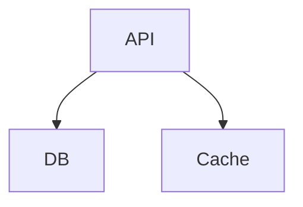
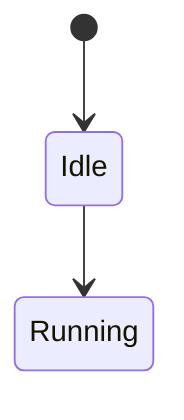
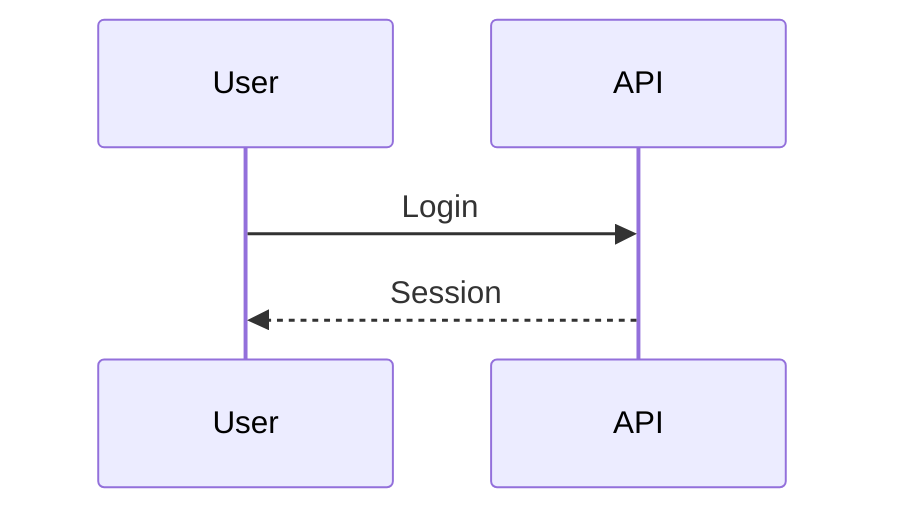
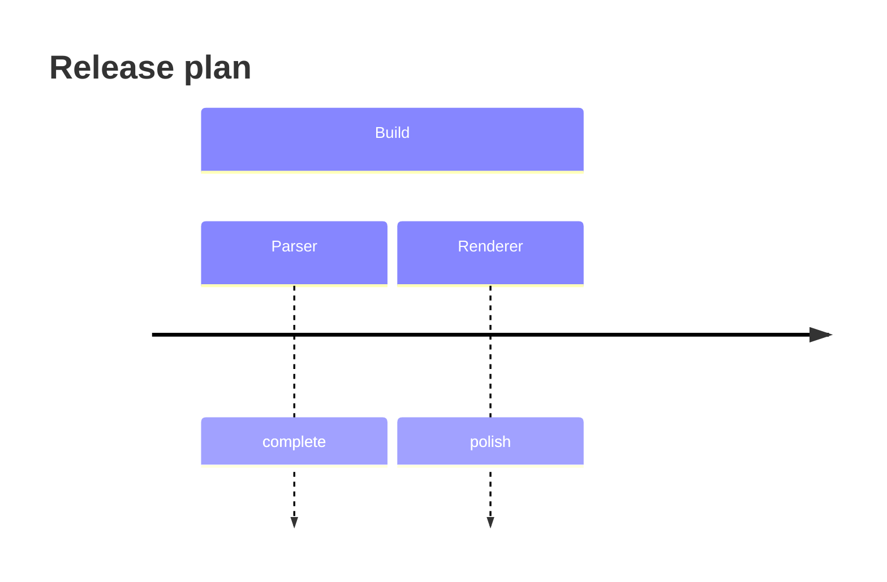
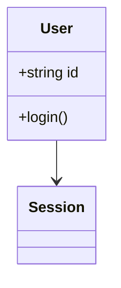
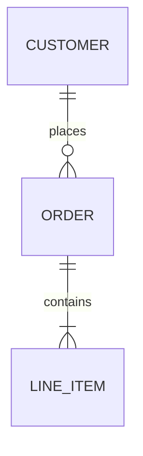
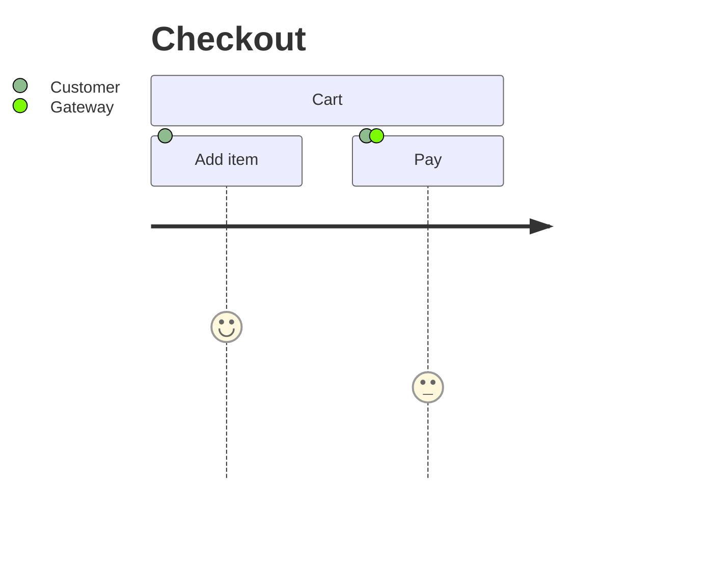
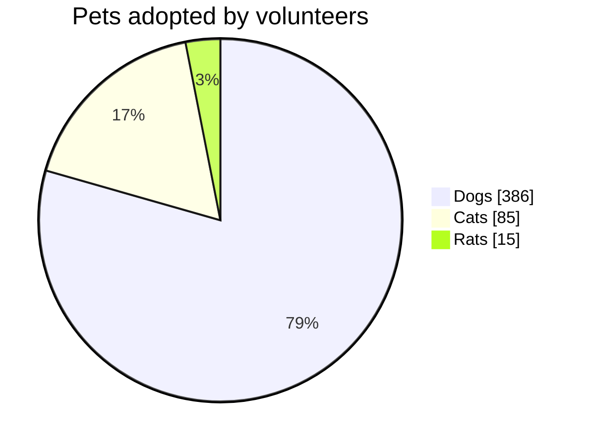
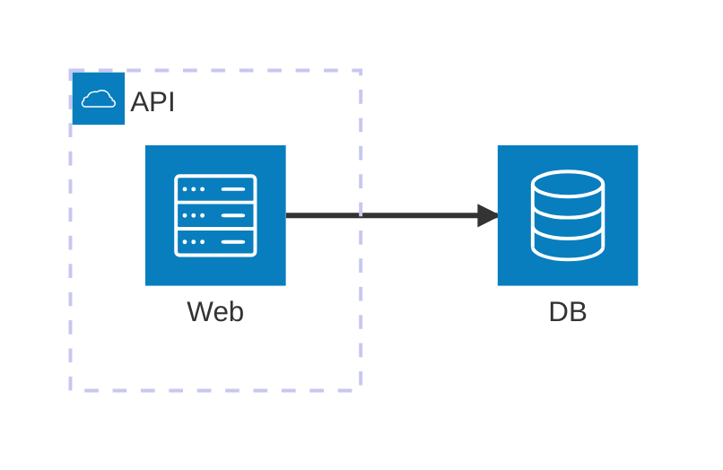

# Diagram families

Agentic Mermaid supports Mermaid's common diagram families through a split pipeline: parse source, layout typed structures, render SVG/PNG/ASCII, and verify structural warnings.

## Capability matrix

| Family | Header(s) | Render | Structured mutation | Notes |
|---|---|---|---|---|
| Flowchart | `flowchart`, `graph` | SVG/PNG/ASCII | ✓ | Includes state diagrams through shared graph editing. |
| State | `stateDiagram-v2` | SVG/PNG/ASCII | ✓ | Parsed through graph-like flowchart mutation today. |
| Sequence | `sequenceDiagram` | SVG/PNG/ASCII | simple syntax | Notes/alt/loop bodies round-trip as opaque source. |
| Timeline | `timeline` | SVG/PNG/ASCII | ✓ | Supports sections, periods, events, title changes. |
| Class | `classDiagram` | SVG/PNG/ASCII | ✓ | Classes, members, relations, notes. |
| ER | `erDiagram` | SVG/PNG/ASCII | ✓ | Entities, attributes, relations. |
| Journey | `journey` | SVG/PNG/ASCII | structured (10 ops) | `asJourney` narrows simple title/section/task journeys; unmodeled syntax (accTitle/accDescr) stays opaque. |
| XY chart | `xychart`, `xychart-beta` | SVG/PNG/ASCII | source-level only | Vertical/horizontal bar/line/mixed charts. |
| Pie | `pie` | SVG/PNG/ASCII | source-level only | Labelled slices with optional `showData` and title. |
| Architecture | `architecture-beta` | SVG/PNG/ASCII | source-level only | Groups, services, junctions, anchored edges. |

Source-level-only does not mean unsupported: those families parse, render, verify, and round-trip, but agents should edit source deliberately instead of calling `mutate`.

## Flowchart



Structured ops include node and edge add/remove/rename/set-label operations. Use `asFlowchart(parsed.value)` before mutation.

## State



State diagrams share the graph-oriented mutation surface where possible. State-specific syntax outside the modeled subset should be treated as source-level.

## Sequence



Simple participants/messages are structured. Rich Mermaid sequence blocks such as notes, `alt`, `loop`, and activation syntax are preserved as opaque source when not modeled.

## Timeline



Structured ops cover title, section, period, and event changes.

## Class



Structured ops cover classes, members, relations, notes, and renames.

## ER



Structured ops cover entities, attributes, relation add/remove, and renames.

## Journey



Journey diagrams are parsed, verified, and rendered. Edit source and re-verify.

## XY chart

```mermaid
xychart-beta
  title "Latency"
  x-axis [p50, p95, p99]
  y-axis "ms" 0 --> 500
  line [50, 180, 420]
```

See [`design/xychart.md`](./design/xychart.md) for compatibility details and layout notes.

## Pie



Pie charts accept the `pie` header with optional `showData`, an optional `title`, and `"label" : value` entries with positive numeric values. Slices render clockwise in source order. `showData` adds the raw value beside each legend label; the legend always shows the computed percentage. Malformed entries (negative/zero values, missing colon, unquoted labels) are hard errors — never silently dropped. The ASCII renderer draws a proportional bar list. Pie is source-level: parse, render, and verify it, then edit source deliberately rather than calling `mutate`.

## Architecture



See [`design/architecture.md`](./design/architecture.md) for parser/layout/render notes.

## Output formats

All families use the same public output paths:

```ts
import { renderMermaidSVG, renderMermaidPNG, renderMermaidASCII } from 'agentic-mermaid/agent'

const svg = renderMermaidSVG(source, { security: 'strict' })
const png = renderMermaidPNG(source, { fitTo: { width: 1200 }, background: '#fff' })
const text = renderMermaidASCII(source)
```

CLI equivalents:

```bash
am render diagram.mmd --format svg > diagram.svg
am render diagram.mmd --format png --output diagram.png
am render diagram.mmd --format ascii > diagram.txt
```
