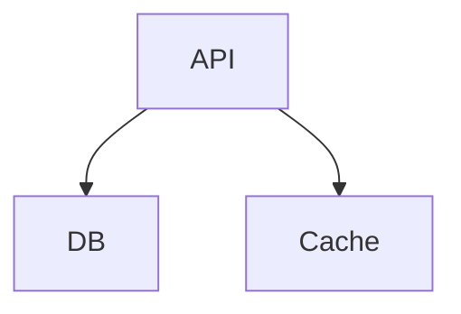
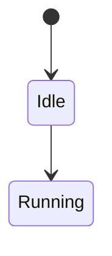
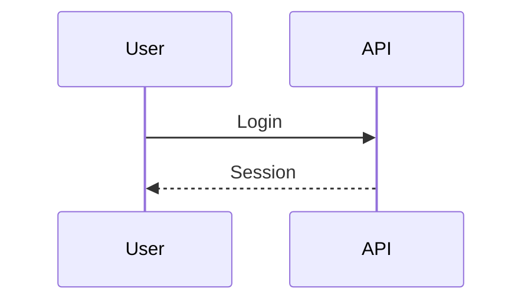
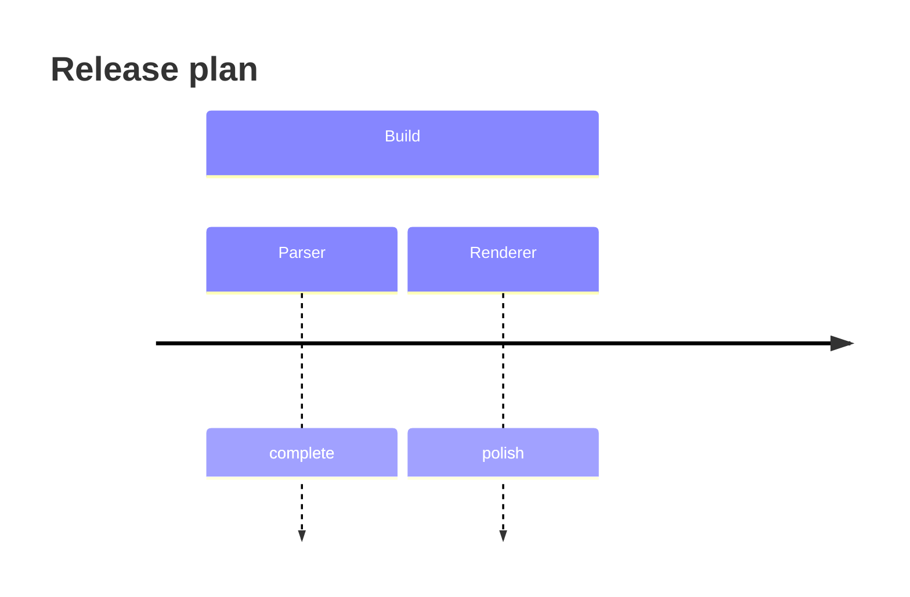
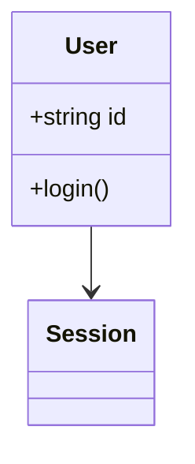
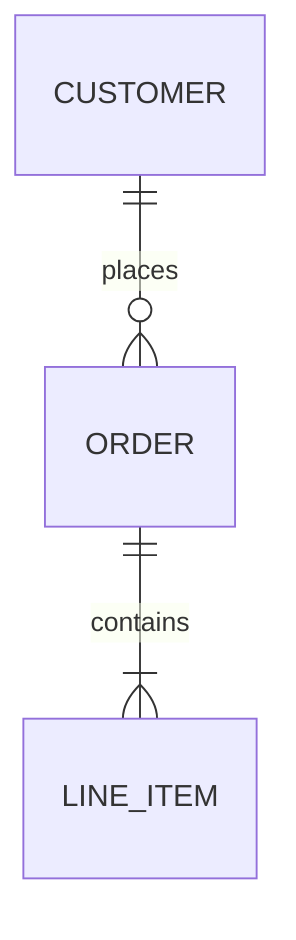
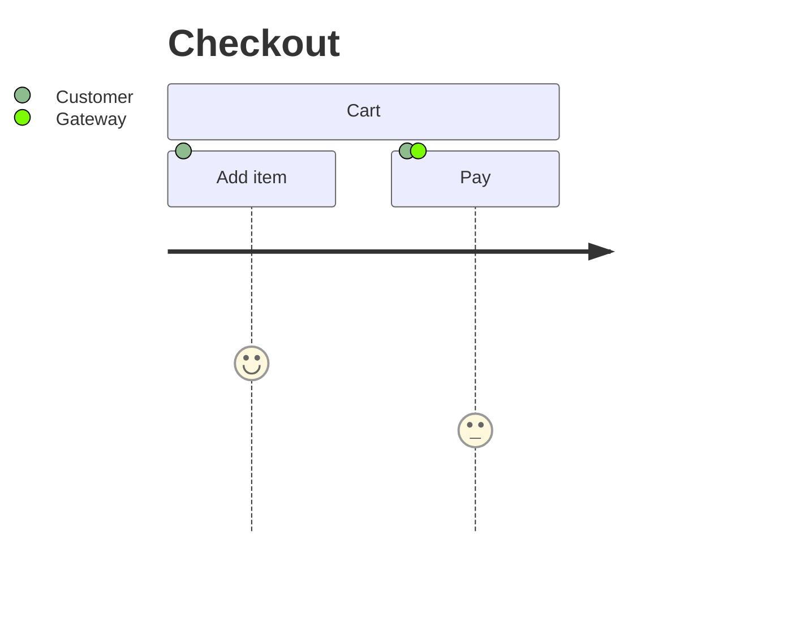
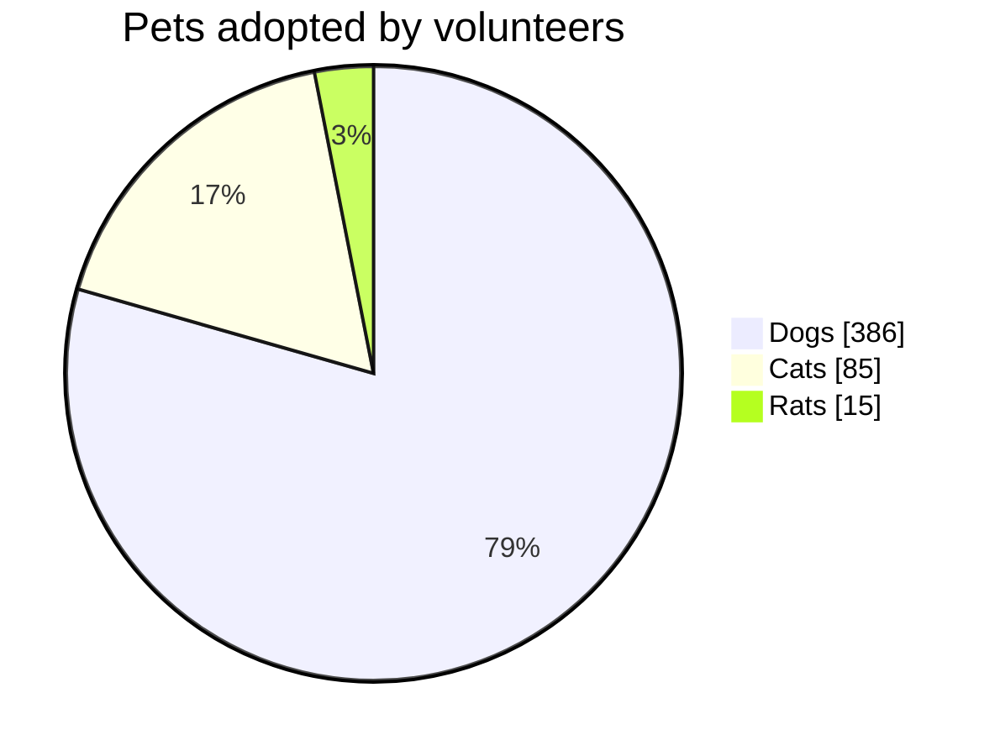
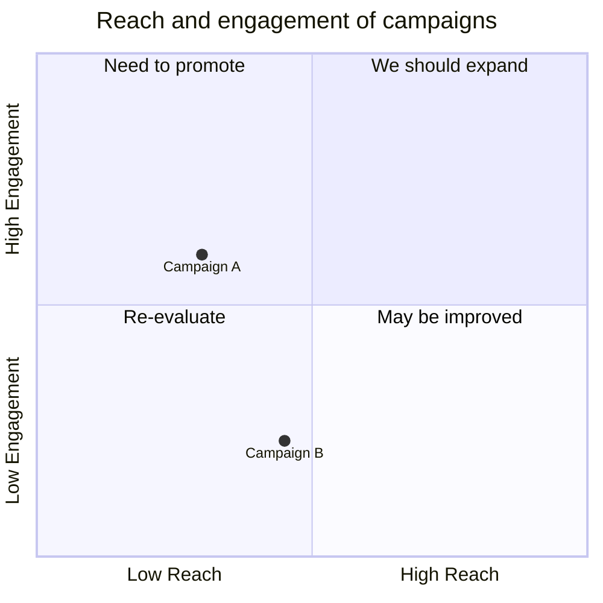
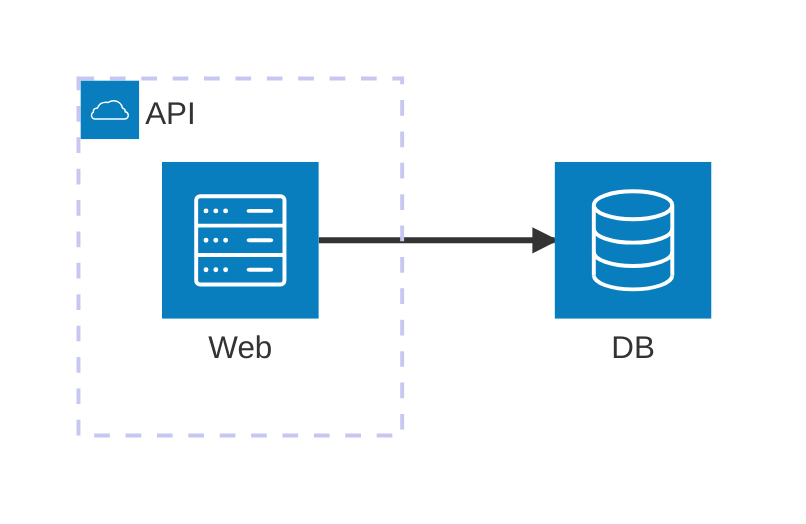

# Diagram families

Agentic Mermaid supports Mermaid's common diagram families through a split pipeline: parse source, layout typed structures, render SVG/PNG/ASCII, and verify structural warnings.

## Capability matrix

| Family | Header(s) | Render | Structured mutation | Notes |
|---|---|---|---|---|
| Flowchart | `flowchart`, `graph` | SVG/PNG/ASCII | ✓ | 6 graph ops; narrow with `asFlowchart`. |
| State | `stateDiagram-v2` | SVG/PNG/ASCII | ✓ | Dedicated `StateBody` (BUILD-19): narrow with `asState`, 8 state-shaped ops. `asFlowchart` returns null. |
| Sequence | `sequenceDiagram` | SVG/PNG/ASCII | simple syntax | Notes/alt/loop bodies round-trip as opaque source. |
| Timeline | `timeline` | SVG/PNG/ASCII | ✓ | Supports sections, periods, events, title changes. |
| Class | `classDiagram` | SVG/PNG/ASCII | ✓ | Classes, members, relations, notes. |
| ER | `erDiagram` | SVG/PNG/ASCII | ✓ | Entities, attributes, relations. |
| Journey | `journey` | SVG/PNG/ASCII | structured (10 ops) | `asJourney` narrows simple title/section/task journeys; unmodeled syntax (accTitle/accDescr) stays opaque. |
| XY chart | `xychart`, `xychart-beta` | SVG/PNG/ASCII | structured (8 ops) | Vertical/horizontal bar/line/mixed charts; modeled subset is structurally mutable via `asXyChart`. |
| Pie | `pie` | SVG/PNG/ASCII | source-level only | Labelled slices with optional `showData` and title. |
| Quadrant | `quadrantChart` | SVG/PNG/ASCII | source-level only | Points plotted in a 2x2 matrix with axis + quadrant labels. |
| Architecture | `architecture-beta` | SVG/PNG/ASCII | structured (10 ops) | `asArchitecture` narrows the modeled subset (groups/services/junctions/edges); the `{group}` boundary modifier and accTitle/accDescr stay opaque. |

Source-level-only does not mean unsupported: those families parse, render, verify, and round-trip, but agents should edit source deliberately instead of calling `mutate`.

## Flowchart



Structured ops include node and edge add/remove/rename/set-label operations. Use `asFlowchart(parsed.value)` before mutation.

## State



State diagrams own a dedicated `StateBody` (BUILD-19): narrow with `asState` and apply the 8 typed ops (`add_state`, `remove_state`, `rename_state`, `set_state_label`, `add_transition`, `remove_transition`, `set_transition_label`, `make_composite`). The modeled subset is simple states, transitions, `[*]` start/end pseudostates, nestable composite blocks, and `direction`. Anything outside it — `<<fork>>`/`<<choice>>`/`<<join>>`, history states, concurrency `--`, notes, `classDef`/`class`/`:::` styling — falls back to a lossless opaque body and stays source-level. Verify still runs the full Tier 1 + Tier 2 geometric path by projecting the body to a graph.

## Sequence



Simple participants/messages are structured. Rich Mermaid sequence blocks such as notes, `alt`, `loop`, and activation syntax are preserved as opaque source when not modeled.

## Timeline



Structured ops cover title, section, period, and event changes.

## Class



Structured ops cover classes, members, relations, notes, and renames.

## ER



Structured ops cover entities, attributes, relation add/remove, and renames.

## Journey



Journey diagrams are parsed, verified, and rendered. Edit source and re-verify.

## XY chart

```mermaid
xychart-beta
  title "Latency"
  x-axis [p50, p95, p99]
  y-axis "ms" 0 --> 500
  line [50, 180, 420]
```

The modeled subset (bare title, named/categorical/range axes, bar/line series with finite values) is structurally mutable: narrow with `asXyChart` and apply the 8 typed ops (`set_title`, `set_x_axis`, `set_y_axis`, `add_series`, `remove_series`, `set_series_values`, `set_series_name`, `reorder_series`). Quoted text, multi-statement `;` lines, and accTitle/accDescr fall back to opaque and stay source-level. See [`design/xychart.md`](./design/xychart.md) for compatibility details and layout notes.

## Pie



Pie charts accept the `pie` header with optional `showData`, an optional `title`, and `"label" : value` entries with positive numeric values. Slices render clockwise in source order. `showData` adds the raw value beside each legend label; the legend always shows the computed percentage. Malformed entries (negative/zero values, missing colon, unquoted labels) are hard errors — never silently dropped. The ASCII renderer draws a proportional bar list. Pie is source-level: parse, render, and verify it, then edit source deliberately rather than calling `mutate`.

## Quadrant



Quadrant charts accept the `quadrantChart` header, an optional `title`, `x-axis <left> --> <right>` and `y-axis <bottom> --> <top>` axis labels (the far side is optional), four `quadrant-1..quadrant-4 <label>` region labels, and `<Label>: [x, y]` points with coordinates in `[0, 1]`. Quadrant numbering follows Mermaid core: **1 = top-right, 2 = top-left, 3 = bottom-left, 4 = bottom-right**. The SVG renderer draws a square plot split into four theme-tinted quadrants with the points as circles; the ASCII renderer draws a bordered grid with a coordinate legend. Malformed lines — out-of-range/non-numeric coordinates, missing brackets, duplicate point labels, and unsupported styling (`classDef`, `:::`) — are hard errors, never silently dropped. Quadrant is source-level: parse, render, and verify it, then edit source deliberately rather than calling `mutate`.

## Architecture



See [`design/architecture.md`](./design/architecture.md) for parser/layout/render notes.

## Output formats

All families use the same public output paths:

```ts
import { renderMermaidSVG, renderMermaidPNG, renderMermaidASCII } from 'agentic-mermaid/agent'

const svg = renderMermaidSVG(source, { security: 'strict' })
const png = renderMermaidPNG(source, { fitTo: { width: 1200 }, background: '#fff' })
const text = renderMermaidASCII(source)
```

CLI equivalents:

```bash
am render diagram.mmd --format svg > diagram.svg
am render diagram.mmd --format png --output diagram.png
am render diagram.mmd --format ascii > diagram.txt
```
