# Diagram families

Agentic Mermaid supports Mermaid's common diagram families through a split pipeline: parse source, layout typed structures, render SVG/PNG/ASCII, and verify structural warnings.

## Capability matrix

| Family | Header(s) | Render | Structured mutation | Notes |
|---|---|---|---|---|
| Flowchart | `flowchart`, `graph` | SVG/PNG/ASCII | `asFlowchart` | Shapes, markdown labels, links, groups, and paint. |
| State | `stateDiagram-v2` | SVG/PNG/ASCII | `asState` | Regions, notes, history, and paint are structured. |
| Sequence | `sequenceDiagram` | SVG/PNG/ASCII | `asSequence` | Unsupported blocks are segment-preserving; un-segmentable syntax falls back to opaque. |
| Timeline | `timeline` | SVG/PNG/ASCII | `asTimeline` | Sections, periods, events, titles, and direction. |
| Class | `classDiagram` | SVG/PNG/ASCII | `asClass` | Classes, members, namespaces, relations, notes, and paint. |
| ER | `erDiagram` | SVG/PNG/ASCII | `asEr` | Entities, attributes, relations, direction, paint, and ordered opaque segments. |
| Journey | `journey` | SVG/PNG/ASCII | `asJourney` | Titles, accessibility, sections, scored tasks, and actors. |
| XY chart | `xychart`, `xychart-beta` | SVG/PNG/ASCII | `asXyChart` | Vertical/horizontal bar, line, and mixed charts. |
| Pie | `pie` | SVG/PNG/ASCII | `asPie` | Titles, `showData`, slices, and highlight configuration. |
| Quadrant | `quadrantChart` | SVG/PNG/ASCII | `asQuadrant` | Axes, region labels, points, and supported paint. |
| Architecture | `architecture-beta` | SVG/PNG/ASCII | `asArchitecture` | Accessibility, groups/services/junctions, boundary edges, and alignment. |
| Gantt | `gantt` | SVG/PNG/ASCII | `asGantt` | Tasks are typed; calendar/click/comment statements remain ordered segments. |
| Mindmap | `mindmap` | SVG/PNG/ASCII | `asMindmap` | Indented tree, shapes, icons, classes, and accessibility. |
| GitGraph | `gitGraph` | SVG/PNG/ASCII | `asGitGraph` | Replayed commits, branches, merges, and cherry-picks. |

Opaque fallback does not mean unsupported: those bodies parse, render, verify, and round-trip losslessly, but agents should edit preserved source deliberately instead of calling `mutate`.

## Flowchart

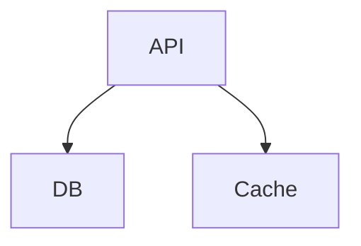

Structured ops include node and edge add/remove/rename/set-label operations. Use `asFlowchart(parsed.value)` before mutation.

## State

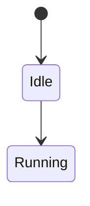

State diagrams own a dedicated `StateBody` (BUILD-19): narrow with `asState` and apply the 8 typed ops (`add_state`, `remove_state`, `rename_state`, `set_state_label`, `add_transition`, `remove_transition`, `set_transition_label`, `make_composite`). The modeled subset is simple states, transitions, `[*]` start/end pseudostates, nestable composite blocks, and `direction`. Anything outside it — `<<fork>>`/`<<choice>>`/`<<join>>`, history states, concurrency `--`, notes, `classDef`/`class`/`:::` styling — falls back to a lossless opaque body and stays source-level. Verify still runs the full Tier 1 + Tier 2 geometric path by projecting the body to a graph.

## Sequence

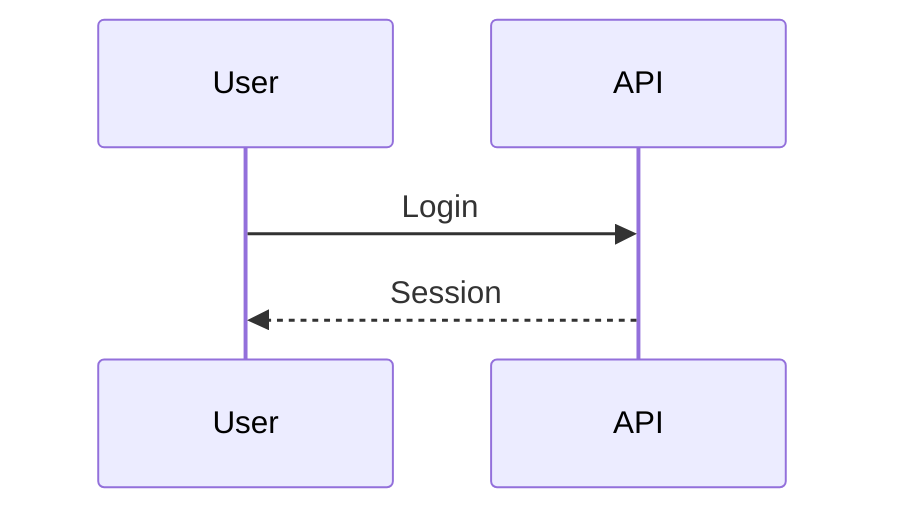

Simple participants/messages are structured. Rich Mermaid sequence blocks such as notes, `alt`, `loop`, and activation syntax are preserved as opaque source when not modeled.

## Timeline

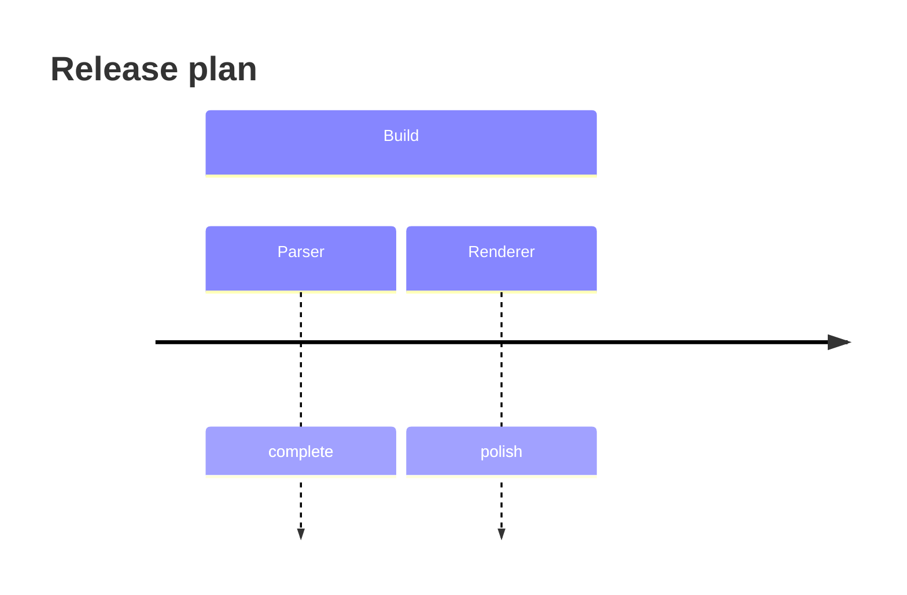

Structured ops cover title, section, period, and event changes.

## Class

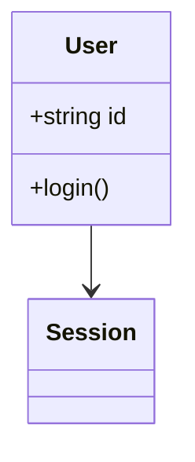

Structured ops cover classes, members, relations, notes, and renames.

## ER

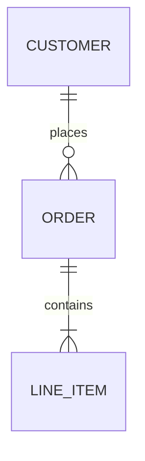

Structured ops cover entities, attributes, relation add/remove, and renames.

## Journey

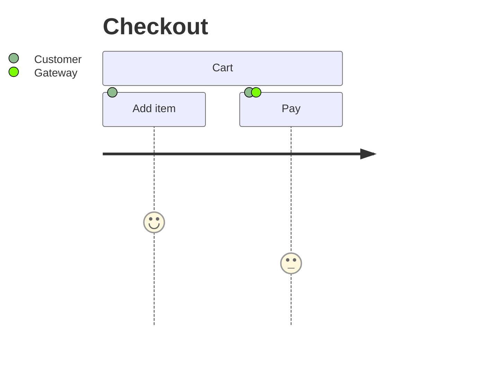

Journey diagrams narrow via `asJourney` and expose 10 structured ops (sections, tasks, scores, actors). Documented Mermaid accessibility directives (`accTitle`, inline `accDescr`, and block `accDescr { ... }`) stay structured and round-trip through canonical serialization. Malformed or unknown Journey syntax falls back to a lossless opaque body.

SVG rendering uses Mermaid's left-to-right Journey metaphor rather than the older Agentic card layout: sections span task columns, actors appear in a left legend, per-task actor dots show participation, and scores map to sentiment markers on a progression baseline. Mermaid `journey` config fields for actor colors, section fills/text colors, task/title fonts, task spacing, and actor label width are honored. Agentic Mermaid `style` and palette colors also reach Journey-specific surfaces such as section spans, actor dots, score markers, and the baseline.

## XY chart

```mermaid
xychart-beta
  title "Latency"
  x-axis [p50, p95, p99]
  y-axis "ms" 0 --> 500
  line [50, 180, 420]
```

The modeled subset (bare title, named/categorical/range axes, bar/line series with finite values) is structurally mutable: narrow with `asXyChart` and apply the 8 typed ops (`set_title`, `set_x_axis`, `set_y_axis`, `add_series`, `remove_series`, `set_series_values`, `set_series_name`, `reorder_series`). Quoted text, multi-statement `;` lines, and accTitle/accDescr fall back to opaque and stay source-level. See [`design/families/xychart.md`](./design/families/xychart.md) for compatibility details and layout notes.

## Pie

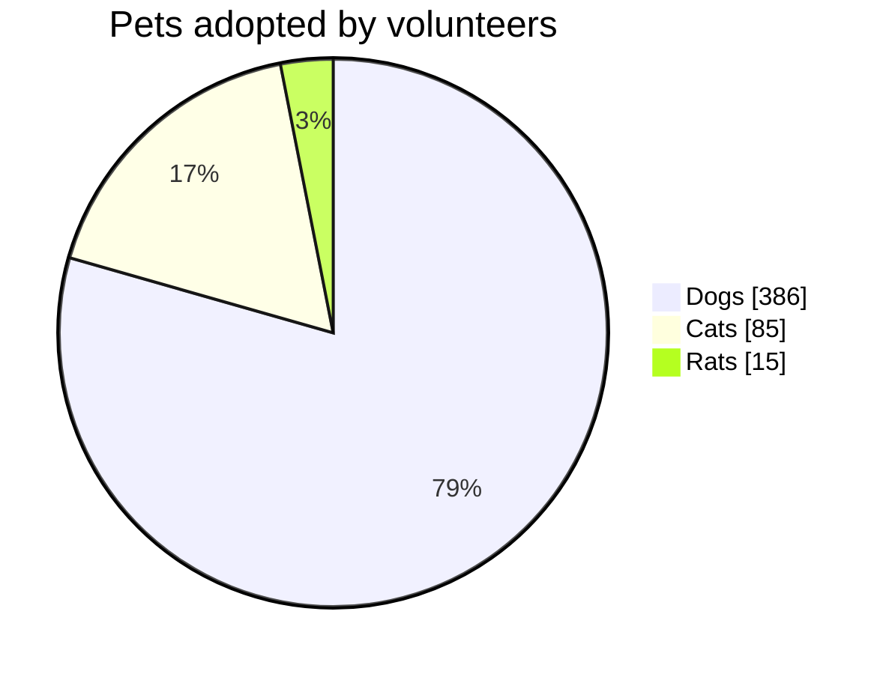

Pie charts accept the `pie` header with optional `showData`, an optional `title`, and `"label" : value` entries with positive numeric values. Slices render clockwise in source order. `showData` adds the raw value beside each legend label; the legend always shows the computed percentage. Malformed entries (negative/zero values, missing colon, unquoted labels) fall back to a lossless opaque body — never silently dropped — and the renderer still surfaces the loud error at render time. The ASCII renderer draws a proportional bar list. Pie is structured when narrowed through `asPie`; slices are addressed by their unique label. The operation schema is generated from the registry rather than duplicated here.

## Quadrant

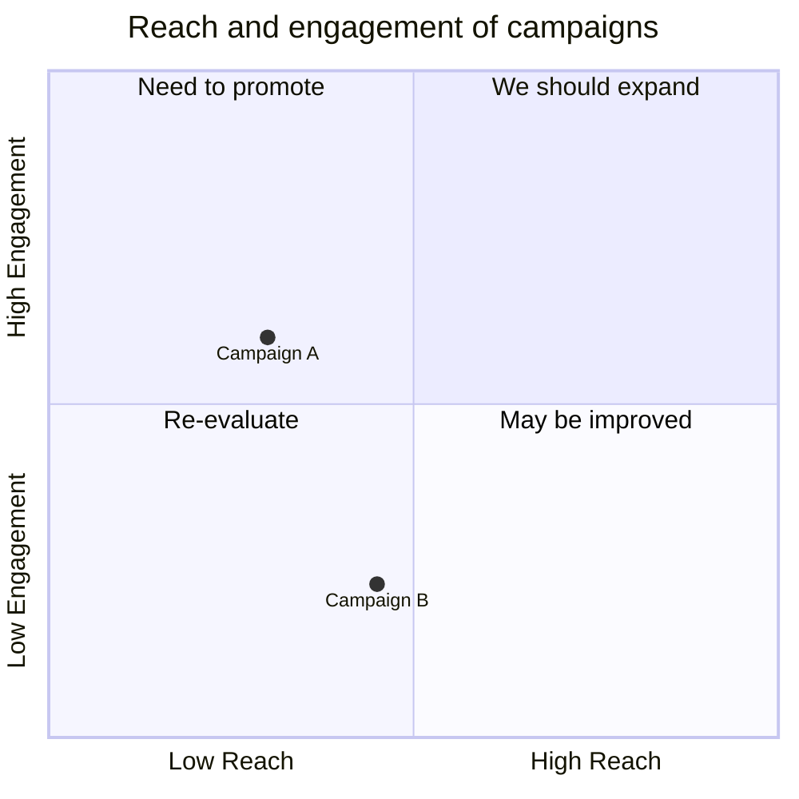

Quadrant charts accept the `quadrantChart` header, an optional `title`, `x-axis <left> --> <right>` and `y-axis <bottom> --> <top>` axis labels (the far side is optional), four `quadrant-1..quadrant-4 <label>` region labels, and `<Label>: [x, y]` points with coordinates in `[0, 1]`. Quadrant numbering follows Mermaid core: **1 = top-right, 2 = top-left, 3 = bottom-left, 4 = bottom-right**. The SVG renderer draws a square plot split into four theme-tinted quadrants with the points as circles; the ASCII renderer draws a bordered grid with a coordinate legend. Official point style metadata (`radius`, `color`, `stroke-color`, `stroke-width`), `classDef` lines, and class assignments are modeled for rendering and typed mutation. Malformed lines — out-of-range/non-numeric coordinates, missing brackets, duplicate point labels, and unknown point style metadata — fall back to a lossless opaque body, never silently dropped, and the renderer still surfaces the loud error at render time. Quadrant is structured when narrowed through `asQuadrant`; points are addressed by their unique label and coordinates stay in `[0, 1]`. The operation schema is generated from the registry rather than duplicated here.

## Gantt

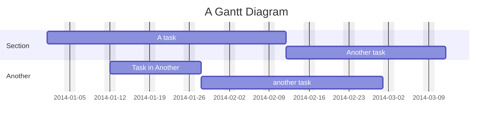

Gantt charts accept the `gantt` header, `title`, calendar directives (`dateFormat`, `axisFormat`, `tickInterval`, `inclusiveEndDates`, `topAxis`, multiple `excludes`/`includes` lines, `weekend friday|saturday`, `weekday <day>`, `todayMarker`), `section` lines, and task lines `Label :[tags,] [id,] [start,] end` where tags are `active`/`done`/`crit`/`milestone`/`vert`, start is a date or `after id…`, and end is a date, a duration token (`ms s m h d w M y`, decimals allowed), or `until id…`. Dependencies resolve in a pure scheduler ([design/families/gantt.md](./design/families/gantt.md)): `after` starts at the latest referenced end, `until` ends at the earliest referenced start, working durations extend over excluded days, `includes` overrides `excludes`, and dependency cycles / unknown references / invalid dates are named structured errors (`GANTT_*`), never wall-clock fallbacks. Rendering is deterministic: the `todayMarker` draws only when the caller passes `ganttToday` (a date in the diagram's `dateFormat`), and `todayMarker off` always wins. `displayMode: compact` (frontmatter or `config.gantt`) packs non-overlapping tasks of a section into shared rows; `vert` markers draw a full-height line without consuming a task row. `click … href` is sanitized under strict security and `click … call` is parsed but never executed. Gantt is structured when narrowed and segment-preserving: `asGantt` edits title/sections/tasks while calendar directives, click lines, and comments ride along verbatim as opaque segments; duplicate task ids or an unclosed `accDescr` block fall back to a lossless whole-opaque body.

## Mindmap

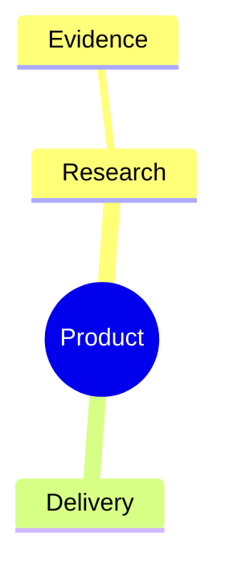

Mindmap uses indentation for parentage and supports Mermaid node shapes, `::icon(...)`, `:::class`, accessibility directives, deterministic tree layout, and 10 typed operations through `asMindmap`. Duplicate semantic ids are rejected. See [`design/families/mindmap.md`](./design/families/mindmap.md).

## GitGraph

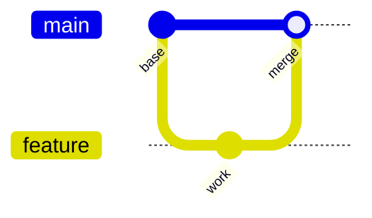

GitGraph replays commits and branch movement in source order; `asGitGraph` exposes 11 typed operations. Generated ids are deterministic `c<N>` values and duplicate custom ids are rejected. See [`design/families/gitgraph.md`](./design/families/gitgraph.md).

## Architecture

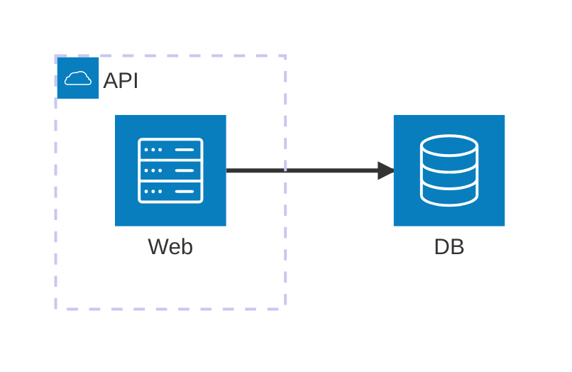

See [`design/families/architecture-beta.md`](./design/families/architecture-beta.md) for parser/layout/render notes.

## Output formats

All families use the same public output paths:

```ts
import { renderMermaidSVG, renderMermaidPNG, renderMermaidASCII } from 'agentic-mermaid/agent'

const svg = renderMermaidSVG(source, { security: 'strict' })
const png = renderMermaidPNG(source, { fitTo: { width: 1200 }, background: '#fff' })
const text = renderMermaidASCII(source)
```

CLI equivalents:

```bash
am render diagram.mmd --format svg > diagram.svg
am render diagram.mmd --format png --output diagram.png
am render diagram.mmd --format ascii > diagram.txt
```
