# Contact sheet — all renderers (families)

> Generated by `scripts/characterization/contact-sheet-families.ts`. Do not edit by hand.

One canonical example per diagram **family** (renderer). The flowchart and
state families share the grid + A\* engine characterised in depth in
[`contact-sheet.md`](./contact-sheet.md) and [`properties.md`](./properties.md);
every other family has its own renderer. This sheet records the breadth and
each family's layout strategy, signature invariant, and which universal
invariants hold (verified empirically).

## Universal-invariant coverage matrix

| Family | Total | Deterministic | No diagonals | Rectangular |
|--------|:-----:|:-------------:|:------------:|:-----------:|
| [Flowchart](#flowchart) | ✓ | ✓ | ✓ | ✓ |
| [State diagram](#state) | ✓ | ✓ | ✓ | ✓ |
| [Sequence diagram](#sequence) | ✓ | ✓ | ✓ | ✓ |
| [Class diagram](#class) | ✓ | ✓ | ✓ | ✓ |
| [ER diagram](#er) | ✓ | ✓ | ✓ | ✓ |
| [Timeline](#timeline) | ✓ | ✓ | ✓ | · |
| [Gantt chart](#gantt) | ✓ | ✓ | ✓ | · |
| [User journey](#journey) | ✓ | ✓ | ✓ | · |
| [XY chart](#xychart) | ✓ | ✓ | ✓ | · |
| [Pie chart](#pie) | ✓ | ✓ | ✓ | · |
| [Quadrant chart](#quadrant) | ✓ | ✓ | ✓ | · |
| [Architecture diagram](#architecture) | ✓ | ✓ | ✓ | · |

**Total** and **Deterministic** hold for every renderer (the bedrock contract;
also pinned across the 258-entry docs corpus by `ascii-determinism.test.ts`).
**No diagonals** holds for every renderer. **Rectangular** (all rows one width)
holds only for the box/graph families; the chart and list families emit ragged
rows by design.

## <a id="flowchart"></a>Flowchart

**Layout strategy:** Grid placement + A* orthogonal edge routing (src/ascii/grid.ts).

**Signature invariant:** Layered: forward edges go downstream; orthogonal; deterministic. Characterised in depth in contact-sheet.md + properties.md.

Source:

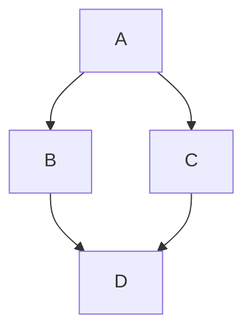

Rendered:

```
┌───┐
│   │
│ A │
│   │
└───┘
  │
  │
  ├─────────┐
  │         │
  ▼         ▼
┌───┐     ┌───┐
│   │     │   │
│ B │     │ C │
│   │     │   │
└─┬─┘     └─┬─┘
  │         │
  │         │
  ├─────────┘
  │
  ▼
┌───┐
│   │
│ D │
│   │
└───┘
```

## <a id="state"></a>State diagram

**Layout strategy:** Same grid + A* pipeline as flowcharts (src/ascii/index.ts).

**Signature invariant:** [*] renders as start/end markers; states are rounded boxes; otherwise identical to flowchart contract.

Source:

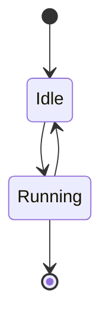

Rendered:

```
●─────────●
│         │
●────┬────●
     │
     │
     ├──────┐
     │      │
     ▼      │
╭─────────╮ │
│         │ │
│   Idle  │ │
│         │ │
╰────┬────╯ │
     │      │
     │      │
     │      │
     │      │
     ▼      │
╭─────────╮ │
│         │ │
│ Running │ │
│         │ │
╰────┬────╯ │
     │      │
     │      │
     ├──────┘
     │
     ▼
╔═════════╗
║         ║
╚═════════╝
```

## <a id="sequence"></a>Sequence diagram

**Layout strategy:** Column-based timeline layout (src/ascii/sequence.ts).

**Signature invariant:** One vertical lifeline per participant, evenly spaced; messages stack top-to-bottom in source order. Rectangular.

Source:

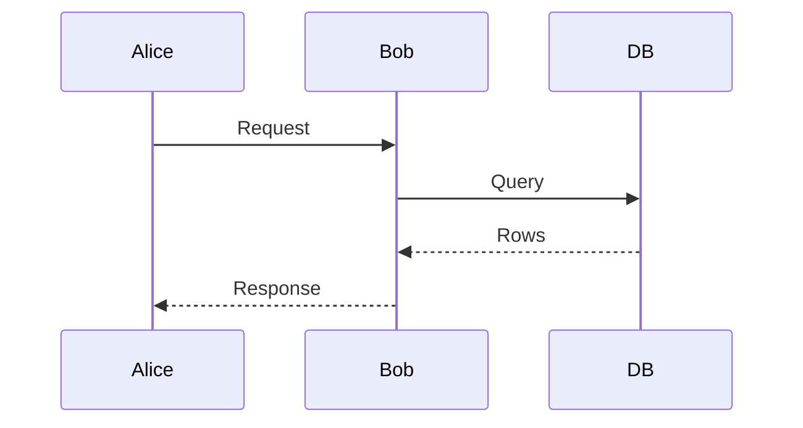

Rendered:

```
 ┌───────┐      ┌─────┐    ┌────┐
 │ Alice │      │ Bob │    │ DB │
 └───┬───┘      └──┬──┘    └──┬─┘
     │             │          │
     │  Request    │          │
     │─────────────▶          │
     │             │          │
     │             │  Query   │
     │             │──────────▶
     │             │          │
     │             │  Rows    │
     │             ◀╌╌╌╌╌╌╌╌╌╌│
     │             │          │
     │  Response   │          │
     ◀╌╌╌╌╌╌╌╌╌╌╌╌╌│          │
     │             │          │
 ┌───┴───┐      ┌──┴──┐    ┌──┴─┐
 │ Alice │      │ Bob │    │ DB │
 └───────┘      └─────┘    └────┘
```

## <a id="class"></a>Class diagram

**Layout strategy:** Level-based UML layout (src/ascii/class-diagram.ts).

**Signature invariant:** Each class is a compartment box (name / members); relationship arrows carry UML arrowheads. Rectangular.

Source:

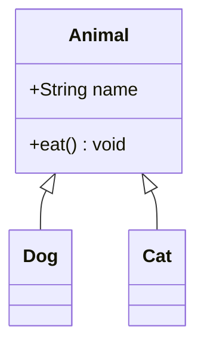

Rendered:

```
┌───────────────┐
│ Animal        │
├───────────────┤
│ +name: String │
├───────────────┤
│ +eat: void    │
└───────────────┘
        △
   ┌────└─────┐
   │          │
┌─────┐    ┌─────┐
│ Dog │    │ Cat │
└─────┘    └─────┘
```

## <a id="er"></a>ER diagram

**Layout strategy:** Grid layout with crow's-foot notation (src/ascii/er-diagram.ts).

**Signature invariant:** Entities are boxes; relationship endpoints render cardinality (||, o{, |{) as crow's-foot glyphs. Rectangular.

Source:

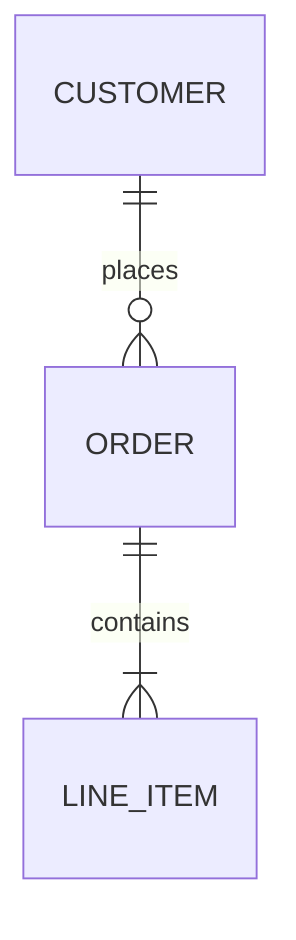

Rendered:

```
┌──────────┐          ┌───────┐
│ CUSTOMER ││───────○╟│ ORDER │
└──────────┘ places   └───────┘
                          │
      ───────────────────── contains
      │                   │
      ╟                   │
┌───────────┐
│ LINE_ITEM │
└───────────┘
```

## <a id="timeline"></a>Timeline

**Layout strategy:** Chronological outline with grouped milestones (src/ascii/timeline.ts).

**Signature invariant:** Periods listed in source order, grouped under sections; an outline, not a routed graph. Ragged rows.

Source:

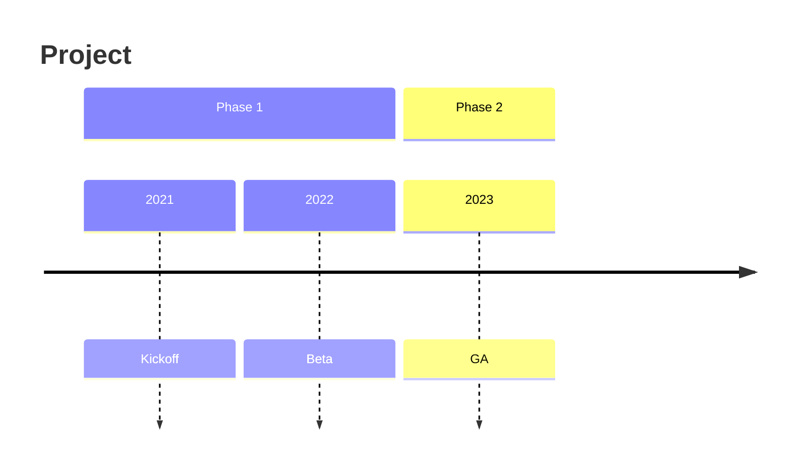

Rendered:

```
Project

[Phase 1]
○ 2021
│  └─ Kickoff

○ 2022
│  └─ Beta

[Phase 2]
○ 2023
│  └─ GA
```

## <a id="gantt"></a>Gantt chart

**Layout strategy:** Calendar/time-axis renderer with scheduled task bars, milestones, and vertical markers (src/ascii/gantt.ts).

**Signature invariant:** Tasks resolve to deterministic intervals on a time axis; dependencies push starts, exclusions extend working durations, milestones render as points, and vert markers consume no task row. Ragged rows.

Source:

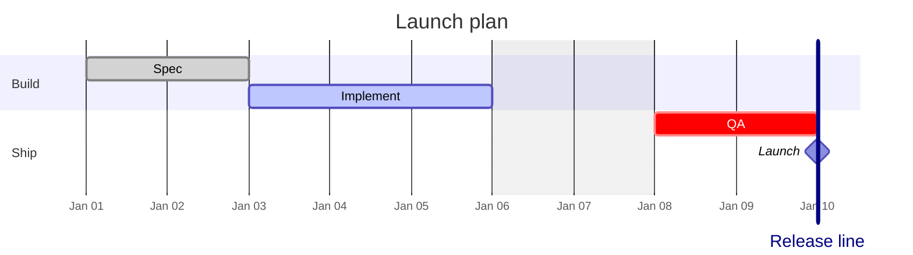

Rendered:

```
                       Launch plan

  Build
    Spec          ░░░░░░░░░──────────────────────────────┊  01-01 → 01-03
    Implement     ─────────▓▓▓▓▓▓▓▓▓▓▓▓▓─────────────────┊  01-03 → 01-06
  Ship
    QA            ──────────────────────▒▒▒▒▒▒▒▒▒▒▒▒▒▒▒▒▒▒  01-06 → 01-10
    Launch        ───────────────────────────────────────◆  01-10
    Release line                                         ┊  01-10
                  ────────────────────────────────────────
                                             Jan 07
```

## <a id="journey"></a>User journey

**Layout strategy:** Scored task lists with actor annotations (src/ascii/journey.ts).

**Signature invariant:** Tasks grouped by section with a 1-5 score and actor initials; an annotated list. Ragged rows.

Source:

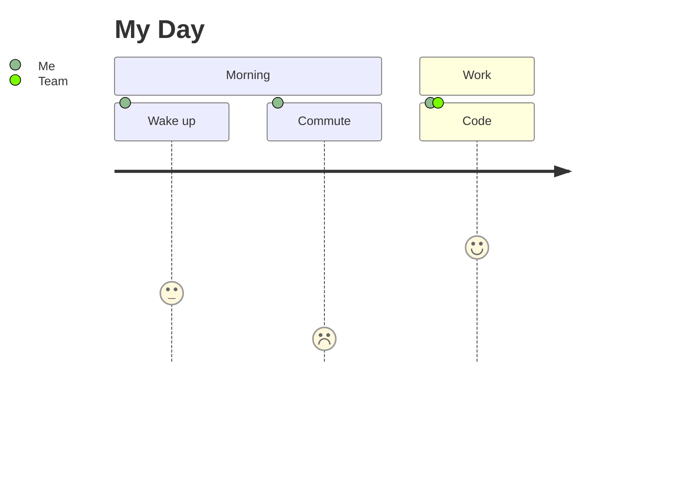

Rendered:

```
My Day

[Morning]
●●●○○ Wake up
  by Me

●○○○○ Commute
  by Me

[Work]
●●●●● Code
  by Me, Team
```

## <a id="xychart"></a>XY chart

**Layout strategy:** Cartesian plot of series over labelled axes (src/ascii/xychart.ts).

**Signature invariant:** Bars/lines plotted against monotonic axes using block glyphs (never `/`\`). Ragged rows.

Source:

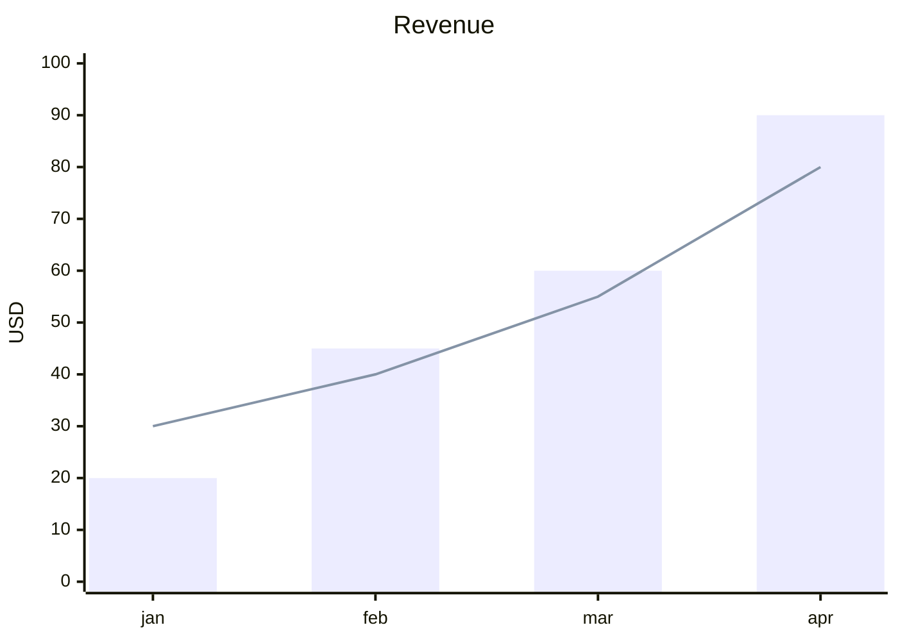

Rendered:

```
                              Revenue
                         █ Bar 1  ─ Line 1

 100┤····························································
    │
    │                                                ████████
    │                                                ████████
  80┤·············································╭──────────····
    │                                             │  ████████
    │                                             │  ████████
    │                                             │  ████████
  60┤·································████████····│··████████····
    │                              ╭──────────────╯  ████████
    │                  ████████    │  ████████       ████████
  40┤···············╭──────────────╯··████████·······████████····
    │               │  ████████       ████████       ████████
    │    ───────────╯  ████████       ████████       ████████
    │                  ████████       ████████       ████████
  20┤···████████·······████████·······████████·······████████····
    │   ████████       ████████       ████████       ████████
    │   ████████       ████████       ████████       ████████
    │   ████████       ████████       ████████       ████████
   0┼···████████·······████████·······████████·······████████····
    ┼───────┬──────────────┬──────────────┬──────────────┬───────
           jan            feb            mar            apr
```

## <a id="pie"></a>Pie chart

**Layout strategy:** Proportional slice rendering (src/ascii/pie.ts).

**Signature invariant:** Each slice is sized in proportion to its share of the total; values shown alongside. Ragged rows.

Source:

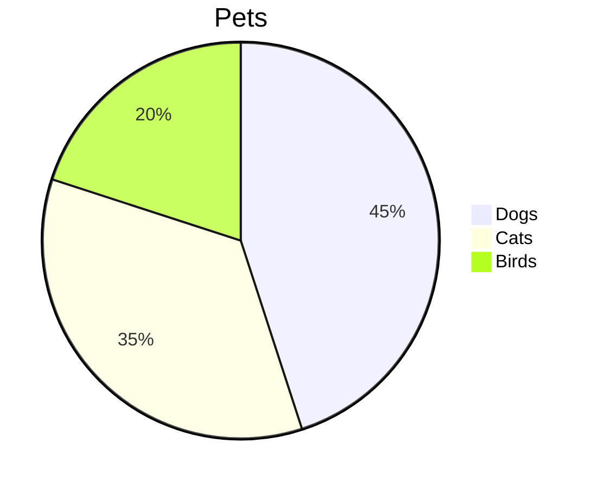

Rendered:

```
Pets
Dogs   ██████████████████████████████   45.0%
Cats   ███████████████████████          35.0%
Birds  █████████████                    20.0%
```

## <a id="quadrant"></a>Quadrant chart

**Layout strategy:** 2-D scatter into four labelled quadrants (src/ascii/quadrant.ts).

**Signature invariant:** Points placed by (x,y) in [0,1]² on a 2×2 grid with axis labels; a scatter plot. Ragged rows.

Source:

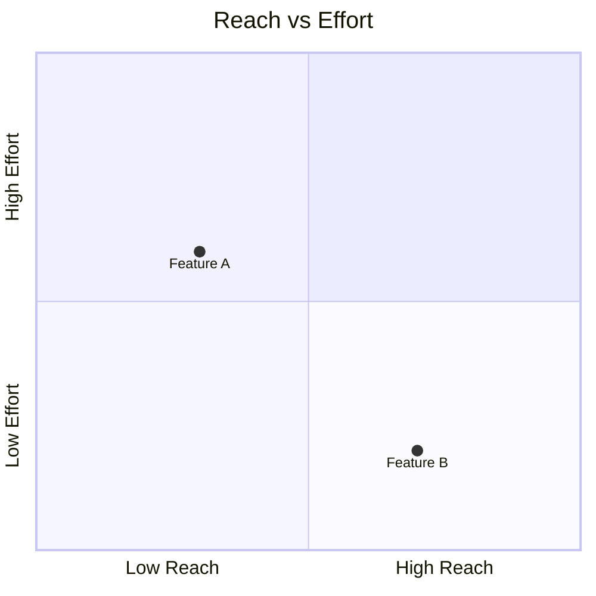

Rendered:

```
              Reach vs Effort
┌─────────────────────────────────────────┐
│                    │                    │
│                    │                    │
│                    │                    │
│                    │                    │
│                    │                    │
│                    │                    │
│                    │                    │
│                    │                    │
│            ●       │                    │
│                    │                    │
├────────────────────┼────────────────────┤
│                    │                    │
│                    │                    │
│                    │                    │
│                    │                    │
│                    │                    │
│                    │       ●            │
│                    │                    │
│                    │                    │
│                    │                    │
│                    │                    │
└─────────────────────────────────────────┘
Low Reach                        High Reach
y-axis  bottom: Low Effort  |  top: High Effort

● Feature A: [0.3, 0.6]
● Feature B: [0.7, 0.2]
```

## <a id="architecture"></a>Architecture diagram

**Layout strategy:** Projected graph layout over the grid engine (src/ascii/architecture.ts).

**Signature invariant:** Services grouped into nested boxes with iconography; edges routed between ports. Ragged rows.

Source:

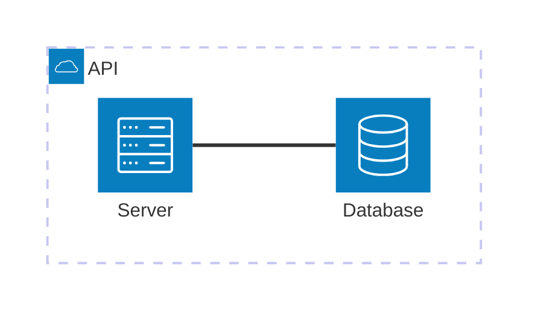

Rendered:

```
┌────────────────────────────┐
│ (cloud) API                │
│────────────────────────────│
  [database] Database
  [server] Server
└────────────────────────────┘

  Database:L ──── R:Server
```
