# Contact sheet — ASCII grid layout algorithm

> Generated by `scripts/characterization/contact-sheet.ts`. Do not edit by hand —
> re-run the generator and review the diff (approval-test workflow).

These are the **minimum set of worked examples** that together exercise every
load-bearing decision in the hand-written grid + A\* layout. Each example
isolates one behaviour. Output is shown in ASCII mode (`useAscii: true`) so the
structure is legible in plain text. See `properties.md` for the
property catalogue these examples motivate, and `README.md` for context.

| # | Example | Characterises |
|---|---------|---------------|
| 01 | [Single node (base case)](#01-single-node) | A node is a 3×3 grid block sized to its label |
| 02 | [Linear chain, top-down](#02-chain-td) | Layer assignment along the flow axis: each child sits one level (stride 4) below its parent |
| 03 | [Linear chain, left-right (transpose of TD)](#03-chain-lr) | Direction duality: LR is the x/y transpose of the identical placement code |
| 04 | [Linear chain, bottom-up](#04-chain-bt) | BT is laid out as TD, then the finished canvas is flipped vertically and arrow glyphs are remapped (v↔^). |
| 05 | [Fan-out from one source](#05-fan-out) | Sibling edges sharing a source are bundled onto a shared trunk that splits at a single junction row. |
| 06 | [Fan-in to one target](#06-fan-in) | Edges sharing a target merge into one trunk |
| 07 | [Branch then merge (diamond)](#07-branch-merge) | A node that is both a fan-out target and a fan-in source: split, two parallel layers, rejoin without crossing. |
| 08 | [Feedback cycle (back edge)](#08-feedback-cycle) | The forward path stays straight |
| 09 | [Self-loop](#09-self-loop) | A node pointing at itself routes a small loop off one side |
| 10 | [Parallel edges into a target](#10-parallel-edges) | Two independent roots feeding one target are placed contiguously and share the merge trunk (no crossed trunks). |
| 11 | [Edge labels on a fan-out](#11-edge-labels) | Labelled edges cannot bundle |
| 12 | [Node shapes](#12-node-shapes) | Shape-aware sizing: diamond/round/circle change the box glyphs and grid dimensions but keep the 3×3 invariant and orthogonal routing. |
| 13 | [Subgraph (bounding box)](#13-subgraph) | A subgraph draws a labelled box whose bounds contain every member node |
| 14 | [Subgraph with direction override](#14-subgraph-direction) | A subgraph can override the flow direction (LR inside TD) |
| 15 | [Disconnected components](#15-disconnected) | Multiple roots / components are laid out side by side |
| 16 | [State diagram start/end](#16-state-markers) | State diagrams reuse the flowchart pipeline |

## <a id="01-single-node"></a>01. Single node (base case)

**Characterises:** A node is a 3×3 grid block sized to its label; the canvas is the box plus border. No edges, no routing.

**Code:** `grid.ts reserveSpotInGrid / setColumnWidth; draw.ts drawBox`

Source:


Rendered:

```
+-------+
|       |
| Start |
|       |
+-------+
```

## <a id="02-chain-td"></a>02. Linear chain, top-down

**Characterises:** Layer assignment along the flow axis: each child sits one level (stride 4) below its parent; one node per layer.

**Code:** `grid.ts:539 childLevel = gc.y + 4`

Source:

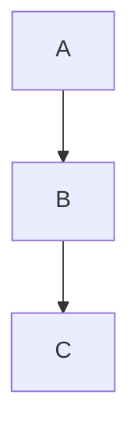

Rendered:

```
+---+
|   |
| A |
|   |
+---+
  |  
  |  
  |  
  |  
  v  
+---+
|   |
| B |
|   |
+---+
  |  
  |  
  |  
  |  
  v  
+---+
|   |
| C |
|   |
+---+
```

## <a id="03-chain-lr"></a>03. Linear chain, left-right (transpose of TD)

**Characterises:** Direction duality: LR is the x/y transpose of the identical placement code; flow axis becomes x.

**Code:** `grid.ts:496-571 (x↔y swap)`

Source:


Rendered:

```
+---+     +---+     +---+
|   |     |   |     |   |
| A |---->| B |---->| C |
|   |     |   |     |   |
+---+     +---+     +---+
```

## <a id="04-chain-bt"></a>04. Linear chain, bottom-up

**Characterises:** BT is laid out as TD, then the finished canvas is flipped vertically and arrow glyphs are remapped (v↔^).

**Code:** `index.ts:179-194; canvas.ts flipCanvasVertically`

Source:

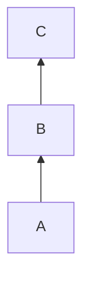

Rendered:

```
+---+
|   |
| C |
|   |
+---+
  ^  
  |  
  |  
  |  
  |  
+---+
|   |
| B |
|   |
+---+
  ^  
  |  
  |  
  |  
  |  
+---+
|   |
| A |
|   |
+---+
```

## <a id="05-fan-out"></a>05. Fan-out from one source

**Characterises:** Sibling edges sharing a source are bundled onto a shared trunk that splits at a single junction row.

**Code:** `edge-bundling.ts analyzeEdgeBundles / processBundles (TD only)`

Source:

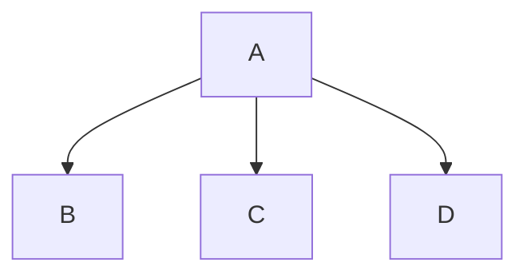

Rendered:

```
+---+                    
|   |                    
| A |                    
|   |                    
+---+                    
  |                      
  |                      
  +---------+---------+  
  |         |         |  
  v         v         v  
+---+     +---+     +---+
|   |     |   |     |   |
| B |     | C |     | D |
|   |     |   |     |   |
+---+     +---+     +---+
```

## <a id="06-fan-in"></a>06. Fan-in to one target

**Characterises:** Edges sharing a target merge into one trunk; fan-in targets align under their parent group (in-degree heuristic).

**Code:** `grid.ts:478-492 inDegree; grid.ts:555-563`

Source:

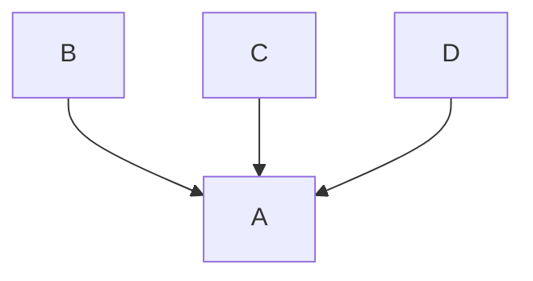

Rendered:

```
+---+     +---+     +---+
|   |     |   |     |   |
| B |     | C |     | D |
|   |     |   |     |   |
+---+     +---+     +---+
  |         |         |  
  |         |         |  
  +---------+---------+  
  |                      
  v                      
+---+                    
|   |                    
| A |                    
|   |                    
+---+
```

## <a id="07-branch-merge"></a>07. Branch then merge (diamond)

**Characterises:** A node that is both a fan-out target and a fan-in source: split, two parallel layers, rejoin without crossing.

**Code:** `grid.ts createMapping multi-pass placement`

Source:

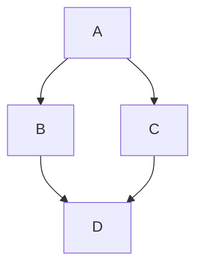

Rendered:

```
+---+          
|   |          
| A |          
|   |          
+---+          
  |            
  |            
  +---------+  
  |         |  
  v         v  
+---+     +---+
|   |     |   |
| B |     | C |
|   |     |   |
+---+     +---+
  |         |  
  |         |  
  +---------+  
  |            
  v            
+---+          
|   |          
| D |          
|   |          
+---+
```

## <a id="08-feedback-cycle"></a>08. Feedback cycle (back edge)

**Characterises:** The forward path stays straight; the cycle-closing edge is routed back around by A* as a detour, not a diagonal.

**Code:** `pathfinder.ts getPath; grid.ts:582 multi-pass safety break`

Source:

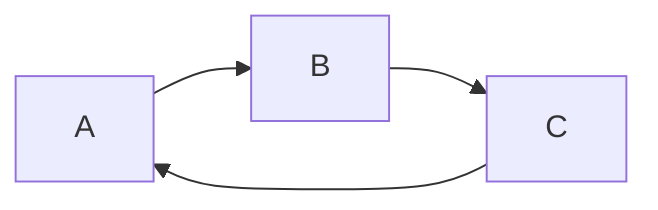

Rendered:

```
+---+     +---+     +---+
|   |     |   |     |   |
| A |---->| B |---->| C |
|   |     |   |     |   |
+---+     +---+     +---+
  ^                   |  
  +-------------------+
```

## <a id="09-self-loop"></a>09. Self-loop

**Characterises:** A node pointing at itself routes a small loop off one side; self-loops are excluded from fan-in degree.

**Code:** `edge-routing.ts selfReferenceDirection; grid.ts:487`

Source:

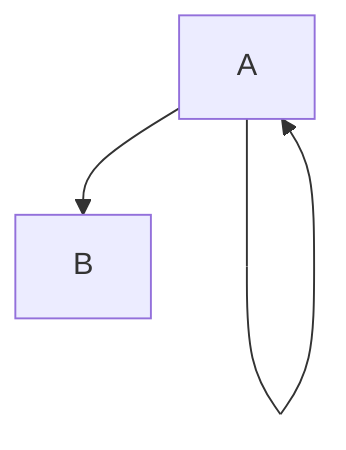

Rendered:

```
+---+  
|   |  
| A |<+
|   | |
+---+ |
  |   |
  |   |
  +---+
  |    
  v    
+---+  
|   |  
| B |  
|   |  
+---+
```

## <a id="10-parallel-edges"></a>10. Parallel edges into a target

**Characterises:** Two independent roots feeding one target are placed contiguously and share the merge trunk (no crossed trunks).

**Code:** `grid.ts:455-470 root grouping by shared first-target`

Source:

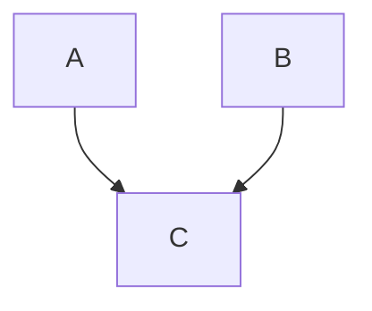

Rendered:

```
+---+     +---+
|   |     |   |
| A |     | B |
|   |     |   |
+---+     +---+
  |         |  
  |         |  
  +---------+  
  |            
  v            
+---+          
|   |          
| C |          
|   |          
+---+
```

## <a id="11-edge-labels"></a>11. Edge labels on a fan-out

**Characterises:** Labelled edges cannot bundle; the label lands on a per-sibling branch segment and widens that column.

**Code:** `edge-routing.ts determineLabelLine; grid.ts shareSiblingEdgeTrunks`

Source:

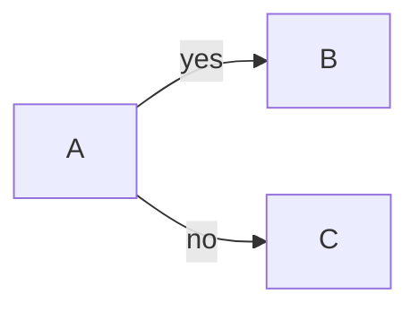

Rendered:

```
+---+        +---+
|   |        |   |
| A |---yes->| B |
|   |        |   |
+---+        +---+
  |               
  |               
  |               
  |               
  |               
  |          +---+
  |          |   |
  +---no---->| C |
             |   |
             +---+
```

## <a id="12-node-shapes"></a>12. Node shapes

**Characterises:** Shape-aware sizing: diamond/round/circle change the box glyphs and grid dimensions but keep the 3×3 invariant and orthogonal routing.

**Code:** `shapes/* getShapeDimensions; grid.ts setColumnWidth`

Source:

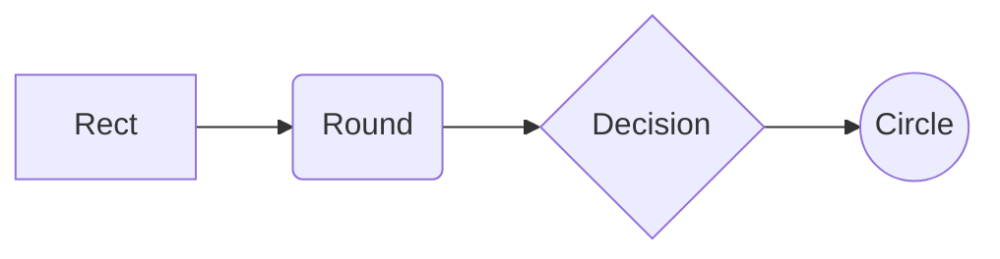

Rendered:

```
+------+     .-------.     <---------->     o--------o
|      |     |       |     |          |     |        |
| Rect |---->| Round |---->| Decision |---->| Circle |
|      |     |       |     |          |     |        |
+------+     '-------'     <---------->     o--------o
```

## <a id="13-subgraph"></a>13. Subgraph (bounding box)

**Characterises:** A subgraph draws a labelled box whose bounds contain every member node; edges cross the border cleanly.

**Code:** `grid.ts calculateSubgraphBoundingBoxes; offsetDrawingForSubgraphs`

Source:

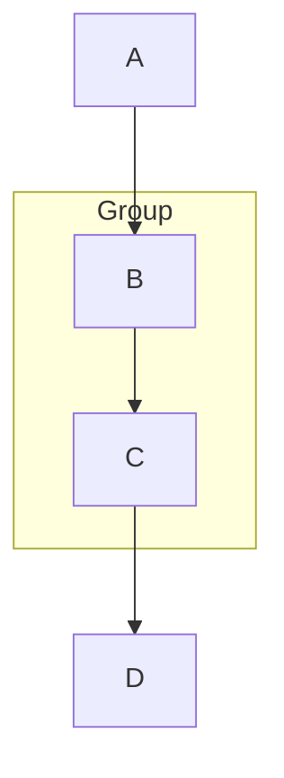

Rendered:

```
  +---+  
  |   |  
  | A |  
  |   |  
  +---+  
    |    
    |    
    |    
    |    
    v    
  +---+  
  |   |  
  | B |  
  |   |  
  +---+  
    |    
    |    
    |    
    |    
    |    
+---|---+
| Group |
|   |   |
|   v   |
| +---+ |
| |   | |
| | C | |
| |   | |
| +---+ |
|   |   |
+---|---+
    |    
    |    
    v    
  +---+  
  |   |  
  | D |  
  |   |  
  +---+
```

## <a id="14-subgraph-direction"></a>14. Subgraph with direction override

**Characterises:** A subgraph can override the flow direction (LR inside TD); the override applies only to edges internal to it.

**Code:** `grid.ts:533-537 effectiveDir; converter.ts:196-199`

Source:

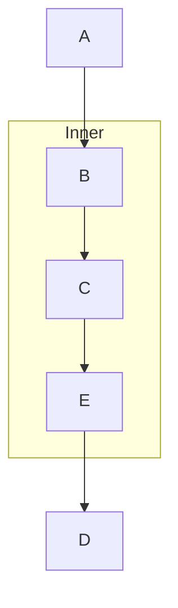

Rendered:

```
  +---+            
  |   |            
  | A |            
  |   |            
  +---+            
    |              
    |              
    |              
    |              
    v              
  +---+            
  |   |            
  | B |            
  |   |            
  +---+            
    |              
    |              
    |              
    |              
    |              
+---|-------------+
|   |  Inner      |
|   |             |
|   v             |
| +---+     +---+ |
| |   |     |   | |
| | C |---->| E | |
| |   |     |   | |
| +---+     +---+ |
|             |   |
+-------------|---+
              |    
              |    
              |    
  +---+       |    
  |   |       |    
  | D |<------+    
  |   |            
  +---+
```

## <a id="15-disconnected"></a>15. Disconnected components

**Characterises:** Multiple roots / components are laid out side by side; each is an independent placement pass.

**Code:** `grid.ts root detection + multi-pass placement`

Source:

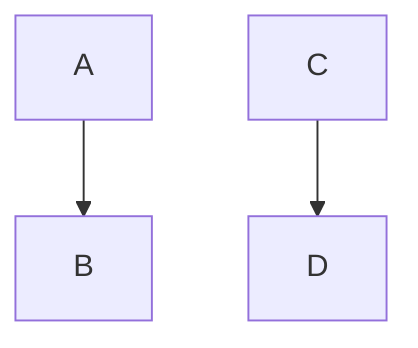

Rendered:

```
+---+     +---+
|   |     |   |
| A |     | C |
|   |     |   |
+---+     +---+
  |         |  
  |         |  
  |         |  
  |         |  
  v         v  
+---+     +---+
|   |     |   |
| B |     | D |
|   |     |   |
+---+     +---+
```

## <a id="16-state-markers"></a>16. State diagram start/end

**Characterises:** State diagrams reuse the flowchart pipeline; [*] becomes start/end markers and states render as rounded boxes.

**Code:** `index.ts flowchart pipeline (state shares it); shapes/state.ts`

Source:

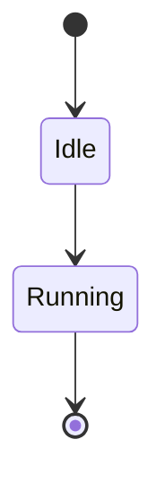

Rendered:

```
*---------*
|         |
*---------*
     |     
     |     
     |     
     |     
     v     
.---------.
|         |
|   Idle  |
|         |
'---------'
     |     
     |     
     |     
     |     
     v     
.---------.
|         |
| Running |
|         |
'---------'
     |     
     |     
     |     
     |     
     v     
#=========#
‖         ‖
#=========#
```
