# Visual quality characterisation

> Generated by `scripts/characterization/visual-quality.ts`. Do not edit by hand.

This is the approval layer for visual/layout quality. The SVG files are
human-inspectable snapshots; the hashes fingerprint the SVG and PNG surfaces;
the metrics are graph-drawing review signals (crossings, bends, canvas area,
label fit, spacing, density, contrast, and label-overlap risk), not standalone correctness laws.
`Label fit` is `n/a` for GitGraph because commit labels are external/rotated
annotations rather than text intended to fit inside the 20px commit glyph;
GitGraph label/canvas containment is gated separately by its layout tests.
For graph-projected route correctness, pair this report with PR 30's hard
gates: `src/__tests__/contact-sheet.test.ts`,
`src/__tests__/layout-rubric.test.ts`, and `bun run track`.

| Family | SVG snapshot | SVG SHA | PNG SHA | PNG bytes | SVG size | Layout bounds | Nodes/edges | Crossings | Bends | Route px | Area fill | Label fit | Label overlaps | Edge-label clearance | Min spacing | Density | Contrast | Aspect |
|--------|--------------|---------|---------|----------:|----------|---------------|-------------|----------:|------:|---------:|----------:|----------:|---------------:|---------------------:|------------:|--------:|---------:|-------:|
| Flowchart | [flowchart.svg](./visual-snapshots/flowchart.svg) | `a4011ae81433` | `4f55402c210d` | 9019 | 279.6835x434.582 | 280x435 | 4/4 | 0 | 0 | 533 | 15.5% | 100.0% | 0 | 7 | 30 | 0.66 | 7.21:1 | 0.64 |
| State diagram | [state.svg](./visual-snapshots/state.svg) | `d92c7173a089` | `9cfbb31c9019` | 7409 | 241.14266666666668x375.15000000000003 | 241x375 | 5/5 | 0 | 6 | 628 | 11.3% | 100.0% | 0 | n/a | 28 | 1.11 | 14.15:1 | 0.64 |
| Sequence diagram | [sequence.svg](./visual-snapshots/sequence.svg) | `cc41346b1910` | `682ab163bc18` | 7347 | 420x286 | 420x286 | 3/4 | 0 | 0 | 560 | 8.0% | 100.0% | 0 | 10 | 60 | 0.58 | 4.94:1 | 1.47 |
| Class diagram | [class.svg](./visual-snapshots/class.svg) | `55beaa8521b5` | `da15de026074` | 4243 | 360x237.8 | 360x238 | 3/2 | 0 | 2 | 240 | 20.6% | 100.0% | 0 | n/a | 40 | 0.58 | 13.54:1 | 1.51 |
| ER diagram | [er.svg](./visual-snapshots/er.svg) | `3181f3a3882d` | `22a6dd41d17d` | 9655 | 951.768x136 | 952x136 | 3/2 | 0 | 0 | 452 | 18.2% | 100.0% | 0 | 226 | 222 | 0.39 | 3.27:1 | 7.00 |
| Timeline | [timeline.svg](./visual-snapshots/timeline.svg) | `b05f586d4fff` | `860bcf5ebf0c` | 8087 | 380x286.6 | 380x287 | 4/0 | 0 | 0 | 0 | 13.2% | 100.0% | 0 | n/a | 24 | 0.37 | 4.69:1 | 1.32 |
| Gantt chart | [gantt.svg](./visual-snapshots/gantt.svg) | `5fe4cf56e531` | `16b076538c25` | 10225 | 703x282 | 703x282 | 4/0 | 0 | 0 | 0 | 5.4% | 75.0% | 0 | n/a | 8 | 0.20 | 14.89:1 | 2.49 |
| User journey | [journey.svg](./visual-snapshots/journey.svg) | `d4f765ccf0ca` | `f9d1919d8a88` | 15272 | 530x482.3 | 530x482 | 2/0 | 0 | 0 | 0 | 5.9% | 100.0% | 0 | n/a | 26 | 0.08 | 7.21:1 | 1.10 |
| XY chart | [xychart.svg](./visual-snapshots/xychart.svg) | `afecafca0fc3` | `b9ab7095025d` | 18126 | 700x500 | 700x500 | 6/0 | 0 | 0 | 0 | 33.9% | 50.0% | 0 | n/a | 9 | 0.17 | 14.89:1 | 1.40 |
| Pie chart | [pie.svg](./visual-snapshots/pie.svg) | `cf6b106fb95f` | `6342a8340188` | 11770 | 368.79x276 | 369x276 | 3/0 | 0 | 0 | 0 | 4.1% | 100.0% | 0 | n/a | 8 | 0.29 | 3.68:1 | 1.34 |
| Quadrant chart | [quadrant.svg](./visual-snapshots/quadrant.svg) | `0eae7832ed76` | `719c3e73ce09` | 9690 | 456x492 | 456x492 | 2/0 | 0 | 0 | 0 | 0.1% | 100.0% | 0 | n/a | 198 | 0.09 | 4.94:1 | 0.93 |
| Mindmap | [mindmap.svg](./visual-snapshots/mindmap.svg) | `9b97a3e55789` | `9ef6b7dee14f` | 10664 | 445.654x173.8 | 446x174 | 5/4 | 0 | 4 | 147 | 21.8% | 100.0% | 0 | n/a | 20 | 1.16 | 9.18:1 | 2.56 |
| GitGraph | [gitgraph.svg](./visual-snapshots/gitgraph.svg) | `4ba43b8c163a` | `7e16aff3d026` | 15365 | 634.3x348.266 | 634x348 | 4/4 | 0 | 4 | 776 | 0.7% | n/a | 0 | n/a | 97 | 0.36 | 4.54:1 | 1.82 |
| Architecture diagram | [architecture.svg](./visual-snapshots/architecture.svg) | `e52c4df70db2` | `de31b0303d43` | 4296 | 414x188 | 414x188 | 2/1 | 0 | 0 | 78 | 14.8% | 100.0% | 0 | n/a | 78 | 0.39 | 6.67:1 | 2.20 |
| Radar chart | [radar.svg](./visual-snapshots/radar.svg) | `6c0cc7a91198` | `9283df8d85db` | 30425 | 460.98x344.25 | 461x344 | 14/0 | 0 | 0 | 0 | 3.1% | 92.9% | 0 | n/a | 7 | 0.88 | 14.89:1 | 1.34 |

## Sources

### Flowchart

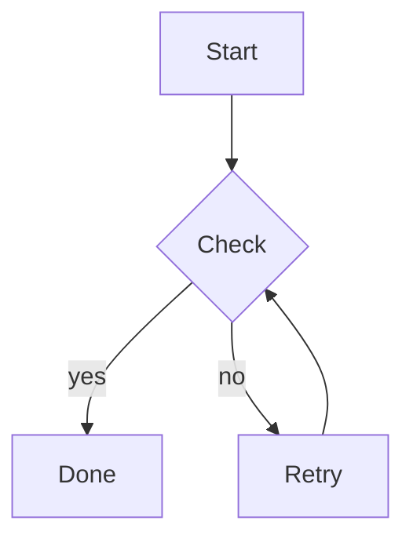

### State diagram

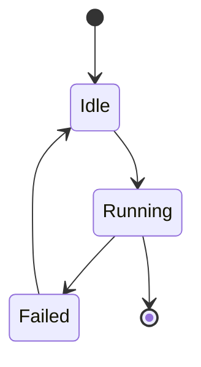

### Sequence diagram

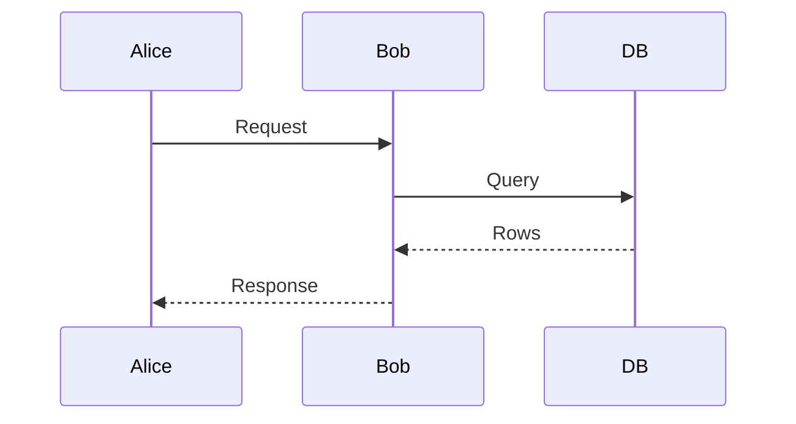

### Class diagram

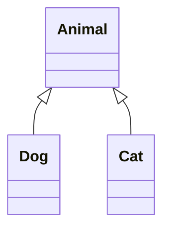

### ER diagram

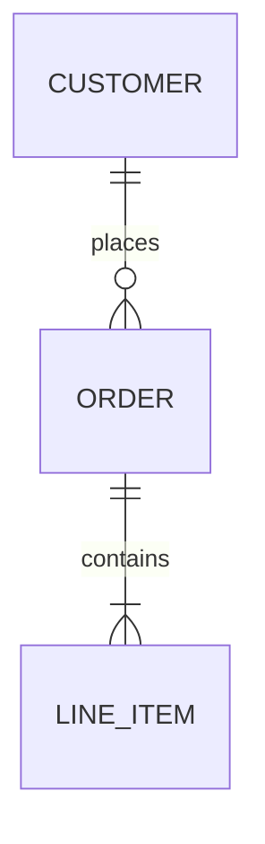

### Timeline

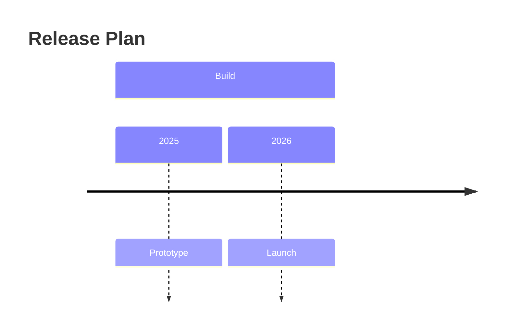

### Gantt chart

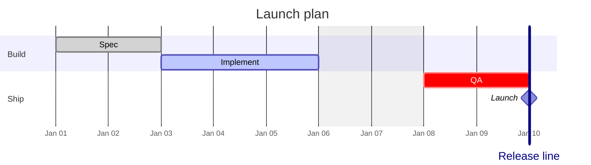

### User journey

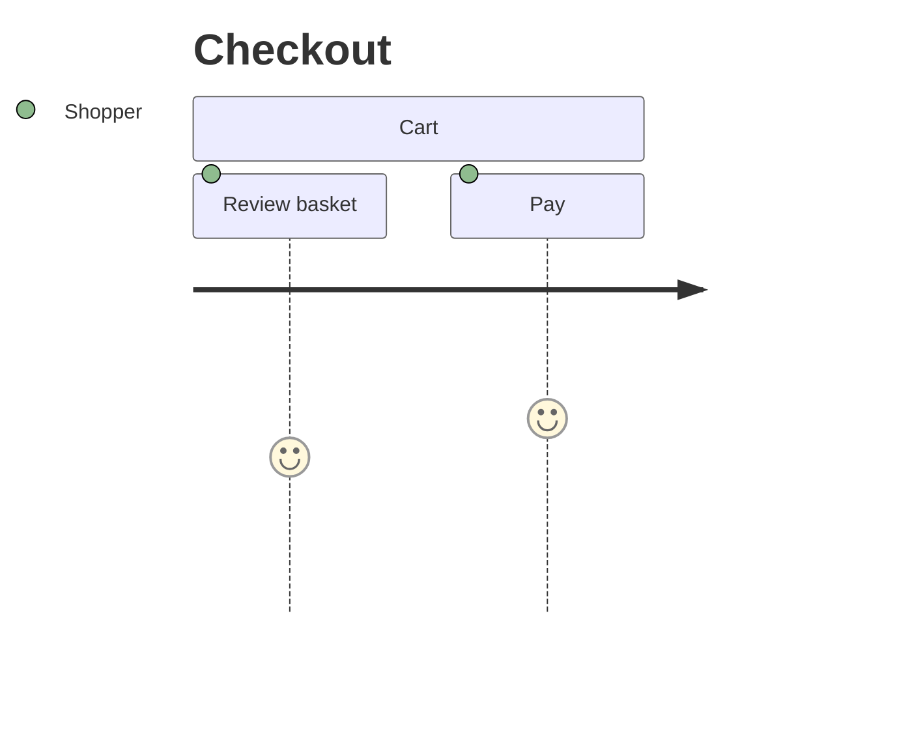

### XY chart

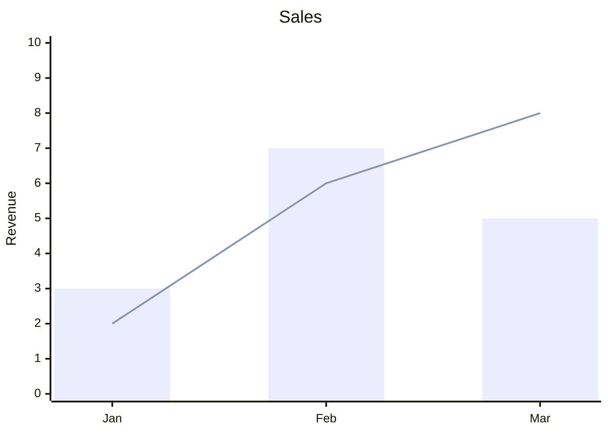

### Pie chart

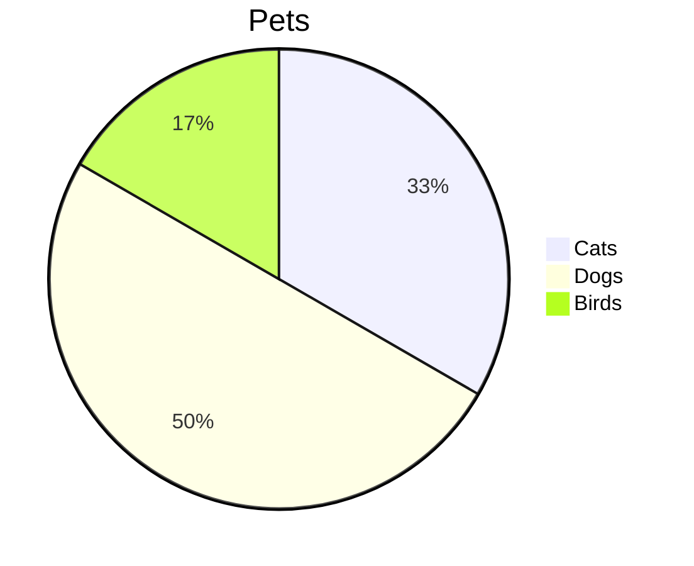

### Quadrant chart

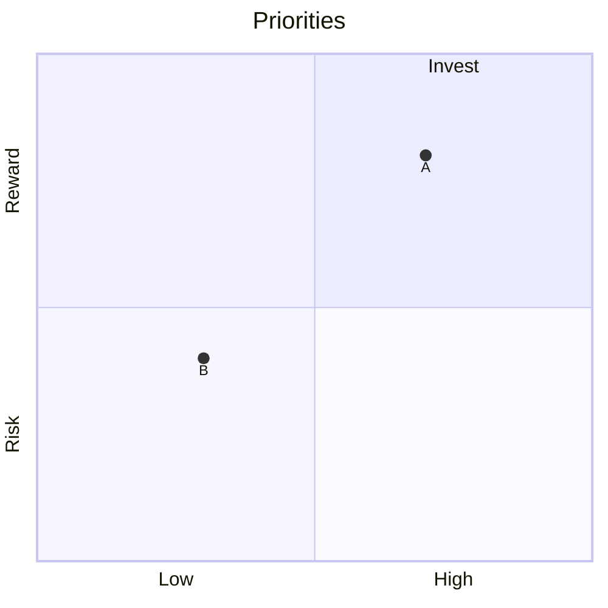

### Mindmap

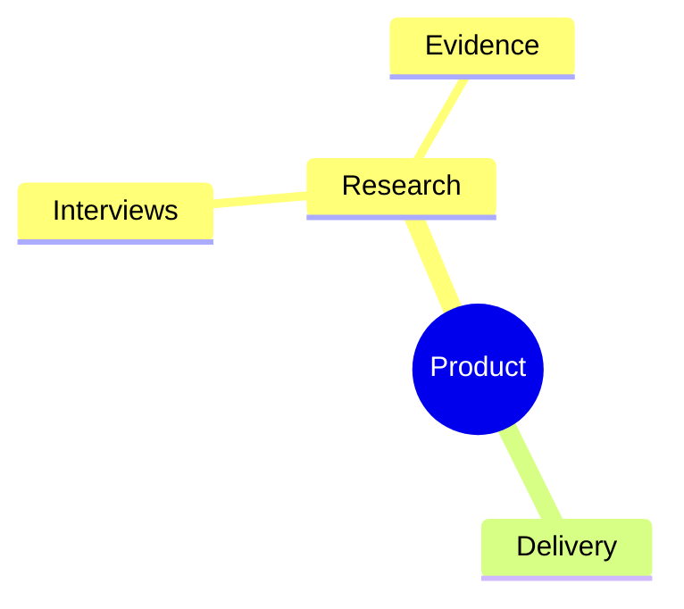

### GitGraph

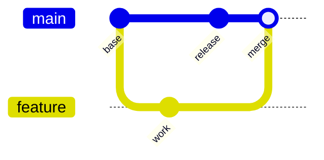

### Architecture diagram

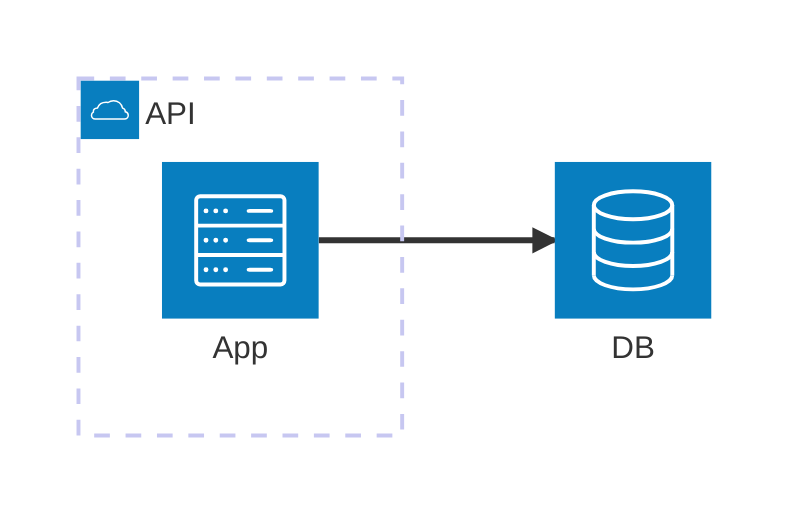

### Radar chart

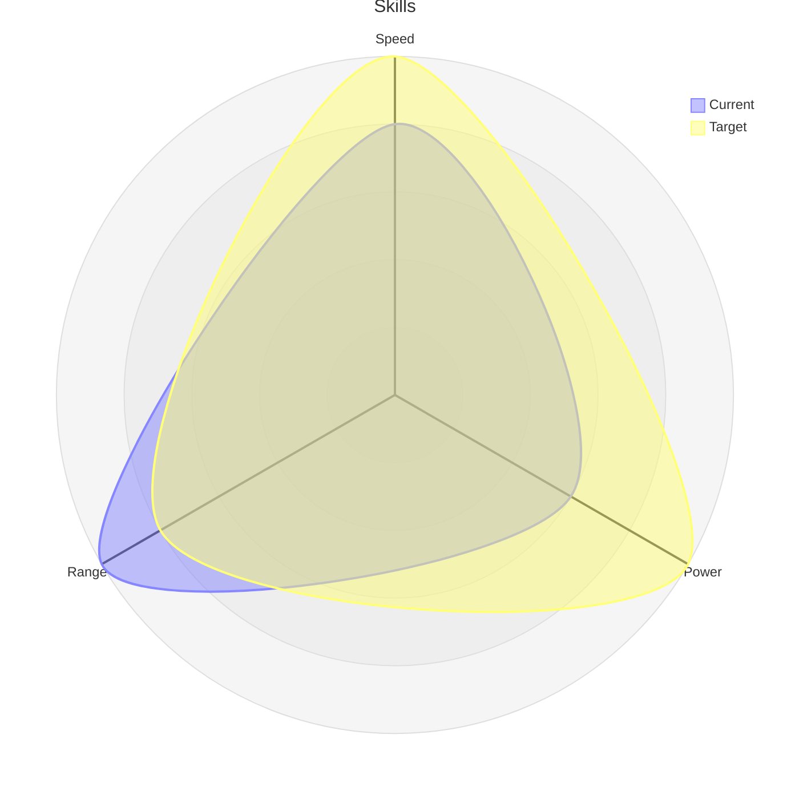
