# Visual quality characterisation

> Generated by `scripts/characterization/visual-quality.ts`. Do not edit by hand.

This is the approval layer for visual/layout quality. The SVG files are
human-inspectable snapshots; the hashes fingerprint the SVG and PNG surfaces;
the metrics are graph-drawing review signals (crossings, bends, canvas area,
label fit, and label-overlap risk), not standalone correctness laws.
`Label fit` is `n/a` for GitGraph because commit labels are external/rotated
annotations rather than text intended to fit inside the 20px commit glyph;
GitGraph label/canvas containment is gated separately by its layout tests.
For graph-projected route correctness, pair this report with PR 30's hard
gates: `src/__tests__/contact-sheet.test.ts`,
`src/__tests__/layout-rubric.test.ts`, and `bun run track`.

| Family | SVG snapshot | SVG SHA | PNG SHA | PNG bytes | SVG size | Layout bounds | Nodes/edges | Crossings | Bends | Route px | Area fill | Label fit | Label overlaps | Edge-label clearance | Aspect |
|--------|--------------|---------|---------|----------:|----------|---------------|-------------|----------:|------:|---------:|----------:|----------:|---------------:|---------------------:|-------:|
| Flowchart | [flowchart.svg](./visual-snapshots/flowchart.svg) | `4983df8f78e7` | `efb3e78c815f` | 9047 | 279.6835x434.582 | 280x435 | 4/4 | 0 | 0 | 533 | 15.5% | 100.0% | 0 | 7 | 0.64 |
| State diagram | [state.svg](./visual-snapshots/state.svg) | `73195d279a6e` | `1f59bfc45ea1` | 7355 | 241.14266666666668x375.15000000000003 | 241x375 | 5/5 | 0 | 6 | 628 | 11.3% | 100.0% | 0 | n/a | 0.64 |
| Sequence diagram | [sequence.svg](./visual-snapshots/sequence.svg) | `13354ecf04d5` | `b5ece80058b3` | 7249 | 420x286 | 420x286 | 3/4 | 0 | 0 | 560 | 8.0% | 100.0% | 0 | 10 | 1.47 |
| Class diagram | [class.svg](./visual-snapshots/class.svg) | `0f1fe2955a84` | `b320189fe7ab` | 3979 | 360x237.8 | 360x238 | 3/2 | 0 | 2 | 240 | 20.6% | 100.0% | 0 | n/a | 1.51 |
| ER diagram | [er.svg](./visual-snapshots/er.svg) | `3b3bb5da4863` | `a2df012af16e` | 9722 | 951.768x136 | 952x136 | 3/2 | 0 | 0 | 452 | 18.2% | 100.0% | 0 | 226 | 7.00 |
| Timeline | [timeline.svg](./visual-snapshots/timeline.svg) | `4a176ff40b69` | `980310c83398` | 8060 | 380x286.6 | 380x287 | 4/0 | 0 | 0 | 0 | 13.2% | 100.0% | 0 | n/a | 1.32 |
| Gantt chart | [gantt.svg](./visual-snapshots/gantt.svg) | `cf045c673ced` | `496e3981b186` | 10402 | 703x282 | 703x282 | 4/0 | 0 | 0 | 0 | 5.4% | 75.0% | 0 | n/a | 2.49 |
| User journey | [journey.svg](./visual-snapshots/journey.svg) | `405d59f1c89a` | `b3f684d932b1` | 15308 | 530x482.3 | 530x482 | 2/0 | 0 | 0 | 0 | 5.9% | 100.0% | 0 | n/a | 1.10 |
| XY chart | [xychart.svg](./visual-snapshots/xychart.svg) | `2e604e0ac7e0` | `faf9bea19236` | 18035 | 700x500 | 700x500 | 6/0 | 0 | 0 | 0 | 33.9% | 50.0% | 0 | n/a | 1.40 |
| Pie chart | [pie.svg](./visual-snapshots/pie.svg) | `df5f6a88f2ac` | `607032f63157` | 12092 | 368.79x276 | 369x276 | 3/0 | 0 | 0 | 0 | 4.1% | 100.0% | 0 | n/a | 1.34 |
| Quadrant chart | [quadrant.svg](./visual-snapshots/quadrant.svg) | `216bf17ccff0` | `937d8189a10b` | 9334 | 456x492 | 456x492 | 2/0 | 0 | 0 | 0 | 0.1% | 100.0% | 0 | n/a | 0.93 |
| Mindmap | [mindmap.svg](./visual-snapshots/mindmap.svg) | `fb6b9016051d` | `77ad6322234f` | 10766 | 445.654x173.8 | 446x174 | 5/4 | 0 | 8 | 342 | 21.8% | 100.0% | 0 | n/a | 2.56 |
| GitGraph | [gitgraph.svg](./visual-snapshots/gitgraph.svg) | `5148f25d317f` | `169ecec5fa42` | 13659 | 604.715x339.781 | 605x340 | 4/4 | 0 | 4 | 736 | 0.8% | n/a | 0 | n/a | 1.78 |
| Architecture diagram | [architecture.svg](./visual-snapshots/architecture.svg) | `b62df2307c70` | `2a5061b23be6` | 4211 | 414x188 | 414x188 | 2/1 | 0 | 0 | 78 | 14.8% | 100.0% | 0 | n/a | 2.20 |

## Sources

### Flowchart

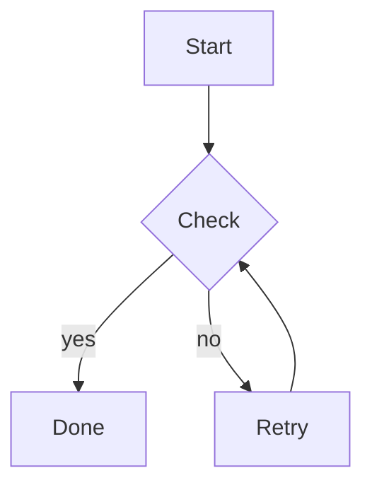

### State diagram

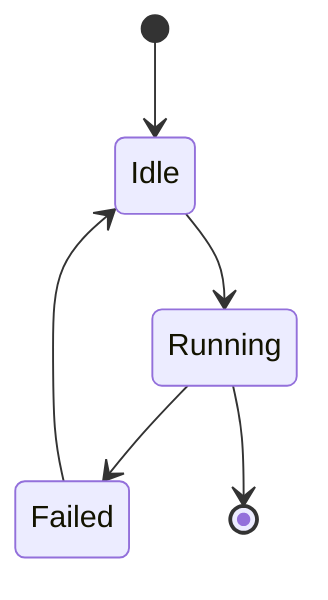

### Sequence diagram

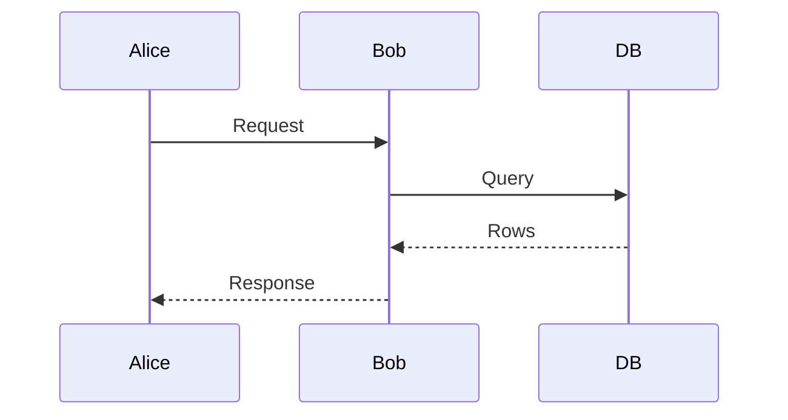

### Class diagram

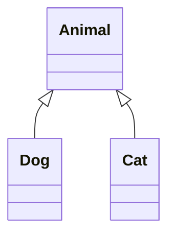

### ER diagram

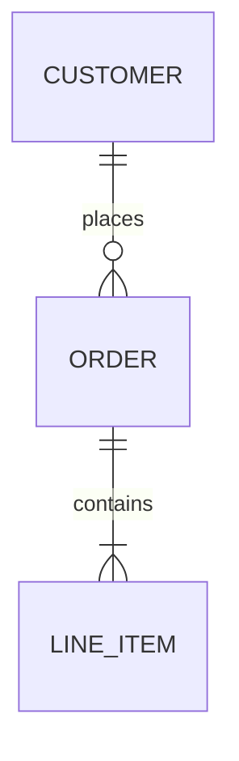

### Timeline

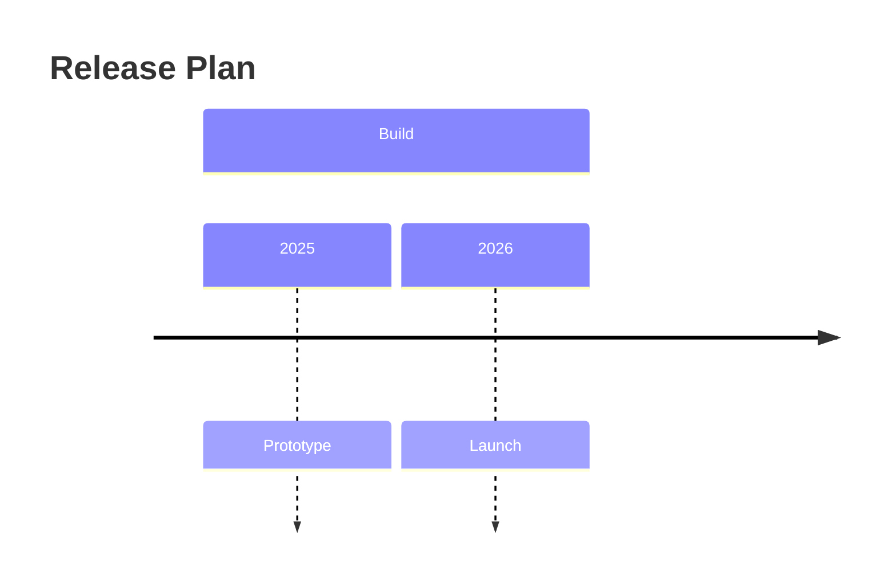

### Gantt chart

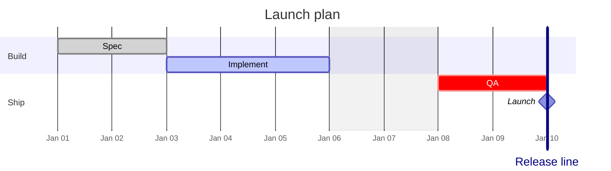

### User journey

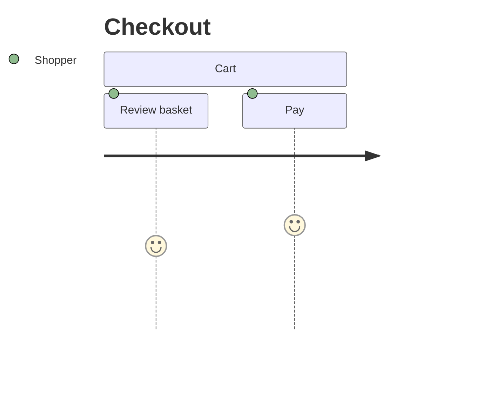

### XY chart

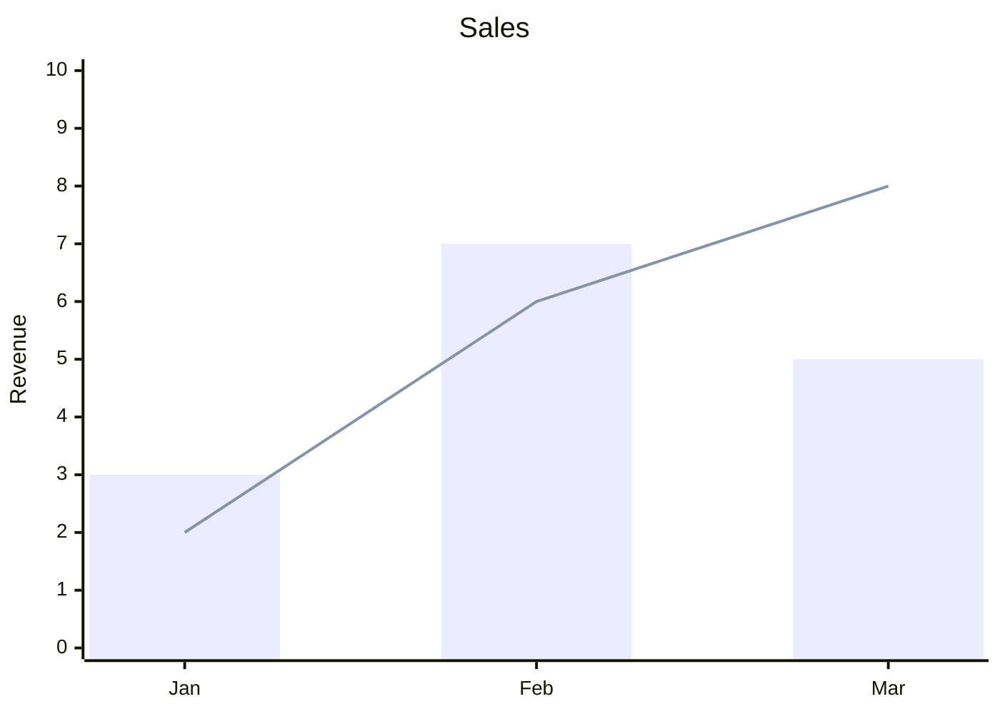

### Pie chart

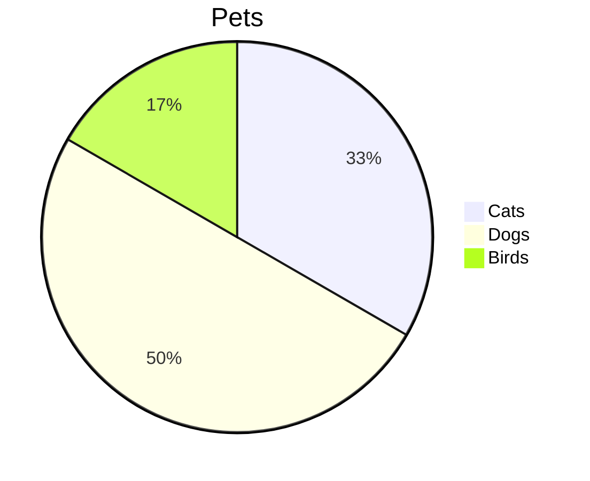

### Quadrant chart

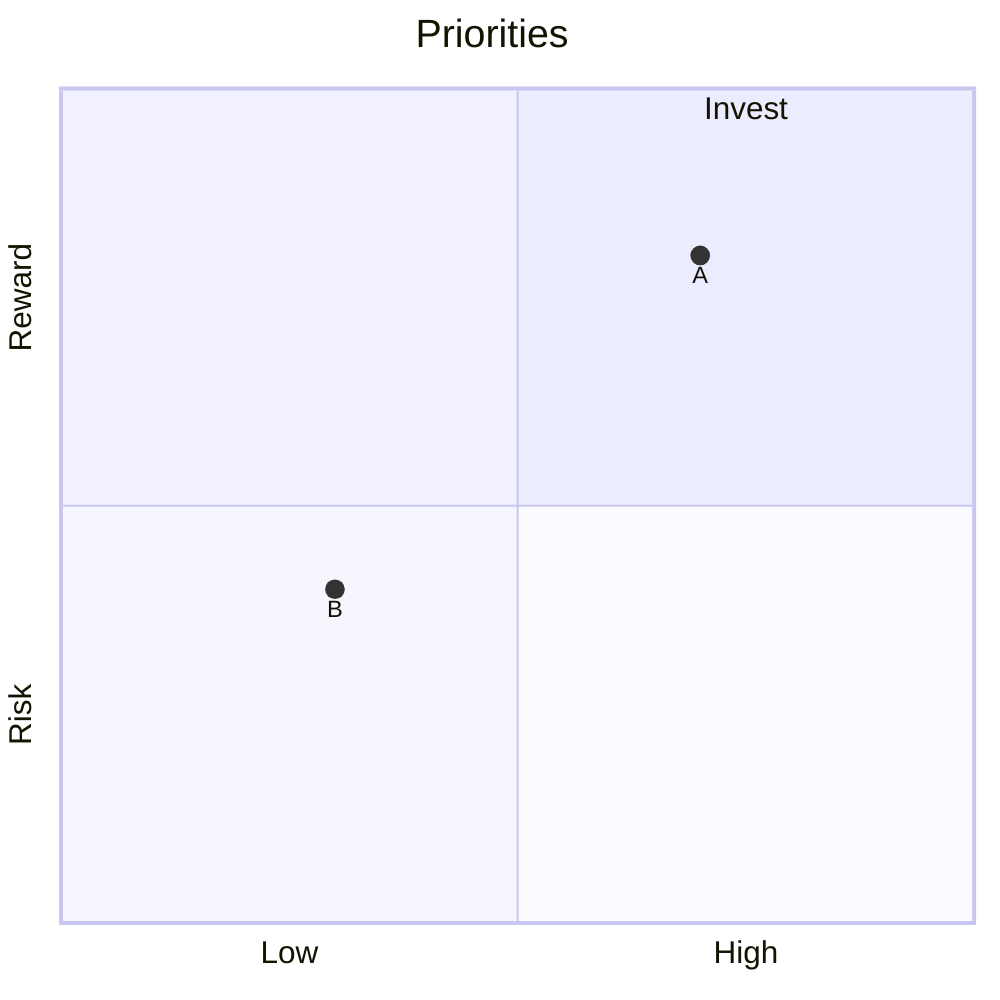

### Mindmap

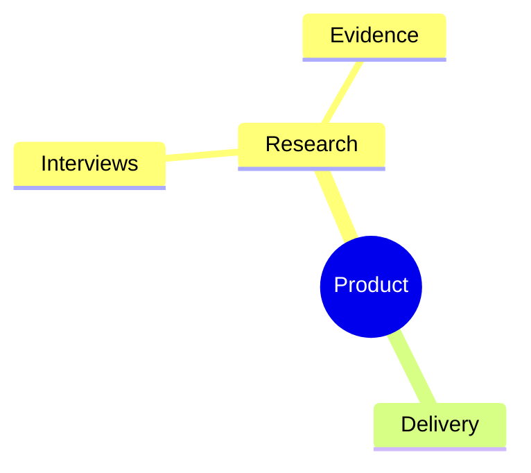

### GitGraph

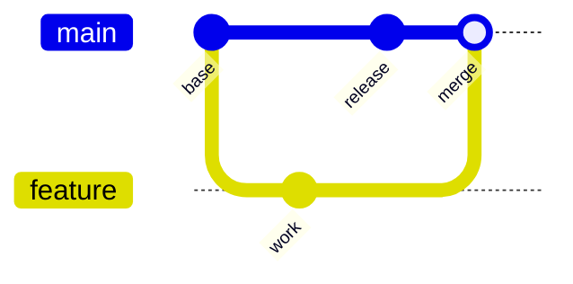

### Architecture diagram

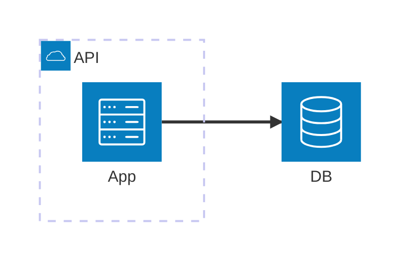
