# Visual quality characterisation

> Generated by `scripts/characterization/visual-quality.ts`. Do not edit by hand.

This is the approval layer for visual/layout quality. The SVG files are
human-inspectable snapshots; the hashes fingerprint the SVG and PNG surfaces;
the metrics are graph-drawing review signals (crossings, bends, canvas area,
label fit, and label-overlap risk), not standalone correctness laws.
For graph-projected route correctness, pair this report with PR 30's hard
gates: `src/__tests__/contact-sheet.test.ts`,
`src/__tests__/layout-rubric.test.ts`, and `bun run track`.

| Family | SVG snapshot | SVG SHA | PNG SHA | PNG bytes | SVG size | Layout bounds | Nodes/edges | Crossings | Bends | Route px | Area fill | Label fit | Label overlaps | Edge-label clearance | Aspect |
|--------|--------------|---------|---------|----------:|----------|---------------|-------------|----------:|------:|---------:|----------:|----------:|---------------:|---------------------:|-------:|
| Flowchart | [flowchart.svg](./visual-snapshots/flowchart.svg) | `c7309bf2da77` | `15045f285709` | 8930 | 279.6835x434.582 | 280x435 | 4/4 | 0 | 0 | 533 | 15.5% | 100.0% | 0 | 89 | 0.64 |
| State diagram | [state.svg](./visual-snapshots/state.svg) | `1c4a472c8c2f` | `c2729a406f0e` | 7382 | 241.14266666666668x375.15000000000003 | 241x375 | 5/5 | 0 | 6 | 628 | 11.3% | 100.0% | 0 | n/a | 0.64 |
| Sequence diagram | [sequence.svg](./visual-snapshots/sequence.svg) | `d4c56a07b76b` | `725fe413d753` | 7207 | 420x280 | 420x280 | 3/4 | 0 | 0 | 560 | 8.2% | 100.0% | 0 | 171 | 1.50 |
| Class diagram | [class.svg](./visual-snapshots/class.svg) | `61e6b7f26fa9` | `1e617c4a61a0` | 4047 | 360x237.8 | 360x238 | 3/2 | 0 | 2 | 240 | 20.6% | 100.0% | 0 | n/a | 1.51 |
| ER diagram | [er.svg](./visual-snapshots/er.svg) | `5598a5275602` | `a6962348dac3` | 9488 | 951.768x136 | 952x136 | 3/2 | 0 | 0 | 452 | 18.2% | 100.0% | 0 | 370 | 7.00 |
| Timeline | [timeline.svg](./visual-snapshots/timeline.svg) | `aa2f3660f25e` | `83efdfa14f76` | 7837 | 380x286.6 | 380x287 | 4/0 | 0 | 0 | 0 | 13.2% | 100.0% | 0 | n/a | 1.32 |
| Gantt chart | [gantt.svg](./visual-snapshots/gantt.svg) | `59c925d9736b` | `3195007323a1` | 9419 | 703x282 | 703x282 | 4/0 | 0 | 0 | 0 | 6.9% | 75.0% | 0 | n/a | 2.49 |
| User journey | [journey.svg](./visual-snapshots/journey.svg) | `6e7c7ec336ef` | `4d01b73acd56` | 9495 | 320x353.4 | 320x353 | 2/0 | 0 | 0 | 0 | 30.8% | 100.0% | 0 | n/a | 0.91 |
| XY chart | [xychart.svg](./visual-snapshots/xychart.svg) | `89848b33b2fb` | `b003ddcb84b9` | 15398 | 700x500 | 700x500 | 6/0 | 0 | 0 | 0 | 37.6% | 50.0% | 0 | n/a | 1.40 |
| Pie chart | [pie.svg](./visual-snapshots/pie.svg) | `0f86fa0f0d48` | `6fb477a893ab` | 10770 | 368.79x276 | 369x276 | 3/0 | 0 | 0 | 0 | 4.1% | 100.0% | 0 | n/a | 1.34 |
| Quadrant chart | [quadrant.svg](./visual-snapshots/quadrant.svg) | `17b8c9f88ad9` | `65e95a1c90d2` | 9396 | 456x492 | 456x492 | 2/0 | 0 | 0 | 0 | 0.1% | 100.0% | 0 | n/a | 0.93 |
| Architecture diagram | [architecture.svg](./visual-snapshots/architecture.svg) | `4241bc600b6e` | `5512686b7606` | 4266 | 414x188 | 414x188 | 2/1 | 0 | 0 | 78 | 14.8% | 100.0% | 0 | n/a | 2.20 |

## Sources

### Flowchart

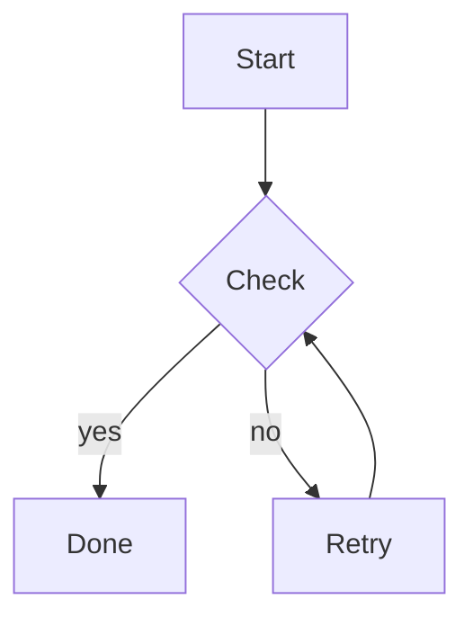

### State diagram

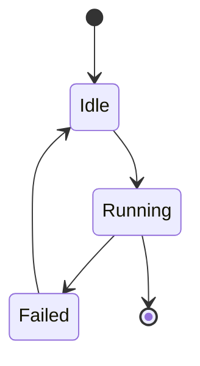

### Sequence diagram

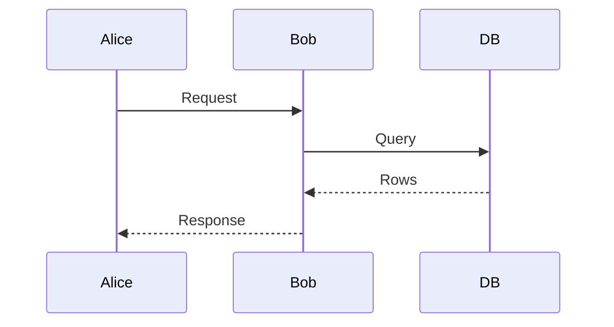

### Class diagram

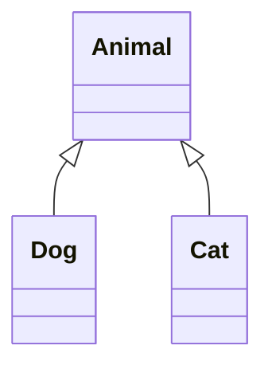

### ER diagram

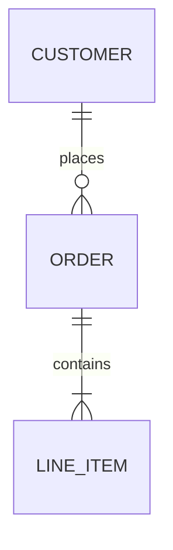

### Timeline

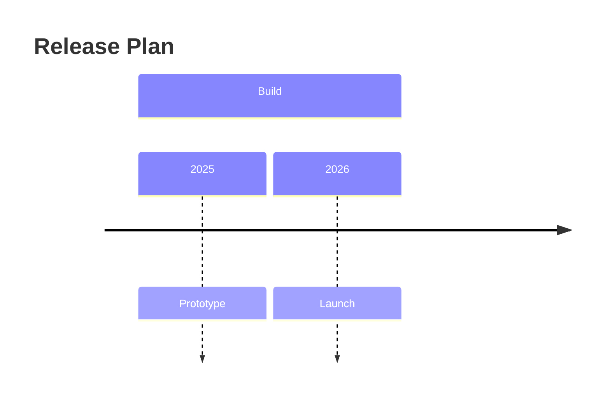

### Gantt chart

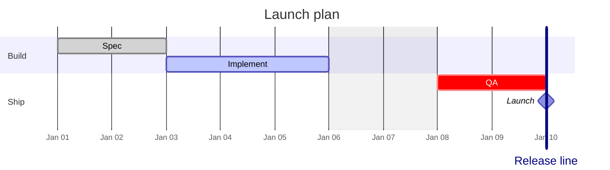

### User journey

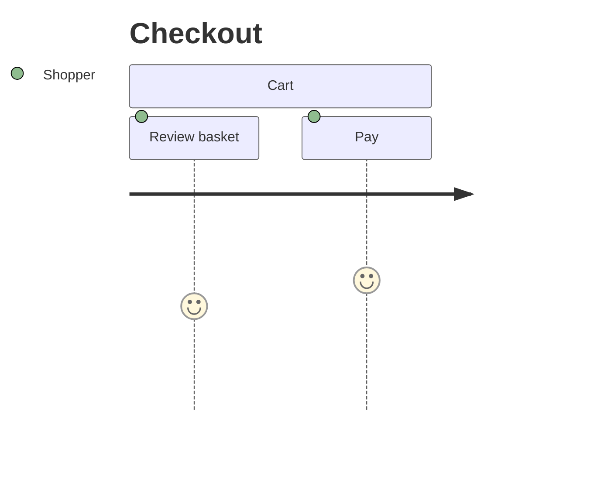

### XY chart

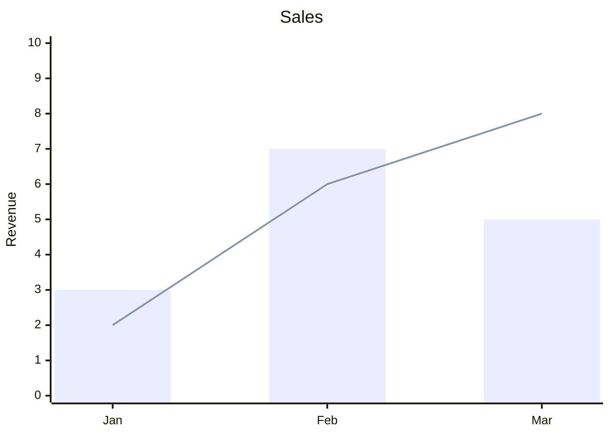

### Pie chart

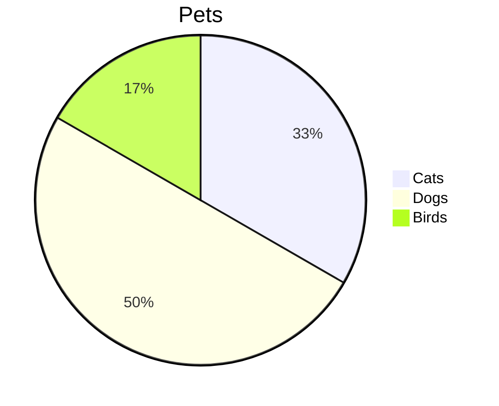

### Quadrant chart

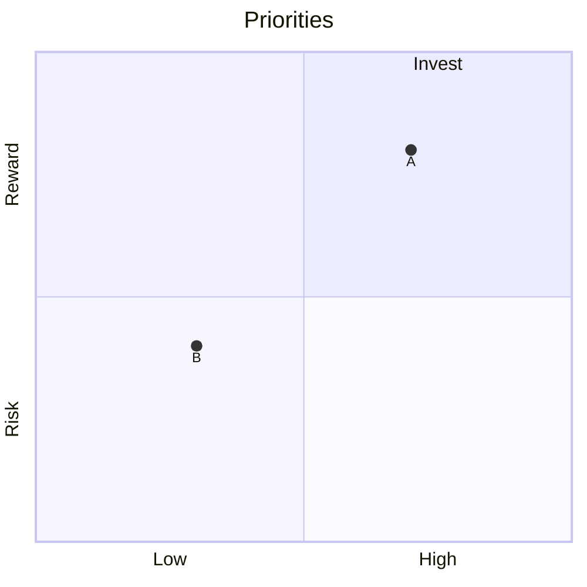

### Architecture diagram

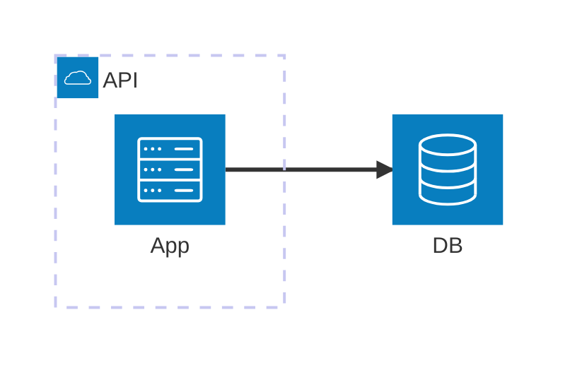
