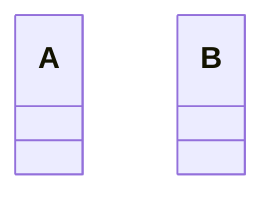

# Class safe-link hover text (#248)

Both SVG files come from the public `renderMermaidSVG` API for the same input:



The [before SVG](issue-248-class-tooltip-before.svg) was rendered at merged
base `2ee45b1f6803381db81d9402d3a4fa622895c576`; the
[after SVG](issue-248-class-tooltip-after.svg) was rendered on this branch.
Their static pixels are identical: an SVG `<title>` appears as native browser
hover text, not as visible diagram lettering. Inspect the Class `data-id="A"`
group in each SVG: before has no `<title>`; after contains
`<title>API reference</title>`. The regression test also checks the public
renderer, agent round-trip, and action sidecar for this same tooltip.

To reproduce either artifact from the corresponding checkout:

```sh
bun -e 'import { renderMermaidSVG } from "./src/index.ts"; process.stdout.write(renderMermaidSVG("classDiagram\nclass A\nlink A \"https://example.com/docs\" \"API reference\"\nclass B"));'
```
