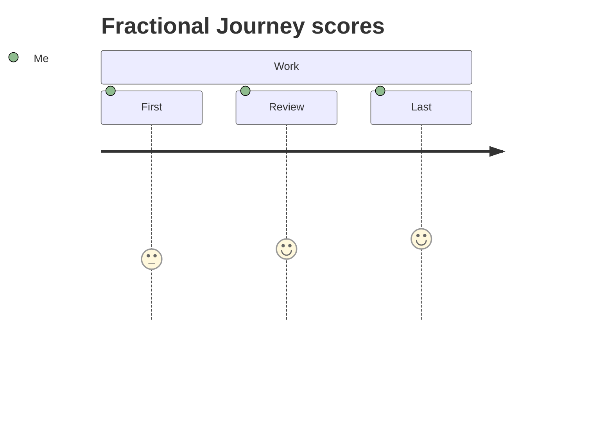

# Journey fractional score (#248)

The same source is used for the exact-base failure and new visual:



At merged base `49cbd03ac1a3df5c23920305a4bc424daa8e406f`, the public
renderer fails with `Journey task "Review" has invalid score 3.5. Expected an
integer from 1 through 5`. There is no successful before render. The
[after SVG](issue-248-journey-fractional-score-after.svg) and
[after PNG](issue-248-journey-fractional-score-after.png) are generated from
that source on this branch: Review has `data-score="3.5"` and its marker is
midway between the 3 and 4 score ticks.

Regenerate and verify the actual base failure plus new outputs with an
independent checkout at the pinned base:

```sh
bun run scripts/pr-assets/issue-248-journey-fractional-score.ts /path/to/base-checkout
```

The focused test also compares Mermaid 11.16's parsed task scores, checks
native/agent/serialization/mutation identity, and verifies terminal output
shows the exact fractional value rather than silently rounding it.
