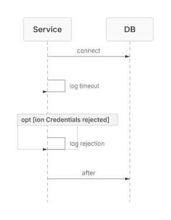
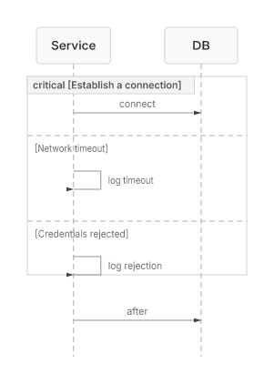

# Sequence critical/option boundary evidence (#264)

The [same authored source](issue-264-critical-option.mmd), SHA-256
`193ed956675811cf7bc8806954c097db61a9197b45f1208d71ab8e0abb82955a`,
was rendered with the public native SVG and PNG APIs at base
`e738265817243cec57503bcb9d6b4ffd64c4d711` and implementation
`fffa957dc7185ede4ed5b680aa31f039f7683700`. Both use the locked
dependencies, `renderMermaidSVG(source, { embedFontImport: false })` and
`renderMermaidPNG(source, { scale: 1 })`. The focused test byte-checks the
after artifacts against the production renderer.

| Before | After |
|---|---|
|  [Inspect SVG](issue-264-critical-option-before.svg) |  [Inspect SVG](issue-264-critical-option-after.svg) |

The old `opt` prefix match consumed `option` and left the `critical` opener
unclosed. The new shared keyword classifier gives each `option` to the open
critical block. The last `after` message remains outside the block in both
images as a control. The pinned Mermaid 11.16 DB independently classifies the
two `option` lines as `CRITICAL_OPTION`, and the focused test asserts the
native block type, message indexes, both divider labels, and agent-source
round trip. The old parser fails that test with a phantom `opt` block.

A semantic-audit follow-up also checks Mermaid's keyword boundary: labels may
start immediately with punctuation. The pinned upstream DB, native parser,
and agent round trip agree on `critical:C`, `option:retry`, `opt(foo)`, and
`par|label`; `optional` and `option_retry` remain non-keywords.
The audit also caught a legacy `par_over` projection that inserted a space
before punctuation; the regression test now pins its original raw suffix.

This proves this one keyword/continuation slice. Agent mutation still keeps
`critical` as an opaque block, and the broader lossless block-event authority
and `par_over` semantics remain open in #264.
