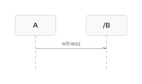
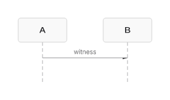

# Sequence half-arrow before/after (#264)

Both renders use [the same two-line Mermaid source](issue-264-half-arrow.mmd),
SHA-256 `28e4667701b0f2c4aaaf9b6335b0d1b5f5c40318418cd7fe1cd524340944d91b`.
The *before* renderer is base commit
`9c62f838f26366abd7f1f8e69eab7f8c6951656e`; the *after* renderer is
candidate commit `6c4d25dcaa599ec3649adf0c0ccad50208db3494`. Each checkout
uses its locked dependencies and public native renderer: `renderMermaidSVG(source,
{ embedFontImport: false })` for the linked SVG, and `renderMermaidPNG(source,
{ scale: 1 })` for the raster preview.

| Before | After |
|---|---|
|  |  |
| [Inspect source SVG](issue-264-half-arrow-before.svg) | [Inspect source SVG](issue-264-half-arrow-after.svg) |

Review cue: the old parser consumed `-|` and turned the remaining `/` into the
recipient ID `/B`; it selected a stroked top marker. The new parser keeps the
entire `-|/` token, addresses `B`, and selects a filled bottom-half polygon.
The SVGs expose `data-to`, `data-end-head`, and the actual marker geometry; the
PNG previews confirm what is visible at the same scale. The sixteen-token
regression matrix independently checks lexical, mutation, and paint contracts.

This is one discriminating witness, **not** a receipt for the whole official
supported-arrow-types section. That public capability remains unclaimed until
the broader Sequence convergence work is complete.
