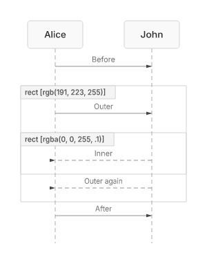
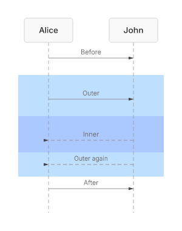

# Sequence rect background paint evidence (#264)

The [same authored source](issue-264-rect-color.mmd), SHA-256
`87cf61d07b230b64f953f8e6005d5c0d78e39b34c264dfcec1f5e892efcb7e80`,
was rendered through the public SVG and PNG APIs before this slice at
`c70df957903931c1aa8363822fafb11a29196700` and after the rect-paint
implementation. Both renderings use locked dependencies,
`renderMermaidSVG(source, { embedFontImport: false })`, and
`renderMermaidPNG(source, { scale: 1 })`. The focused test byte-checks the
after artifacts against the production renderer.

| Before | After |
|---|---|
|  [Inspect SVG](issue-264-rect-color-before.svg) |  [Inspect SVG](issue-264-rect-color-after.svg) |

The pinned Mermaid 11.16 parser DB independently emits two `RECT_START`
events whose payloads are the RGB and RGBA colors, followed by matching
`RECT_END` events. The native model now carries color separately from a
header label, projects it into typed Scene paint and SVG, and paints nested
backgrounds outer-first. Agent parsing retains the block as an opaque,
lossless source segment and later messages remain structured. Safe concrete
color syntax is admitted; malformed or fetching paint fails with the named
`SEQUENCE_RECT_COLOR_UNSUPPORTED` error rather than entering SVG.

This proves rect background paint and explicit invalid-paint disposition in
this source class. It does not claim the full lossless Sequence block-event
authority or nested block mutation required to close #264.
