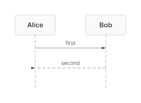

# Sequence semicolon statement evidence (#264)

Both runs use [the same one-line Mermaid source](issue-264-separator.mmd),
SHA-256 `30e64bc3a5b9ff67b3475d5a9785bfd780e02f1e0650ff7672e113c31089b81c`.
The *before* renderer is the merged base
`8399250bd749a7cb58103cf6bab0c3bd593e466a`; the *after* image was
captured at implementation commit `0b73520b39002776538b9c52e60af9784704ec93`.
The focused regression test checks that the after SVG and PNG remain
byte-identical to the current production renderer after subsequent fixes.
Each checkout uses its locked dependencies and the public native renderer:
`renderMermaidSVG(source, { embedFontImport: false })` and
`renderMermaidPNG(source, { scale: 1 })`.

| Before | After |
|---|---|
| [Inspect actual empty SVG](issue-264-separator-before.svg): `width="0" height="0" viewBox="0 0 0 0"`, no actors or messages. The production PNG path throws `RangeError: SVG root viewBox must contain four finite values with positive bounds for PNG rasterization`; there is no legitimate before PNG. |  [Inspect SVG](issue-264-separator-after.svg) |

The original single physical line was treated only as a header by native
rendering, despite carrying participants and messages. The shared splitter
now yields the same actor IDs, labels, message order, arrow paint, and SVG
endpoints as newline-separated statements. The focused red/green suite also
checks agent serialization, entity punctuation, block continuations, comments,
actor metadata, and accessibility text. This witness proves the separator
slice, not the full lossless Sequence block authority; #264 stays open.
