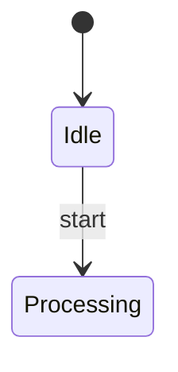

Agentic Mermaid subagent prompt eval.
Use one fresh subagent per request when your harness supports subagents. The request file is the complete parent-visible task. Save the raw response exactly; the finalize step gates it with the deterministic Agentic Mermaid oracle.

Mode: raw chat prompt. Follow the agent-facing surface under test as a normal third-party coding agent would. Do not return Code Mode JavaScript unless the prompt itself requires it.

Agent-facing surface under test (homepage):
The homepage prompt under test is normally fetch-only. For this run the exact body of https://agentic-mermaid.dev/start.md is inlined below; do NOT fetch that URL — follow the inlined protocol as if fetched.

These are the official Agentic Mermaid agent instructions. The facts below are validated against the shipped package; `/llms.txt` and `/capabilities.json` mirror them if you need to confirm authenticity. Do the work yourself — do not ask the user to run commands unless authorization or secrets require it.

## Step 1 — Establish one channel

Do not assume this repository is checked out. Use one channel available to you — pick the first that actually exists and stop probing, so you spend your turns on the diagram, not on tool exploration:

1. **Library imports, when available** (if you can run JS/TS): `parseRegisteredMermaid`, `verifyMermaid`, `serializeMermaid`, `mutate`, `buildMermaid`, the `as*` helpers, and the op-discovery helpers `describeOps(family)` / `opSignatures(family)` (exact op fields, enum values, and constraint notes) from `agentic-mermaid/agent` when it is installed, or from this repo's `./src/agent/index.ts` when the repo is checked out.
2. **CLI:** `am …` or `npx agentic-mermaid …`.
3. **the hosted MCP at `https://agentic-mermaid.dev/mcp`** — stateless streamable HTTP JSON-RPC, no initialize handshake. Tools: `execute`, `describe_sdk`, `render_svg`, `render_ascii`, `render_png`, `verify`, `describe`, `mutate`, `build` (64 KB input cap; the whole POST body is capped at 128 KB). `describe_sdk` returns compact signatures or exact fields for one family. `mutate` (edit a `source`) and `build` (author from a `family`) apply a JSON op list declaratively and return `{ ok, family, source, verify }` — prefer them for structured edits and reserve `execute` for logic the ops don't express. Call shape: `POST /mcp` with `content-type: application/json` and body `{"jsonrpc":"2.0","id":1,"method":"tools/call","params":{"name":"verify","arguments":{"source":"flowchart TD\n  A --> B"}}}`.

Chat-only with no shell or sandbox: use the hosted MCP over HTTP. The website exposes no REST render API — `/mcp` speaks MCP only. Note the nine tools above are the **hosted** endpoint's; the **local** stdio server (`agentic-mermaid-mcp`, e.g. from `am init-agent`'s `.mcp.json`) exposes only `execute`, `describe_sdk`, `render_png`, and `describe` — for `verify`/`mutate`/`build`/`render_svg` locally, call the SDK inside `execute` or use the library/CLI.

**Confidentiality:** the hosted MCP, and any `npx`/`npm` install traffic, leave the machine. If Task or Context holds private, internal, or proprietary material, prefer a local channel and treat the hosted MCP as opt-in.

## Step 2 — Learn the surface (version-matched)

- **Operations, families, warning codes:** run `am capabilities --json` when the CLI is installed — it matches your exact version, so prefer it — otherwise fetch `https://agentic-mermaid.dev/capabilities.json`. Each family entry carries `headers` (the keyword to open with), `example` (canonical syntax for that family), and `opFields` (every op's exact field names, required-ness, and enum values) — read these before authoring or editing so you don't guess field shapes — several are not guessable (a series' type field is `kind2`, not `kind`; a gantt task `start` accepts `after <taskId>`).
- **Full operating guide and authoring facts:** `https://agentic-mermaid.dev/agent-instructions.md`.

Flowchart essentials: quote any label carrying punctuation (`id["HTTPS /api/sessions*"]`); `\n` inside a quoted label is a line break and canonicalizes to `<br>` on serialize; `subgraph id["Title"] … end` groups nodes; edges are `A -- "label" --> B`, `A -.-> B`, and `A -. "label" .-> B`. Discover the current family roster and each family's exact syntax through `am capabilities --json` or `capabilities.json`; do not rely on a copied list.

## Step 3 — Do the task (the one safe loop)

- **For a new diagram, author Mermaid source directly** from the Context — or build it with `buildMermaid(kind, ops)` — then parse it. No mutation ceremony. Match the family to the request and open with that family's own header keyword (from `capabilities.json` `families[].headers`, e.g. `architecture-beta`, `classDiagram`, `stateDiagram-v2`) — do not default to `flowchart`/`graph`. For the family's exact edge/relationship syntax, read its `example` in `capabilities.json` (only flowchart's is spelled out below); e.g. class inheritance is `Base <|-- Derived`, ER cardinality is `A ||--o{ B : label`, architecture edges are `api:R --> L:db`.
- **For an existing diagram, parse it,** narrow with the matching `as*` helper (`asFlowchart`, `asSequence`, `asGantt`, …), and prefer the smallest `mutate(...)` operation over rewriting source. Inside `execute`, call `mutate(...)` once per op on the parsed diagram — do not hand-assemble a new source string, even for a trivial-looking edit. State diagrams narrow via `asState` (not `asFlowchart`). Mutation ops use a `kind` discriminator (for example `{ kind: "add_edge", from, to, label }`). An op array handed to `mutate` is rejected. Library callers can batch with `applyOps({ source, ops })`; hosted MCP callers can use the declarative `mutate` tool. Code Mode intentionally exposes neither of those batch wrappers, so repeat `mermaid.mutate(d, op)` there.
- If no typed operation fits, make the smallest source-level edit and say `source-level fallback`.

## Step 4 — Verify before you return

Run `verifyMermaid` at every commit point; never serialize a diagram whose verify result you have not inspected. Warnings are signals, not commands: `LABEL_OVERFLOW` counts the longest rendered line (default cap 40) — raise the cap (`verifyMermaid(d, { labelCharCap: N })`, `am verify --label-cap N`) for intentionally long labels rather than truncating the user's text. If no Agentic Mermaid channel is available, do not fabricate verification: return the best source, say `not verified — Agentic Mermaid unavailable` with what you tried, and treat non-flowchart families with extra caution since their syntax is likelier to drift.

Before returning, confirm the specific change the task asked for is actually present. `verify.ok` is structural; it does not check that you made the right edit. A diagram can verify yet be the wrong family or shape: read it back with `describe` and compare to the request, and if it does not match — or a family's syntax keeps failing — consult that family's `example` in `capabilities.json` and redo rather than settling for a verifying-but-wrong diagram. For a new diagram, also confirm it parsed **structured**, not opaque: the matching `as*` helper (`asXyChart`, `asClass`, …) returns the typed body, and returns `null` when your syntax fell to the source-level/opaque path (a `UNSUPPORTED_SYNTAX` warning names it) — an opaque body still renders but cannot be edited with typed ops, so fix the syntax against the family `example` rather than shipping something that only renders.

## Grounding and scope

If the diagram describes a repository, codebase, or URL you can inspect, read the real source first. Every node and edge must trace to the supplied Context or to something you inspected — do not invent nodes or relationships; mark uncertain ones (dotted edge, `?` in the label) or leave them out. When Context enumerates specific entities, steps, or relationships, model each one as its own node/edge — do not merge or drop described elements to simplify. If Context omits the abstraction level or scope, take the smallest consistent reading, keep the whole diagram at one abstraction level, and state your assumptions in Verification. When the diagram is based on inspected source, add a Sources section listing the files.

## Return

- **In chat:** return exactly `Updated Mermaid` (only the final source in a ```mermaid fence — no SVG/PNG/ASCII unless requested), `Verification`, and `Trace`. In Trace, name the channel and the calls/ops you actually ran — plus `Sources` when you inspected source.
- **In `execute(code)`:** return an object with `{ source }` after verification, or `{ error, warnings }`; do not return prose from inside code.

Do not modify project files unless the user explicitly asked to change files.

Task ID: state_add_done_transition
Task prompt under test:
Follow the start.md protocol inlined above; do not fetch it.

Task:
Add a done transition from Processing to [*] using structured mutation, verify, then serialize.

Context:
The state diagram already has a start state and Processing state. Add the completion path without changing existing transitions.

Mermaid source (for edits; leave blank for a new diagram):


If any `<…>` placeholder above is still unreplaced, do not author a generic diagram — reply asking for the missing details.

Return the human-facing response requested by the prompt.
