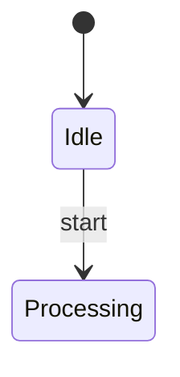

Agentic Mermaid subagent prompt eval.
Use one fresh subagent per request when your harness supports subagents. The request file is the complete parent-visible task. Save the raw response exactly; the finalize step gates it with the deterministic Agentic Mermaid oracle.

Mode: raw chat prompt. Follow the agent-facing surface under test as a normal third-party coding agent would. Do not return Code Mode JavaScript unless the prompt itself requires it.

Agent-facing surface under test (homepage):
The populated homepage prompt appears under “Task prompt under test” below. Do not use any other product guidance.

Task ID: state_add_done_transition
Task prompt under test:
Create or edit a Mermaid diagram with Agentic Mermaid.

Task:
Add a done transition from Processing to [*] using structured mutation, verify, then serialize.

Context:
The state diagram already has a start state and Processing state. Add the completion path without changing existing transitions.

Mermaid source (for edits; leave blank for a new diagram):


If any `<…>` placeholder above is still unreplaced, do not author a generic diagram — reply asking for the missing details.

Environment:
- Do not assume this repository is checked out. Use one channel available to you: installed `agentic-mermaid/agent`, this repo's `./src/agent/index.ts`, the CLI (`am` or `bun run bin/am.ts`), self-hosted MCP Code Mode, or the hosted MCP at `https://agentic-mermaid.dev/mcp` (stateless streamable HTTP JSON-RPC). The website exposes no REST render API — `/mcp` speaks MCP only.
- Probe once, in order: (1) import `agentic-mermaid/agent`, (2) `am capabilities --json` (or `npx agentic-mermaid capabilities --json`), (3) the hosted MCP. Use the first channel that responds and stop discovering — spend your turns on the diagram, not on tool exploration.
- Hosted MCP call shape (stateless, no initialize handshake needed): POST to `https://agentic-mermaid.dev/mcp` with `content-type: application/json` and body `{"jsonrpc":"2.0","id":1,"method":"tools/call","params":{"name":"verify","arguments":{"source":"flowchart TD\n  A --> B"}}}`. Tools: `execute`, `render_svg`, `render_ascii`, `render_png`, `verify`, `describe` (64KB input cap).
- If no Agentic Mermaid channel is available (local or the hosted MCP), do not fabricate verification; return the best Mermaid source and say `not verified — Agentic Mermaid unavailable` with what you tried. You may run a clearly labeled secondary check (for example another Mermaid parser) and report it as secondary, never as Agentic Mermaid verification.
- Library imports, when available: `parseMermaid`, `verifyMermaid`, `serializeMermaid`, `mutate`, and `as*` helpers from `agentic-mermaid/agent`.

Authoring facts (already verified — do not spend turns rediscovering them):
- Families: flowchart, sequence, state, class, ER, journey, timeline, gantt, pie, quadrant, xychart, architecture.
- Flowchart syntax that parses, renders, and round-trips: `subgraph id["Title"] … end`; quoted labels for punctuation (`id["HTTPS /api/sessions*"]`); multi-line labels via `\n` inside a quoted label (canonical form is `<br>`); labeled edges `A -- "label" --> B`; dotted edges `A -.-> B` and `A -. "label" .-> B`.
- Warnings never flip `verify.ok` unless their severity is error. `LABEL_OVERFLOW` counts total label characters, line breaks included (default cap 40, not per rendered line); when long labels are intentional, raise the cap (`verifyMermaid(d, { labelCharCap: N })`, `am verify --label-cap N`) and say so in Trace — do not truncate the user's text to silence the warning.
- CLI verification: `am verify <file> --json` (exit 3 only on error-severity findings); `am render <file> --format ascii` is a fast visual sanity check.

Grounding and scope:
- If the diagram describes a repository, codebase, or URL you can access, inspect the actual source first. Every node and edge must be traceable to the supplied context or to something you inspected — do not invent nodes or relationships. Mark uncertain relationships (dotted edge, `?` in the label) or leave them out.
- If Context does not state the abstraction level (system architecture, data flow, implementation detail, class model), the required entities and relationships, or things to omit, choose the smallest consistent reading, keep the whole diagram at one abstraction level, and state your assumptions in Verification.
- When the diagram is based on inspected source, add a Sources section after Trace listing the files or paths that back the main nodes.

Workflow:
1. For a new diagram, author Mermaid source directly from the supplied context, then parse it with `parseMermaid`.
2. For an existing diagram, parse it, narrow with the matching `as*` helper (`asFlowchart`, `asSequence`, `asGantt`, etc.), and prefer the smallest `mutate(...)` operation.
3. Mutation ops use a `kind` discriminator (for example `{ kind: "add_edge", from, to, label }`). Discover exact ops from local types, `am capabilities --json`, or `/capabilities.json` when present.
4. If no typed operation fits, or no Agentic Mermaid channel is available, make the smallest source-level edit and say `source-level fallback`.
5. Run `verifyMermaid` on the final diagram or source. If structural warnings remain after one mechanical fix attempt, return the warnings instead of guessing.
6. Return mode:
   - In chat, return exactly these sections: Updated Mermaid, Verification, Trace (plus Sources when Grounding and scope requires it).
   - In self-hosted MCP/Code Mode `execute(code)`, return an object with `{ source }` after verification, or `{ error, warnings }`; do not return prose from inside code.
7. In Updated Mermaid, include only the final Mermaid source in a ```mermaid fence. Do not return SVG, PNG, ASCII, or Unicode unless requested.
8. In Trace, name the channel and exact calls/ops used: `parseMermaid`, the `as*` helper, `mutate({ kind: ... })`, `verifyMermaid`, and `serializeMermaid`; for new diagrams say `no mutate`. If no channel was available, Trace instead names the channels you probed and any secondary check you ran.

Do not modify project files unless the user explicitly asked you to change files.

Return the human-facing response requested by the prompt.
