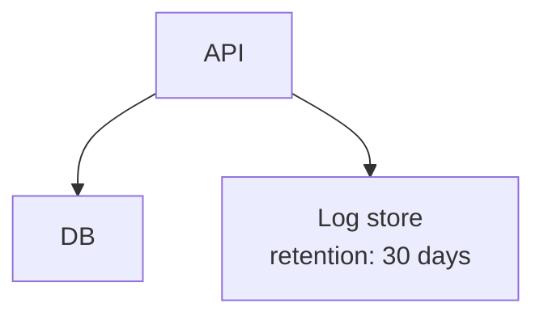

Agentic Mermaid subagent prompt eval.
Use one fresh subagent per request when your harness supports subagents. The request file is the complete parent-visible task. Save the raw response exactly; the finalize step gates it with the deterministic Agentic Mermaid oracle.

Mode: raw chat prompt. Follow the agent-facing surface under test as a normal third-party coding agent would. Do not return Code Mode JavaScript unless the prompt itself requires it.

Agent-facing surface under test (instructions):
# Instructions_for_agents.md

# Agentic Mermaid — agent-use guide

This is the canonical agent-use guide. The same content is emitted by `am --agent-instructions`. A doc-sync test asserts the two are byte-identical.

## Quick start

Choose the narrowest channel. New diagrams: author Mermaid source directly, then parse/verify/render. Existing structured diagrams: parse → narrow → mutate → verify → serialize. Code Mode/library are best for multi-step edits; CLI is best for one-shot verify/render/preview. Code Mode exposes `mermaid.*`; library users import the same names from `agentic-mermaid/agent`. A hosted MCP at `agentic-mermaid.dev/mcp` (stateless Streamable HTTP JSON-RPC) exposes six tools — `execute` (Code Mode), `render_svg`, `render_ascii`, `render_png`, `verify`, `describe` — with 64KB input caps; the call shape is a plain POST (stateless, no initialize handshake): `POST /mcp` with `content-type: application/json` and body `{"jsonrpc":"2.0","id":1,"method":"tools/call","params":{"name":"verify","arguments":{"source":"flowchart TD\n  A --> B"}}}`. Prefer the local library, CLI, or a self-hosted MCP and reach for the hosted endpoint only when you cannot install. Agentic Mermaid outputs ASCII, PNG, and SVG; Unicode text and JSON layout are also available. Flowchart authoring facts: quote any label carrying punctuation (`id["HTTPS /api/sessions*"]`); `\n` inside a quoted label is a line break and canonicalizes to `<br>` on serialize; `subgraph id["Title"] … end` groups nodes; labeled and dotted edges are `A -- "label" --> B`, `A -.-> B`, and `A -. "label" .-> B`.

```ts
const source = 'flowchart TD\n  API --> DB'
const d0 = mermaid.parseMermaid(source)
if (!d0.ok) throw new Error('parse')

const flow = mermaid.asFlowchart(d0.value)
if (!flow) return { phase: 'narrow', family: d0.value.kind }

const d1 = mermaid.mutate(flow, { kind: 'add_node', id: 'Cache', label: 'Cache' })
if (!d1.ok) throw new Error('mutate')

const verify = mermaid.verifyMermaid(d1.value)
if (!verify.ok) return { phase: 'verify', warnings: verify.warnings }

return { source: mermaid.serializeMermaid(d1.value) }
```

Use `asFlowchart` / `asState` / `asSequence` / `asTimeline` / `asClass` / `asEr` / `asJourney` / `asArchitecture` / `asXyChart` / `asPie` / `asQuadrant` / `asGantt` before mutating existing diagrams. State diagrams own a dedicated body: `asState` narrows them and state-shaped ops (`add_state`, `add_transition`, `make_composite`, …) apply; `asFlowchart` returns null on a state diagram. Sequence diagrams are segment-preserving: one with `Note`/`alt`/`loop`/`par`/`activate`/`autonumber`/`title` still narrows via `asSequence` and keeps its participant/message ops while those unmodeled lines ride along verbatim; `remove_message`/`set_message_text` indexes address only top-level messages (messages inside an `alt`/`loop` block are not touched); only an un-segmentable sequence (e.g. an unbalanced `end`) falls back to opaque. Gantt charts are segment-preserving too: title/section/task ops stay live while calendar directives (`dateFormat`, `excludes`, …), `click` lines, and comments ride along verbatim; gantt rendering never reads the wall clock — pass `ganttToday` to draw the today marker. In Code Mode, SDK-returned diagrams are read-only; structured edits must go through `mermaid.mutate`. Opaque-fallback bodies (any unmodeled syntax) round-trip losslessly as source-level bodies but do not expose structured mutation; return an unsupported-family result unless the task explicitly asks for source-level editing, then re-parse and verify before returning.

## The verify-before-commit rule

Run `verifyMermaid` at every commit point — anywhere the result would be saved, sent, or shown. For new diagrams, verify the authored source. For existing diagrams, verify after mutation and before serializing. You may batch several `mutate` calls between verifications, but never serialize a `ValidDiagram` whose `verify` result you have not inspected. `verify.ok` is structural, not a visual-quality score; inspect `verify.layout`, render artifacts, or PNG/SVG screenshots for visual tasks.

## Tier 1 vs Tier 2 vs Tier 3 warnings

Tier 1 (structural, reliable, universal): `EMPTY_DIAGRAM`, `EDGE_MISANCHORED`, `OFF_CANVAS`, `GROUP_BREACH`, `UNKNOWN_SHAPE`, `LABEL_OVERFLOW` (source-based char-count check over the total label — line breaks included, not per rendered line; default cap 40, raise via `labelCharCap` / `am verify --label-cap N` when long labels are intentional instead of truncating the user's text), `UNRESOLVABLE_SCHEDULE` (gantt: parses but the schedule cannot resolve — render would fail; `reason` names the `GANTT_*` error), `RENDER_FAILED` (any family: the source verifies structurally but the strict render parser throws, so rendering would fail; `reason` carries the renderer error — a clean verify proves the diagram actually renders). Applies to every family. Never suppress Tier 1 errors.

Tier 2 (geometric, advisory, flowchart-specific): `NODE_OVERLAP`, `ROUTE_SELF_CROSS`, plus the route-contract tripwires `ROUTE_HITCH`, `ROUTE_UNEXPLAINED_BEND`, `ROUTE_LABEL_ON_SHARED_TRUNK`, `ROUTE_CONTAINER_MISANCHOR`, `ROUTE_SHAPE_MISANCHOR`, `ROUTE_STALE_AFTER_NODE_MOVE` (docs/design/system/route-contracts.md — the layout pipeline upholds these itself, so they fire only on pipeline regressions). Route tripwires fire for flowchart/state; class and ER additionally run boundary-anchor and overlap checks (`ROUTE_SHAPE_MISANCHOR`, `NODE_OVERLAP` on class/entity boxes). For other families, geometric concerns surface via perceptual metrics (`measureQuality(layoutMermaid(d))`). See `docs/quality.md`. Don't gate CI on Tier 2 alone.

Tier 3 (lint, advisory): `DUPLICATE_EDGE`, `UNREACHABLE_NODE`, `DECISION_BRANCH_UNLABELED`, `COMMENT_DROPPED`, `UNSUPPORTED_SYNTAX`, `CONTENT_DROPPED_ON_ROUNDTRIP`. These catch common agent mistakes, source-preserved Mermaid syntax that is not fully modeled, and content-bearing sources whose local layout renders nothing. They never flip `verify.ok`; inspect and fix when the task asks for clean maintainable diagrams. `DECISION_BRANCH_UNLABELED` means a multi-exit decision diamond has an unlabeled branch. `COMMENT_DROPPED` means in-body `%%` comments will not survive structured serialization; the leading wrapper (frontmatter, `%%{init}%%` directives, comments before the header) always round-trips byte-verbatim. `UNSUPPORTED_SYNTAX` means either a Mermaid construct (for example flowchart edge IDs, edge metadata, click/href, or markdown strings) is preserved losslessly as source but is not fully modeled by local structured mutation/render semantics, or `syntax: "empty_layout"` means the source carries content but the local layout produced a 0x0 canvas with no nodes, edges, or groups. Inspect the warning message and `verify.layout` before accepting the artifact. `CONTENT_DROPPED_ON_ROUNDTRIP` means the structured node/edge/group tally changed across a parse → serialize → re-parse cycle — canonical serialization is silently dropping or duplicating content even though the bytes may re-parse; treat it as a faithfulness bug to report.

## CLI verbs

`am capabilities --json` — JSON envelope listing families, `families[].editPolicy`, `families[].mutationOps`, warning codes, output formats (`svg`, `ascii`, `unicode`, `png`, `json`). Schema-stable; use it to self-discover.
`am batch --jsonl` — JSONL stdin → JSONL stdout for render/verify/parse/serialize/mutate. Malformed lines surface error but don't abort the stream.
`am render <file…> --format svg|ascii|unicode|json [--security strict] [--style <names|file.json>] [--seed N]` — JSON = layout shape; --security strict = no external-fetch refs; `--style` takes a stack (comma-separated names and/or .json spec files, merged left → right, e.g. `--style hand-drawn,dracula`) and applies to svg/png; `--seed` re-rolls styled ink. Multiple files → results array for non-PNG formats. `--watch` is single-file/non-PNG only. PNG uses `--format png --output file.png` for one input and does not support watch/multi-input.
`am preview <file|-> [--output out.html] [--open] [--json] [--security strict]` — standalone strict-mode HTML preview for human inspection.
`am mutate <file|-> (--op '<JSON>'|--ops '<JSON array|file>') [--json]` — apply mutation(s), run verify, emit source only if verify succeeds. JSON success includes `{ok,source,verify}`; verify failure exits 3 and omits source.
`am verify <file|-> [--json] [--label-cap N] [--suppress CODES]` — full tiered verify; exit 3 only on error-severity findings. `am parse` (ValidDiagram JSON), `am serialize` (ValidDiagram JSON on stdin → canonical source), and `am format` (idempotent reformat) round out the loop.
`am describe <file|-> [--format text|json]` — prose summary or structured AX tree (`{nodes,edges,entryPoints,sinks}`, #7349). Library: `describeMermaid(d, {format})`.
`am styles [--json]` — list registered styles: the default, full looks, and palette-only themes, with backends and blurbs.
`am llms-txt` — agent-discovery digest (llms.txt convention).
`am init-agent [--dir .] [--force]` — writes a non-clobbering AGENTS.md section, root skills/ bundle, and .mcp.json sample into a consumer repo.
`am render-markdown <file.md> [--ascii]` — render each Mermaid fenced block; skips invalid diagrams, never aborts the file. JSON: `{blocks:[{index,ok,output|error}]}`.
Exit codes: `0` ok, `2` arg/parse/mutation error, `3` verify-failed, `4` internal. Parse and verify-failure errors carry `error.details` arrays, not stringified blobs.

Library extras: `renderMermaidPNG(src,{fitTo,background,style,seed,fontDirs})` returns PNG bytes; `renderMermaidASCIIWithMeta(src)` → `{ascii,regions,warnings,routeParity}` for TUI click-mapping; `analyzeMermaid(d)` / `analyzeMermaidSource(source)` returns non-rendering feedback/action/Gantt facts; `asciiToMermaid(ascii)` reverses flowchart ASCII (best-effort, lossy); `verifyNoExternalRefs(svg)` asserts no external fetch; `renderMermaidSVG(src,{idPrefix})` namespaces def ids for multi-diagram pages. See SECURITY.md.

## Styles

Every library render call accepts `style`: a built-in name (`hand-drawn`, `excalidraw`, `pen-and-ink`, `freehand`, `watercolor`, `blueprint`, `tufte`, or any theme name — a theme is a palette-only style), an inline spec (a plain JSON record of palette/typography/stroke/fill/role fields, all optional), or a stack merged left → right (`{ style: ['hand-drawn', 'dracula'] }`). `seed` re-rolls the ink wobble of styled looks and never moves layout, so `(source, style, seed)` reproduces an image exactly. Custom styles are data, not code: check untrusted records with `validateStyleSpec(json)` (returns problems; `[]` = usable) and register reusable ones with `registerStyle({ name, ... })` — importable from `agentic-mermaid` and `agentic-mermaid/agent`. `style: 'crisp'` (or unset) is the byte-identical default; styles apply uniformly to all twelve families. The authoring guide and quality rubric live in docs/style-authoring.md. SVG declares any font; PNG bundles the faces the built-in looks use and falls back to DejaVu Sans for unbundled families (supply extras via `fontDirs`).

## Anti-patterns

- Regenerating an existing parsed diagram instead of mutating it. Defeats round-trip; produces noise.
- Verifying only after a long risky edit chain. Loses precision about which op broke it.
- Serializing before reading `verify.ok` / `verify.warnings` / `verify.layout`.
- Concatenating source to edit an existing structured diagram when a typed `mutate` op exists. Direct source authoring is fine for new diagrams.
- Calling `mutate` on an opaque-fallback body; the structured-family narrower returns null for unmodeled syntax, so edit its preserved source instead.

Task ID: canonical_add_cache_messy
Task prompt under test:
Create or edit a Mermaid diagram with Agentic Mermaid.

Task:
Insert Cache between api and db (api → Cache → db, removing the direct api → db edge) and return the CANONICAL Agentic Mermaid serialization of the result — the exact bytes serializeMermaid emits.

Context:
The existing flowchart uses irregular spacing, quoted labels, and a \n line break inside the logs label. Keep the logs node and its full label text. The returned source must be byte-identical to the canonical Agentic Mermaid serialization of the edited diagram.

Mermaid source (for edits; leave blank for a new diagram):


If any `<…>` placeholder above is still unreplaced, do not author a generic diagram — reply asking for the missing details.

Environment:
- Do not assume this repository is checked out. Use one channel available to you: installed `agentic-mermaid/agent`, this repo's `./src/agent/index.ts`, the CLI (`am` or `bun run bin/am.ts`), self-hosted MCP Code Mode, or the hosted MCP at `https://agentic-mermaid.dev/mcp` (stateless streamable HTTP JSON-RPC). The website exposes no REST render API — `/mcp` speaks MCP only.
- Probe once, in order: (1) import `agentic-mermaid/agent`, (2) `am capabilities --json` (or `npx agentic-mermaid capabilities --json`), (3) the hosted MCP. Use the first channel that responds and stop discovering — spend your turns on the diagram, not on tool exploration.
- Hosted MCP call shape (stateless, no initialize handshake needed): POST to `https://agentic-mermaid.dev/mcp` with `content-type: application/json` and body `{"jsonrpc":"2.0","id":1,"method":"tools/call","params":{"name":"verify","arguments":{"source":"flowchart TD\n  A --> B"}}}`. Tools: `execute`, `render_svg`, `render_ascii`, `render_png`, `verify`, `describe` (64KB input cap).
- If no Agentic Mermaid channel is available (local or the hosted MCP), do not fabricate verification; return the best Mermaid source and say `not verified — Agentic Mermaid unavailable` with what you tried. You may run a clearly labeled secondary check (for example another Mermaid parser) and report it as secondary, never as Agentic Mermaid verification.
- Library imports, when available: `parseMermaid`, `verifyMermaid`, `serializeMermaid`, `mutate`, and `as*` helpers from `agentic-mermaid/agent`.

Authoring facts (already verified — do not spend turns rediscovering them):
- Families: flowchart, sequence, state, class, ER, journey, timeline, gantt, pie, quadrant, xychart, architecture.
- Flowchart syntax that parses, renders, and round-trips: `subgraph id["Title"] … end`; quoted labels for punctuation (`id["HTTPS /api/sessions*"]`); multi-line labels via `\n` inside a quoted label (canonical form is `<br>`); labeled edges `A -- "label" --> B`; dotted edges `A -.-> B` and `A -. "label" .-> B`.
- Warnings never flip `verify.ok` unless their severity is error. `LABEL_OVERFLOW` counts total label characters, line breaks included (default cap 40, not per rendered line); when long labels are intentional, raise the cap (`verifyMermaid(d, { labelCharCap: N })`, `am verify --label-cap N`) and say so in Trace — do not truncate the user's text to silence the warning.
- CLI verification: `am verify <file> --json` (exit 3 only on error-severity findings); `am render <file> --format ascii` is a fast visual sanity check.

Grounding and scope:
- If the diagram describes a repository, codebase, or URL you can access, inspect the actual source first. Every node and edge must be traceable to the supplied context or to something you inspected — do not invent nodes or relationships. Mark uncertain relationships (dotted edge, `?` in the label) or leave them out.
- If Context does not state the abstraction level (system architecture, data flow, implementation detail, class model), the required entities and relationships, or things to omit, choose the smallest consistent reading, keep the whole diagram at one abstraction level, and state your assumptions in Verification.
- When the diagram is based on inspected source, add a Sources section after Trace listing the files or paths that back the main nodes.

Workflow (the one safe loop is parse → narrow → mutate → verify → serialize; everything else is your judgment):
1. For a new diagram, author Mermaid source directly from the supplied context, then parse it with `parseMermaid` — no mutation ceremony. For an existing diagram, parse it, narrow with the matching `as*` helper (`asFlowchart`, `asSequence`, `asGantt`, etc.), and prefer the smallest `mutate(...)` operation over rewriting source. Mutation ops use a `kind` discriminator (for example `{ kind: "add_edge", from, to, label }`); look ops up in local types or `am capabilities --json` only when you cannot infer one.
2. If no typed operation fits, or no Agentic Mermaid channel is available, make the smallest source-level edit and say `source-level fallback`.
3. Run `verifyMermaid` before anything you return. Warnings are signals, not commands: fix what one mechanical attempt can fix, and report the rest with your reasoning rather than guessing or silently truncating the user's content.
4. Return mode:
   - In chat, return exactly these sections: Updated Mermaid, Verification, Trace (plus Sources when Grounding and scope requires it). In Updated Mermaid, include only the final Mermaid source in a ```mermaid fence — no SVG, PNG, ASCII, or Unicode unless requested. In Trace, name the channel and the calls/ops you actually ran, e.g. `mutate({ kind: ... })`; for new diagrams say `no mutate`; if no channel was available, name the channels you probed and any secondary check.
   - In self-hosted MCP/Code Mode `execute(code)`, return an object with `{ source }` after verification, or `{ error, warnings }`; do not return prose from inside code.

Do not modify project files unless the user explicitly asked you to change files.

Return the human-facing response requested by the prompt.
