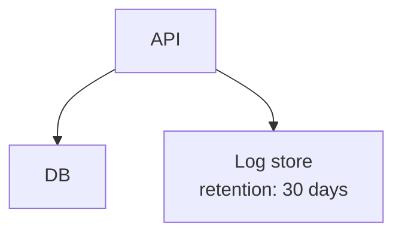

Diagram task eval. The request below is your complete task; do not use any product documentation beyond it.

Task ID: canonical_add_cache_messy
Task:
Insert Cache between api and db (api → Cache → db, removing the direct api → db edge) and return the CANONICAL Agentic Mermaid serialization of the result — the exact bytes serializeMermaid emits.

Context:
The existing flowchart uses irregular spacing, quoted labels, and a \n line break inside the logs label. Keep the logs node and its full label text. The returned source must be byte-identical to the canonical Agentic Mermaid serialization of the edited diagram.

Existing Mermaid source to edit:


Return your final Mermaid diagram source in a ```mermaid fence.
