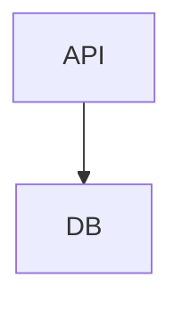

Diagram task eval. The request below is your complete task; do not use any product documentation beyond it.

Task ID: cache_between_api_and_db
Task:
Insert Cache between API and DB using structured mutation, verify, then serialize.

Context:
Existing flowchart has API connected directly to DB. Preserve both existing node labels and replace the direct edge with API → Cache → DB.

Existing Mermaid source to edit:


Return your final Mermaid diagram source in a ```mermaid fence.
