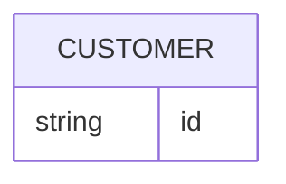

Diagram task eval. The request below is your complete task; do not use any product documentation beyond it.

Task ID: er_add_order
Task:
Add an ORDER entity with string id using structured mutation, verify, then serialize.

Context:
The ER diagram has CUSTOMER. Add ORDER with a string id attribute; no relation is needed for this task.

Existing Mermaid source to edit:


Return your final Mermaid diagram source in a ```mermaid fence.
