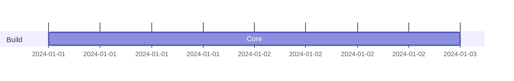

Diagram task eval. The request below is your complete task; do not use any product documentation beyond it.

Task ID: gantt_add_docs_task
Task:
Add a Docs task after Core using structured mutation, verify, then serialize.

Context:
The Gantt chart has one Build section and a Core task with id core. Add Docs with task id docs, start after core, duration 2d.

Existing Mermaid source to edit:


Return your final Mermaid diagram source in a ```mermaid fence.
