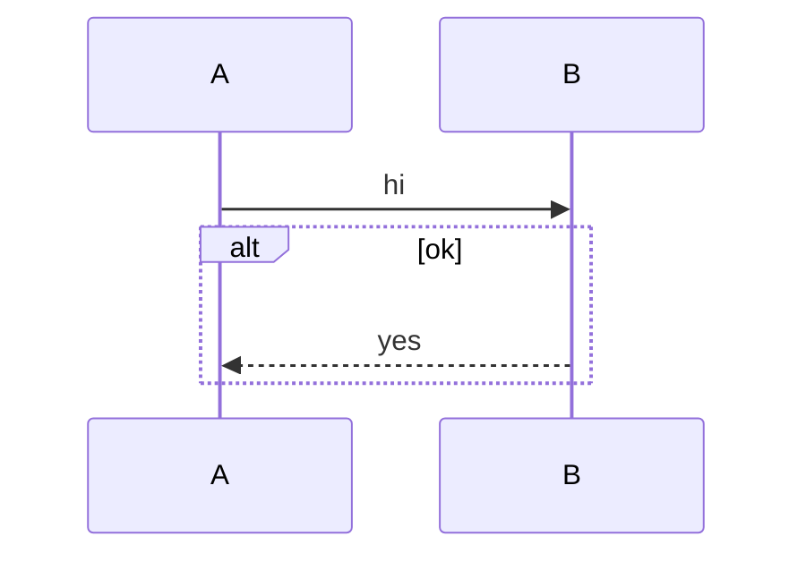

Diagram task eval. The request below is your complete task; do not use any product documentation beyond it.

Task ID: sequence_alt_add_message
Task:
Add a top-level message A->>B: bye using structured mutation, verify, then serialize. Preserve the alt block verbatim.

Context:
The sequence diagram contains one top-level message and an alt block. The new message belongs at top level, not inside the alt block.

Existing Mermaid source to edit:


Return your final Mermaid diagram source in a ```mermaid fence.
