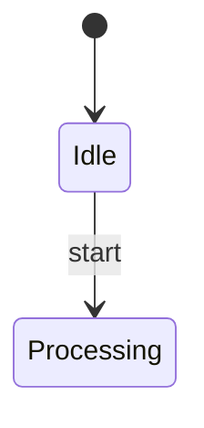

Diagram task eval. The request below is your complete task; do not use any product documentation beyond it.

Task ID: state_add_done_transition
Task:
Add a done transition from Processing to [*] using structured mutation, verify, then serialize.

Context:
The state diagram already has a start state and Processing state. Add the completion path without changing existing transitions.

Existing Mermaid source to edit:


Return your final Mermaid diagram source in a ```mermaid fence.
