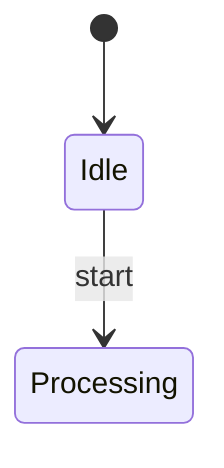

Agentic Mermaid subagent prompt eval.
Use one fresh subagent per request when your harness supports subagents. The request file is the complete parent-visible task. Save the raw response exactly; the finalize step gates it with the deterministic Agentic Mermaid oracle.

Mode: raw chat prompt. Follow the agent-facing surface under test as a normal third-party coding agent would. Do not return Code Mode JavaScript unless the prompt itself requires it.

Agent-facing surface under test (homepage):
The populated homepage prompt appears under “Task prompt under test” below. Do not use any other product guidance.

Task ID: state_add_done_transition
Task prompt under test:
Create or edit a Mermaid diagram with Agentic Mermaid.

Task:
Add a done transition from Processing to [*] using structured mutation, verify, then serialize.

Context:
The state diagram already has a start state and Processing state. Add the completion path without changing existing transitions.

Mermaid source (for edits; leave blank for a new diagram):


Environment:
- Do not assume this repository is checked out. Use one local channel available to you: installed `agentic-mermaid/agent`, this repo's `./src/agent/index.ts`, the CLI (`am` or `bun run bin/am.ts`), or self-hosted MCP Code Mode.
- Do not call the website as a render API. If no local Agentic Mermaid channel is available, do not fabricate verification; return the best Mermaid source and say `not verified — Agentic Mermaid unavailable` with what you tried.
- Library imports, when available: `parseMermaid`, `verifyMermaid`, `serializeMermaid`, `mutate`, and `as*` helpers from `agentic-mermaid/agent`.

Workflow:
1. For a new diagram, author Mermaid source directly from the supplied context, then parse it with `parseMermaid`.
2. For an existing diagram, parse it, narrow with the matching `as*` helper (`asFlowchart`, `asSequence`, `asGantt`, etc.), and prefer the smallest `mutate(...)` operation.
3. Mutation ops use a `kind` discriminator (for example `{ kind: "add_edge", from, to, label }`). Discover exact ops from local types, `am capabilities --json`, or `/capabilities.json` when present.
4. If no typed operation fits, make the smallest source-level edit and say `source-level fallback`.
5. Run `verifyMermaid` on the final diagram or source. If structural warnings remain after one mechanical fix attempt, return the warnings instead of guessing.
6. Return mode:
   - In chat, return exactly these sections: Updated Mermaid, Verification, Trace.
   - In MCP/Code Mode `execute(code)`, return an object with `{ source }` after verification, or `{ error, warnings }`; do not return prose from inside code.
7. In Updated Mermaid, include only the final Mermaid source in a ```mermaid fence. Do not return SVG, PNG, ASCII, or Unicode unless requested.
8. In Trace, name the local channel and exact calls/ops used: `parseMermaid`, the `as*` helper, `mutate({ kind: ... })`, `verifyMermaid`, and `serializeMermaid`; for new diagrams say `no mutate`.

Do not modify project files unless the user explicitly asked you to change files.

Return the human-facing response requested by the prompt.
