# Degenerate `edgeThroughNode` catalog (issue #81)

Reproducible catalog of the `edgeThroughNode` residual that survives PR #80. These
are **degenerate fuzz inputs**, not realistic diagrams: the 287-diagram corpus and the
standing corner-case gate are HARD-clean. They are tracked here so a future
packing/`honorLinkRankDistance` change can target `nodeOverlaps = 0` on these families
and confirm the `edgeThroughNode` residual collapses with it.

## How to reproduce

```bash
bun run eval/degenerate-etn/enum-etn.ts
```

`enum-etn.ts` runs two deterministic generators — a dense multi-component DAG with
back-edges / high fan-out / mixed shapes / variable-length links, and an extreme
diamond-fan — over fixed integer seeds (1200 + 800 cases, no RNG), keeps every case
whose layout has an `edgeThroughNode` HARD violation, greedily **delta-debugs** each to
a minimal repro (line removal that preserves the violation), then buckets by a structural
**signature** `direction · #components · has-diamond · has-variable-length-link`.

The enumeration is deterministic (hash-seeded generators + deterministic layout), so the
set below is stable across runs. As of PR #80 it yields **18 distinct minimal signatures**.

## Finding

**Every** signature has `long=true` — a variable-length link (`===>` / `--->` / `---->`).
The `edgeThroughNode` is usually a *downstream symptom of `nodeOverlaps`*: `honorLinkRankDistance`
shoves the target sub-DAG to honour the rank distance, the cross-axis pack fails to
re-separate nodes on multi-component / mixed-shape graphs, and an edge through the
overlapping node follows. The durable fix is on the spacing/packing side (`nodeOverlaps = 0`
by construction), not more post-freeze edge rerouting — see PR #80's scoping note and #26 / #38.

## Cases

Each case below has its minimal Mermaid source plus a link to the **Mermaid Live** editor
and to the **fork's live editor**. All links are round-trip-verified (decode → source
matches). Mermaid.js may lay these degenerate graphs out differently — the point is the
**fork's** `edgeThroughNode` / `nodeOverlaps`.

### Case 1 — `BT comp=3 diamond=false long=true`

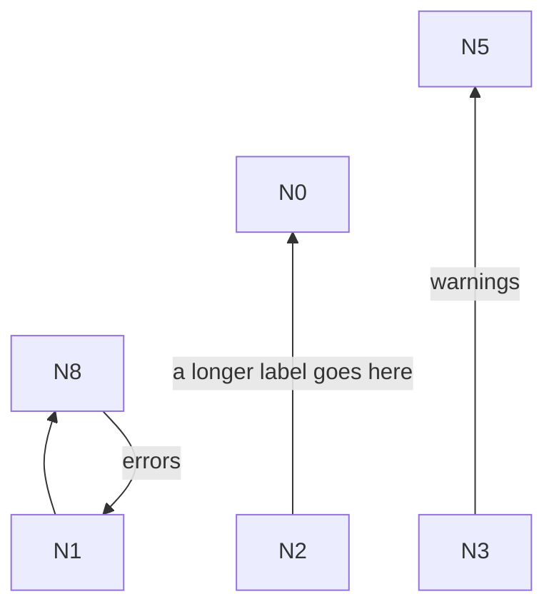

- HARD violations: edgeThroughNode (N8->N1 segment 3 through N2)
- [Open in Mermaid Live](https://mermaid.live/edit#pako:eNo9j02rwjAQRf_KMOsG_OCBZOFC3NqNriSbec00LaQZmSbIw_rfH0Z0ebjnXrgP7MQzWuyj3LuBNMPh4hJAuwVjjNkvd9I0pjAv0P7UYA3G7KHdVdhAlQiipMAKkX45QhCeYWDlBdpV9Xav0sKqoq-lNTY4sU40erT4cJgHntihdei5pxKzwyc2SCXL-S91aLMWblClhAFtT3HmBsvNU-bjSEFp-ig3SleRL7Ifs-jpfbJ-ff4D3ZxPpw)
- [Open in the fork editor](https://adewale.github.io/beautiful-mermaid/editor#eyJzb3VyY2UiOiJmbG93Y2hhcnQgQlRcbiAgTjMgLS0tLT58d2FybmluZ3N8IE41XG4gIE4xIC0tPiBOOFxuICBOMiAtLS0+fGEgbG9uZ2VyIGxhYmVsIGdvZXMgaGVyZXwgTjBcbiAgTjggLS0+fGVycm9yc3wgTjEifQ==)

### Case 2 — `LR comp=3 diamond=false long=true`

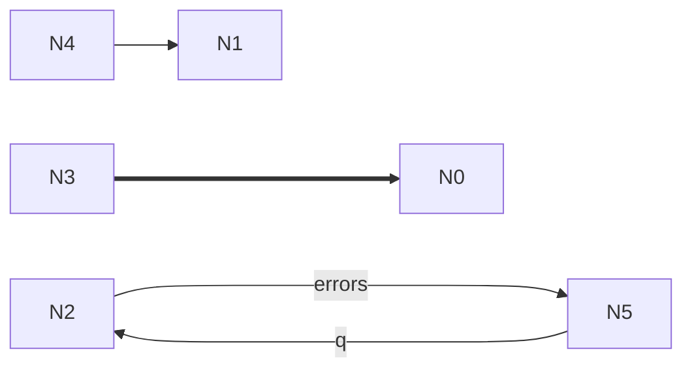

- HARD violations: edgeThroughNode (N5->N2 segment 3 through N3); edgeThroughNode (N5->N2 segment 1 through N0)
- [Open in Mermaid Live](https://mermaid.live/edit#pako:eNo9j71qxDAQBl9l-WoLEufcCOwqZaIi1wU1i7X-Adu6rCWOw_a7hzgk5QzTzIY2BoFFN8V7O7AmevvwC5G7kDENuecTSjLGNLuoRl13ctVpqx9rmv1rJ1ee5oXqum7IPaHALDrzGGCxeaRBZvGwHkE6zlPyOFCAc4rXx9LCJs1SQGPuB9iOp1UK5FvgJK8j98rzX3Lj5TPGf5QwpqjvvxPny_ENu4RDXA)
- [Open in the fork editor](https://adewale.github.io/beautiful-mermaid/editor#eyJzb3VyY2UiOiJmbG93Y2hhcnQgTFJcbiAgTjQgLS0+IE4xXG4gIE4yIC0tLT58ZXJyb3JzfCBONVxuICBONSAtLS0tPnxxfCBOMlxuICBOMyA9PT0+IE4wIn0=)

### Case 3 — `TD comp=2 diamond=false long=true`

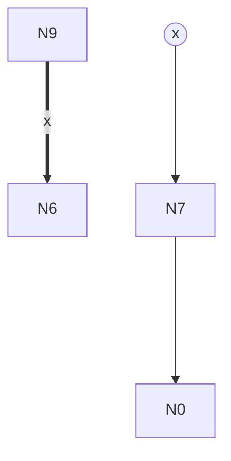

- HARD violations: edgeThroughNode (N2->N7 segment 1 through N6); nodeOverlaps (N6 overlaps N7)
- [Open in Mermaid Live](https://mermaid.live/edit#pako:eNo9jz0LgzAYhP9KuEkhQulQaUAn17q0U8nyYl4_QI2kCbWo_72gtNs9xzPcLaisYSjUvX1XLTkvHoUehSjPUTTH8R6vIsuyfJ1XUV72IhVJkiS5KE-HKg5KITGwG6gzUFg0fMsDaygNwzWF3mtskKDg7f0zVlDeBZZwNjQtVE39iyXCZMhz0VHjaPgpE41Pa__IpvPW3Y7p-4PtC-myP5c)
- [Open in the fork editor](https://adewale.github.io/beautiful-mermaid/editor#eyJzb3VyY2UiOiJmbG93Y2hhcnQgVERcbiAgTjIoKHgpKVxuICBOOSA9PT0+fHh8IE42XG4gIE43IC0tLS0+IE4wXG4gIE4yIC0tLT4gTjcifQ==)

### Case 4 — `RL comp=1 diamond=false long=true`

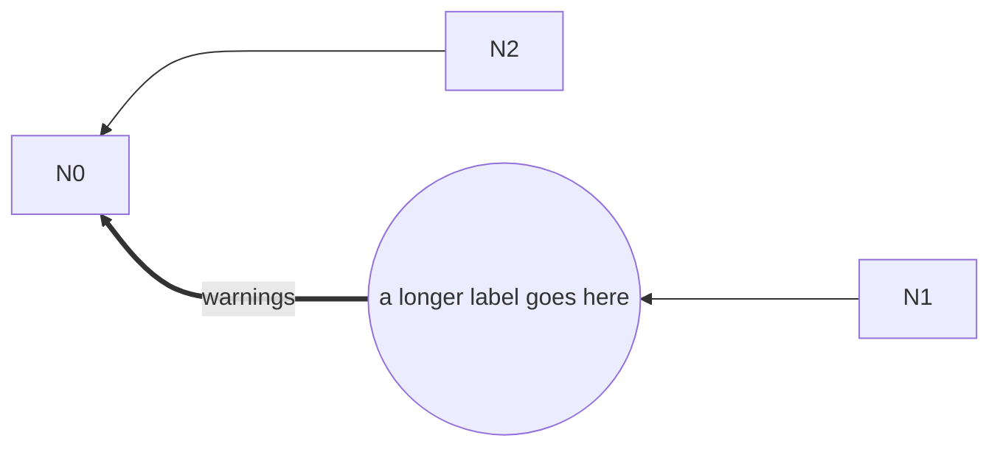

- HARD violations: edgeThroughNode (N2->N0 segment 1 through N6); nodeOverlaps (N2 overlaps N6)
- [Open in Mermaid Live](https://mermaid.live/edit#pako:eNo9zzFrwzAQxfGvcrwpARvaDBkEztSxydBsRcvVOssGWRfOEqEk-e4lCen4Hr_lf0GvQeAwJD33I1uhr0-fiQ7b1YopaY5ilPhHEkWVhUYxWa8fYkNt2-7o8Pb01HXd7npmy1OOy_X1v9_VnW3RYBabeQpwuHiUUWbxcB5BBq6peNzQgGvR42_u4YpVaWBa4wg3cFqkQT0FLvIxcTSeX-TE-Vv1f0qYitr-Gfbou_0BAbdKxA)
- [Open in the fork editor](https://adewale.github.io/beautiful-mermaid/editor#eyJzb3VyY2UiOiJmbG93Y2hhcnQgUkxcbiAgTjYoKGEgbG9uZ2VyIGxhYmVsIGdvZXMgaGVyZSkpXG4gIE4yIC0tLT4gTjBcbiAgTjYgPT09Pnx3YXJuaW5nc3wgTjBcbiAgTjEgLS0tLT4gTjYifQ==)

### Case 5 — `LR comp=2 diamond=false long=true`

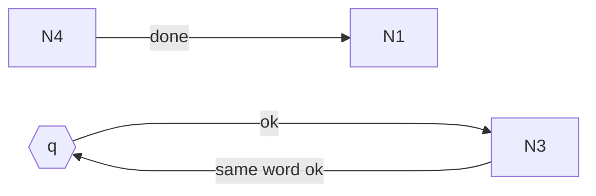

- HARD violations: edgeThroughNode (N3->N0 segment 3 through N4)
- [Open in Mermaid Live](https://mermaid.live/edit#pako:eNo9j7sOgkAURH9lMzUkGK22oLJUCu3MNjfs5RFZLi67IQb4dyNEu5lzppkZpViGRtXJVDbkg7rcTK9Ukc3za123eFJpmuaLlZ4XVRx2vTN5Lqo4buT4JWm-jORYTeKt2mSGBI69o9ZCYzYIDTs20AaWK4pdMFiRgGKQ-7svoYOPnMBLrBvoirqRE8TBUuBzS7Un95sM1D9E_pVtG8Rf9z_brfUDDmFJEg)
- [Open in the fork editor](https://adewale.github.io/beautiful-mermaid/editor#eyJzb3VyY2UiOiJmbG93Y2hhcnQgTFJcbiAgTjB7e3F9fVxuICBONCAtLS0+fGRvbmV8IE4xXG4gIE4wIC0tLT58b2t8IE4zXG4gIE4zIC0tLS0+fHNhbWUgd29yZCBva3wgTjAifQ==)

### Case 6 — `RL comp=3 diamond=true long=true`

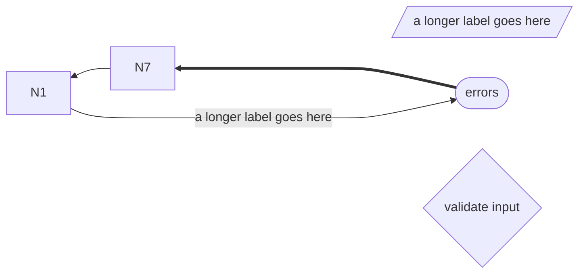

- HARD violations: edgeThroughNode (N1->N6 segment 3 through N10)
- [Open in Mermaid Live](https://mermaid.live/edit#pako:eNp1kL1qw0AQhF9lmSoBHY4h2CCQKpeJCruLz8VGWv3ASSdWdwlB1ruHSCRdyhnmY4aZUfpKkKJ2_rNsWQOdX-xAVDxfdxZMzg-NKDl-F0eNl4laUbHY3dbU4eFqIapeJ4vb4-rtn-YPdl3FQagbxhiW1T6SMTkV-42jLMtyKo4bQcaY_P5f252KAxL0oj13FVLMFqGVXixSi0pqji5YLEjAMfjL11AiDRolgfrYtEhrdpMkiOPPqFPHjXL_Gxl5ePP-T0rVBa-v2yvrOcs33FdfsQ)
- [Open in the fork editor](https://adewale.github.io/beautiful-mermaid/editor#eyJzb3VyY2UiOiJmbG93Y2hhcnQgUkxcbiAgTjRbL1wiYSBsb25nZXIgbGFiZWwgZ29lcyBoZXJlXCIvXVxuICBONihbXCJlcnJvcnNcIl0pXG4gIE4xMHt2YWxpZGF0ZSBpbnB1dH1cbiAgTjcgLS0+IE4xXG4gIE42ID09PT4gTjdcbiAgTjEgLS0tPnxhIGxvbmdlciBsYWJlbCBnb2VzIGhlcmV8IE42In0=)

### Case 7 — `TD comp=3 diamond=false long=true`

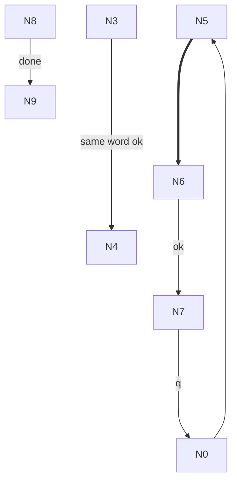

- HARD violations: edgeThroughNode (N7->N0 segment 3 through N8)
- [Open in Mermaid Live](https://mermaid.live/edit#pako:eNo9jzFvwjAQRv_K6eZYQmoJ1FIysdYLTMjLKb6QqHGOGlsRwvx3hKEd33vf8t2wE8eosZ9k6QYKEQ47OwOYNTRN04KpC9WglGqz_GQwm2I-nka1-UKeYZHgoMTPElegVAtmXWDzXv5mMKtits-cncycwXxhhZ6Dp9GhxpvFOLBni9qi457SFC3esUJKUfbXuUMdQ-IKg6TTgLqn6cIVprOjyLuRToH83-RM81HkH9mNUcL363D5fX8AI3ZP4Q)
- [Open in the fork editor](https://adewale.github.io/beautiful-mermaid/editor#eyJzb3VyY2UiOiJmbG93Y2hhcnQgVERcbiAgTjUgPT09PiBONlxuICBONiAtLS0+fG9rfCBON1xuICBOMyAtLS0tPnxzYW1lIHdvcmQgb2t8IE40XG4gIE4wIC0tPiBONVxuICBONyAtLS0tPnxxfCBOMFxuICBOOCAtLT58ZG9uZXwgTjkifQ==)

### Case 8 — `LR comp=3 diamond=true long=true`

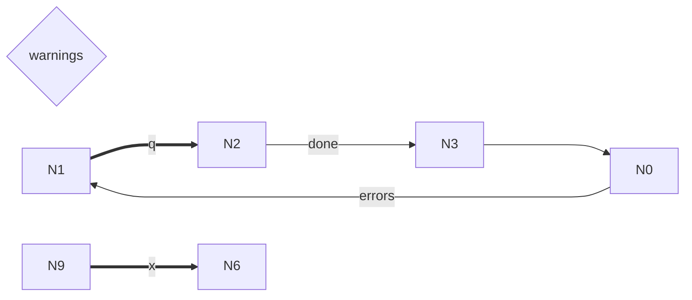

- HARD violations: edgeThroughNode (N0->N1 segment 3 through N9)
- [Open in Mermaid Live](https://mermaid.live/edit#pako:eNo9j0tLxTAQRv_KMOsW7kMEA-3KpWahO8lmaKYPaDPXacJVmv53MUWX5_CdxbdhJ57RYD_LvRtJI7y8uQBgH7Y7aZjCsO6Fz9A0TZs_M9hLEReo67rNXgJnsNfirr-ubsGeCj4dzVcG-1jE6WhYVXTNYM9Y4cK60OTR4OYwjrywQ-PQc09pjg53rJBSlPfv0KGJmrhClTSMaHqaV64w3TxFfp5oUFr-JjcKHyL_yH6Koq_H2fJ5_wGvf1DE)
- [Open in the fork editor](https://adewale.github.io/beautiful-mermaid/editor#eyJzb3VyY2UiOiJmbG93Y2hhcnQgTFJcbiAgTjR7d2FybmluZ3N9XG4gIE4xID09PT58cXwgTjJcbiAgTjIgLS0tPnxkb25lfCBOM1xuICBOMyAtLS0tPiBOMFxuICBOOSA9PT0+fHh8IE42XG4gIE4wIC0tLT58ZXJyb3JzfCBOMSJ9)

### Case 9 — `RL comp=4 diamond=false long=true`

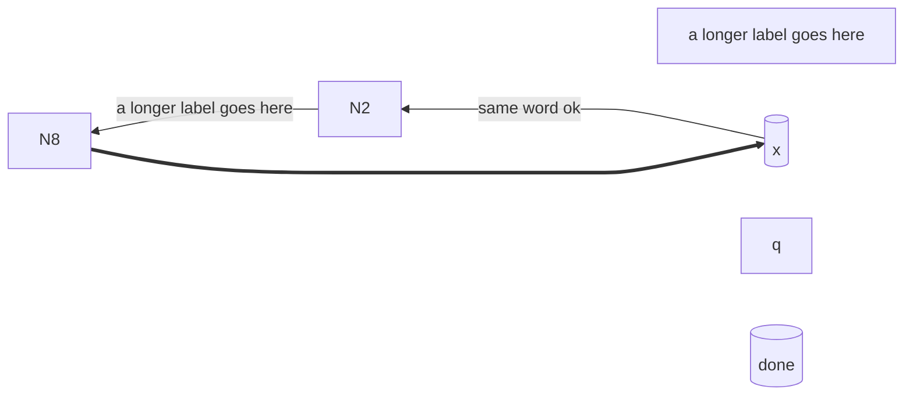

- HARD violations: edgeThroughNode (N8->N7 segment 3 through N10)
- [Open in Mermaid Live](https://mermaid.live/edit#pako:eNp1kD1Pw0AQRP_KaqpEsiVIgcNJTkVJXECHj2LxrT_E2RvOZwUU578jHEJHNzvvSSvNCZU6gUHt9Vi1HCI9PdqBqLgrLZi8Do0E8vwmnhqVkVoJYvG6OFm5-lxf4n1p8XHtb2_KldNBfllGaZqmu3nkXuiowZG-z1RsFrihH_Tfp5mK7aJtKc_zHRUZEvQSeu4cDE4WsZVeLIyFk5onHy3OSMBT1OevoYKJYZIEQaemhanZj5JgOjiO8tBxE7i_KgceXlT_TnFd1LC_zLOsdP4Glvlhrw)
- [Open in the fork editor](https://adewale.github.io/beautiful-mermaid/editor#eyJzb3VyY2UiOiJmbG93Y2hhcnQgUkxcbiAgTjZbXCJhIGxvbmdlciBsYWJlbCBnb2VzIGhlcmVcIl1cbiAgTjdbKHgpXVxuICBOOVtcInFcIl1cbiAgTjEwWyhkb25lKV1cbiAgTjcgLS0tLT58c2FtZSB3b3JkIG9rfCBOMlxuICBOMiAtLT58YSBsb25nZXIgbGFiZWwgZ29lcyBoZXJlfCBOOFxuICBOOCA9PT0+IE43In0=)

### Case 10 — `LR comp=1 diamond=false long=true`

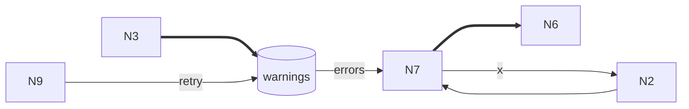

- HARD violations: edgeThroughNode (N7->N2 segment 3 through N8); nodeOverlaps (N2 overlaps N8)
- [Open in Mermaid Live](https://mermaid.live/edit#pako:eNo9kD3LwkAQhP_KspVC0ihoPIjVW75eoZ2exZLbfEByJ5s7VIz_XYzR8pmdGdh5YOEto8Ky9deiJgnwvzcOQGen2ZXENa7q5-dRWUOe51vQq5EWkKbpFvR6uqVvHG4D6MUnD29mES_98LUtp4pspM0UEg5yH0BnmGDH0lFjUeHDYKi5Y4PKoOWSYhsMPjFBisEf7q5AFSRyguJjVaMqqe05wXixFPivoUqo-1ou5I7e_5BtE7zsPq-PCzxfiANTOg)
- [Open in the fork editor](https://adewale.github.io/beautiful-mermaid/editor#eyJzb3VyY2UiOiJmbG93Y2hhcnQgTFJcbiAgTjhbKHdhcm5pbmdzKV1cbiAgTjcgPT09PiBONlxuICBOMiAtLS0+IE43XG4gIE43IC0tLS0+fHh8IE4yXG4gIE44IC0tPnxlcnJvcnN8IE43XG4gIE4zID09PT4gTjhcbiAgTjkgLS0tLT58cmV0cnl8IE44In0=)

### Case 11 — `RL comp=4 diamond=true long=true`


- HARD violations: edgeThroughNode (N0->N5 segment 3 through N10)
- [Open in Mermaid Live](https://mermaid.live/edit#pako:eNo9zz9rwzAQBfCvIt7kgA0uNIFqyJSx9dBujTIc1vkPtaXkLBGK4-9eKifZ7nfvbngzam8ZGs3gr3VHEtTnu3FKVa_Z0YBFvEwGp03abefLkoa3LLuSuN6102aNXsqjgf8xOCXuVFEUe1WV699du6TyX8X-drmpaoscI8tIvYXGbBA6HtlAG1huKA7BYEEOisF__boaOkjkHOJj20E3NEycI54tBT701AqNj5MzuW_vn2TbBy8fa9tUevkDTSxPwA)
- [Open in the fork editor](https://adewale.github.io/beautiful-mermaid/editor#eyJzb3VyY2UiOiJmbG93Y2hhcnQgUkxcbiAgTjQoW1wiZXJyb3JzXCJdKVxuICBONXtxfVxuICBOOSgod2FybmluZ3MpKVxuICBOMTBbXCJva1wiXVxuICBONiAtLS0+IE4wXG4gIE41IC0tLT4gTjZcbiAgTjAgLS0tLT58cXwgTjUifQ==)

### Case 12 — `LR comp=4 diamond=false long=true`


- HARD violations: edgeThroughNode (N7->N2 segment 3 through N9)
- [Open in Mermaid Live](https://mermaid.live/edit#pako:eNpVkMFugzAQRH9ltadEwkqaQ2mR4NRj60N7K85hhRewBDZy7EYR8O9VTVOpx5k3OyvNjI3TjAW2g7s2PfkAr-_KAsjjPHsO_rauST7UB4VfNBhNgcHYKQaFh3Nip3p3JW-N7S77zXne1Qq1s6zwvE9ODmVZViAftwsQQlTL_74FZP6bFQnfSxeQpwSeQIgKZI4ZjuxHMhoLnBWGnkdWWCjU3FIcgsIVM6QY3MfNNlgEHzlD72LXY9HScOEM4_Tz-sVQ52m8Ryayn879SdYmOP-2TZSWWr8B-95jhA)
- [Open in the fork editor](https://adewale.github.io/beautiful-mermaid/editor#eyJzb3VyY2UiOiJmbG93Y2hhcnQgTFJcbiAgTjB7e3JldHJ5fX1cbiAgTjFbL1widmFsaWRhdGUgaW5wdXRcIi9dXG4gIE4yWyh3YXJuaW5ncyldXG4gIE45KFtcImRvbmVcIl0pXG4gIE43ID09PT4gTjZcbiAgTjIgLS0tPnx2YWxpZGF0ZSBpbnB1dHwgTjdcbiAgTjcgLS0tLT58d2FybmluZ3N8IE4yXG4gIE44IC0tPiBONyJ9)

### Case 13 — `TD comp=2 diamond=true long=true`

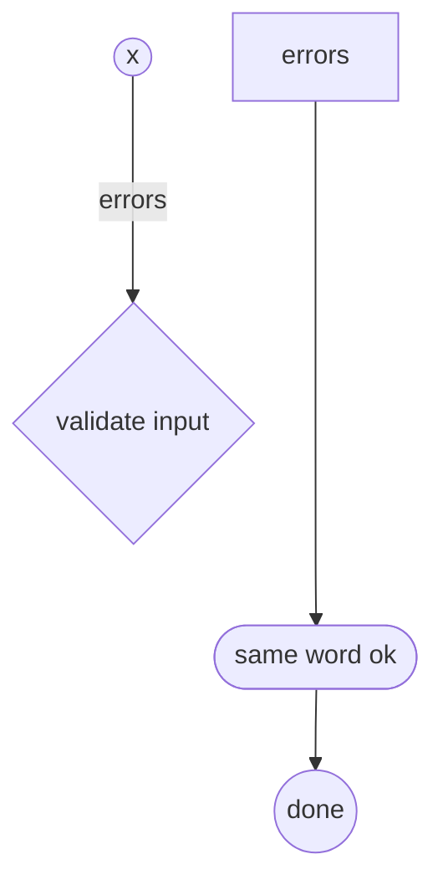

- HARD violations: edgeThroughNode (N0->N5 segment 1 through N7); edgeThroughNode (N3->N0 segment 1 through N7); nodeOverlaps (N0 overlaps N7)
- [Open in Mermaid Live](https://mermaid.live/edit#pako:eNo9kD9rwzAQxb-KeJMDFoSWEPCQKWu9tFOjDId1jkUtn5GlpsXxdy-22m73_vDjeDMasYwKbS_3pqMQ1dvZDErV--JiMJFndZdglXwYXHdb8lQUX7t8Pl8MOAQJk8F1cw5FYWXg3_w4f1LvLEVWbhhTXDJaaX1S9SHTlNb69MiUh6qPGby6a2mPEp6DJ2dRYTaIHXs2qAwst5T6aLCgBKUor99DgyqGxCWCpFuHqqV-4hJpXH84O7oF8n-VkYZ3kX_J1kUJL3mObZXlB8GyWyw)
- [Open in the fork editor](https://adewale.github.io/beautiful-mermaid/editor#eyJzb3VyY2UiOiJmbG93Y2hhcnQgVERcbiAgTjAoW1wic2FtZSB3b3JkIG9rXCJdKVxuICBOMigoeCkpXG4gIE4zW1wiZXJyb3JzXCJdXG4gIE41KChkb25lKSlcbiAgTjd7dmFsaWRhdGUgaW5wdXR9XG4gIE4wIC0tPiBONVxuICBOMiAtLS0+fGVycm9yc3wgTjdcbiAgTjMgLS0tLT4gTjAifQ==)

### Case 14 — `BT comp=2 diamond=false long=true`

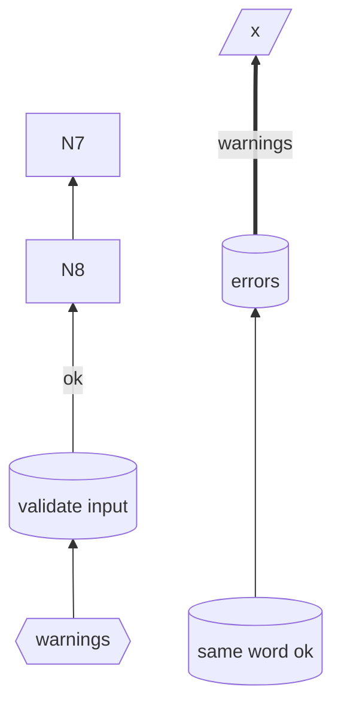

- HARD violations: edgeThroughNode (N8->N7 segment 1 through N6); nodeOverlaps (N6 overlaps N8)
- [Open in Mermaid Live](https://mermaid.live/edit#pako:eNo9UEFugzAQ_MpqT1QCJVWVNEKCQ9VrubSn4h5WeAErYCNjl1bA3ytw0uPOzM7OzoyVkYwp1p2Zqpasg5cPoQGKYxl9U6ckOQalB-8evnb8cZ4nslrpZlzXHXkqo5F6hslYCeZ6053Kg8AfgYcwnsuIrTV2vNEXSJIciudAQpZl-XL3XaA4hQyQJEm-mOsCxSXc2pBt8RzCBJcjxtiz7UlJTHEW6FruWWAqUHJNvnMCV4yRvDPvv7rC1FnPMVrjmxbTmrqRY_TD9uyrosZSf5cMpD-N-R9ZKmfsW-hsr279A5yeZuU)
- [Open in the fork editor](https://adewale.github.io/beautiful-mermaid/editor#eyJzb3VyY2UiOiJmbG93Y2hhcnQgQlRcbiAgTjBbKHZhbGlkYXRlIGlucHV0KV1cbiAgTjF7e3dhcm5pbmdzfX1cbiAgTjNbKHNhbWUgd29yZCBvayldXG4gIE41Wy9cInhcIi9dXG4gIE42WyhlcnJvcnMpXVxuICBOOCAtLT4gTjdcbiAgTjYgPT09Pnx3YXJuaW5nc3wgTjVcbiAgTjAgLS0tPnxva3wgTjhcbiAgTjMgLS0tLT4gTjZcbiAgTjEgLS0+IE4wIn0=)

### Case 15 — `TD comp=4 diamond=false long=true`

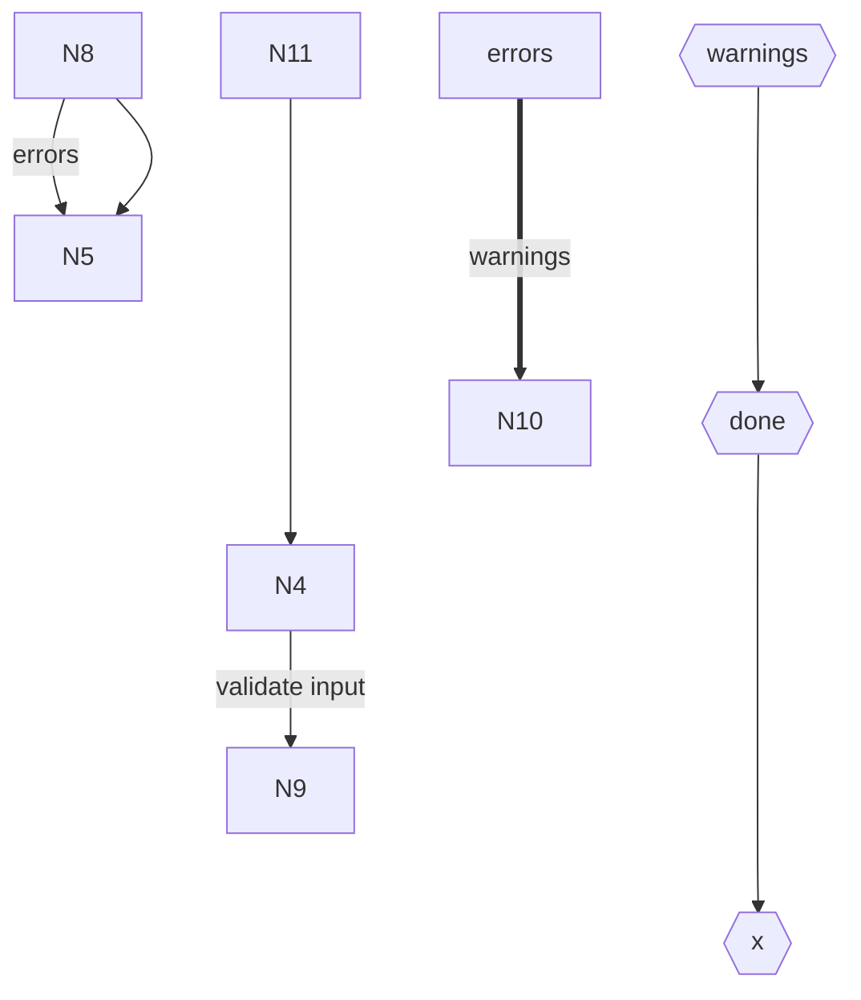

- HARD violations: edgeThroughNode (N6->N3 segment 1 through N5); nodeOverlaps (N3 overlaps N5)
- [Open in Mermaid Live](https://mermaid.live/edit#pako:eNpFkEFvgzAMhf-K5TNIRW2nDYmeem0u22nLDhYxEAkSFJJ1U-C_T5Cy3fzZ79lPjlhbxVhi09t73ZHz8HaVBkAcYvxelq0sPiSyc9ZNEj-3zjFGZQ0_5k8x3skZbdrp0XmGPL_MyTODOCcZ5Hl-AXFMK1Za8bDhaXN8Ua8VeQZtxuBnEC8pAFRVdZn3IzOIIrmKYt9y-r8L4owZDuwG0gpLjBJ9xwNLLCUqbij0XuKCGVLw9vXH1Fh6FzhDZ0PbYdlQP3GGYVyjXDW1joZdMpJ5t_YPWWlv3S39cHvl8gtQnmwr)
- [Open in the fork editor](https://adewale.github.io/beautiful-mermaid/editor#eyJzb3VyY2UiOiJmbG93Y2hhcnQgVERcbiAgTjB7e3h9fVxuICBOMVtcImVycm9yc1wiXVxuICBOM3t7ZG9uZX19XG4gIE42e3t3YXJuaW5nc319XG4gIE44IC0tPnxlcnJvcnN8IE41XG4gIE42IC0tLT4gTjNcbiAgTjMgLS0tLT4gTjBcbiAgTjQgLS0+fHZhbGlkYXRlIGlucHV0fCBOOVxuICBOMSA9PT0+fHdhcm5pbmdzfCBOMTBcbiAgTjExIC0tLS0+IE40XG4gIE44IC0tPiBONSJ9)

### Case 16 — `LR comp=1 diamond=true long=true`


- HARD violations: edgeThroughNode (N9->N6 segment 3 through N0); edgeThroughNode (N5->N6 segment 3 through N0); nodeOverlaps (N0 overlaps N6)
- [Open in Mermaid Live](https://mermaid.live/edit#pako:eNp1kctOxDAMRX_F8iojtdKMZgaYSu2KJXQBOwgL07gPkSZVmjKgtv-O-oIVy2Pfe23LPWZWMUaYa3vNSnIeHp6kAUj3QlzJmcoU7W43Vw7iVaL9kPi28FEIAm1NwQ40vbOGwnILJTteHeeenbOuHWe6CPFJulLkGSrTdH5VHSGO42TYpg2Qnub6HYRhmEB6WdwTTbif8QRhmAz_zR8gPa-uOftrgPRmOWsNPSwLbqF_zWRQ1kwBtxhgza6mSmGEvURfcs0SI4mKc-q0lzhigNR5-_xtMoy86zhAZ7uixCgn3XKAXTPde19R4ajeJA2ZF2t_kVXlrXtcHjH_Y_wB4dJ-4g)
- [Open in the fork editor](https://adewale.github.io/beautiful-mermaid/editor#eyJzb3VyY2UiOiJmbG93Y2hhcnQgTFJcbiAgTjAoKHdhcm5pbmdzKSlcbiAgTjEoW1wib2tcIl0pXG4gIE4zKChhIGxvbmdlciBsYWJlbCBnb2VzIGhlcmUpKVxuICBONXtlcnJvcnN9XG4gIE45KCh2YWxpZGF0ZSBpbnB1dCkpXG4gIE4zID09PT58d2FybmluZ3N8IE40XG4gIE44IC0tLT4gTjlcbiAgTjkgLS0tLT4gTjBcbiAgTjQgLS0+fGEgbG9uZ2VyIGxhYmVsIGdvZXMgaGVyZXwgTjVcbiAgTjkgPT09Pnx4fCBONlxuICBOMCAtLS0+IE4xXG4gIE41IC0tLS0+IE42XG4gIE4wIC0tPnxkb25lfCBONyJ9)

### Case 17 — `RL comp=2 diamond=true long=true`

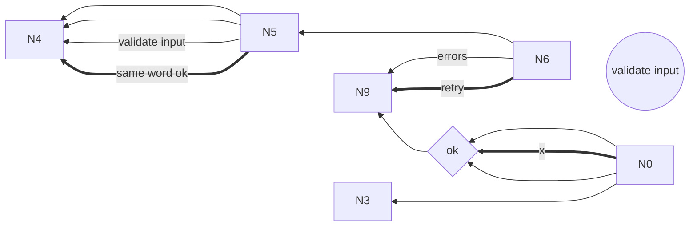

- HARD violations: edgeThroughNode (N6->N5 segment 3 through N9); nodeOverlaps (N5 overlaps N9)
- [Open in Mermaid Live](https://mermaid.live/edit#pako:eNpVkc1qw0AMhF9l0SkBG1KalNZgn3pscmhvxRfhlWMT2zLybtPg9buX3fzQvekTM6MBzVCxJsig7vhcNShGfX6Ug1KH19XqB7tWoyHVDqM163XYP21mPi1h3Kg0TQu_Cvji0fMu4E4F2N6keZ4X7tfF6sKRCMvk1OHtYYps8YEQImTkEjsKF3d1_wNCxPOt_DXwbg15E_akzixa8ckbIYGepMdWQwZzCaahnkrIStBUo-1MCQskgNbw12WoIDNiKQFhe2wgq7GbKAE7-jbvLR4F-7tkxOGb-YGkW8Oyvz4g_GH5A7bcd60)
- [Open in the fork editor](https://adewale.github.io/beautiful-mermaid/editor#eyJzb3VyY2UiOiJmbG93Y2hhcnQgUkxcbiAgTjgoKHZhbGlkYXRlIGlucHV0KSlcbiAgTjEwe29rfVxuICBOMCAtLS0+IE4xMFxuICBONiAtLS0tPiBONVxuICBONSAtLT4gTjRcbiAgTjAgPT09Pnx4fCBOMTBcbiAgTjYgLS0tPnxlcnJvcnN8IE45XG4gIE41IC0tLS0+IE40XG4gIE4wIC0tPiBOMTBcbiAgTjYgPT09PnxyZXRyeXwgTjlcbiAgTjUgLS0tPnx2YWxpZGF0ZSBpbnB1dHwgTjRcbiAgTjAgLS0tLT4gTjNcbiAgTjEwIC0tPiBOOVxuICBONSA9PT0+fHNhbWUgd29yZCBva3wgTjQifQ==)

### Case 18 — `RL comp=6 diamond=true long=true`

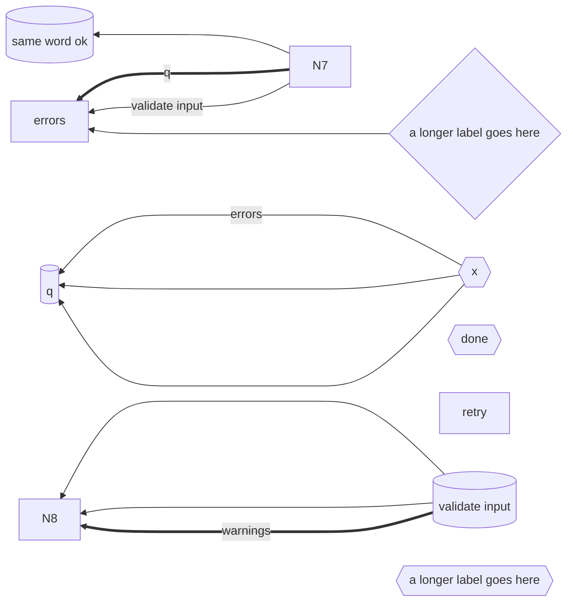

- HARD violations: edgeThroughNode (N6->N8 segment 3 through N9); edgeThroughNode (N6->N8 segment 3 through N9); edgeThroughNode (N6->N8 segment 3 through N9); nodeOverlaps (N9 overlaps N8)
- [Open in Mermaid Live](https://mermaid.live/edit#pako:eNp1kbtuwzAMRX-F4JQCNpBHXzEQTx1bD-1Wq4Ma0Q_UlhJabhrI_vfClpMmQzdekufyAnS4NYowwqwyh20h2cLrs9AAydxJqIzOiaGSn1RBbqiBgpj6cb5w7qf35TIVSMyGG4EfY2eVzvY3vrx1ThlN0-pdKpDJ8vG0eZ_OvmVVKmkJSr1r7YSt01kja4KDYQXma-ou5u7_WP7CA4RhGEOy9vaDGuSj5yEM485n7SBZTcRms4m7fQfJ8g-6Yka5OvvH3XXmC3K0OkjWpc6HExceZ4v5yXGJAdbEtSwVRugE2oJqEhgJVJTJtrICewxQtta8HfUWI8stBcimzQuMMlk1FGC7G5I8lTJnWZ9WdlK_G3OWpEpr-MX_enx5_wtWJJ-A)
- [Open in the fork editor](https://adewale.github.io/beautiful-mermaid/editor#eyJzb3VyY2UiOiJmbG93Y2hhcnQgUkxcbiAgTjB7YSBsb25nZXIgbGFiZWwgZ29lcyBoZXJlfVxuICBOMXt7eH19XG4gIE4yW1wiZXJyb3JzXCJdXG4gIE4zWyhxKV1cbiAgTjR7e2RvbmV9fVxuICBONVtcInJldHJ5XCJdXG4gIE42Wyh2YWxpZGF0ZSBpbnB1dCldXG4gIE45WyhzYW1lIHdvcmQgb2spXVxuICBOMTB7e2EgbG9uZ2VyIGxhYmVsIGdvZXMgaGVyZX19XG4gIE43IC0tLT4gTjlcbiAgTjYgLS0tLT4gTjhcbiAgTjEgLS0+fGVycm9yc3wgTjNcbiAgTjcgPT09PnxxfCBOMlxuICBONiAtLS0+IE44XG4gIE4xIC0tLS0+IE4zXG4gIE43IC0tPnx2YWxpZGF0ZSBpbnB1dHwgTjJcbiAgTjYgPT09Pnx3YXJuaW5nc3wgTjhcbiAgTjEgLS0tPiBOM1xuICBOMCAtLS0tPiBOMiJ9)
