# Degenerate `edgeThroughNode` catalog (issue #81)

**Status: FIXED.** The enumeration below now yields **0 residual signatures**: the
`honorLinkRankDistance` packing fix pushes ahead whatever a variable-length-link shove
lands on (restoring ELK's no-overlap invariant) and rebuilds blocked reconnect routes
through free channels (lane switch / rung / elbow / staircase). Across the 2,800-case
deep fuzz this took `edgeThroughNode` 39 → 0, `nodeOverlaps` 71 → 0, and `hitches`
18 → 7, with the clean corpus byte-identical (equivalence gate) and `bun run track`
zero-drift. Five representative repros are pinned red→green in
`src/__tests__/linkrank-packing.test.ts`.

The 18 pre-fix signatures below are retained as the characterization corpus (source +
editor links). These are **degenerate fuzz inputs**, not realistic diagrams: the
287-diagram corpus and the standing corner-case gate were HARD-clean throughout — and
the hypothesis this catalog was filed to track (the through-node is a downstream
symptom of a `nodeOverlaps` packing failure) is confirmed by the collapse.

## How to reproduce

```bash
bun run eval:degenerate-routes
```

The canonical runner imports the shared deterministic generators — a dense
multi-component DAG with back-edges / high fan-out / mixed shapes /
variable-length links, and an extreme diamond-fan — over fixed integer seeds
(2,000 + 800 cases, no RNG). It lays out every source once and derives
`edgeThroughNode`, hitch, route-audit, and certificate observations from that
result. It prints complete sources for gated failures; minimization happens only
after a finding is promoted to a focused regression. CI runs the same command
outside coverage in the route-sabotage lane.

The enumeration is deterministic (hash-seeded generators + deterministic layout), so the
set below is stable historical evidence. The retired `enum-etn.ts` minimizer
yielded **18 distinct signatures** as of PR #80; the canonical runner now
reports `edgeThroughNode = 0` (run it to confirm).

## Finding (pre-fix)

**Every** signature has `long=true` — a variable-length link (`===>` / `--->` / `---->`).
The `edgeThroughNode` is usually a *downstream symptom of `nodeOverlaps`*: `honorLinkRankDistance`
shoves the target sub-DAG to honour the rank distance, the cross-axis pack fails to
re-separate nodes on multi-component / mixed-shape graphs, and an edge through the
overlapping node follows. The durable fix is on the spacing/packing side (`nodeOverlaps = 0`
by construction), not more post-freeze edge rerouting — see PR #80's scoping note and #26 / #38.

## Cases (pre-fix characterization corpus)

Each case below has its minimal Mermaid source plus a link to the **Mermaid Live** editor
and to the **fork's live editor**. All links are round-trip-verified (decode → source
matches). Mermaid.js may lay these degenerate graphs out differently — the point is the
**fork's** `edgeThroughNode` / `nodeOverlaps`. The HARD violations listed per case are
the **pre-fix** measurements; all 18 are HARD-clean for `nodeOverlaps`/`edgeThroughNode`
with the packing fix.

### Case 1 — `BT comp=3 diamond=false long=true`

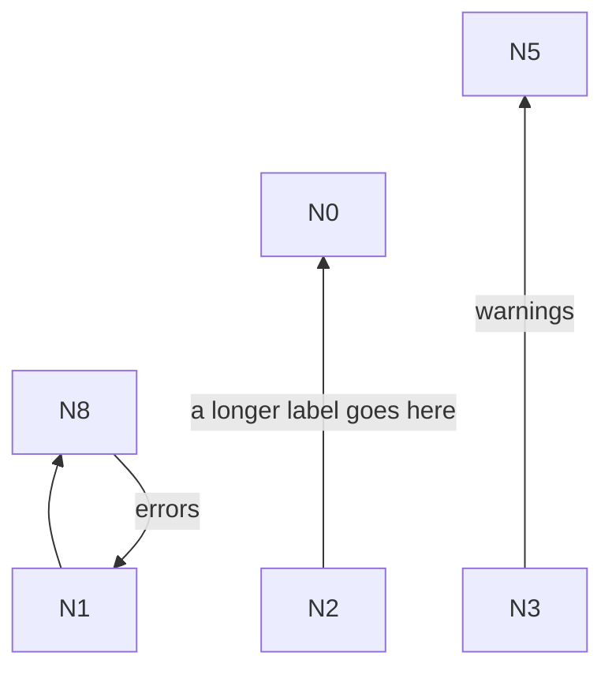

- HARD violations: edgeThroughNode (N8->N1 segment 3 through N2)
- [Open in Mermaid Live](https://mermaid.live/edit#pako:eNo9j02rwjAQRf_KMOsG_OCBZOFC3NqNriSbec00LaQZmSbIw_rfH0Z0ebjnXrgP7MQzWuyj3LuBNMPh4hJAuwVjjNkvd9I0pjAv0P7UYA3G7KHdVdhAlQiipMAKkX45QhCeYWDlBdpV9Xav0sKqoq-lNTY4sU40erT4cJgHntihdei5pxKzwyc2SCXL-S91aLMWblClhAFtT3HmBsvNU-bjSEFp-ig3SleRL7Ifs-jpfbJ-ff4D3ZxPpw)
- [Open in the fork editor](https://agentic-mermaid.dev/editor/#deflate:HYwxCsMwEAS_sqg_iBMCxoWLPECVyzSyOMsBoYOTjQorfzdSOezsXCbLqZ7NZLYoxe9OD3yWbwLsC0REcy1O0y-FXGHffRhANMOOHZ7okkOUFFgR3coRQThjZ-UK--je2E6VVUVbaTD_Gw)

### Case 2 — `LR comp=3 diamond=false long=true`

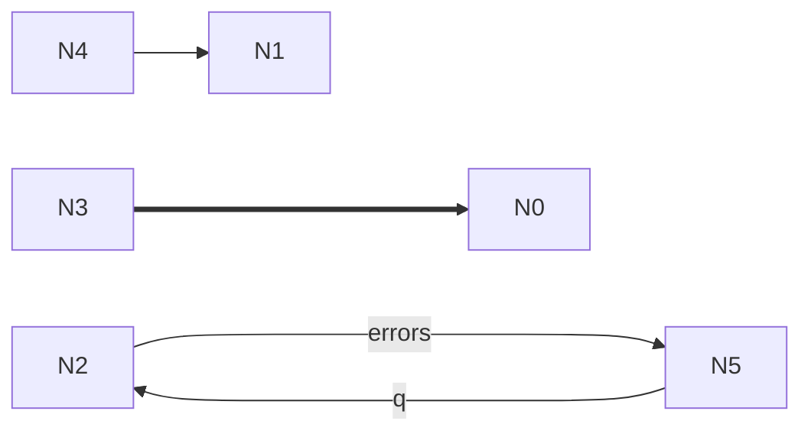

- HARD violations: edgeThroughNode (N5->N2 segment 3 through N3); edgeThroughNode (N5->N2 segment 1 through N0)
- [Open in Mermaid Live](https://mermaid.live/edit#pako:eNo9j71qxDAQBl9l-WoLEufcCOwqZaIi1wU1i7X-Adu6rCWOw_a7hzgk5QzTzIY2BoFFN8V7O7AmevvwC5G7kDENuecTSjLGNLuoRl13ctVpqx9rmv1rJ1ee5oXqum7IPaHALDrzGGCxeaRBZvGwHkE6zlPyOFCAc4rXx9LCJs1SQGPuB9iOp1UK5FvgJK8j98rzX3Lj5TPGf5QwpqjvvxPny_ENu4RDXA)
- [Open in the fork editor](https://agentic-mermaid.dev/editor/#deflate:q1Yqzi8tSk5VslJKy8kvT85ILCpR8AmKyVNQ8DNR0NW1U_AzBHOMFHR1de1qUouK8ouKaxT8TMGipiBRXbuawhoFPyOwiLGCra2tnYKfgVItAA)

### Case 3 — `TD comp=2 diamond=false long=true`

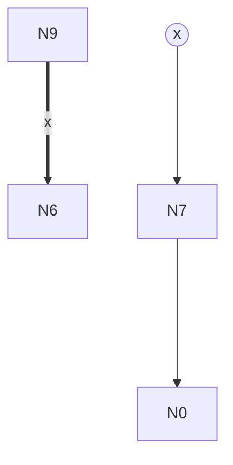

- HARD violations: edgeThroughNode (N2->N7 segment 1 through N6); nodeOverlaps (N6 overlaps N7)
- [Open in Mermaid Live](https://mermaid.live/edit#pako:eNo9jz0LgzAYhP9KuEkhQulQaUAn17q0U8nyYl4_QI2kCbWo_72gtNs9xzPcLaisYSjUvX1XLTkvHoUehSjPUTTH8R6vIsuyfJ1XUV72IhVJkiS5KE-HKg5KITGwG6gzUFg0fMsDaygNwzWF3mtskKDg7f0zVlDeBZZwNjQtVE39iyXCZMhz0VHjaPgpE41Pa__IpvPW3Y7p-4PtC-myP5c)
- [Open in the fork editor](https://agentic-mermaid.dev/editor/#deflate:q1Yqzi8tSk5VslJKy8kvT85ILCpRCHGJyVNQ8DPS0KjQ1AQzLRVsbW3taipqFPzMwALmCrq6urp2Cn4GEKUKEJ65Ui0A)

### Case 4 — `RL comp=1 diamond=false long=true`

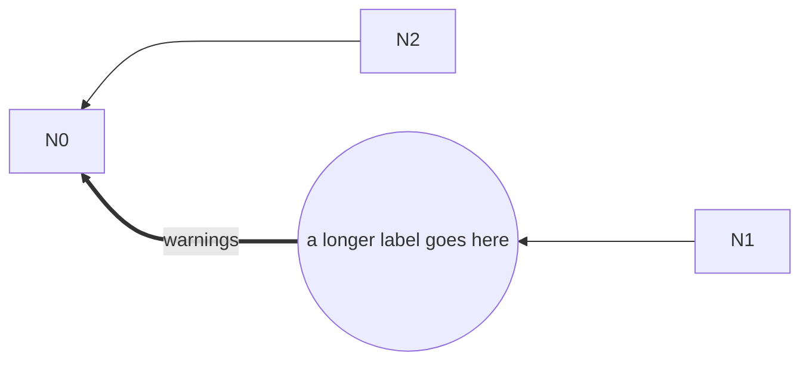

- HARD violations: edgeThroughNode (N2->N0 segment 1 through N6); nodeOverlaps (N2 overlaps N6)
- [Open in Mermaid Live](https://mermaid.live/edit#pako:eNo9zzFrwzAQxfGvcrwpARvaDBkEztSxydBsRcvVOssGWRfOEqEk-e4lCen4Hr_lf0GvQeAwJD33I1uhr0-fiQ7b1YopaY5ilPhHEkWVhUYxWa8fYkNt2-7o8Pb01HXd7npmy1OOy_X1v9_VnW3RYBabeQpwuHiUUWbxcB5BBq6peNzQgGvR42_u4YpVaWBa4wg3cFqkQT0FLvIxcTSeX-TE-Vv1f0qYitr-Gfbou_0BAbdKxA)
- [Open in the fork editor](https://agentic-mermaid.dev/editor/#deflate:q1Yqzi8tSk5VslJKy8kvT85ILCpRCPKJyVNQ8DPT0EhUyMnPS08tUshJTErNUUjPTy1WyEgtStXUBKswUtDV1bVT8DOAqFewtbW1qylPLMrLzEsvroGJG4JUgZSZKdUCAA)

### Case 5 — `LR comp=2 diamond=false long=true`

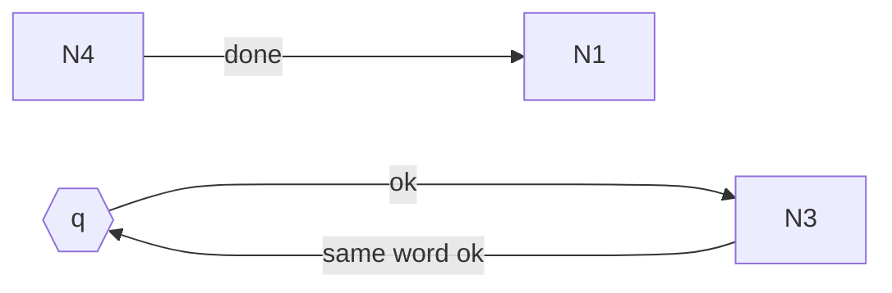

- HARD violations: edgeThroughNode (N3->N0 segment 3 through N4)
- [Open in Mermaid Live](https://mermaid.live/edit#pako:eNo9j7sOgkAURH9lMzUkGK22oLJUCu3MNjfs5RFZLi67IQb4dyNEu5lzppkZpViGRtXJVDbkg7rcTK9Ukc3za123eFJpmuaLlZ4XVRx2vTN5Lqo4buT4JWm-jORYTeKt2mSGBI69o9ZCYzYIDTs20AaWK4pdMFiRgGKQ-7svoYOPnMBLrBvoirqRE8TBUuBzS7Un95sM1D9E_pVtG8Rf9z_brfUDDmFJEg)
- [Open in the fork editor](https://agentic-mermaid.dev/editor/#deflate:q1Yqzi8tSk5VslJKy8kvT85ILCpR8AmKyVNQ8DOori6srQUzTRR0dXXtalLy81JrFPwMIdIQsfzsGgU_Y7CIMUhE166mODE3VaE8vyhFASxpoFQLAA)

### Case 6 — `RL comp=3 diamond=true long=true`


- HARD violations: edgeThroughNode (N1->N6 segment 3 through N10)
- [Open in Mermaid Live](https://mermaid.live/edit#pako:eNp1kL1qw0AQhF9lmSoBHY4h2CCQKpeJCruLz8VGWv3ASSdWdwlB1ruHSCRdyhnmY4aZUfpKkKJ2_rNsWQOdX-xAVDxfdxZMzg-NKDl-F0eNl4laUbHY3dbU4eFqIapeJ4vb4-rtn-YPdl3FQagbxhiW1T6SMTkV-42jLMtyKo4bQcaY_P5f252KAxL0oj13FVLMFqGVXixSi0pqji5YLEjAMfjL11AiDRolgfrYtEhrdpMkiOPPqFPHjXL_Gxl5ePP-T0rVBa-v2yvrOcs33FdfsQ)
- [Open in the fork editor](https://agentic-mermaid.dev/editor/#deflate:dY2xCoMwFEV_5fKmdghWKAqF-AUlQ1fjkNpXFYKRl9gO6r8XdO56OIezUAyztEw3evvwbXsnCY-7HQFzrTNLDj6MHQu8e7JHFziiZ2FLWbNbxam2xCJBoqXmvLP8snycH14uMYZxmtO24xJKVTD50UFrXcGURwGlVLX-u60wBW0_)

### Case 7 — `TD comp=3 diamond=false long=true`

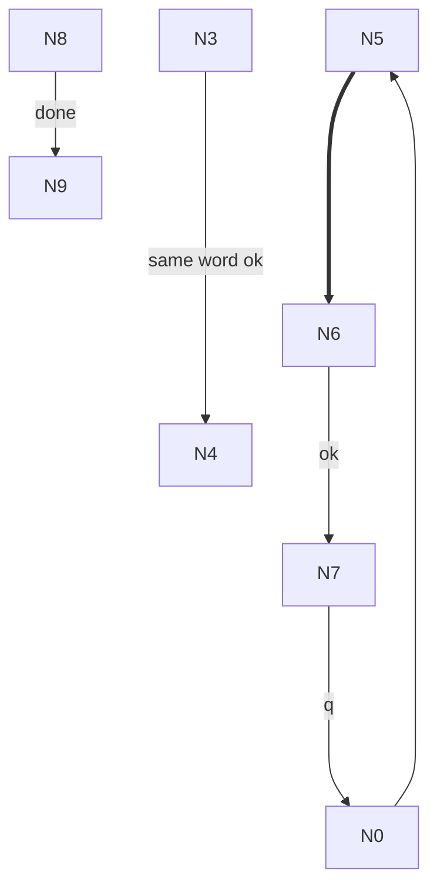

- HARD violations: edgeThroughNode (N7->N0 segment 3 through N8)
- [Open in Mermaid Live](https://mermaid.live/edit#pako:eNo9jzFvwjAQRv_K6eZYQmoJ1FIysdYLTMjLKb6QqHGOGlsRwvx3hKEd33vf8t2wE8eosZ9k6QYKEQ47OwOYNTRN04KpC9WglGqz_GQwm2I-nka1-UKeYZHgoMTPElegVAtmXWDzXv5mMKtits-cncycwXxhhZ6Dp9GhxpvFOLBni9qi457SFC3esUJKUfbXuUMdQ-IKg6TTgLqn6cIVprOjyLuRToH83-RM81HkH9mNUcL363D5fX8AI3ZP4Q)
- [Open in the fork editor](https://agentic-mermaid.dev/editor/#deflate:LYq7CoNAEEV_5bL9gJD4iLBbpZ7KMo3oSiDGIati4eTfxcHyPHY3y5q66Go3jLJ17zYtaJ6vCeAc3vsALowKEFFQ-Si4NHM7DQWd22_EJqmHxbvFDEQBnBuU1_lTcGamOrP2MkUFP9z_AA)

### Case 8 — `LR comp=3 diamond=true long=true`

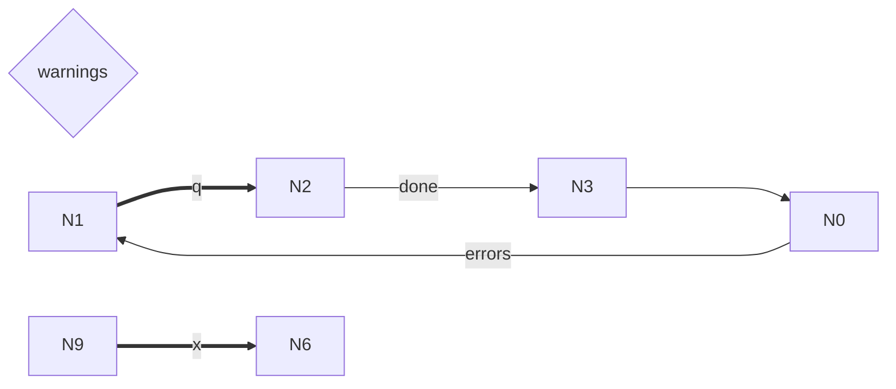

- HARD violations: edgeThroughNode (N0->N1 segment 3 through N9)
- [Open in Mermaid Live](https://mermaid.live/edit#pako:eNo9j0tLxTAQRv_KMOsW7kMEA-3KpWahO8lmaKYPaDPXacJVmv53MUWX5_CdxbdhJ57RYD_LvRtJI7y8uQBgH7Y7aZjCsO6Fz9A0TZs_M9hLEReo67rNXgJnsNfirr-ubsGeCj4dzVcG-1jE6WhYVXTNYM9Y4cK60OTR4OYwjrywQ-PQc09pjg53rJBSlPfv0KGJmrhClTSMaHqaV64w3TxFfp5oUFr-JjcKHyL_yH6Koq_H2fJ5_wGvf1DE)
- [Open in the fork editor](https://agentic-mermaid.dev/editor/#deflate:JcvLCoMwEEbhV_nJPuClCBWSJyiz6NqNaKqFktCJRcHx3Yvj8nxwdpPTj4dgWvP6pHWYe17weHYRoNu-9hzfccqHdgnnnJevgCqFCtZaL2OKQUC1Wn2a9aBC8349m4AaheJ6AnPiLKDSHH8)

### Case 9 — `RL comp=4 diamond=false long=true`

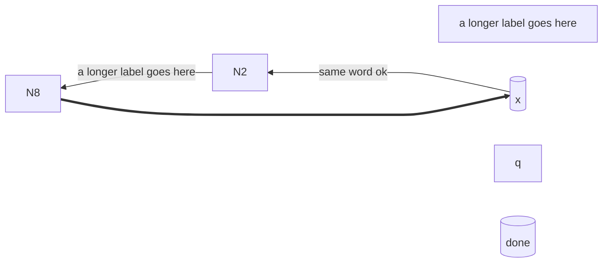

- HARD violations: edgeThroughNode (N8->N7 segment 3 through N10)
- [Open in Mermaid Live](https://mermaid.live/edit#pako:eNp1kD1Pw0AQRP_KaqpEsiVIgcNJTkVJXECHj2LxrT_E2RvOZwUU578jHEJHNzvvSSvNCZU6gUHt9Vi1HCI9PdqBqLgrLZi8Do0E8vwmnhqVkVoJYvG6OFm5-lxf4n1p8XHtb2_KldNBfllGaZqmu3nkXuiowZG-z1RsFrihH_Tfp5mK7aJtKc_zHRUZEvQSeu4cDE4WsZVeLIyFk5onHy3OSMBT1OevoYKJYZIEQaemhanZj5JgOjiO8tBxE7i_KgceXlT_TnFd1LC_zLOsdP4Glvlhrw)
- [Open in the fork editor](https://agentic-mermaid.dev/editor/#deflate:dY2xCsIwFEV_5fKmOgS0g61C-wWSwTVxiO2zBdM8TJUKxn8Xq45ul3MO3AeNcosN05ZOXqamd_GK_c4GQK-NJQcvoeMI747s0QmP6DmypcPcFCa7Lz5zYyxdfny1NFkrgb-ugFJK1Wl0A2OS2ELOCTqfZY63-veUoMs5K1FVVQ1d0PMF)

### Case 10 — `LR comp=1 diamond=false long=true`

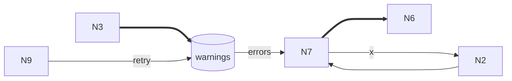

- HARD violations: edgeThroughNode (N7->N2 segment 3 through N8); nodeOverlaps (N2 overlaps N8)
- [Open in Mermaid Live](https://mermaid.live/edit#pako:eNo9kD3LwkAQhP_KspVC0ihoPIjVW75eoZ2exZLbfEByJ5s7VIz_XYzR8pmdGdh5YOEto8Ky9deiJgnwvzcOQGen2ZXENa7q5-dRWUOe51vQq5EWkKbpFvR6uqVvHG4D6MUnD29mES_98LUtp4pspM0UEg5yH0BnmGDH0lFjUeHDYKi5Y4PKoOWSYhsMPjFBisEf7q5AFSRyguJjVaMqqe05wXixFPivoUqo-1ou5I7e_5BtE7zsPq-PCzxfiANTOg)
- [Open in the fork editor](https://agentic-mermaid.dev/editor/#deflate:q1Yqzi8tSk5VslJKy8kvT85ILCpR8AmKyVNQ8LOI1ihPLMrLzEsv1owFi5gr2Nra2in4mYF5Rgq6urp2Cn7mUDldELemokbBzwiiXwHETy0qyi8qroEpM4YaYQHmWUI1FaWWFFXWKPhZKNUCAA)

### Case 11 — `RL comp=4 diamond=true long=true`

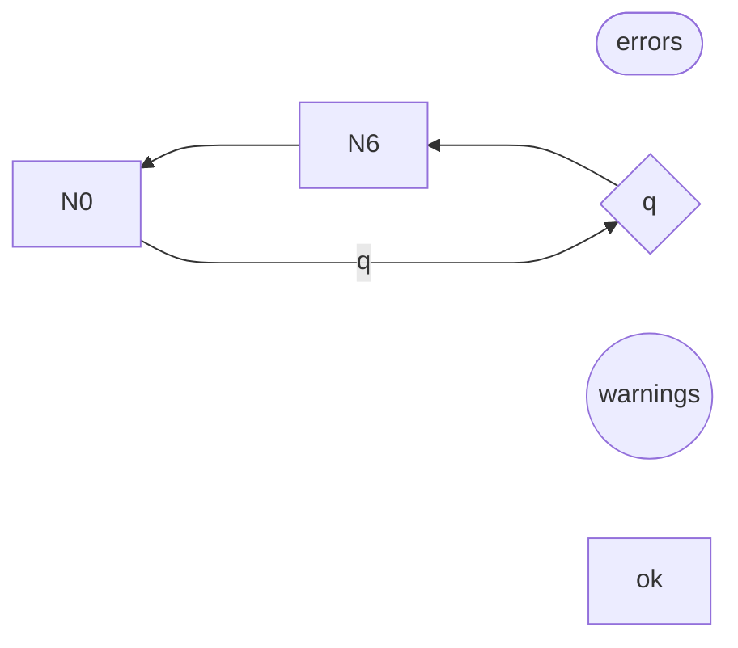

- HARD violations: edgeThroughNode (N0->N5 segment 3 through N10)
- [Open in Mermaid Live](https://mermaid.live/edit#pako:eNo9zz9rwzAQBfCvIt7kgA0uNIFqyJSx9dBujTIc1vkPtaXkLBGK4-9eKifZ7nfvbngzam8ZGs3gr3VHEtTnu3FKVa_Z0YBFvEwGp03abefLkoa3LLuSuN6102aNXsqjgf8xOCXuVFEUe1WV699du6TyX8X-drmpaoscI8tIvYXGbBA6HtlAG1huKA7BYEEOisF__boaOkjkHOJj20E3NEycI54tBT701AqNj5MzuW_vn2TbBy8fa9tUevkDTSxPwA)
- [Open in the fork editor](https://agentic-mermaid.dev/editor/#deflate:q1Yqzi8tSk5VslJKy8kvT85ILCpRCPKJyVNQ8DPRiI5RSi0qyi8qjlGK1QSLmVYX1oIZlhoa5YlFeZl56cWaEClDg-gYpfzsGKVYMNdMQVdX107BzwCiD8ozA_MMQDxdu5rCGgU_U6VaAA)

### Case 12 — `LR comp=4 diamond=false long=true`

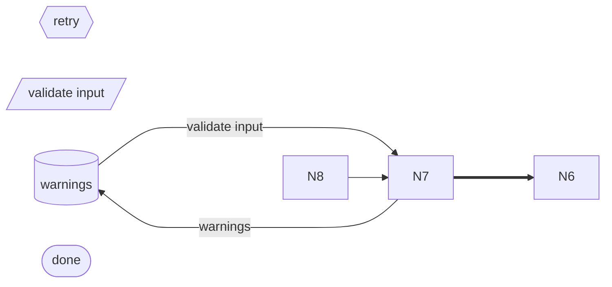

- HARD violations: edgeThroughNode (N7->N2 segment 3 through N9)
- [Open in Mermaid Live](https://mermaid.live/edit#pako:eNpVkMFugzAQRH9ltadEwkqaQ2mR4NRj60N7K85hhRewBDZy7EYR8O9VTVOpx5k3OyvNjI3TjAW2g7s2PfkAr-_KAsjjPHsO_rauST7UB4VfNBhNgcHYKQaFh3Nip3p3JW-N7S77zXne1Qq1s6zwvE9ODmVZViAftwsQQlTL_74FZP6bFQnfSxeQpwSeQIgKZI4ZjuxHMhoLnBWGnkdWWCjU3FIcgsIVM6QY3MfNNlgEHzlD72LXY9HScOEM4_Tz-sVQ52m8Ryayn879SdYmOP-2TZSWWr8B-95jhA)
- [Open in the fork editor](https://agentic-mermaid.dev/editor/#deflate:VYyxDsIgFEV_5eVN7UCqHURN4AsMg2vpQFpUkgYMpTYG-HcTqoPjPefeG3F2ix80nvE2uXV4KB_gcpUWQOxi9Dr4d84l7rtG4ktNZlRBg7HPJUhs-uLarlqVt8be53ojp6qTODqrJfZ1IRQYYxzEYVsAIYSn_78Egn67pOjfaQLRFnEEQjgIivkD)

### Case 13 — `TD comp=2 diamond=true long=true`


- HARD violations: edgeThroughNode (N0->N5 segment 1 through N7); edgeThroughNode (N3->N0 segment 1 through N7); nodeOverlaps (N0 overlaps N7)
- [Open in Mermaid Live](https://mermaid.live/edit#pako:eNo9kD9rwzAQxb-KeJMDFoSWEPCQKWu9tFOjDId1jkUtn5GlpsXxdy-22m73_vDjeDMasYwKbS_3pqMQ1dvZDErV--JiMJFndZdglXwYXHdb8lQUX7t8Pl8MOAQJk8F1cw5FYWXg3_w4f1LvLEVWbhhTXDJaaX1S9SHTlNb69MiUh6qPGby6a2mPEp6DJ2dRYTaIHXs2qAwst5T6aLCgBKUor99DgyqGxCWCpFuHqqV-4hJpXH84O7oF8n-VkYZ3kX_J1kUJL3mObZXlB8GyWyw)
- [Open in the fork editor](https://agentic-mermaid.dev/editor/#deflate:LYwxC4MwEEb_ynFTHALSIkIHp86ZuhmHYK5UanPlEmtB_e9F0-3jvY-3YORJesIL3kee-4eTBLerDQCmVK3F6F4EM4sHflrsisOclPoWeZ5biyTCEi12B6mU8hzo7-vl48bBu0QwhPeUtpwGrRswVa6B1rpZc2UFU-fwTvdTidsP)

### Case 14 — `BT comp=2 diamond=false long=true`

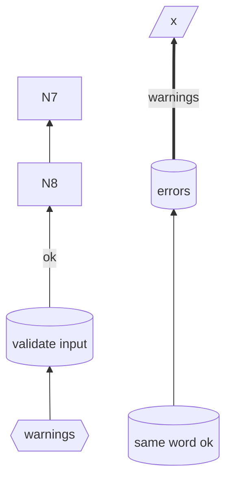

- HARD violations: edgeThroughNode (N8->N7 segment 1 through N6); nodeOverlaps (N6 overlaps N8)
- [Open in Mermaid Live](https://mermaid.live/edit#pako:eNo9UEFugzAQ_MpqT1QCJVWVNEKCQ9VrubSn4h5WeAErYCNjl1bA3ytw0uPOzM7OzoyVkYwp1p2Zqpasg5cPoQGKYxl9U6ckOQalB-8evnb8cZ4nslrpZlzXHXkqo5F6hslYCeZ6053Kg8AfgYcwnsuIrTV2vNEXSJIciudAQpZl-XL3XaA4hQyQJEm-mOsCxSXc2pBt8RzCBJcjxtiz7UlJTHEW6FruWWAqUHJNvnMCV4yRvDPvv7rC1FnPMVrjmxbTmrqRY_TD9uyrosZSf5cMpD-N-R9ZKmfsW-hsr279A5yeZuU)
- [Open in the fork editor](https://agentic-mermaid.dev/editor/#deflate:NY7BDoIwEER_ZdMTHhowBiQm9OAH9OSt9dBAVQK0ZgtiQvvvBorHebM7MwtxdsJakwt59HauXwpHuN6kAeCZSD6qbxs1amjNexoP940fl2VWaFrzdCFs5CQSpwYNs8UGbLff5SKV5CtJGmUhEo1o0e12CZQy4OdoQlVVzP9zPfA8bgBKKfO288DL2LWS9bGIY2JKRsIP)

### Case 15 — `TD comp=4 diamond=false long=true`

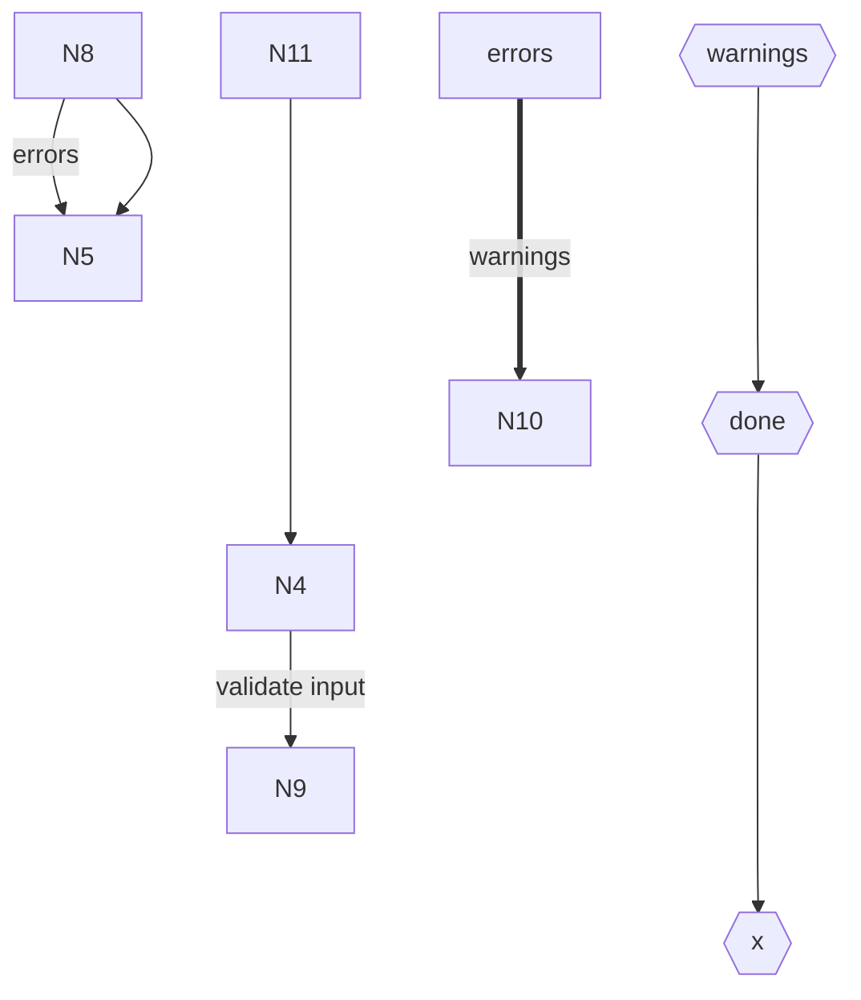

- HARD violations: edgeThroughNode (N6->N3 segment 1 through N5); nodeOverlaps (N3 overlaps N5)
- [Open in Mermaid Live](https://mermaid.live/edit#pako:eNpFkEFvgzAMhf-K5TNIRW2nDYmeem0u22nLDhYxEAkSFJJ1U-C_T5Cy3fzZ79lPjlhbxVhi09t73ZHz8HaVBkAcYvxelq0sPiSyc9ZNEj-3zjFGZQ0_5k8x3skZbdrp0XmGPL_MyTODOCcZ5Hl-AXFMK1Za8bDhaXN8Ua8VeQZtxuBnEC8pAFRVdZn3IzOIIrmKYt9y-r8L4owZDuwG0gpLjBJ9xwNLLCUqbij0XuKCGVLw9vXH1Fh6FzhDZ0PbYdlQP3GGYVyjXDW1joZdMpJ5t_YPWWlv3S39cHvl8gtQnmwr)
- [Open in the fork editor](https://agentic-mermaid.dev/editor/#deflate:RY7BDoIwEER_ZdN7ExrAqAmcPPfkzXpooCoJac1SxGTbfze0EG_7ZndmltjkZuwMO7PH6JbupdHD9aIsgCyIvjGmUdwUM4gOJ8XuSSmJemfNtj8QLRrtYJ_TphyB8zZkTwBZ5zPgnLcgyxyx0opFwio5Pnoceu0NDPY9-wDylB-ApmnasJcEkCK7hNhTqn8vyJrFHw)

### Case 16 — `LR comp=1 diamond=true long=true`

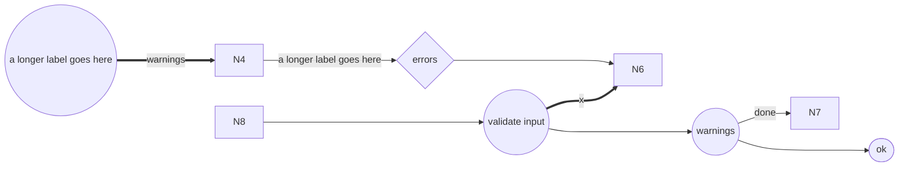

- HARD violations: edgeThroughNode (N9->N6 segment 3 through N0); edgeThroughNode (N5->N6 segment 3 through N0); nodeOverlaps (N0 overlaps N6)
- [Open in Mermaid Live](https://mermaid.live/edit#pako:eNp1kctOxDAMRX_F8iojtdKMZgaYSu2KJXQBOwgL07gPkSZVmjKgtv-O-oIVy2Pfe23LPWZWMUaYa3vNSnIeHp6kAUj3QlzJmcoU7W43Vw7iVaL9kPi28FEIAm1NwQ40vbOGwnILJTteHeeenbOuHWe6CPFJulLkGSrTdH5VHSGO42TYpg2Qnub6HYRhmEB6WdwTTbif8QRhmAz_zR8gPa-uOftrgPRmOWsNPSwLbqF_zWRQ1kwBtxhgza6mSmGEvURfcs0SI4mKc-q0lzhigNR5-_xtMoy86zhAZ7uixCgn3XKAXTPde19R4ajeJA2ZF2t_kVXlrXtcHjH_Y_wB4dJ-4g)
- [Open in the fork editor](https://agentic-mermaid.dev/editor/#deflate:dY_BDoIwEER_ZdNTOTTBACom9AtMD17FQ4UKxKY1LYgJ5d8NLcSTxze7M7M7IasHUwl0Qg-px6rlpofzpVQALMZ45EZ1qrFR5JUdvpZIP0t0C5xgzEFq1QgDkt-FhEYLC60wYnVkkzBGGzt7yjF-c9nVvBfQqdfQr1sJFEVB3dbmgKVePwIhhALLg3uhBWOPKRBC3b9-ByxbXT7744Dtw1tr6C4cuIX-htTVWi0BBzR_AQ)

### Case 17 — `RL comp=2 diamond=true long=true`

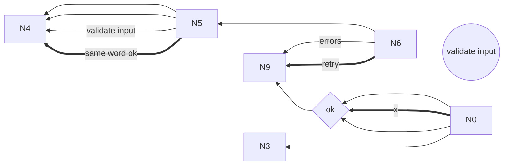

- HARD violations: edgeThroughNode (N6->N5 segment 3 through N9); nodeOverlaps (N5 overlaps N9)
- [Open in Mermaid Live](https://mermaid.live/edit#pako:eNpVkc1qw0AMhF9l0SkBG1KalNZgn3pscmhvxRfhlWMT2zLybtPg9buX3fzQvekTM6MBzVCxJsig7vhcNShGfX6Ug1KH19XqB7tWoyHVDqM163XYP21mPi1h3Kg0TQu_Cvji0fMu4E4F2N6keZ4X7tfF6sKRCMvk1OHtYYps8YEQImTkEjsKF3d1_wNCxPOt_DXwbg15E_akzixa8ckbIYGepMdWQwZzCaahnkrIStBUo-1MCQskgNbw12WoIDNiKQFhe2wgq7GbKAE7-jbvLR4F-7tkxOGb-YGkW8Oyvz4g_GH5A7bcd60)
- [Open in the fork editor](https://agentic-mermaid.dev/editor/#deflate:VY7BDoIwDEB_pdkJDkswilET9gWGg2cvC8xIQGa6IRrKv5tVNO621_S9dRLODlgZcRCXzo7VVaOH0_HcA5S7JHnorqm1N9D098GnKc9X2WTbmZ8ZSClVGDFuAwbOGXNg2CyrRVEoelK8rcggWnQE5f4nRVr8AUfQeHzFhqL4VvoPcGK9HP8JflXuOX0zMFqswbZBFPMb)

### Case 18 — `RL comp=6 diamond=true long=true`

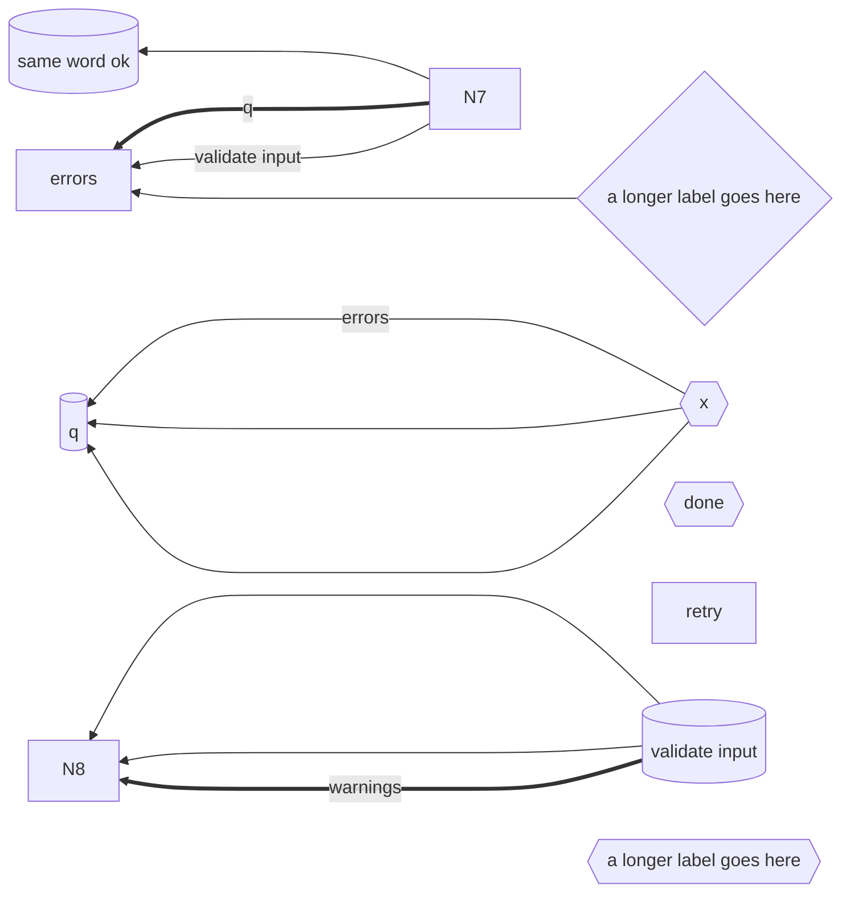

- HARD violations: edgeThroughNode (N6->N8 segment 3 through N9); edgeThroughNode (N6->N8 segment 3 through N9); edgeThroughNode (N6->N8 segment 3 through N9); nodeOverlaps (N9 overlaps N8)
- [Open in Mermaid Live](https://mermaid.live/edit#pako:eNp1kbtuwzAMRX-F4JQCNpBHXzEQTx1bD-1Wq4Ma0Q_UlhJabhrI_vfClpMmQzdekufyAnS4NYowwqwyh20h2cLrs9AAydxJqIzOiaGSn1RBbqiBgpj6cb5w7qf35TIVSMyGG4EfY2eVzvY3vrx1ThlN0-pdKpDJ8vG0eZ_OvmVVKmkJSr1r7YSt01kja4KDYQXma-ou5u7_WP7CA4RhGEOy9vaDGuSj5yEM485n7SBZTcRms4m7fQfJ8g-6Yka5OvvH3XXmC3K0OkjWpc6HExceZ4v5yXGJAdbEtSwVRugE2oJqEhgJVJTJtrICewxQtta8HfUWI8stBcimzQuMMlk1FGC7G5I8lTJnWZ9WdlK_G3OWpEpr-MX_enx5_wtWJJ-A)
- [Open in the fork editor](https://agentic-mermaid.dev/editor/#deflate:dY7PkoIwDIdfJdMTHjqDoLvqDDyBw8Fr2UNXIjLWVgOKOy3vvgPFfwdv-SX5vsSy2lxoi2zFdsq0272kBjbrXANkoZWgjC6RQMlfVFAarGGPhN0wn1p763wZiZwhkaE6Zz9DJxbBeeLLmbWF0TiuzkXOCBv6u29-ieAqVVXIBqHSp0szYksR1PKI0BoqwBzG7jS0n9_yF76Bc55CtvT6PvVx4XngPHX-VwdZPBJJkqTu7CCLntAbM8T44U_d-88v5KBqJelKl_2JF8dDEd6NEev-AQ)
