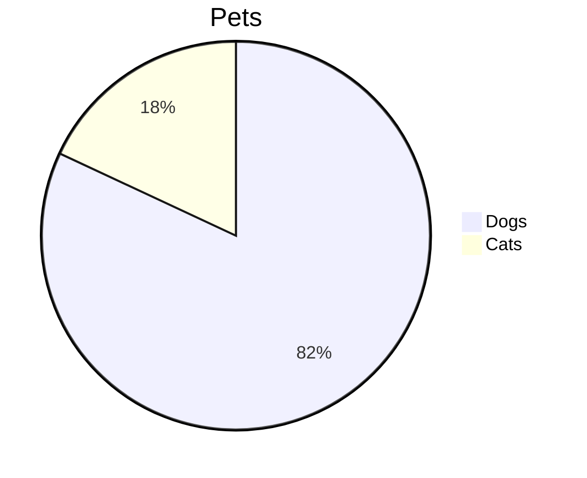
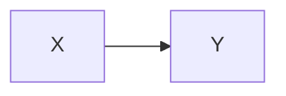
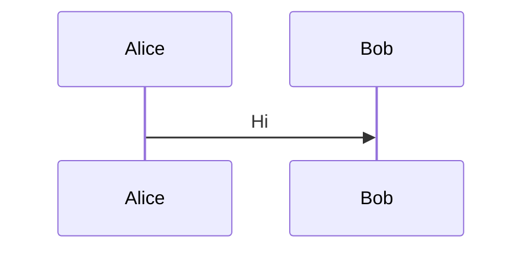

# Sample A

A flowchart:

```mermaid
flowchart TD
  A --> B
```

A pie chart with a title:

```mermaid
pie title Pets
  "Dogs" : 386
  "Cats" : 85
```

A graph alias (still flowchart):

```mermaid
graph LR
  X --> Y
```

A sequence diagram:

```mermaid
sequenceDiagram
  Alice->>Bob: Hi
```
