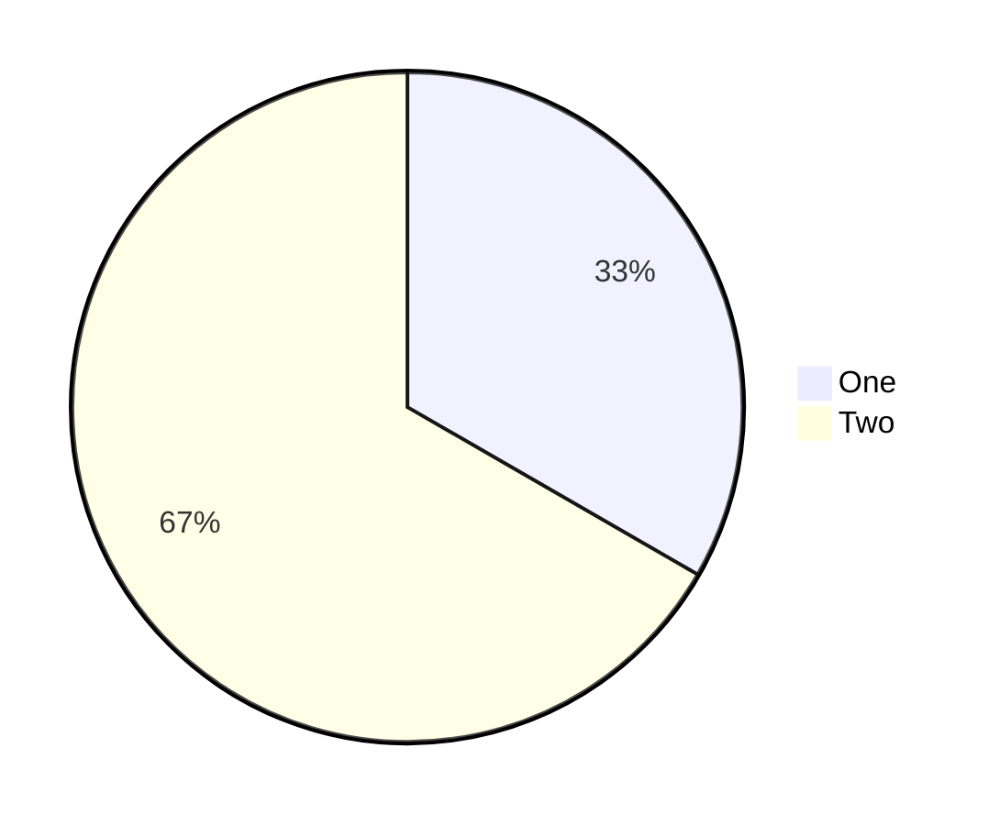

# Sample C

A regular code block that mentions mermaid but is not a mermaid fence:

```ts
const s = renderMermaidSVG('pie title Not Counted\n  "X" : 1')
```

Another pie, this time the third one in the corpus:


