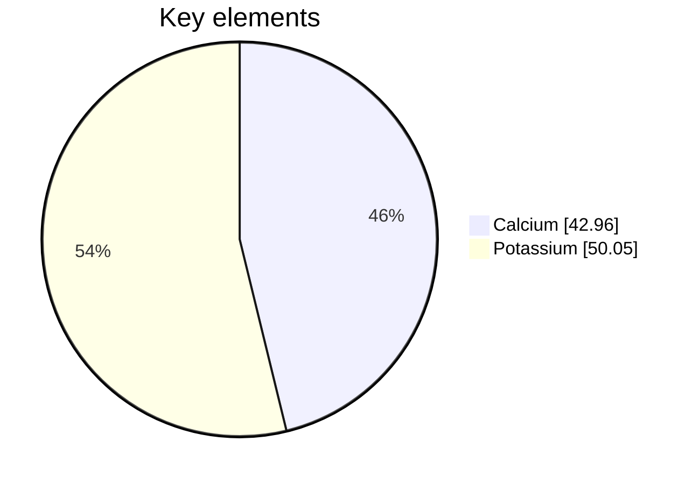
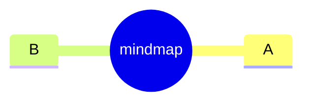
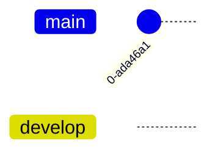
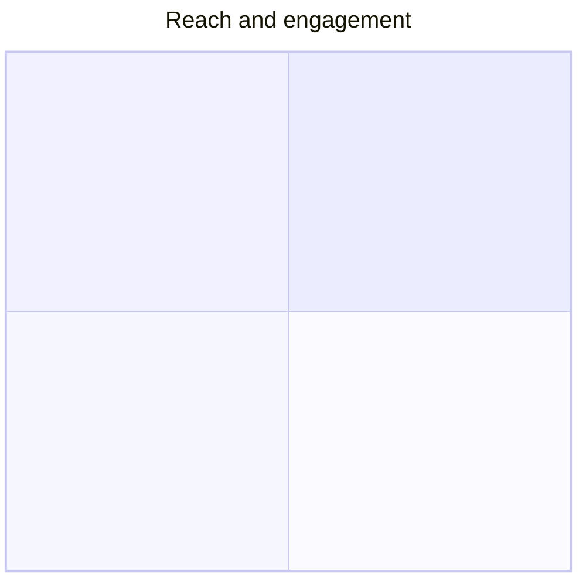

# Sample B (nested, .markdown extension)

A pie with frontmatter and showData — header is on a later line:

A gantt:

~~~mermaid
gantt
  title A Gantt
  section S
  Task :a1, 2024-01-01, 30d
~~~

A mindmap:

A gitGraph (note the capital G in source):

A block we don't render but should still count:

