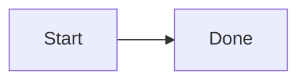

# COMMENT_DROPPED

> COMMENT_DROPPED is a lint warning: in-body %% comments will not survive structured serialization; the loss is announced, not silent.

- **Tier:** lint
- **Severity:** warning

## What triggers it

Comments between statements in a structurally-modeled body: the typed tree does not model them, so `serializeMermaid` writes the body back without them. The warning carries the count and line numbers.

## How to fix it

Move essential comment content into a label or title before mutating, keep a source-level edit instead of a typed mutation when comments must survive, or accept the loss knowingly.

## Example

Run `am verify diagram.mmd --json`, inspect this code, and apply the smallest source or typed mutation that clears it. If it persists after two mechanical attempts, return the warning and ask for human review.

Full page: https://agentic-mermaid.dev/warnings/COMMENT_DROPPED/
