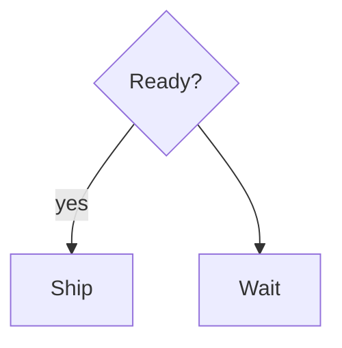

# DECISION_BRANCH_UNLABELED

> DECISION_BRANCH_UNLABELED is a lint warning: a decision diamond with two or more exits has at least one unlabeled exit, so the branch condition is ambiguous.

- **Tier:** lint
- **Severity:** warning

## What triggers it

Adding a second exit to a diamond without a condition label. ISO 5807 / ANSI X3.5 require each exit of a multi-exit decision to be labeled with its condition value.

## How to fix it

Label every exit — `set_label` on the unlabeled edge (e.g. `yes`/`no`) or add `|condition|` to the source line.

## Example

Run `am verify diagram.mmd --json`, inspect this code, and apply the smallest source or typed mutation that clears it. If it persists after two mechanical attempts, return the warning and ask for human review.

Full page: https://agentic-mermaid.dev/warnings/DECISION_BRANCH_UNLABELED/
