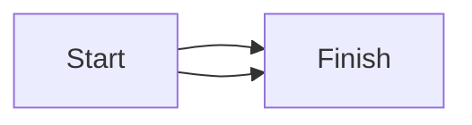

# DUPLICATE_EDGE

> DUPLICATE_EDGE is a lint warning: two edges with identical endpoints, label, and style — the second adds ink but no information.

- **Tier:** lint
- **Severity:** warning

## What triggers it

An agent re-adding an edge that already exists, typically an `add_edge` issued without checking the current edge list, or copy-pasted source lines.

## How to fix it

Remove one copy with `remove_edge` (or delete the duplicate source line); if two parallel edges are intentional, give them distinct labels so they stop being duplicates.

## Example

Run `am verify diagram.mmd --json`, inspect this code, and apply the smallest source or typed mutation that clears it. If it persists after two mechanical attempts, return the warning and ask for human review.

Full page: https://agentic-mermaid.dev/warnings/DUPLICATE_EDGE/
