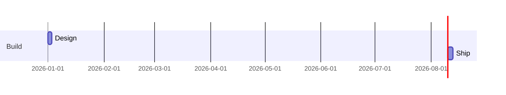

# EDGE_MISANCHORED

> EDGE_MISANCHORED is a structural error: an edge, message, or dependency references an endpoint that is not in the diagram.

- **Tier:** structural
- **Severity:** error

## What triggers it

A gantt `after` dependency naming a missing task, a sequence message whose participant was removed, or edges left dangling after a `remove_node` mutation.

## How to fix it

Add the missing endpoint (`add_node`, `add_participant`, `add_task`) or retarget/remove the dangling edge (`remove_edge`, `remove_message`).

## Example

Run `am verify diagram.mmd --json`, inspect this code, and apply the smallest source or typed mutation that clears it. If it persists after two mechanical attempts, return the warning and ask for human review.

Full page: https://agentic-mermaid.dev/warnings/EDGE_MISANCHORED/
