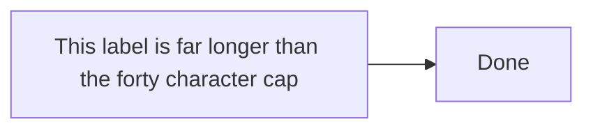

# LABEL_OVERFLOW

> LABEL_OVERFLOW is a structural warning: a label’s longest rendered line exceeds the character cap (default 40), which hurts layout and readability. The count measures what the renderer draws: ` ` starts a new line, XML entities like `&#160;` count as one character, and formatting tags are stripped.

- **Tier:** structural
- **Severity:** warning

## What triggers it

Prose sentences pasted into node labels, edge labels, message text, or section/period titles — common when an agent copies requirement text verbatim into the diagram. Multi-line labels fire only when a single rendered line exceeds the cap.

## How to fix it

Shorten the text with `set_label`, `set_message_text`, or the matching family mutation; raise `labelCharCap` in `VerifyOptions` only when long labels are genuinely intended.

## Example

Run `am verify diagram.mmd --json`, inspect this code, and apply the smallest source or typed mutation that clears it. If it persists after two mechanical attempts, return the warning and ask for human review.

Full page: https://agentic-mermaid.dev/warnings/LABEL_OVERFLOW/
