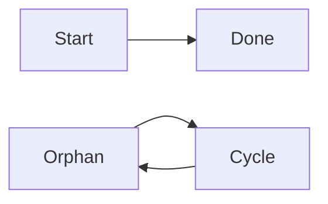

# UNREACHABLE_NODE

> UNREACHABLE_NODE is a lint warning: a node cannot be reached from any root (a node with no incoming edges) by following edges.

- **Tier:** lint
- **Severity:** warning

## What triggers it

Disconnected clusters left behind after `remove_edge`/`remove_node` mutations, or a cycle with no entry edge from the main flow.

## How to fix it

Connect the node into the flow with `add_edge` from a reachable node, or delete it with `remove_node` if it is leftover.

## Example

Run `am verify diagram.mmd --json`, inspect this code, and apply the smallest source or typed mutation that clears it. If it persists after two mechanical attempts, return the warning and ask for human review.

Full page: https://agentic-mermaid.dev/warnings/UNREACHABLE_NODE/
